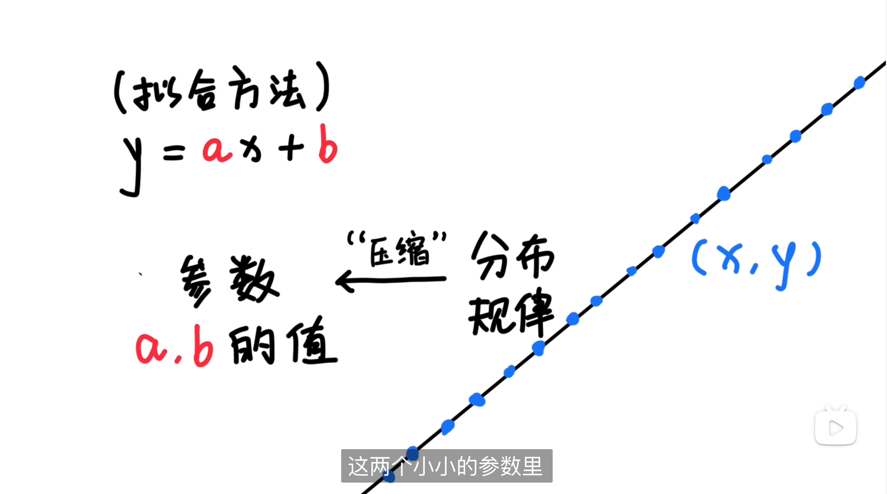
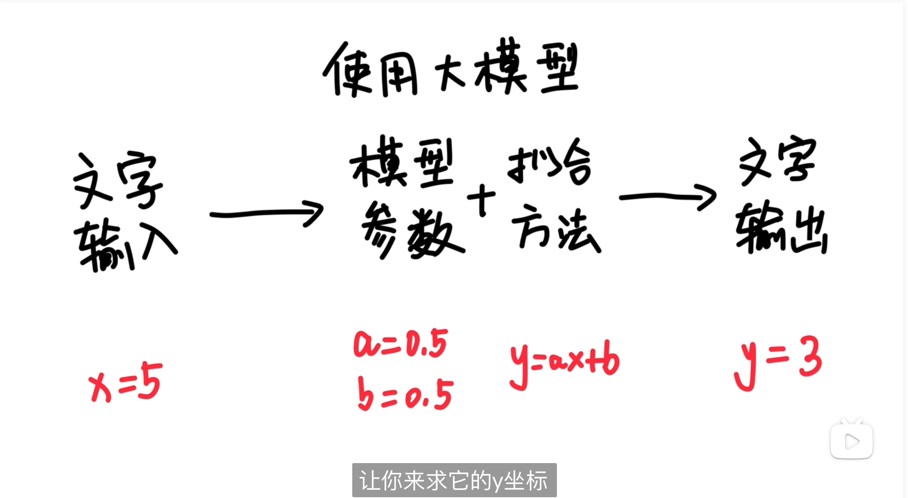
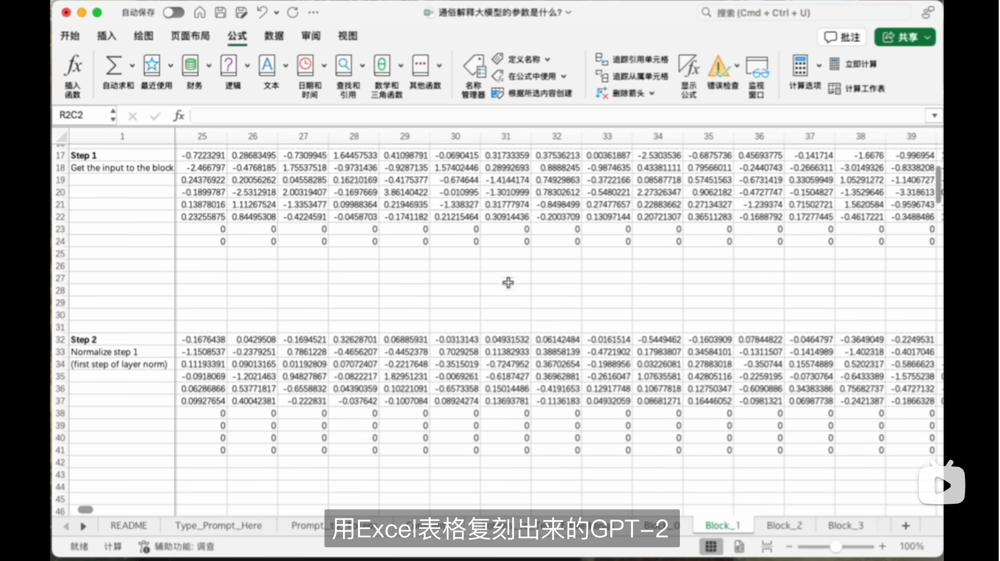
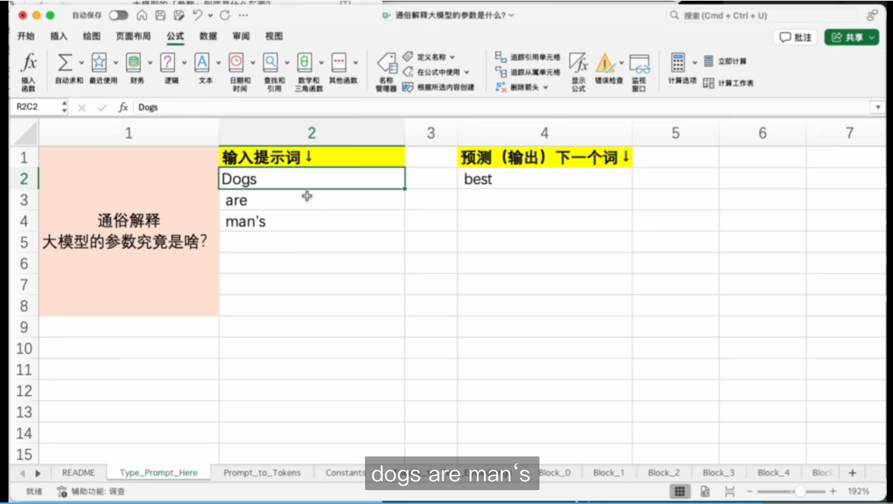

# 大模型参数

​	大模型的参数究竟是什么东西啊, 前几天我老婆这么问我, 我说参数参数, 参天大树, ……, 参数参数, 它就是个数嘛！ 比如其中一个参数可能是3.1415926, 另一个参数可能是-0.0009527, 像DeepSeek R1(模型）最大的版本是671B, 这个B是10亿（Billion)的意思, 也就是它有6,710亿个类似这样的数, 你可以想象一张巨大的表格, 每个格子里都有一个类似这样的数, 一共有几千亿个数, 这些参数, 通常占了一个大模型90%以上的体积

​	她听完以后, 好像更疑惑了, 为什么这么一堆数构成的大模型, 可以蕴含那么多的知识, 还能回答各种问题呢, 于是我决定换一种方式, 利用初中的知识, 来让她理解, 大模型里的参数究竟是什么东西, 但凡你不是九年义务教育的漏网之鱼, 就肯定知道这个东西

​	它可以用来拟合一条直线, 只要你找到了这条直线对应的, a和b的值, 你就是这条线的世界里的神, 你掌握了这条线的所有点的分布规律, 给你任何一个点的x坐标, 你都可以很快的推导出它的y坐标, 换句话说, 只要找到了合适的拟合方法, 这条线上无数多个点的分布规律, 就都被压缩到了a和b, 这两个小小的参数里

​	规律可以压缩到参数里, 而大模型做的事情, 就是把这个世界的文字或者图像, 或者声音的分布规律, 压缩到了一堆参数里, 只不过一条线上的所有点, 它的分布规律比较简单, 所以拟合它所需要的用到的方法、公式, 就比较简单, 参数也非常的少, 只需要两个, 而文字图像和声音的规律, 比一条直线显然要复杂的多, 所以拟合它需要用到的方法也更复杂, 要用像自注意力机制, 反向传播算法, Transformer架构等等这些复杂的方法, 并且需要用到的参数量也更多, 得需要用百亿、千亿甚至更多, 才可以更准确地, 去捕捉到这些复杂的分布规律

​	但本质上, 它跟人们用一个简单的公式, 去拟合一条直线, 它背后的思想是一样的, 训练一个大语言模型的过程, 是通过大量已有的文字, 去推导出最适合的模型参数, 这就好比是根据已知的两个点的坐标, 去计算推导出a和b的值, 而使用大模型的过程, 只输入一些文字, 经过模型参数和拟合方法的计算, 输出另外一些文字, 这就好比是, 在已经知道参数a和b的值, 以及直线方程表达式的情况下, 给你一个点的x坐标, 让你来求它的y坐标, 或者给你一个点, 让你找到它附近的另一个点

​	总之大模型的核心就是这两样东西, 只要能找到合适的参数和拟合方法, 哪怕是用Excel表格, 也可以制作出一个大模型, 这个就是一位网友, 用Excel表格复刻出来的GPT-2格子里

​	都是一些看起来乱七八糟的数字, 我给大家演示一下效果, 我的左边输入几个单词, dogs are man‘s, 它就可以计算出下一个词, 最有可能是best

​	我再把best填到左边, 它又可以预测出下一个, 词是friend

​	我再把friend放到左边, 它又可以预测出下一个单词, 最有可能出现的是句号

​	你看就光是靠一大堆表格里的数字, 和一些计算规则, 就可以复刻出大模型的最基本功能, 回到刚开始那个问题, 大模型的参数究竟是什么东西啊, 真的就是一堆数字。