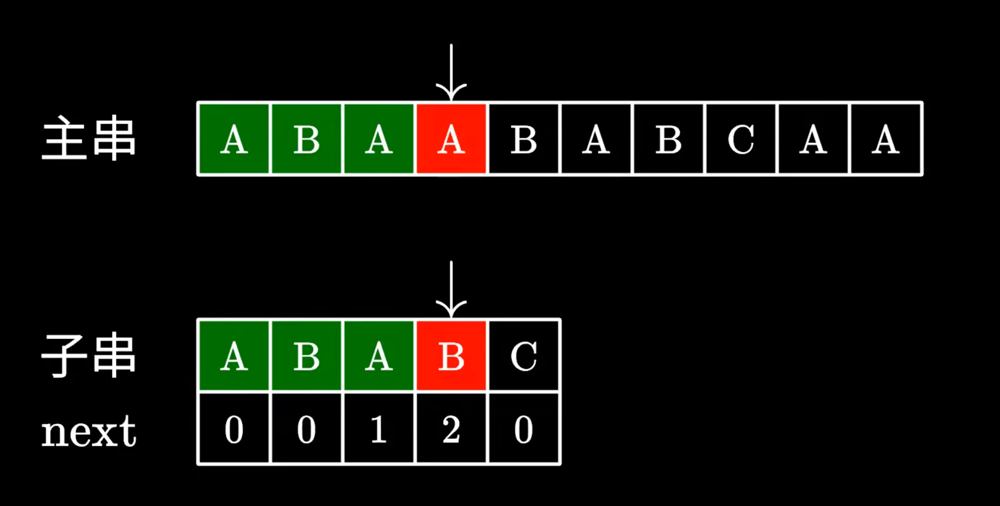

# LeetCode28: 找出字符串中第一个匹配项的下标

题目：给你两个字符串 `haystack` 和 `needle` ，请你在 `haystack` 字符串中找出 `needle` 字符串的第一个匹配项的下标（下标从 0 开始）。如果 `needle` 不是 `haystack` 的一部分，则返回 `-1` 。

## 暴力求解

### 解题思路

1. **边界处理**：
   - 如果 `needle` 为空字符串，直接返回0。
   - 如果 `haystack` 的长度小于 `needle` 的长度，返回-1。
2. **暴力匹配法**：
   - 遍历 `haystack` 中每一个可能的起始位置 `i`（从0到 `len(haystack) - len(needle)`）。
   - 对于每个位置 `i`，检查从 `i` 开始的子字符串是否与 `needle` 完全匹配。
   - 找到第一个匹配的位置后立即返回，否则遍历结束后返回-1。

```go
func strStr(haystack string, needle string) int {
    if len(needle) == 0 {
        return 0
    }
    n, m := len(needle), len(haystack)
    if m < n {
        return -1
    }
  	// abc, a -> 3-1=2
    for i := 0; i <= m-n; i++ {
        if haystack[i:i+n] == needle {
            return i
        }
    }
    return -1
}
```

### 代码解析

- **边界条件处理**：首先处理 `needle` 为空的情况，直接返回0。如果 `haystack` 比 `needle` 短，不可能包含，返回-1。
- **主循环**：遍历所有可能的起始位置 `i`，检查每个位置开始的子字符串是否与 `needle` 相等。一旦找到立即返回当前索引 `i`。
- **时间复杂度**：最坏情况下为O((m-n+1)*n)，其中m和n分别是两个字符串的长度。适用于一般情况，尤其是测试数据规模较小时效率足够。

## KMP

今天我们来讲一个经典的字符串匹配算法，KMP字符串匹配是一个非常基本的操作，也就在一个字符串中寻找另一个子串。

其中最容易想到的是一种暴力匹配的算法，比如一个字一个字地与子串进行比对


一旦匹配失败，就跳回主串中的下一个字符，重新开始匹配。


这个算法的原理很简单，实现起来也十分容易，但最大的问题在于它的时间复杂度


假如你运气不好，恰好碰到主串和子串都是若干个A，最后紧跟一个B的情况，这个时候呢算法会很傻的，把前面的A都比对完；然后发现最后一个字符不匹配，于是跳过下一个字符重新比对，做了不少的无用功。

不难发现，这是一个ON乘以M时间复杂度的算法，因此效率极低。


这个时候呢有三位大佬KMP，他们就想，既然字符串在比对失败的时候，我们已经知道之前都读过哪些字符了，有没有可能避免跳回下一个字符，再重新匹配的步骤呢

于是他们就发表了，线性时间复杂度的KMP算法；换句话说，你只需要在一次字符串遍历的过程中，就可以匹配出子串


KMP算法的基本思路是，当我们发现某一个字符不匹配的时候，由于已经知道之前面过的字符，那能不能利用这些信息来避免暴力算法中回退的步骤呢；换句话说，我们不希望递减上面的这个指针，而让它永远向前方移动，如果能做到这一点，我们的算法不就可以改进为线性时间复杂度了吗？

给大家举个例子，这里我们在主串中搜索ABABC，然后发现最后一个字符不匹配


这个时候，由于我们已经知道前面都读到过哪些字符，是不是可以将子串移动到这个位置，接着进行匹配呢？

由于这里的AB和主串中的ab是相同的，我们完全可以跳过它们，避免重复的比对，接下来只需要继续测试后面的字符就好了

那你可能会问，我们怎么知道应该跳过多少个字符呢？

这里就要用到cap中定义的next数组了，我们先不管NEX的数组是怎样生成的，先来看一下它的功能和用途，kmp算法在匹配失败的时候，会去看最后一个匹配的字符它所对应的next数值，比如这里是2，于是我们移动子串直接跳过前面的这两个字符

这里的2代表子串中我们可以跳过匹配的字符个数，也就是说前面的这两个ab不需要看了，直接从下一个字符接着匹配；很显然这样是没有问题的，<mark>因为最长前后缀相等，我们相当于拿子串里已匹配的字符的最长前缀去匹配主串里已匹配字符的最长后缀</mark>


可以看一下具体例子，主串子串对应的字符不匹配，j跳过已匹配字符，长度为1



A里无最长相等的前后缀，j归为0，跟i对应的A进行匹配


匹配完成


看一下具体的程序实现


那么接下来要解决的关键问题，就是next数组的生成了；之前我们讲到next的数值，代表了在匹配失败的时候子串中可以跳过匹配的字符个数，如果是2，就代表我们可以跳过前两个字符的比较

但凭什么可以这么做呢，因为我们之前成功匹配的最后这两个ab，和这里跳过的最前面的这两个ab是完全一样的；换句话说，对于子串的前面四个字符，它们拥有一个共同的前缀和后缀，ab长度为2；<mark>所以next数组的本质，其实就是寻找子串中相同前后缀的长度，并且一定是最长的前后缀</mark>


下面我们还是以ABABC为例，来说明一下next数组的计算

首先对第一个字符，显然不存在比它还短的前后缀，所以next直接为0；接着对于前两个字符同样没有相同的前后缀，所以next为0
对于前三个字符，由于A是共同的前后缀，所以next为1；对于前四个字符，由于ab是共同的前后缀，next为2；对于前五个字符同样找不到相同的前后缀，所以next为0；这样我们就计算得到了整个next数组

但算法应该怎么写呢？

我们当然可以用for循环暴力求解，但显然效率太低，其实这里可以采用一种递推的方式来快速求解next数组，它的巧妙之处在于会不断的利用已经掌握的信息来避免重复的运算


假设我们已经知道当前的共同前后缀了，长度为2，接下来分两种情况讨论

如果下一个字符依然相同的话，不就直接构建了一个更长的前后缀吗？很明显它的长度等于之前的加上1

但如果下个字符不同的话，又应该怎么办呢

既然ABA无法与下一个字符构成更长的前后缀，我们就看看其中存不存在更短的


比如这里的A，它其实是有可能与下一个字符构成共同前后缀的，这一步难道要暴力求解吗

其实不然，根据之前的计算，我们掌握了一个重要信息，那就是子串前后的这两部分是完全相同的；也就是说，右边这部分的后缀其实等同于左边这部分的后缀，那我们直接在左边寻找共同的前后缀，不就好了吗


而左边的前后缀我们之前已经计算过了，直接查表就可以得到它的长度是1


于是我们又回到了最开始的步骤，检查下一个字符是否相同


如果相同，则可以构成一个更长的前后缀，长度加1即可


看下代码的实现


 prefix_len = next【prefix_len - 1】 的原因。 例如，

串 A B A C A B A B 　　　

     0 1 2  3 4 5 6  7 

扫描到 6 号位的 A 时，最长公共前后缀是 ABA；<mark>而扫描到 7 号位的 B 时，ABAC 和 ABAB 不匹配了，即原来的最长公共前后缀失配。这时候我们要做的事情就是，找上一次匹配中次长的公共前后缀，</mark>看与 7 号位的 B 拼接起来是否能匹配。 这时候，注意到上一次扫描中 0 ~ 2 位的 ABA 是和 4 ~ 6 位的 ABA 完全相同的（贪心原则保证上次结果一定是包含前一位置字符的最长公共前后缀），所以考察上一次匹配中次长的公共前后缀，只能在考察上一次匹配中的最长公共前后缀中考察，也就是说，<mark>只能考察 ABA 中更短的 BA、A 是否是次长的，而这直接在前面一个 ABA 中考察都行</mark>，所以我们把 ABA C ABA 中中间部分（C）和后缀（ABA）直接抛弃，等效于一个串 ABA（也就是前缀）与 B 拼接成 ABAB。这样再来计算第 7 位的 B 的 next 值，等价于计算 ABAB 第 3 位的 B 的 next 值。prefix_len = next【prefix_len - 1】 也就是这个等效过程的代码展示。