# DDD领域驱动设计

## DDD(Domain Driven Design)理解

领域驱动设计(简称 DDD )历史悠久。

2004年著名建模专家eric evans（埃里克埃文斯）发表的他最具影响力的书籍:

《domain-driven design –tackling complexity in the heart of software》(中文译名：领域驱动设计—软件核心复杂性应对之道)一书。标志着 DDD 这种 设计和架构方法的诞生。

我们在日常开发中，经常针对一些功能点争论“这个功能不应该我改，应该是你那边改”，最终被妥协改了之后都改不明白为什么这个功能要在自己这边改。

区别于传统的数据驱动架构（Data Driven Design）设计，领域驱动设计（DDD）也许在这个时候能帮助你做到清晰的划分。

### 什么是DDD

领域驱动设计最初由Eric Evans提出，但是多年以来一直停留在理念阶段，

然后，真正能实现并且落地的项目和公司少之又少，

近来，包括阿里在内很多大厂，都在大力推行DDD的设计方法，

它主要可以帮助我们解决传统单体式集中架构难以快速响应业务需求落地的问题，并且针对中台和微服务盛行的场景做出指导。

DDD为我们提供的是架构设计的方法论，既面向技术也面向业务，从业务的角度来把握设计方案。

### DDD的作用

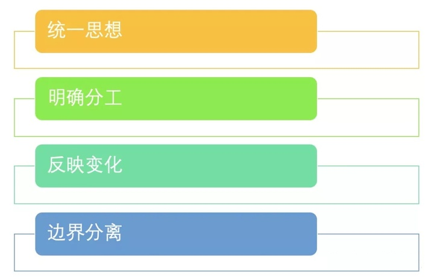

**统一思想**：统一项目各方业务、产品、开发对问题的认知，而不是开发和产品统一，业务又和产品统一从而产生分歧。

**明确分工**：域模型需要明确定义来解决方方面面的问题，而针对这些问题则形成了团队分钟的理解。

**反映变化**：需求是不断变化的，因此我们的模型也是在不断的变化的。领域模型则可以真实的反映这些变化。

**边界分离**：领域模型与数据模型分离，用领域模型来界定哪些需求在什么地方实现，保持结构清晰。

## DDD的基本概念

领域驱动设计围绕着**领域模型**进行设计，通过**分层架构**将领域独立出来。

这里有两个关键词：

-   领域模型
-   分层架构

领域模型的对象包括：实体、值对象和领域服务，领域逻辑都应该封装在这些对象中。

### 领域模型 Domain Model

领域反映到代码里就是模型，模型是对领域某个方面的抽象，并且可以用来解决相关域的问题，

模型分为实体和值对象两种。

### 实体对象 Entities

有唯一标志的核心领域对象，且这个标志在整个软件生命周期中都不会发生变化。

这个概念和我们平时软件模型中和数据库打交道的Entity实体比较接近，

不同的是DDD中这些实体会包含与该实体相关的业务逻辑，它是操作行为的载体。

**实体 = 唯一身份标识 + 可变性【状态 + 行为】**

DDD 中要求实体是唯一的且可持续变化的。

意思是说在实体的生命周期内，无论其如何变化，其仍旧是同一个实体。

唯一性由唯一的身份标识来决定的。

可变性也正反映了实体本身的状态和行为。

**实体以 DO（领域对象）的形式存在**，每个实体对象都有唯一的 ID。

我们可以对一个实体对象进行多次修改，修改后的数据和原来的数据可能会大不相同。

但是，由于它们拥有相同的 ID，它们依然是同一个实体。

比如商品是商品上下文的一个实体，通过唯一的商品 ID 来标识，不管这个商品的数据如何变化，商品的 ID 一直保持不变，它始终是同一个商品。

### 值对象 Value Object

依附于实体存在，通过对象属性来识别的对象，它将一些相关的实体属性打包在一起处理，形成一个新的对象。

这些对象是用来表示临时的事物，或者可以认为值对象是实体的属性，这些属性没有特性标识但同时表达了领域中某类含义的概念。

通常值对象不具有唯一id，由对象的属性描述，可以用来传递参数或对实体进行补充描述。

举个栗子：

比如用户实体，包含用户名、密码、年龄、地址，地址又包含省市区等属性，而将省市区这些属性打包成一个属性集合就是值对象。

值对象与实体的区别是什么？

-   **值对象没有唯一标识和连续性**，任何属性发生变化, 都可以认为是新的值对象。判断对象是否相同：值对象需要判断所有属性是否相同，而实体只需要判断唯一标识是否相同。
-   **值对象一般依附于实体而存在**，是实体属性的一部分，而非独立存在。值对象属性是只读的，可以被安全的共享.

**值对象 = 将一个值用对象的方式进行表述，来表达一个具体的固定不变的概念。**

还是举个订单的例子，订单是一个实体，里面包含地址，这个地址可以只通过属性嵌入的方式形成的订单实体对象，也可以将地址通过 json 序列化一个 string 类型的数据，存到 DB 的一个字段中，那么这个 Json 串就是一个值对象，是不是很好理解？

当你只关心某个对象的属性时，该对象便可作为一个值对象。

我们需要将值对象看成不变对象，**不要给它任何身份标识**，注意，\*\*不要给它任何身份标识，该对象便可作为一个值对象。 \*\*

注意：应该尽量避免像实体对象一样的复杂性。

### 聚合

实体和值对象表现的是个体的能力，而我们的业务逻辑往往很复杂，依赖个体是无法完成的，这时候就需要多个实体和值对象一起协同工作，而这个协同的组织就是聚合。

聚合是数据修改和持久化的基本单元，同一个聚合内要保证事务的一致性，所以在设计的时候要保证聚合的设计拆分到最小化以保证效率和性能。

### 聚合根

也叫做根实体，一个特殊的实体，它是聚合的管理者，代表聚合的入口，抓住聚合根可以抓住整个聚合。

### 领域服务

有些领域的操作是一些动词，并不能简单的把他们归类到某个实体或者值对象中。

领域的动作，从领域中识别出来之后，应该将它声明成一个服务，它的作用仅仅是为领域提供相应的功能。

简单理解： 就是业务方法

### 领域事件

在特定的领域由用户动作触发，表示发生在过去的事件，或者领域状态的变化。

比如:

-   充值成功
-   充值失败的事件。

## DDD四种模式

接下来，看看DDD四种模式

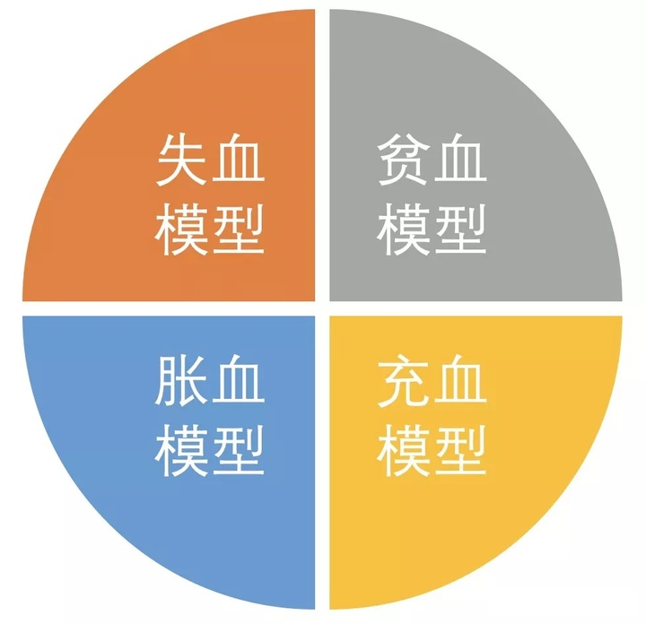

### 失血模型

模型中只有简单的get set方法，是对一个实体最简单的封装，其他所有的业务行为由服务类来完成。

pojo里边光秃秃的，get和set方法都没有

    @Data
    @ToString
    public class User {
        private Long id;
        private String username;
        private String password;
        private Integer status;
        private Date createdAt;
        private Date updatedAt;
        private Integer isDeleted;
    }

而且，其他所有的业务行为由服务类来完成，

    public class UserService{
        public boolean isActive(User user){
            return user.getStatus().equals(StatusEnum.ACTIVE.getCode());
        }
    }

### 贫血模型

贫血模型是指领域对象里只有get和set方法（POJO），所有的业务逻辑都不包含在内而是放在Business Logic层。

    @Data
    @ToString
    public class User {
        private Long id;
        private String username;
        private String password;
        private Integer status;
        private Date createdAt;
        private Date updatedAt;
        private Integer isDeleted;
        
        public boolean isActive(User user){
            return user.getStatus().equals(StatusEnum.ACTIVE.getCode());
        }
        
        public void setUsername(String username){
            return username.trim();
        }
    }

贫血模型在失血模型基础之上，领域对象的包含一些状态变化，但是停留在内存层面，不关心数据持久化。

贫血模型所有的业务逻辑都不包含在内而是放在Business Logic层。

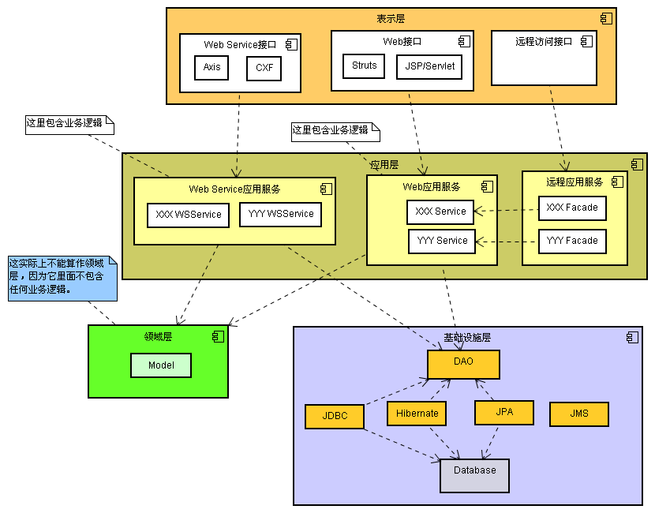

贫血模型优点是系统的层次结构清楚，各层之间单向依赖，Client->（Business Facade）->Business Logic->Data Access Object。

可见，领域对象几乎只作传输介质之用，不会影响到层次的划分。

这就是 传统的 数据驱动的开发。

在使用Spring的时候，通常暗示着你使用了贫血模型，我们把Domain类用来单纯地存储数据，Spring管不着这些类的注入和管理，Spring关心的逻辑层（比如单例的被池化了的Business Logic层）可以被设计成singleton的bean。

假使我们这里逆天而行，硬要在Domain类中提供业务逻辑方法，那么我们在使用Spring构造这样的数据bean的时候就遇到许多麻烦，比如：bean之间的引用，可能引起大范围的bean之间的嵌套构造器的调用。

### 充血模型

在贫血模型基础上，负责数据的持久化。

    @Data
    @ToString
    public class User {
        private Long id;
        private String username;
        private String password;
        private Integer status;
        private Date createdAt;
        private Date updatedAt;
        private Integer isDeleted;
        
        private UserRepository userRepository;
        
        public boolean isActive(User user){
            return user.getStatus().equals(StatusEnum.ACTIVE.getCode());
        }
        
        public void setUsername(String username){
            this.username = username.trim();
            userRepository.update(user);
        }
    }

充血模型层次结构和上面的差不多，不过大多业务逻辑放在Domain Object里面，Business Logic只是简单封装部分业务逻辑以及控制事务、权限等，这样层次结构就变成Client->（Business Facade）->Business Logic->Domain Object->Data Access Object。

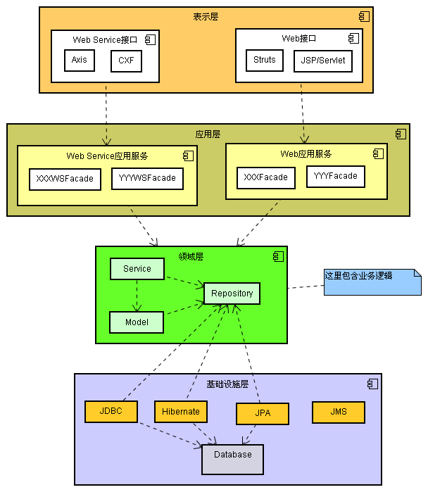

它的优点是面向对象，Business Logic符合单一职责，不像在贫血模型里面那样包含所有的业务逻辑太过沉重。

### 胀血模型

service都不需要，所有的业务逻辑、数据存储都放到一个类中。

对于DDD来说，失血和胀血都是不合适的，

失血太轻量没有聚合，胀血那是初学者才这样写代码。

那么充血模型和贫血模型该怎么选择？

充血模型依赖repository接口，与数据存储紧密相关，有破坏程序稳定性的风险。

## DDD建模方法

-   用例分析法
-   四色建模法
-   事件风暴法

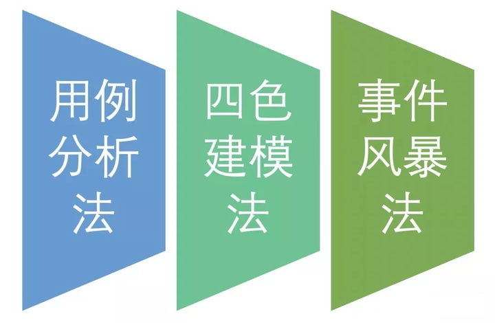

### 用例分析法

用例分析法是领域建模最简单可行的方式。

大致可以分为获取用例、收集实体、添加关联、添加属性、模型精化几个步骤。

1.  获取用例：提取领域规则描述
2.  收集实体：定位实体，
3.  添加关联：两个实体间用动词关联起来
4.  添加属性：获取实体属性
5.  模型精化：可选的步骤，可以用UML的泛华和组合来表达模型间的关系，同时可以做子领域的划分

### 四色建模法

四色建模法源于《Java Modeling In Color With UML》，它是一种模型的分析和设计方法，

通过把所有模型分为四种类型，帮助模型做到清晰、可追溯。

简单来说，四色关注的是某个人的角色在某个地点的角色用某个东西的角色做了某件事情。

Peter Coad和Mark Mayfield奠定了4种架构型（一种形式，所有的东西都或多或少地遵守）的早期工作。

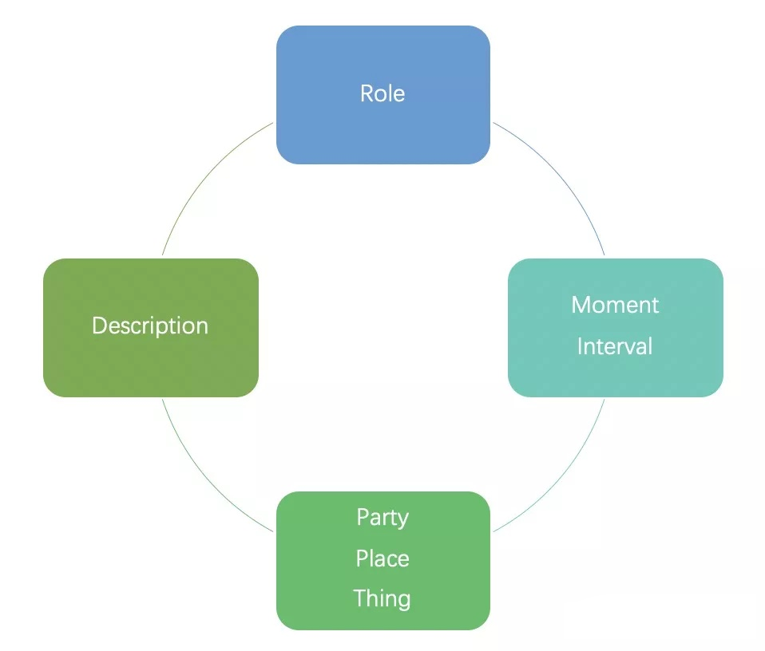

#### 4种架构型 Archetype：

1.  **MomentInterval 时刻时段 类型的 Archetype**：  
2.  一个时刻或一段时间，粉红色表示。
    -   一次销售是在一个时刻完成的——这次销售的日期和时间。
    -   一次租赁发生在一个时间段——从登记入住到归还。
3.  **Role 角色 类型的 Archetype**：  
4.  角色是一种参与方式，  
5.  角色由 PartyPlaceThing 类型模型 来承担，黄色表示。
6.  **Description 描述 类型的 Archetype**：  
7.  Description 是类似 “分类目录条目似的” 描述，  
8.  Description 是一组反复应用的值，  
9.  Description 也为所有对应到某个描述的东西提供行为，蓝色表示。
10.  **PartyPlaceThing 参与方-地点-物品 类型的 Archetype**：  
11.  PartyPlaceThing 包括 参与方（意味着人或组织机构）、地点或物品  
12.  PartyPlaceThing 是扮演不同角色的人或物，  
13.  PartyPlaceThing 绿色表示。

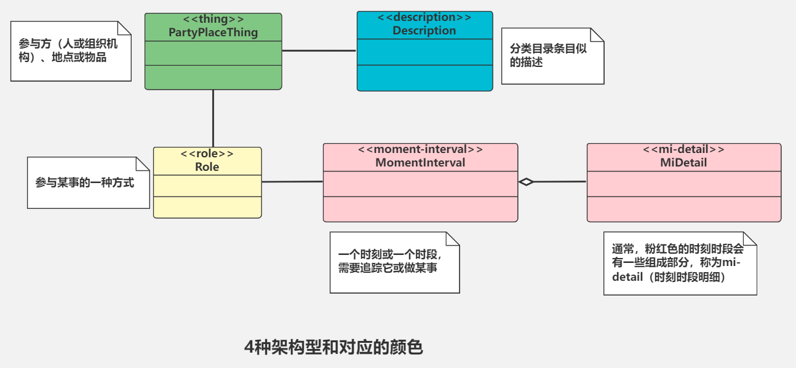

这4种颜色中, 每一种都对应一种架构型的特征（属性、链接、方法、插入点和交互），每一种颜色对应的类，或多或少都包含了这些特性。

#### 如何确定一个类的颜色类型？

1.  它是某个时刻或时段，是出于某个原因（业务原因或法律原因），是系统需要追踪的东西吗？  
2.  如果是这样，那么它是粉红色的、时刻时段 MomentInterval 类型的 Archetype。
3.  否则，它是一个角色吗？  
4.  如果是这样，那么它是黄色类型的、**Role 角色 类型的 Archetype**。
5.  否则，它是一个类似分类目录似的描述，包含了一组可以反复应用的值吗？  
6.  如果是这样，那么它是蓝色的、**Description 描述 类型的 Archetype**。
7.  否则，它就是绿色的、PartyPlaceThing 参与方-地点-物品 类型的 Archetype。

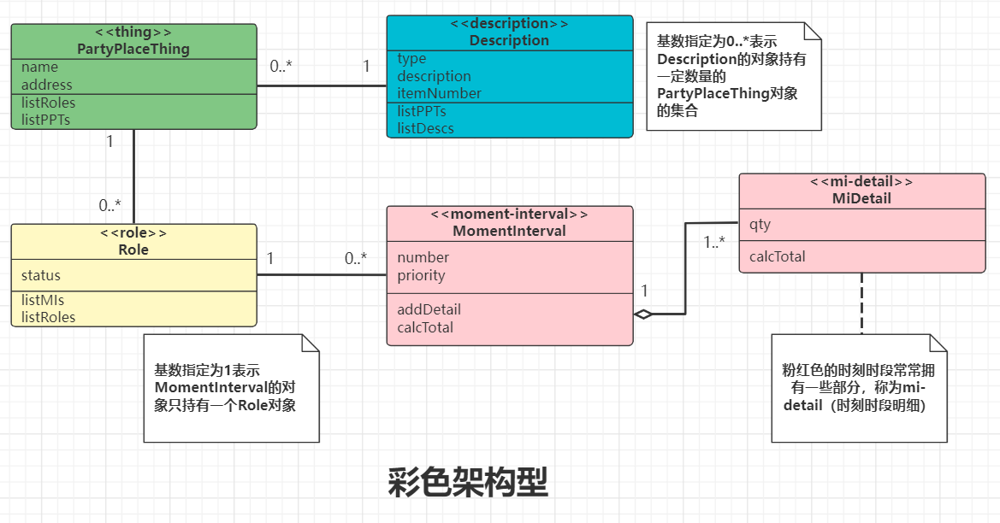

### 事件风暴法

事件风暴法类似头脑风暴，简单来说就是谁在何时基于什么做了什么，产生了什么，影响了什么事情。

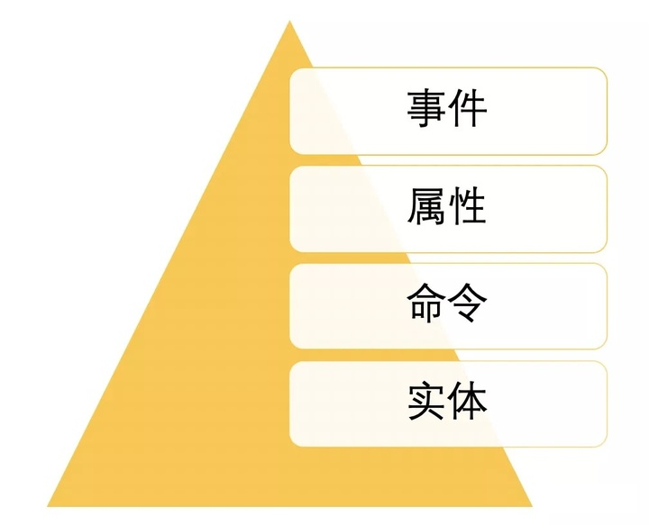

## DDD分层架构

### DDD的概念

领域驱动设计围绕着**领域模型**进行设计，通过**分层架构**将领域独立出来。

这里有两个关键词：

-   领域模型
-   分层架构

领域模型的对象包括：实体、值对象和领域服务，领域逻辑都应该封装在这些对象中。

聚合是一种边界，它可以封装一到多个实体与值对象，并维持该边界范围之内的业务完整性。在聚合中，至少包含一个实体，且只有实体才能作为聚合根。工厂和资源库都是对领域对象生命周期的管理。工厂负责领域对象的创建，用于封装复杂或者可能变化的创建逻辑。资源库负责从存放资源的持久层获取、添加、删除或者修改领域对象。

### 传统的三层架构

传统的MVC模型把框架分成了三层：显示层、控制层、模型层。

显示层负责显示用户界面，控制层负责处理业务逻辑、而模型则负责与数据库通信，对数据进行持久化的操作。

从代码角度来看，这样的框架结构每个模块职责分离，特别适合小型的应用系统。

最简单的分层方式自然就是“表现层、业务逻辑层和数据访问层”，如下图：

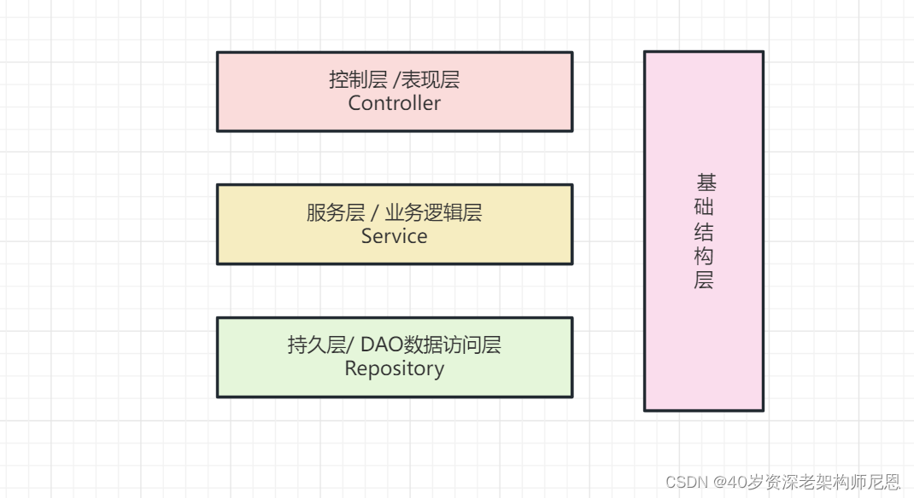

其中包含一些 帮助类/工具类，比如 SQLHelper、StringUtility之类，归纳到 基础结构层。

在传统的三层架构中，表现层只能跟业务逻辑层打交道，而业务逻辑层 只能跟 数据访问层 打交道。

这也是一般的编程规范都要求： **表现层不能访问 DAO层，表现层对数据访问层的内容一无所知**。

从领域驱动的角度看，这种分层的方式有一定的弊端。

主要有两点：

-   首先， 基础结构层作为 公共组件，为各个层面提供服务，职责职责比较紊乱。

基础结构层 既可以是纯粹的技术框架，又可以包含或处理一定的业务逻辑，这样一来，业务逻辑层与“基础结构层”之间就会存在依赖关系；

-   其次，**传统的三层架构**数据表驱动编程，或者可以说是**面向数据表编程**，总之，这种结构过分地突出了“数据访问”的地位。

这种面向数据表模式中，“数据访问”甚至超过了 “业务逻辑”地位。一旦在数据访问弱化的场景中，甚至不存在库表的场景中，很多软件人员一上来就问：“我没有表，难道还要三层？不用三层，该怎么办？ 这就问题来了。

另外，随着业务复杂度的上升，会发现服务层的逻辑以及代码不断增长，变得庞大且复杂、测试成本直线上升。由于各个Service的逻辑散落在各处，后续新需求的维护的成本也非常高，导致交付效率越来越低，稳定性风险也越来越高。

除了日常开发的一些问题外，由于缺乏一定的业务知识沉淀，如果文档沉淀或者更新不及时的情况下，新同学来接受一个新的小需求，面对产品描述的需求改动点，开发同学根本无从下手。一方面是新同学业务的生疏，但真正根本原因还是：开发与产品之间的语言不能保持一致，双方对于同一事物的表达和理解有很大的区别。产品描述的更多是实际的业务场景，而开发则更关注背后的具体实现逻辑，加之文档的缺失，可以说是面对一堆模型和代码两眼茫然。

怎么办？DDD来解决这摊子问题。

### DDD领域驱动设计的分层架构

DDD将软件系统分为四层：基础结构层、领域层、应用层和表现层。

在**《领域驱动设计——软件核心复杂性的应对之道》**一书中，DDD 范式的创始人 Evans 提出下图所示的这样一种分层架构：

整个系统划分为：

-   **基础设施层（Infrastructure）**
-   **领域层（Domain）**
-   **应用层（Application）**
-   **表示层（也称为 用户接口层 User Interface）**

与上述的三层相比，**数据访问层（DAO层）**已经不在了，它被移到基础结构层了。

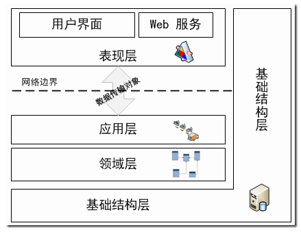

#### 基础结构层 （Infrastructure Layer）：

该层专为其它各层提供技术框架支持。

基础结构层的基本原则：不会涉及任何业务知识，与业务无关，不涉及业务逻辑。

为啥数据访问的内容移动到了基础结构层 ？因为 数据的CRUD，本质上不涉及业务逻辑，或者说数据的读写是业务无关的。所以，数据访问的内容，也被放在了该层当中。

Infrastructure Layer 一些例子：

-   领域层需要持久化服务，在DDD中，领域层通过仓储（Repository）接口定义持久化需求，基础设施层通过采用JDBC、JPA、Hibernate、NoSQL等技术之一实现领域层的仓储接口，为领域层提供持久化服务。
-   领域层需要消息通知服务，在领域层中定义了一个NotificationService领域服务接口，基础设施层通过采用手机短信、电子邮件、Jabber等技术实现NotificationService领域服务接口，为领域层提供消息通知服务。
-   用户接口层需要一个对象序列化服务，将任何JavaBean序列化为JSON字符串，可以在用户接口层定义一个ObjectSerializer服务接口，基础设施层通过采用Gson实现这一接口，为用户接口层提供对象序列化服务。

#### 领域层 （Domain Layer）：

包含了业务所涉及的领域对象（实体、值对象）、领域服务以及它们之间的关系。

这部分内容的具体表现形式是： 领域模型（Domain Model）。

DDD提倡**富领域模型**，即尽量将业务逻辑归属到领域对象上，实在无法归属的部分，则以领域服务的形式进行定义。

**什么是业务逻辑？**

业务逻辑就是存在于问题域即业务领域中的实体、概念、规则和策略等，业务逻辑与软件实现无关，主要包含下面的内容：

-   业务实体（领域对象）。例如银行储蓄领域中的账户、信用卡等等业务实体。
-   业务规则。例如借记卡取款数额不得超过账户余额，信用卡支付不得超过授信金额，转账时转出账户余额减少的数量等于转入账户余额增加的数量，取款、存款和转账必须留下记录，等等。
-   业务策略。例如机票预订的超订策略（卖出的票的数量稍微超过航班座位的数量，以防有些旅客临时取消登机导致座位空置）等。
-   完整性约束。例如账户的账号不得为空，借记卡余额不得为负数等等。本质上，完整性约束是业务规则的一部分。
-   业务流程。例如，“在线订购”是一个业务流程，它包括“用户登录-选择商品-结算-下订单-付款-确认收货”这一系列流程。

对领域层的进一步说明如下：

-   领域层实现映射到领域模型，是设计维度的领域模型（Domain Model）在软件中的具体实现。
-   包含**实体、值对象和领域服务**等领域对象，通常这些领域对象和**问题域中的概念实体**一一对应，具有相同或相似的属性和行为。
-   在实体、值对象和领域服务等领域对象的方法中，封装实现业务规则和保证完整性约束（这一点是与CRUD模式相比最明显的差别，CRUD中的领域对象没有行为）。
-   领域对象在实现业务逻辑上具备坚不可摧的完整性，意味着不管外界代码如何操作，都不可能创建不合法的领域对象（例如没有账户号码或余额为负数的借记卡对象），亦不可能打破任何业务规则（例如在多次转账之后，钱凭空丢失或凭空产生）。
-   领域对象的功能是高度内聚的，具有单一的职责，任何不涉及业务逻辑的复杂的组合操作都不在领域层而在应用层中实现。
-   领域层中的全部领域对象的总和在功能上是完备的，意味着系统的所有行为都可以由领域层中的领域对象组合实现。

#### 应用层/工作流层 （Application Layer）：

应用层是领域驱动中最有争议的一个层次，也会有很多人对其职责感到模糊不清。

应用层不包含任何领域逻辑，但它会对任务进行协调，并可以维护应用程序的状态，

因此，应用层更注重流程性的东西。在某些领域驱动设计的实践中，也会将其称为“工作流层”。

既然不包含领域逻辑，那应用层又如何协调工作任务呢？

它通过**排列组合领域层**的领域对象来实现用例，它的职责可表示为“编排和转发”，

具体来说，Application Layer 将要实现的功能委托给一个或多个领域对象来实现，Application Layer 只负责安排工作顺序和拼装操作结果。

如果一定要进行类比的话 ，Application Layer 的职责 类似于微服务领域的 SpringCloud gateway，或者服务总线Service Bus。

#### 表现层/用户接口层（User Interface）：

这个好理解，跟三层架构里的表现层（Controller）意思差不多，

表现层依赖于应用层，但是表现层与应用层之间是通过数据传输对象（DTO）进行交互的，

DTO数据传输对象是没有行为的POCO（C#中的概念）对象，DTO的目的只是为了对领域对象（Domain Object）中的数据进行封装，剥离了Domain Object中的行为，实现层与层之间的数据传递。

为何不能直接将 Domain Object 用于数据传递？两个原因：

（1) 因为Domain Object 更注重领域，而DTO更注重数据。

(2) 由于“富领域模型”的特点，这样做会直接将Domain Object 的行为暴露给表现层。

表现层为外部用户访问底层系统提供交互界面和数据表示。

表现层在底层系统之上封装了一层可访问外壳，为特定类型的外部用户（人或计算机程序）访问底层系统提供访问入口，并将底层系统的状态数据以该类型客户需要的形式呈现给它们。

**表现层有两个任务：**

（1）从用户处接收命令操作，改变底层系统状态；

（2）从用户处接收查询操作，将底层系统状态以合适的形式呈现给用户。

**表现层说明：**

o 典型的用户是人类用户，但是也可能是别的计算机系统。例如如果 ERP 系统要访问我们的系统获取信息，它也是一种用户。

o 不同类型的用户需要不同形式的用户接口，例如为人类用户提供 Web 界面和手机 App，为 ERP 软件用户提供 REST 服务接口。所以，REST 服务接口 也算是表现层。

o 不同类型的用户需要不同形式的数据表示，包括表现形式的不同（XML、JSON、HTML）和内容的不同（例如手机 App 中呈现的数据内容往往比 Web 页面中呈现的少）。

o 表现层对应用层进行封装，表现层的操作与应用层上定义的操作通常是一一对应的关系。表现层从外部用户处接受输入，转换成应用层方法的参数形式，调用应用层方法将任务交由底层系统执行，并将返回结果转换成合适的形式返回给外部用户。

表现层的典型任务是下面三个：

-   校验——校验外部客户输入的数据是否合法；
-   转换——将外部客户的输入转换成对底层系统的方法调用参数，以及将底层系统的调用结果转换成外部客户需要的形式；
-   转发——将外部客户的请求转发给底层系统。

表现层也被称为用户界面层或用户接口层。

有时候，为了某些需要，我们可以从表现层中分离出一个亚层，可命名为门面层（Facade）。位于真正的表现层和应用层之间。

#### 门面层(Faced Layer)

**门面层隔离前台和后台系统，定义特定于表现层的数据结构，从后台获取数据内容并转化为表现层的数据形式。**

从表现层中分离出专门的门面层，具有下面的优势：

-   使得表现层能够独立于后台系统，与后台系统并行开发。

表现层通过**门面层接口**达到和应用层、领域层解耦，意味着表现层可以独立开发，不必等待后台系统的完成，亦不受后台系统重构的影响，在需求调研阶段系统原型出来并得到用户确认之后，**就可以开始表现层的开发了**。

可以根据界面原型定义**表现层需要的数据结构**，该数据结构与底层数据结构解耦，不需要知道底层数据类型和数据之间的关联关系。将应用层DTO数据和界面数据连接起来，并相互转换是门面层实现类的职责，这方面工作可以等待前后台系统分别完成之后进行。

-   使得分布式部署成为可能。

如果没有门面层的隔离，表现层只能直接使用领域层的领域对象作为自己的数据展现结构。

这样我们就不能将系统进行**分布式部署**，将表现层和后台系统（领域层、应用层等）分别部署到不同的服务器上。

因为在JPA和Hibernate等技术实现中，**领域实体**绑定到当前服务器的持久化上下文中，必须脱管之后才能够跨越JVM进行传输。

-   避免Hibernate中“会话已关闭”的问题，消除成本巨大的“Open Session in View”模式的需要。

在采用JPA或Hibernate作为持久化手段的系统中，存在臭名昭著的“会话已关闭”问题，对付这一问题的主要手段是使用Open Session in View方案，但是这个方案的性能很低。

-   把事务作用范围控制在后端，缩短事务的跨度，提升性能和系统的吞吐量。

更大的问题是事务问题，事务要跨越服务器的边界，复杂性增加，性能严重下降。门面层的存在使得实体和事务都限制在后台系统，不需要扩展到前台服务器。

如果不采用门面层隔离后台数据结构，在前端展现数据需要访问实体的延迟初始化属性时，就会遇到“会话已关闭”问题，而采用Open Session in View模式去解决的话，就意味着事务不是在后端独立完成，这样事务就扩展到前端表现层，在大流量、高吞吐的网站上，把事务扩展到前端界面做造成事务时间跨度极度拉长，从而带来严重的严重的性能问题，大大降低吞吐量。

采用门面模式的话，有关联关系的数据在后台拼装完毕再一次性返回给前端，事务局限在后端范围，不再有“会话已关闭”和性能问题。

门面层说明：

-   门面层特定于表现层，由表现层定义和控制（包括操作和数据的形式和内容），这意味着需要为不同类型的表现层开发专门的门面层。
-   查询结果通常以数据传输对象（DTO）的形式表示。DTO的结构由表现层而不是后端决定，代表前端需要的数据形式，与底层数据结构脱耦。
-   通过门面层实现类访问后端的应用层。实现类将后端数据拼装为DTO并返回给前端，它可以将数据装配职责委托给专门的Assembler工具类去执行。
-   在分布式系统中，可以在前端和后端分别部署门面层。前后端的门面层接口相同，但后端的门面层实现类负责数据装配和发布，前端的门面层实现类负责通过某种通信机制（Web Service等）与后端门面层通讯，获取后者装配好的数据。传输过程中DTO可能序列化为JSON或XML等形式。

#### 分层架构的优点

分层架构的目的是通过关注点分离来降低系统的复杂度，同时满足单一职责、高内聚、低耦合、提高可复用性和降低维护成本。

-   单一职责：每一层只负责一个职责，职责边界清晰，如持久层只负责数据查询和存储，领域层只负责处理业务逻辑。
-   高内聚：分层是把相同的职责放在同一个层中，所有业务逻辑内聚在领域层。  
    这样做有什么好处呢？试想一下假如业务逻辑分散在每一层，修改功能需要去各层修改，测试业务逻辑需要测试所有层的代码，这样增加了整个软件的复杂度和测试难度。
-   低耦合：依赖关系非常简单，上层只能依赖于下层，没有循环依赖。
-   可复用：某项能力可以复用给多个业务流程。  
    比如持久层提供按照还款状态查询信用卡的服务，既可以给申请信用卡做判断使用，也可以给展示未还款信用卡使用。
-   易维护：面对变更容易修改。把所有对外接口都放在对外接口层，一旦外部依赖的接口被修改，只需要改这个层的代码即可。

以上这些既是分层的好处也是分层的原则，大家在分层时需要遵循以上原则，不恰当的分层会违背了分层架构的初衷。

#### 分层架构的缺点

-   开发成本高：因为多层分别承担各自的职责，增加功能需要在多个层增加代码，这样难免会增加开发成本。但是合理的能力抽象可以提高了复用性，又能降低开发成本。
-   性能略低：业务流需要经过多层代码的处理，性能会有所消耗。
-   可扩展性低：因为上下层之间存在耦合度，所有有些功能变化可能涉及到多层的修改。

### DDD的特点

DDD到底能帮助我们什么呢？

用一段话总结下：DDD改变了**数据表驱动**的设计方式，设计驱动方向变为**Domain Model驱动**，

DDD设计的时候，首先将业务概念和业务规则 转换为 Domain Model(包括类型以及类型的属性与行为)，而不是将业务概念和业务规则转换为 Entity和表结构，

DDD设计通过运用面向对象的封装、继承、多态等设计要素，降低或隐藏整个系统的业务复杂性，使得复杂的分布式系统具有更好的扩展性，应对纷繁多变的现实业务问题。

DDD试图解决的是软件的复杂性问题，如果软件比较复杂，或者是预期会很复杂，那么都可以开始考虑DDD。

由于维系领域模型需要实现大量的封装和隔离，DDD会带来较大的成本，如果系统比较简单，未来也不会有太多复杂的扩展，那么，传统的数据表驱动(/数据模型驱动)的设计方式，更为合适。

### 使用DDD的好处

-   领域模型是整个软件的核心，是软件中最有价值和最具竞争力的部分，设计足够精良且符合业务需求的领域模型能够更快速的响应需求变化。
-   通用领域模型语言：在有界的上下文中形成统一的语言，方便与产品同学或者开发同学之间沟通，减少歧义和沟通成本。通用领域模型语言：DDD帮助统一语言，在有界的上下文中形成通用的语言，方便与产品同学或者开发同学之间沟通，减少歧义和沟通成本。
-   业务领域知识沉淀：领域驱动设计的核心是建立统一的领域模型，领域模型不同于数据模型，和任何技术实现及存储实现无关，只反映业务本身，业务通过核心稳定的领域模型，领域知识进行传递，沉淀业务知识。
-   系统的架构设计：传统的开发设计方式，数据模型驱动是从数据出发，设计数据库表，编写DAO，然后进行业务实现。而领域驱动设计从领域出发，分析领域内模型及其关系，并进行领域建模，设计核心业务逻辑，完成了领域模型与数据模型分离，业务复杂度与技术复杂度分离。
-   系统的具体实现：领域驱动设计领域建模完成后，确定了业务和应用边界，保证业务模型与代码模型的一致性，进而再进行技术细节实现。领域模型确保了我们的软件的业务逻辑都在一个模型模块中，提高软件的可维护性，业务可理解性以及可重用性。
-   系统的扩展性：领域模型划分出的边界，沉淀的核心稳定的领域模型知识，面对新来的需求可以快速判断需求的合理性，需求的归属子域，应该在哪个模块实现，通过不断的抽象、不断的分治、拉齐团队内成员对需求的认知，应对系统复杂性，让设计更加清晰和规范。

### DDD的难点

-   DDD有这么多优势，为什么大家使用的还是不够多呢？任何一个事物都有两面性，不可能是完美，DDD也有很多问题，而且有些问题可能就是致命的，让人望而却步的？
-   要求、难度系数高：领域模型的正确构建首先需要有一个熟悉业务、建模的领域专家，其次依赖编程人员对DDD的深刻理解，对团队成员的本身素质要求较高。
-   效率，投入产出比：正确的建模从方案讨论、设计、实践、落地往往需要花费一段时间，面对业务紧急的需求以及倒排的工期，可能满足不了上线的要求。而其他一般架构不需要这些时间，短期投入成本高，但是从长期看，领域模型收益还是很高的。
-   团队成员之间协作：领域模型一般是整体的，领域内是相互依赖的，相互影响的，不容易分割为可并行独立解耦开发的模块，对开发同学的协作要求较高。
-   技术上的缺陷：DDD是基于聚合来组织代码，对于高性能场景下，加载聚合中大量的无用字段会严重影响性能，实际场景中，更多的高流量查询往往脱离聚合直接对某一个数据进行查询。此外，事务被限定在限界上下文中，跨多个限界上下文的场景需要开发者额外考虑分布式事务问题。

### 深入DDD

领域驱动设计是一种思维方式，也是一组优先任务，是针对复杂系统设计的一套软件工程方法。分为领域分析建模、领域设计建模与领域实现建模三个过程。

领域驱动设计围绕着**领域模型**进行设计，通过**分层架构**将领域独立出来。

这里有两个关键词：

-   领域模型
-   分层架构

领域模型的对象包括：实体、值对象和领域服务，领域逻辑都应该封装在这些对象中。

聚合是一种边界，它可以封装一到多个实体与值对象，并维持该边界范围之内的业务完整性。

在聚合中，至少包含一个实体，且只有实体才能作为聚合根。

工厂和资源库都是对领域对象生命周期的管理。

工厂负责领域对象的创建，用于封装复杂或者可能变化的创建逻辑。

资源库负责从存放资源的持久层获取、添加、删除或者修改领域对象。

#### 聚合(aggregate)

聚合是领域对象的显式分组，我们把一些关联性极强、生命周期一致的实体、值对象放到一个聚合里。

聚合定义了一组具有内聚关系的相关对象的集合，每个聚合都有一个根对象（聚合根实体）。

我们把聚合看作是一个修改数据的单元。

一个聚合是一组相关的被视为整体的对象。每个聚合都有一个根对象（聚合根实体），从外部访问只能通过这个对象。

根实体对象有组成聚合所有对象的引用，但是外部对象只能引用根对象实体。只有聚合根才能使用仓储库直接查询，其它的只能通过相关的聚合访问。如果根实体被删除，聚合内部的其它对象也将被删除。

为啥需要进行聚合？旨在支持领域模型的行为和不变性，同时充当一致性和事务性边界。

聚合有两个核心要素：

-   一个聚合根
-   一个上下文边界

这个边界 根据业务单一职责和高内聚原则，定义了聚合内部应该包含哪些实体和值对象，而聚合之间的边界是松耦合的。

按照这种方式设计出来的服务很自然就是“高内聚、低耦合”的。

聚合在 DDD 分层架构里属于领域层，领域层包含了多个聚合，共同实现核心业务逻辑。

#### 聚合根(aggregate root)

如果把聚合比作组织，那聚合根就是这个组织的负责人。

**聚合根也称为根实体，它不仅是实体，还是聚合的管理者。**

-   首先它作为实体本身，拥有实体的属性和业务行为，实现自身的业务逻辑。
-   其次它作为聚合的管理者，在聚合内部负责协调实体和值对象按照固定的业务规则协同完成共同的业务逻辑。
-   最后在聚合之间，它还是聚合对外的接口人，以聚合根 ID 关联的方式接受外部任务和请求，在上下文内实现聚合之间的业务协同。也就是说，聚合之间通过聚合根 ID 关联引用，如果需要访问其它聚合的实体，就要先访问聚合根，再导航到聚合内部实体，外部对象不能直接访问聚合内实体。

上面讲的还是有些抽象，下面看一个图就能很好理解（同样是源于极客时间欧创新的DDD实战课）：

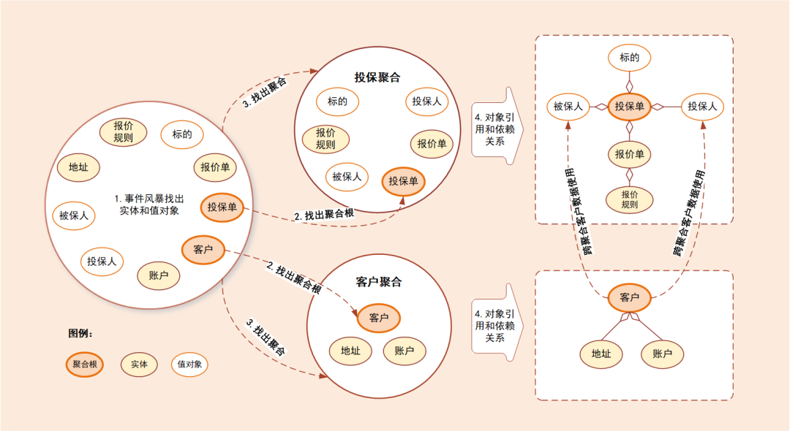

简单概括一下：

-   通过事件风暴（我理解就是头脑风暴，不过我们一般都是先通过个人理解，然后再和相关核心同学进行沟通），得到实体和值对象；
-   将这些实体和值对象聚合为“投保聚合”和“客户聚合”，其中“投保单”和“客户”是两者的聚合根；
-   找出与聚合根“投保单”和“客户”关联的所有紧密依赖的实体和值对象；
-   在聚合内根据聚合根、实体和值对象的依赖关系，画出对象的引用和依赖模型。

#### 服务（services）

服务提供的操作是它提供给使用它的客户端，并突出领域对象的关系。

所有的service只负责协调并委派业务逻辑给领域对象进行处理，其本身并未真正实现业务逻辑，绝大部分的业务逻辑都由领域对象承载和实现了。

service可与多种组件进行交互，这些组件包括：其他的service、领域对象和repository 或 dao。

服务又细分为领域服务和应用服务。

#### 领域服务（Domain Service）

接下来，看看领域服务和应用服务两个核心概念。

领域中的一些概念，如果是名词，适合建模为对象的一般归类到实体对象或值对象。

如果是动词，比如一些操作、一些动作，代表的是一种行为，如果是和实体或值对象密切相关的，也可以合并到某个实体或者值对象中。

但是，有些操作**不属于实体或者值对象本身**，或会**涉及到多个领域对象**，并且需要协调这些领域对象共同完成这个操作或动作，这时就需要创建领域服务来提供这些操作。

当一些逻辑不属于某个实体时，可以把这些逻辑单独拿出来放到领域服务中。可以使用领域服务的情况：

-   执行一个显著的业务操作
-   对领域对象进行转换
-   以多个领域对象作为输入参数进行计算，结果产生一个值对象

领域服务有两个特征：

-   1）操作代表了一个领域概念，且不是实体或者值对象的一个自然的部分；
-   2）被执行的操作涉及领域中的其他对象；操作是无状态的。领域服务还有一个好处可以避免领域逻辑泄露到t应用层。

因为如果没有领域服务，那么应用层会直接调用领域对象完成本该是属于领域服务该做的操作。

此外，如果实体操作过多或者过大，为了避免臃肿，也可以使用领域服务来解决。

但是，不能把所有的东西都搬到领域服务里，过度使用可能会导致产生的太多的贫血对象。

理想的情况是没有领域服务，如果领域服务使用不恰当，慢慢又演化回了以前逻辑都在 service 层的局面

#### 应用服务（Application Service）

应用层作为展现层与领域层的桥梁，是用来表达用例和用户故事的主要手段。

应用层通过应用服务接口来暴露系统的全部功能。

在应用服务的实现中，它负责编排和转发，它将要实现的功能委托给一个或多个领域对象来实现，它本身只负责处理业务用例的执行顺序以及结果的拼装。

通过这样一种方式，它隐藏了领域层的复杂性及其内部实现机制。

应用层相对来说是较“薄”的一层，除了定义应用服务之外，在该层我们可以进行安全认证，权限校验，持久化事务控制，或者向其他系统发生基于事件的消息通知，另外还可以用于创建邮件以发送给客户等。

领域服务和应用服务的不同：

-   领域服务和应用服务是不同的，领域服务是领域模型的一部分，用来处理业务逻辑，而应用服务不是。
-   应用服务是领域服务的直接客户，负责处理**事务、安全**等操作，它将领域模型变成对外界可用的软件系统。
-   跨多个实体的业务逻辑通过领域服务来实现，跨多个聚合的业务逻辑通过应用服务来实现。

跨多个实体的业务逻辑通过领域服务来实现，跨多个聚合的业务逻辑通过应用服务来实现。

-   比如有的业务场景需要同一个聚合的 A 和 B 两个实体来共同完成，我们就可以将这段业务逻辑用领域服务来实现；
-   而有的业务逻辑需要聚合 C 和聚合 D 中的两个服务共同完成，这时你就可以用应用服务来组合这两个服务。

#### 领域事件

领域事件是一个领域模型中极其重要的部分，用来表示领域中发生的事件。

**领域事件 = 事件发布 + 事件存储 + 事件分发 + 事件处理。**

程序事件通常分为：系统事件、应用事件和领域事件。领域事件的触发点在领域模型中。

它的作用是将领域对象从对repository或service的依赖中解脱出来，避免让领域对象对这些设施产生直接依赖。

它的做法就是当领域对象的业务方法需要依赖到这些对象时,就发出一个事件，这个事件会被相应的对象监听到并做出处理。譬如跨限界上下文时，使用关键应用事件触发事件传递。

从尼恩的视角简单来说：领域事件是对 repository或service 的异步解耦。

在尼恩写的深度文章《[京东一面：20种异步，你知道几种？ 含协程](https://blog.csdn.net/crazymakercircle/article/details/128899176)》中，就有EventBus 这样的事件总线，完成模块之间的异步解耦，也有 RocketMQ这样的分布式消息组件，完成进程级别的异步解耦。而领域事件 是设计维度的解耦。EventBus 、RocketMQ是实现层面的异步解耦，当然是先有设计，后有实现。

在DDD中，通过领域事件，一个领域模型可以忽略不相关的领域活动，同时明确领域专家要跟踪或希望被通知的事情，或与其他模型对象中的状态更改相关联。

下面简单说明领域事件：

-   **事件发布**：构建一个事件，需要唯一标识，然后发布；
-   **事件存储**：发布事件前需要存储，因为接收后的事建也会存储，可用于重试或对账等；
-   **事件分发**：服务内直接发布给订阅者，服务外需要借助消息中间件，比如Kafka，RabbitMQ等；
-   **事件处理**：先将事件存储，然后再处理。

比如下订单后，给用户增长积分与赠送优惠券的需求。如果使用瀑布流的方式写代码。一个个逻辑调用，那么不同用户，赠送的东西不同，逻辑就会变得又臭又长。

这里的比较好的方式是，用户下订单成功后，发布领域事件，积分聚合与优惠券聚合监听订单发布的领域事件进行处理。

#### 资源仓储/资源库（Repository）

仓储（资源库）是用来管理实体的集合。

仓储介于领域模型和数据模型之间，主要用于聚合的持久化和检索。

仓储里面存放的对象一定是聚合，原因是domain是以聚合的概念来划分边界的；聚合作为一个整体概念，要么一起被取出来，要么一起被删除。

它隔离了领域模型和数据模型，以便我们关注于领域模型而不需要考虑如何进行持久化。

我们将暂时不使用的领域对象从内存中持久化存储到磁盘中。

当日后需要再次使用这个领域对象时，根据 key 值到数据库查找到这条记录，然后将其恢复成领域对象，应用程序就可以继续使用它了，这就是领域对象持久化存储的设计思想。

#### 工厂（Factory）

工厂用来封装创建一个复杂对象尤其是聚合时所需的知识，作用是将创建对象的细节隐藏起来。

客户传递给工厂一些简单的参数，然后工厂可以在内部创建出一个复杂的领域对象然后返回给客户。

工厂（Factory）不是必须的，只有当创建实体和值对象复杂时，建议使用工厂模式。

## 领域驱动设计一般分为两个阶段

领域驱动设计划分了**战略设计**和**战术设计**，也提供了诸多模式和工具，但却没有一个统一过程去规范这两个阶段需要执行的活动、交付的工件以及阶段里程碑，甚至没有清晰定义这两个阶段如何衔接、它们之间执行的工作流到底是怎么样的。

除了把领域驱动设计 分为战略设计和战术设计的方法之外，《解构-领域驱动设计》提出的 DDDRUP 方法。

DDDRUP 给出了更细致的步骤、步骤与步骤之间的衔接，以及明确的阶段里程碑，最重要的是 DDDRUP 可以串联 DDD 的所有概念和模式，非常便于初学者做知识梳理和上手实践。DDDRUP 各步骤与战略&战术设计的关系见下表。

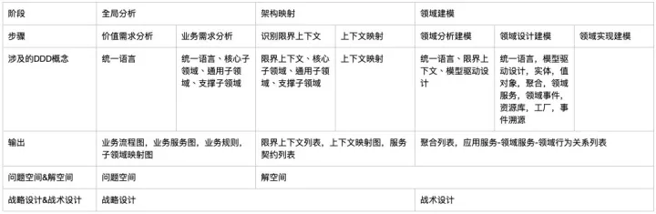

对于《解构-领域驱动设计》DDDRUP 方法，打击可以去看那个书籍。

这里，尼恩还是使用略设计和战术设计方式，进行 领域驱动设计的介绍。

战略设计侧重于高层次、宏观上去划分和集成限界上下文，而战术设计则关注更具体使用建模工具来细化上下文。

### （1）战略阶段。

在战略设计中，讲求的是子域和限界上下文的划分，以及各个限界上下文之间的上下游关系，更偏向于软件架构，帮助我们从一个宏观的角度观察和审视软件系统。

**分解问题域：**

-   通常先进行需求调研，收集领域知识，用例设计，
-   引入限界上下文（Bounded Context）和上下文映射（Context Map）对问题域进行合理的分解，
-   识别出核心领域（Core Domain）与子领域（SubDomain）
-   并确定领域的边界以及它们之间的关系，维持模型的完整性。

**架构方面：**

-   通过分层架构来隔离关注点，尤其是将领域实现独立出来，能够更利于领域模型的单一性与稳定性；
-   引入六边形架构可以清晰地表达领域与技术基础设施的边界；
-   CQRS 模式则分离了查询场景和命令场景，针对不同场景选择使用同步或异步操作，来提高架构的低延迟性与高并发能力。
-   在对传统MVC架构系统进行改造时，一般分为接口层、应用层、领域层、基础设施层。

### （2）战术阶段。

在战术层面，它主要应对的是领域的复杂性。

领域驱动设计用以表示模型的主要要素包括如下：

-   实体（Entity）。一个由它的标识定义的对象叫做实体。通常实体具备唯一id，能够被持久化，具有业务逻辑，对应现实世界业务对象。
-   值对象（Value Object）。描述事物的对象；更准确的说，一个没有标识符描述一个领域方面的对象。
-   聚合及聚合根(aggregate、aggregate root)。聚合是用来定义领域对象所有权和边界的领域模式。聚合定义了一组具有内聚关系的相关对象的集合，每个聚合都有一个根对象（聚合根实体）。
-   领域事件（Domain Event）。领域事件的触发点在领域模型中。它的作用避免让领域对象对repository或service设施产生直接依赖。
-   资源库（Repository）。仓储（资源库）是用来管理实体的集合。。
-   工厂（Factory）。当创建实体和值对象复杂时建议使用工厂模式。
-   服务（services）。服务提供的操作是它提供给使用它的客户端，并突出领域对象的关系。其细分为领域服务和应用服务。
-   领域服务（Domain Service）。领域服务封装了一些域概念，这些概念并不是自然建模的。领域服务是无状态的，须以非常干净简洁的代码实现。
-   应用服务（Application Service）。应用程序服务构成应用程序或服务层。

### 领域驱动设计流程

通常战略阶段和战术阶段要求领域专家和开发团队紧密配合，沟通协调完成，示意图如下：

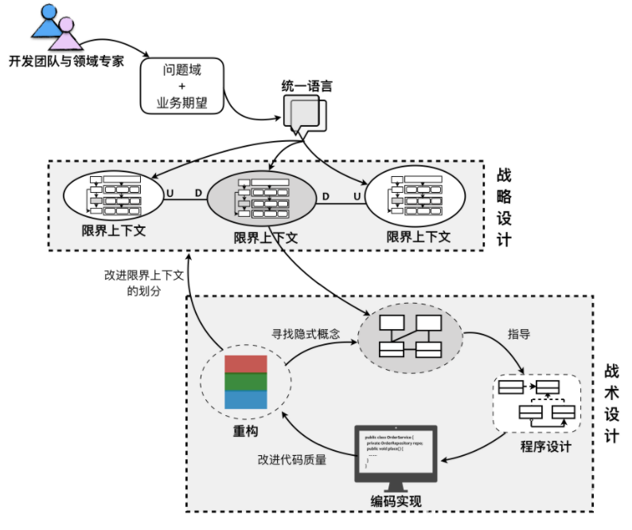

### **领域驱动的流程特点**

领域驱动指的是以领域作为解决问题切入点，

面对业务需求，先提炼出领域概念，并构建领域模型来表达业务问题，

而构建过程中我们应该尽可能避免牵扯技术方案或技术细节。

而编码实现更像是对领域模型的代码翻译，代码（变量名、方法名、类名等）中要求能够表达领域概念，让人见码明义。

#### **特点之一：思维模式转变**

实践 DDD 以前，我最常使用的是**数据驱动设计**。

它的核心思路针对业务需求进行**数据建模**：根据业务需求提炼出类，然后通过 ORM 把类映射为表结构，并根据读写性能要求使用范式优化表与表之间的关联关系。

数据驱动是从技术的维度解决业务问题，得出的数据模型是对业务需求的直接翻译，并没有蕴含稳定的**领域知识/规则**。

一旦需求发生变化，数据模型就得发生变化，对应的库表的设计也需要进行调整。

这种设计思维导致变化从需求穿透到了数据层，中间并没有稳定的，不易变的层级进行阻隔，最终导致系统响应变化的能力很差。

#### **特点之二：协同方式转变**

过去由产品同学提出业务需求，研发同学根据业务需求的 产品原型 进行技术方案设计，并编程实现。

这种协同方式的弊端在于：**无法形成能够消除认知差异的模型**。

产品同学从业务角度提出用户需求，这些需求可能是易变的、定制化的，

而研发同学在缺少行业经验的情况下，往往会选择直译，即根据需求直接转换为数据模型。

而研发同学从技术实现角度设计技术方案，其中涉及很多的技术细节，产品同学无法从中判断是否与自己提出的业务诉求和产品规划相一致，最终形成认知差异。

且认知差异会随着迭代不断被放大，最后系统变成一个大泥球。

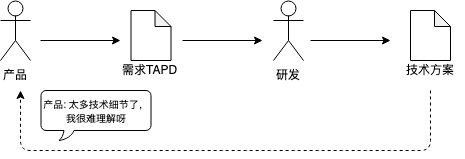

DDD 通过解锁新角色**”领域专家"以及模型驱动设计**，有效地降低产品和研发的认知差异。 领域专家是具有丰富行业经验和领域知识储备的人，他们能够在易变的、定制化的需求中提炼出清晰的边界，稳定的、可复用的领域概念和业务规则，并携手产品和研发共同构建出领域模型。

领域模型是对业务需求的知识表达形式，它不涉及具体的技术细节（但能够指导研发同学进行编程实现），因此消除了产品和研发在需求认知上的鸿沟。

而模型驱动设计则要求领域模型能够关联业务需求和编码实现，模型的变更意味着需求变更和代码变更，协作围绕模型为中心。

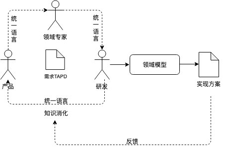

#### 特点之三：精炼循环

精炼循环指的是在统一语言，提炼领域概念，明确边界，构建模型，绑定实现过程中，这些环节相互影响和反馈，在不断的迭代试错-调整以最终沉淀出稳定的、深层次的模型的过程。

比如，我们在提炼领域概念的时候会觉得统一语言定义不合理/有歧义，此时我们就会调整统一语言的定义，并重新进行提炼领域概念。

通过精炼循环，我们逐步形成稳定的领域模型。在 DDD 中，让领域专家来主导概念提炼、边界划分等宏观设计，原因就在于领域专家的经验和行业洞见来源于过去已经迭代的无数个精炼循环，因此由这些宏观设计推导出来的领域模型，往往都是非常稳定的。

精炼循环的核心是循环，它避免知识只朝单一方向流动，最终因各环节上的认知差异，最终导致模型无法在产品、领域专家和研发中达成一致、模型与实现割裂。

## 阶段一：战略阶段

战略阶段的工作：引入限界上下文（Bounded Context）和上下文映射（Context Map）对问题域进行合理的分解。

战略阶段的参与人员：产品、领域专家和开发同学。这些人组成 DDD 战略设计会。

领域专家是谁？懂得该领域业务知识的人，领域专家一般不是技术人员，通常技术人员对新软件项目的领域知识是不了解的。

领域专家通常是软件设计者或者产品经理，也可能是销售、技术支持等收集业务需求的人。

技术人员与领域专家之间需要使用**领域通用语言**（Ubiquitous Language）进行业务沟通，领域通用语言可以是 UML、需求文档等提前规定好的双方都能理解的语言。

在战略设计中，讲求的是子域和限界上下文的划分，以及各个限界上下文之间的上下游关系，更偏向于软件架构，帮助我们从一个宏观的角度观察和审视软件系统。

首先，领域可以拆分为多个子领域。

一个领域相当于一个问题域，领域拆分为子域的过程就是大问题拆分为小问题的过程。

子域还可根据需要进一步拆分为子子域，拆到一定程度后，有些子子域的领域边界就可能变成限界上下文的边界了。

每个领域模型都有它对应的限界上下文，团队在限界上下文内用通用语言交流。

领域内所有限界上下文的领域模型构成整个领域的领域模型。

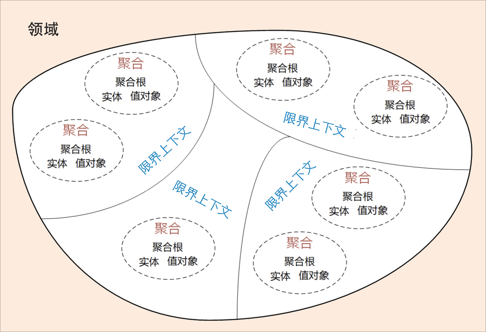

DDD 战略设计会`建立领域模型`，领域模型可以用于`指导微服务的设计和拆分`。

`事件风暴`是建立领域模型的主要方法，它是一个从发散到收敛的过程。

-   它通常采用用例分析、场景分析和用户旅程分析，尽可能全面不遗漏地分解业务领域，并梳理领域对象之间的关系，这是一个发散的过程。
-   事件风暴过程会产生很多的实体、命令、事件等领域对象，我们将这些领域对象从不同的维度进行聚类，形成如聚合、限界上下文等边界，建立领域模型，这就是一个收敛的过程。

### 领域通用语言和限界上下文（Bounded Context）

-   **通用语言**：就是能够简单、清晰、准确描述业务涵义和规则的语言。
-   **限界上下文**：用来封装通用语言和领域对象，提供上下文环境，保证在领域之内的一些术语、业务相关对象等（通用语言）有一个确切的含义，没有二义性。

### 通用语言 Ubiquitous Language

通用语言是团队统一的语言，不管你在团队中承担什么角色，在同一个领域的软件生命周期里都使用统一的语言进行交流。

那么，通用语言的价值也就很明了，它可以解决交流障碍这个问题，使领域专家和开发人员能够协同合作，从而确保业务需求的正确表达。

什么是通用语言？

尼恩给大家说个大白话：就是 产品经理、项目经理、架构师、开发人员、测试等项目所有人员，对同一个业务词汇，有统一的定义，不要一词各表、鸡同鸭讲。

所以，通用语言最终结果，就是需求沟通没有歧义，同一个词，有大家都明确了的定义。

大家不要感觉这个是一件很容易做到的事情，其实很难。 在实际开发过程中 ， 产品经理以为开发懂了，实际上最终的效果不是他们想要的，很大程度上，就是没有统一通用语言。

在事件风暴过程中，通过团队交流达成共识的，能够简单、清晰、准确描述业务涵义和规则的语言就是通用语言。也就是说，通用语言是团队统一的语言，不管你在团队中承担什么角色，在同一个领域的软件生命周期里都使用统一的语言进行交流。

通用语言包含术语和用例场景，并且能够直接反映在代码中。

通用语言中的名词可以给领域对象命名，如商品、订单等，对应实体对象；而动词则表示一个动作或事件，如商品已下单、订单已付款等，对应领域事件或者命令。

通用语言贯穿 DDD 的整个设计过程。作为项目团队沟通和协商形成的统一语言，基于它，你就能够开发出可读性更好的代码，将业务需求准确转化为代码设计。

下面这张图描述了从事件风暴建立通用语言到领域对象设计和代码落地的完整过程。

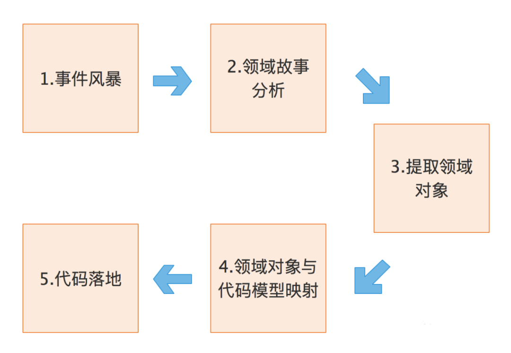

在事件风暴的过程中，领域专家会和设计、开发人员一起建立领域模型，在领域建模的过程中会形成通用的业务术语和用户故事。

事件风暴也是一个项目团队统一语言的过程。

通过用户故事分析会形成一个个的领域对象，这些领域对象对应领域模型的业务对象，每一个业务对象和领域对象都有通用的名词术语，并且一一映射。

微服务代码来源于领域模型，每个代码对象跟 领域对象一一对应。

设计过程中我们可以用一些表格，来记录事件风暴和微服务设计过程中产生的**领域对象及其属性**。

比如，领域对象在 DDD 分层架构中的位置、属性、依赖关系以及与代码对象的映射关系等。

下面是一个微服务设计实例的部分数据，表格中的这些名词术语就是项目团队在事件风暴过程中达成一致、可用于团队内部交流的通用语言。

在这个表格里面我们可以看到，DDD 分析过程中所有的领域对象以及它们的属性都被记录下来了，除了 DDD 的领域对象，我们还记录了在微服务设计过程中领域对象所对应的代码对象，并将它们一一映射。

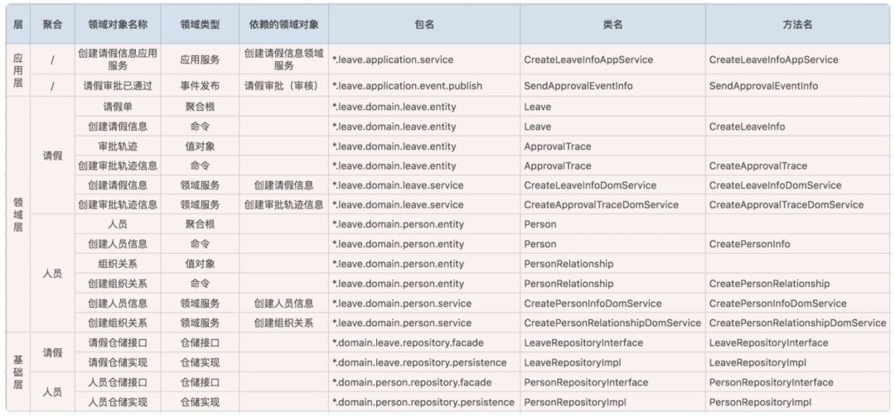

#### 限界上下文 （Bounded Context）

通用语言也有它的上下文环境，为了避免同样的概念或语义在不同的上下文环境中产生歧义，DDD 在战略设计上提出了“限界上下文”这个概念，用来确定语义所在的领域边界。

限界上下文是一个显式的语义和语境上的边界，领域模型便存在于边界之内。

限界上下文包含两部分：限界（Bounded）和上下文（Context）。限界就是领域的边界, 而上下文就是语义环境, 通过限界上下文让所有交流的人讨论的范围在同一个领域边界内。

边界内，通用语言中的所有术语和词组都有特定的含义。

把限界上下文拆解开看，限界就是领域的边界，而上下文则是语义环境。

通过领域的限界上下文，我们就可以在统一的领域边界内用统一的语言进行交流。

总之，限界上下文用来封装通用语言和领域对象，提供上下文环境，保证在领域之内的一些术语、业务相关对象等概念有一个确切的含义。

### 领域和子域 （Domain 、SubDomain）

什么是领域？

@汉语词典：领域是从事一种专门活动或事业的范围、部类或部门。”

@百度百科：领域具体指一种特定的范围或区域。”

两个解释有一个共同点：`范围`。领域就是用来确定范围的，范围即边界，这也是 DDD 在设计中不断强调边界的原因。

在研究和解决业务问题时，DDD 会按照一定的规则将业务领域进行细分，当领域细分到一定的程度后，DDD 会将问题范围限定在特定的边界内，在这个边界内建立领域模型，进而用代码实现该领域模型，解决相应的业务问题。简言之，DDD 的领域就是这个边界内要解决的业务问题域。

**业务领域**分析的过程，是由浅入深，从粗到细致，不断迭代，不断深化的过程。

在不断迭代的过程中，DDD 会按照一定的规则将**业务领域**不断细分，

领域可以进一步划分为子领域。

把划分出来的多个子领域称为子域，每个子域对应一个更小的问题域或更小的业务范围。

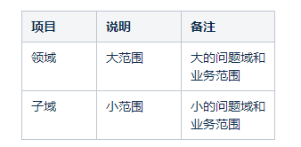

**领域的核心思想就是分治思想：就是将问题域逐级细分，来降低业务理解和系统实现的复杂度。**

最终，当领域细分到一定的程度后，DDD 会将问题范围限定在特定的边界内，在这个边界内建立**领域模型**，进而用代码实现该领域模型，解决相应的业务问题。

**子领域的功能分类策略**：问题空间应该分为哪些子领域，需要团队对目标系统整体进行探索，并根据**功能分类策略**进行分解。

-   **业务职能**：当目标系统运用于企业的生产和管理时，与目标系统业务有关的职能部门往往会影响目标系统的子领域划分，并形成一种简单的映射关系。这是康威定律的一种运用。
-   **业务产品**：当目标系统为客户提供诸多具有业务价值的产品时，可以按照产品的内容与方向进行子领域划分。
-   **业务环节**：对贯穿目标系统的核心业务流程进行阶段划分，然后按照划分出来的每个环节确定子领域。（这也是我们最常用的策略）
-   **业务概念**：捕捉目标系统中一目了然的业务概念，将其作为子领域。  
    通过领域细分，逐步缩小服务需要解决的问题域，构建合适的领域模型。

**举个简单的例子**，

对于保险领域，我们做第一次解耦，可以把保险细分为承保、收付、再保以及理赔等子域，

而承保子域，还可以继续解耦，细分为投保、保全（寿险）、批改（财险）等子子域。

### 核心域（Core Domain）、通用域和支撑域

子域可以根据重要程度和功能属性划分为如下：

-   **核心域**：决定产品和公司核心竞争力的子域，它是业务成功的主要因素和公司的核心竞争力。
-   **通用域**：没有太多个性化的诉求，同时被多个子域使用的通用功能的子域。
-   **支撑域**：但既不包含决定产品和公司核心竞争力的功能，也不包含通用功能的子域。

**核心域、支撑域和通用域的主要目标**：识别出资源投入的优先级。通过领域划分，区分不同子域在项目内的不同功能属性和重要性，从而项目可对不同子域采取不同的资源投入和建设策略，其关注度也会不一样。

公司在 IT 系统建设过程中，由于预算和资源有限，对不同类型的子域应有不同的关注度和资源投入策略，好钢要用在刀刃上。

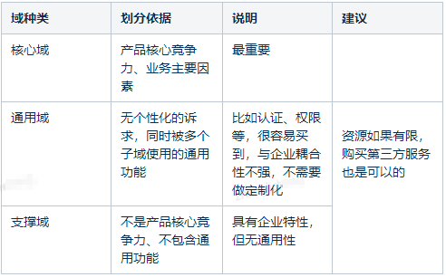

很多公司的业务，表面看上去相似，但商业模式和战略方向是存在很大差异的，因此公司的关注点会不一样，在划分核心域、通用域和支撑域时，其结果也会出现非常大的差异。

比如同样都是电商平台的淘宝、天猫、京东和苏宁易购，他们的商业模式是不同的。

淘宝是 C2C 网站，个人卖家对个人买家; 而天猫、京东和苏宁易购则是 B2C 网站，是公司卖家对个人买家。

即便是苏宁易购与京东都是 B2C 的模式，苏宁易购是典型的传统线下卖场转型成为电商，京东则是直营加部分平台模式。

因此，在公司建立领域模型时，我们就要结合公司战略重点和商业模式，重点关注核心域。

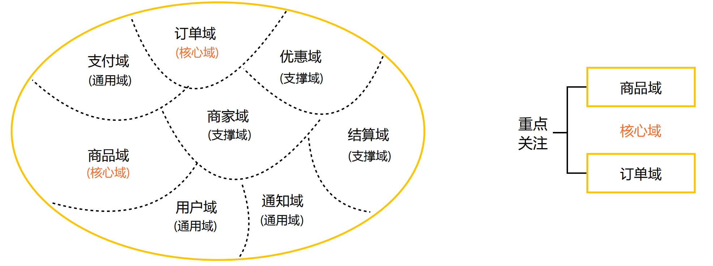

注意：通用语言贯穿 DDD 的整个设计过程。作为项目团队沟通和协商形成的统一语言，在说某通用语言时，必须要限定在某个上下文内，以确保每个上下文含义在它特定的边界内都有唯一的含义。

### 上下文映射图（Context Mapping） - 上下文 Context集成

上下文映射图的英文是 Context Map 其实这个翻译挺难理解的，上下文映射图其实就是不同上下文是如何进行交流的关系。

_尼恩提示：这里的用词雷死人不要命。 eric evans（埃里克埃文斯）搞得那么玄乎，其实就是 不同 Context 上下文之间的依赖关系。_

#### 三种Context集成方式

1.  RPC 方式
2.  消息队列或者发布 - 订阅机制
3.  RESTful 方式

#### 上下文映射 （依赖）的种类

-   **合作关系**

合作关系存在于两个团队之间。

每个团队各自负责一个限界上下文。两个团队通过互相依赖的一整套目标联合起来形成合作关系。一损俱损，一荣俱荣。

由于相互之间的联系非常紧密，他们经常会对同步日程安排和相互关联的工作。他们还必须使用持续集成对保持集成工作协调一致。

-   **共享内核**

两个或者多个团队之间共享着一个小规模但却通用的模型。

团队必须就要共享的模型元素达成一致。有可能他们当中只有一个团队会维护，构建及测试共享模型的代码。

-   **客户 - 供应商**

两个限界上下文中，一方是供应商处于上游，一方是客户方处于下游。支配这种关系的是供应商，因为它必须提供客户需要的东西。客户需要与供应商共同制订规划来满足各种预期，但最终却还是由供应商来决定客户获得的是什么以及何时获得。

-   **跟随者**

上游团队没有任何动机去满足下游团队的具体需求。由于各种原因，下游团队也无法投入资源去翻译上游模型的通用语言来适应自己的特定需求，因此只能顺应上游的模型。例如当一个团队需要与一个非常庞大复杂的模型集成，而且这个模型已经非常成熟时，团队往往会成为它的跟随者。

-   **防腐层 ACL**

这是最具防御性的上下文映射关系，下游团队在其通用语言（模型）和位于它上游的通用语言（模型）之间创建了一个翻译层。

防腐层隔离了下游模型与上游模型，并完成了两者之间的翻译。

引入防腐层的目的是为了**隔离耦合**。防腐层往往位于下游，通过它隔离上游上下文发生的变化。

所以，这也是一种集成方式。

_尼恩提示：防腐层 就更加 文绉绉了，其实就是 **适配层**。 TMD，写到这里尼恩想吐。_

-   **开放主机服务 OHS**

开放主机服务会定义一套协议或者接口，让限界上下文可以被当做一组服务访问。

开放主机服务定义公开服务的协议（亦称为“服务契约”），包括通信方式、传递消息的格式（协议），让限界上下文可以被当做一组服务访问。开放主机服务也可以视为一种承诺，保证开放的服务不会轻易做出变化。

对于进程内的开放主机服务，称为**本地服务**（对应 DDD 中的应用服务）。

对于进程间的开放主机服务，成为**远程服务**。根据选择的分布式通信技术的不同，又可以定义出类型不同的远程服务：

-   面向服务行为，比如基于 RPC，称为提供者（Provider）；
-   面向服务资源，比如基于 REST，称为资源（Resource）；
-   面向事件，比如基于消息中间件，称为订阅者（Subscriber）；
-   面向视图模型，比如基于 MVC，称为控制器（Controller）；

该协议是开放的，所有需要与限界上下文进行集成的客户端都可以相对轻松地使用它。

通过应用程序编程接口提供的服务都有详细的文档，用起来也很舒服。

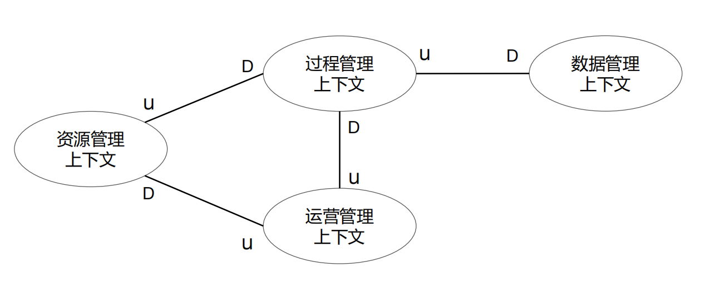

_尼恩提示： u表示 upstream 上游，d 表示down stream下游。_

## 阶段二：战术阶段

战术设计也称为战术建模，从`技术视角`出发，以领域模型为输入，通过限界上下文作为服务划分的边界进行`微服务拆分`，

在每个微服务中进行领域分层，实现`领域服务`，从而实现领域模型对于`代码映射`目的，最终实现DDD的落地实。

包括：实体、值对象、聚合、聚合根、资源库、工厂、领域服务、领域事件、应用服务等代码逻辑的设计和实现。

> 总体设计思路：面向对象。

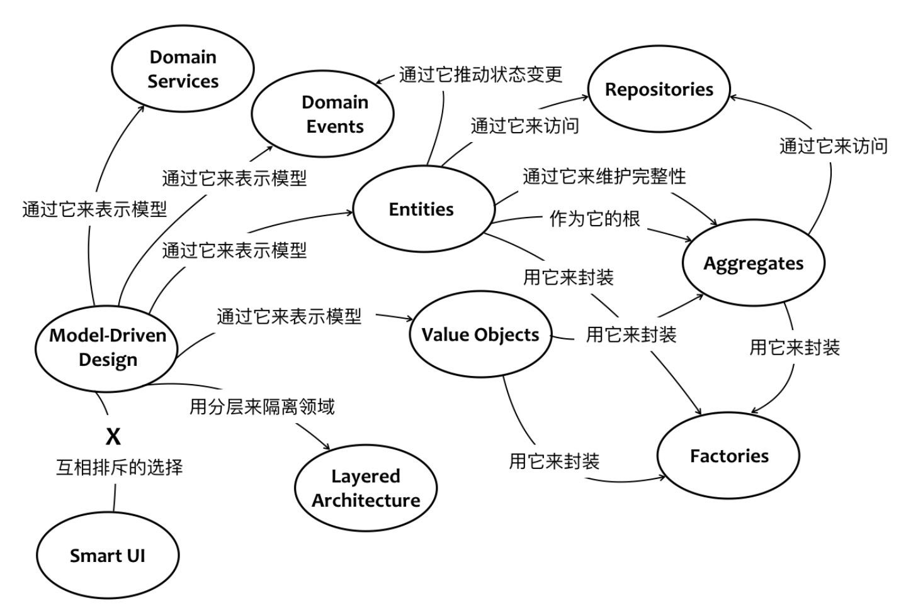

### 实体和值对象

在 DDD 中，实体和值对象是很基础的`领域对象`。

> **实体**一般对应**业务对象**，它具有**业务属性和业务行为**；而**值对象**主要是**属性集合**，**对实体的状态和特征进行描述**。但实体和值对象都只是个体化的对象，它们的行为表现出来的是个体的能力。

实体 对象 具备id标识，可以通过id进行相等性比较，实体在聚合内唯一，但是状态可变，它依附于聚合根，它的生命周期由聚合根管理，实体一般都会持久化，跟数据持久化对象存在多种对应关系（一对一，一对多，多对一，1对0），实体可以引用聚合中的聚合根，实体，值对象。

值对象描述了领域中的一件东西，这个东西是不可变的，无生命周期，用完即失效，值对象之间通过属性值判断相等性，他的核心是值，是一组概念完整的属性集合，用于描述实体的特征和状态，值对象尽量只引用值对象。

举个栗子

人员`实体`原本包括：**姓名、年龄、性别以及人员所在的省、市、县和街道等属性**。

这样显示地址相关的属性就很零碎了对不对？

现在，我们可以将 **“省、市、县和街道等属性”** 拿出来构成一个“地址属性集合”，这个集合就是`值对象`了。

### 聚合和聚合根

领域模型内的实体和值对象就好比个体，而聚合能让实体和值对象协同工作的组织就是聚合，它用来确保这些领域对象在实现共同的业务逻辑时，能保证数据的一致性。

如果把聚合比作组织，聚合根则是组织的负责人，聚合根也叫做根实体，它不仅仅是实体，还是实体的管理者。

聚合 需要做到 高内聚、低耦合，它是领域模型中最底层的边界，可以作为拆分微服务的最小单位。

当然，一个微服务可以包含多个聚合。或者说 多个 聚合 拆分 到一个微服务。

但是，在对性能有极致要求的场景中，聚合可以独立作为一个微服务，以满足版本的高频发布和极致的弹性伸缩能力。

一个微服务可以包含多个聚合，聚合之间的边界是微服务内天然的逻辑边界。

有了这个逻辑边界，在微服务架构演进时就可以以聚合为单位进行拆分和组合了，微服务的架构演进也就不再是一件难事了。

#### 怎样设计聚合

1.  采用`事件风暴`（用例分析、场景分析和用户旅程分析等方法），列出所有`业务行为和事件`，梳理出这些行为过程中的实体和值对象（领域对象）。
2.  从众多实体中选出作为对象管理者的根实体，也叫`聚合根`。
3.  根据业务`单一职责`和`高内聚原则`，找出与聚合根关联的所有的紧密依赖的`实体`和`值对象`。
4.  在聚合内根据 `聚合根、实体、值对象` 的依赖关系，画出`对象的引用`和`依赖模型`。
5.  多个聚合根据业务语义和上下文一起划分到同一个`限界上下文`中。

DDD 领域建模通常采用事件风暴，它通常采用用例分析、场景分析和用户旅程分析等方法，通过头脑风暴列出所有可能的业务行为和事件，然后找出产生这些行为的领域对象，并梳理领域对象之间的关系，找出聚合根，找出与聚合根业务紧密关联的实体和值对象，再将聚合根、实体和值对象组合，构建聚合。

下面我们以保险的投保业务场景为例，看一下聚合的构建过程主要都包括哪些步骤：  

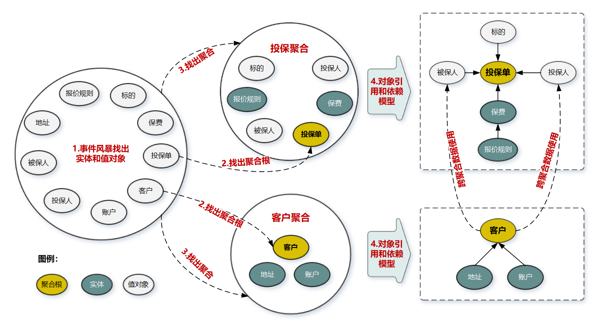

#### 聚合的一些设计原则

1.  **在一致性边界内建模真正的不变条件**：聚合内的实体和值对象按照统一的业务规则运行，实现数据对象的一致性。
2.  **设计小聚合**：降低由于业务过大导致的聚合重构的可能性。
3.  **通过唯一标志引用其他聚合**：聚合之间通过关联外部聚合根 id 的方式引用。
4.  **在边界之外使用最终一致性**：在一次事务中，最多只能更改一个聚合的状态。若一次业务操作导致多个聚合状态的修改。可以采用`领域事件`异步修改相关的聚合。
5.  **通过应用层实现跨聚合的服务调用**：为实现微服务内聚合之间的解耦，以及未来以聚合为单位的微服务组合和拆分，应避免跨聚合的领域服务调用和跨聚合的数据库表关联。

### 领域事件（Domain Event）

领域事件是解耦微服务的关键，也是领域模型中非常重要的一部分，用来表示领域中发生的事件。一个领域事将导致进一步的业务操作，在实现业务解耦的同时, 还有助于形成完整的业务闭环。

#### 如何识别领域事件

① 在做用户旅程或者场景分析时，我们要捕捉业务、需求人员或领域专家口中的关键词：“如果发生……，则……”、“当做完……的时候，请通知……”、“发生……时，则……” 等。在这些场景中，如果`发生某种事件后，会触发进一步的操作，那么这个事件很可能就是领域事件`。

② 领域事件可以切断领域模型之间的强依赖关系，事件发布完成之后，发布方不必关系订阅方事件处理是否成功，这样可以实现领域模型之间的解耦，维护领域模型的独立性和数据的一致性。在领域模型映射到微服务系统架构时，领域事件可以解耦微服务，微服务之间的数据不必要求强一致性，而是基于事件的最终一致性。

#### 领域事件的使用场景

-   **微服务内的领域事件**

当领域事件发生在微服务内的聚合之间，领域事件发生后完成事件实体构建和事件数据持久化，发布方聚合将事件发布到事件总线，订阅方接收事件数据完成后续业务操作。

微服务内大部分事件的集成，都发生在同一个进程内，进程自身可以很好地控制事务，因此不一定需要引入消息中间件。

但一个事件如果同时更新多个聚合，按照 `DDD “一次事务只更新一个聚合” 的原则`，你就要考虑是否引入事件总线。但微服务内的事件总线，可能会增加开发的复杂度，因此你需要结合应用复杂度和收益进行综合考虑。

微服务内应用服务，可以通过跨聚合的服务编排和组合，以服务调用的方式完成跨聚合的访问，这种方式通常应用于实时性和数据一致性要求高的场景。这个过程会用到分布式事务，以保证发布方和订阅方的数据同时更新成功。

-   **微服务之间的领域事件**

跨微服务的领域事件会在不同的限界上下文或领域模型之间实现业务协作，其主要目的是实现微服务解耦，减轻微服务之间实时服务访问的压力。

领域事件发生在微服务之间的场景比较多，事件处理的机制也更加复杂。跨微服务的事件可以推动业务流程或者数据在不同的子域或微服务间直接流转。

跨微服务的事件机制要总体考虑事件构建、发布和订阅、事件数据持久化、消息中间件，甚至事件数据持久化时还可能需要考虑引入分布式事务机制等。

微服务之间的访问也可以采用应用服务直接调用的方式，实现数据和服务的实时访问，弊端就是跨微服务的数据同时变更需要引入分布式事务，以确保数据的一致性。分布式事务机制会影响系统性能，增加微服务之间的耦合，所以我们还是要尽量避免使用分布式事务。

#### 领域事件相关案例

**介绍一个保险承保业务过程中有关领域事件的案例**：一个保单的生成，经历了很多子域、业务状态变更和跨微服务业务数据的传递。这个过程会产生很多的领域事件，这些领域事件促成了保险业务数据、对象在不同的微服务和子域之间的流转和角色转换。

**事件起点：客户购买保险 - 业务人员完成保单录入 - 生成投保单 - 启动缴费动作。**  

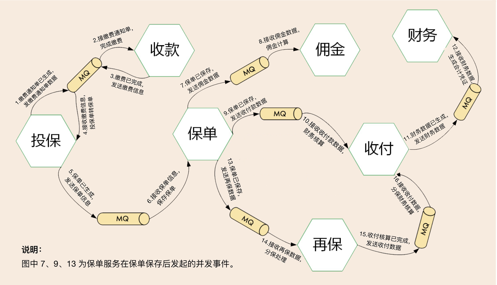

#### 领域事件总体架构

领域事件的执行需要一系列的组件和技术来支撑。

我们来看一下这个领域事件总体技术架构图，领域事件处理包括：`事件构建和发布、事件数据持久化、事件总线、消息中间件、事件接收和处理等`。

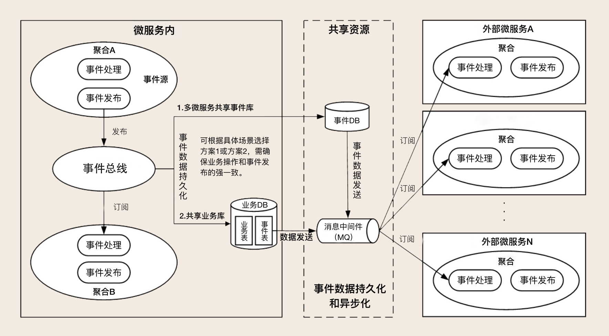

### 领域服务(Domain Service)和应用服务(Application Service)

**战略层语境：**

-   领域服务通常指相对聚焦的底层支撑域/通用域服务
-   应用服务通常指面向业务场景负责功能组装的服务

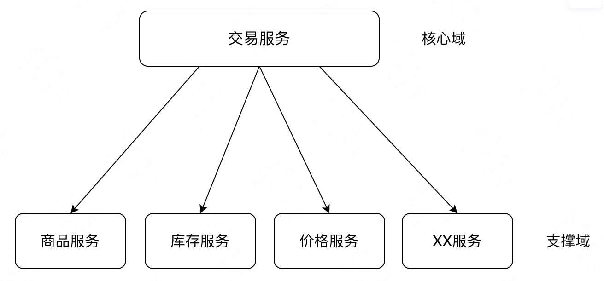

**战术层语境：**

-   领域服务指领域建模工具集中所指的“领域服务”， 处于领域层
-   应用服务指面向场景的技术实现组装，处于应用层

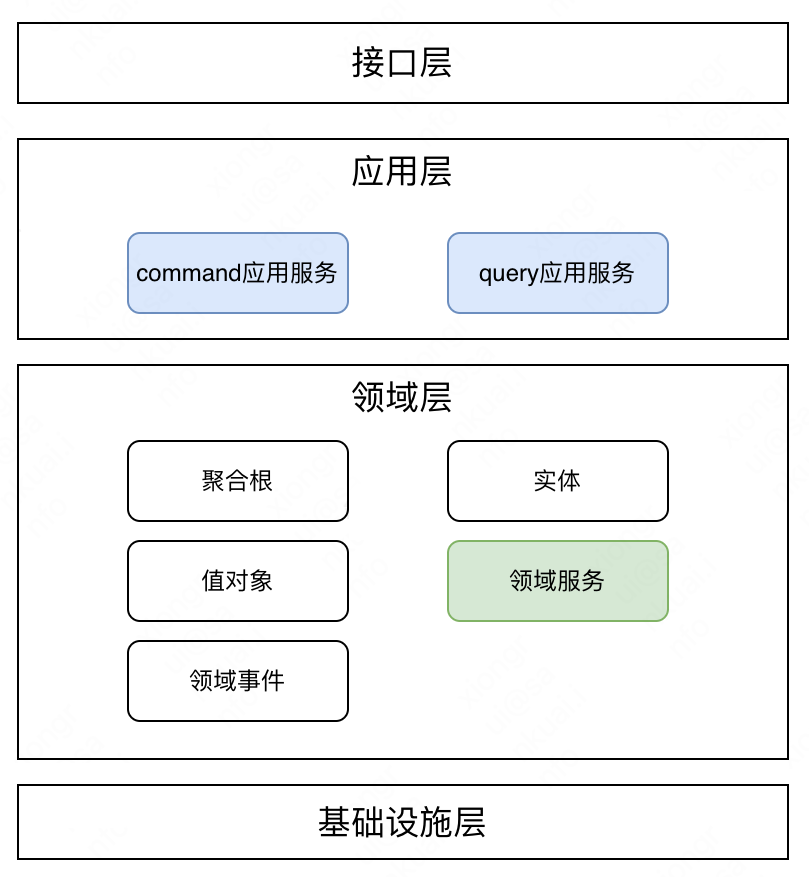

**思考：在战术层语境，应用和领域仅仅是技术和业务的分离吗？能否参考战略层语境？**

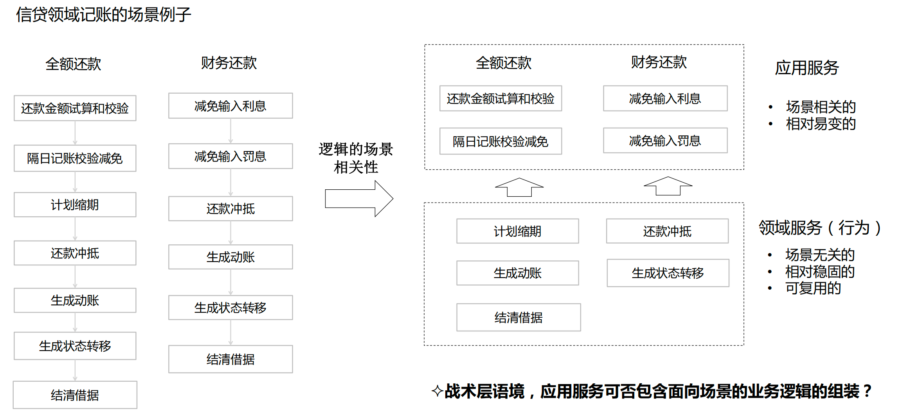

### 开发框架设计

总体设计思路：

-   分层
-   CQRS
-   EDA

#### 分层架构

在《实现领域驱动设计》一书中，DDD 分层架构有一个重要的原则：`每层只能与位于其下方的层发生耦合`。分层架构可以简单分为两种，即严格分层架构和松散分层架构。

在**严格分层架构**中，某层只能与位于其直接下方的层发生耦合，而在**松散分层架构**中，则允许某层与它的任意下方层发生耦合。

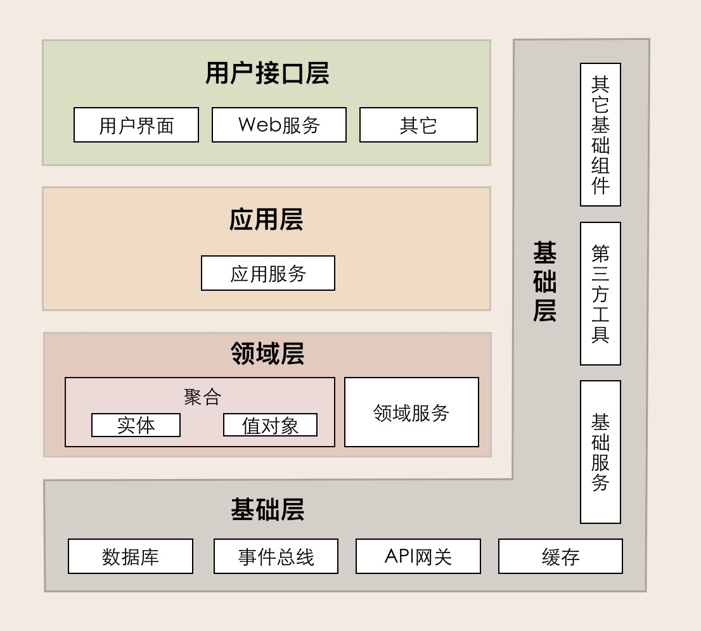

关于分层架构的`优点`，Martin Fowler在《Patterns of Enterprise Application Architecture》一书中给出了答案：

1.  开发人员可以只关注整个结构中的某一层。
2.  可以很容易的用新的实现来替换原有层次的实现。
3.  可以降低层与层之间的依赖。
4.  有利于标准化。
5.  利于各层逻辑的复用。

“金无足赤，人无完人”，分层架构也不可避免具有一些`缺陷`：

1.  降低了系统的性能。这是显然的，因为增加了中间层，不过可以通过缓存机制来改善。
2.  可能会导致级联的修改。这种修改尤其体现在自上而下的方向，不过可以通过依赖倒置来改善。

#### 六边形架构

六边形架构是 Alistair Cockburn 在2005年提出，解决了传统的分层架构所带来的问题，实际上它也是一种分层架构，只不过不是上下或左右，而是变成了内部和外部。

六边形架构又名“端口-适配器架构”：

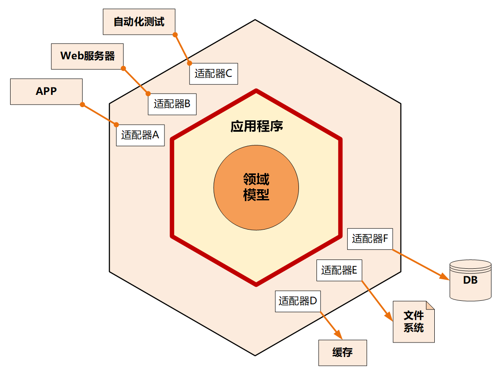

六边形架构又称为`端口-适配器架构`，这个名字更容器理解。

六边形架构将系统分为内部（内部六边形）和外部，内部代表了应用的业务逻辑，外部代表应用的驱动逻辑、基础设施或其他应用。内部通过端口和外部系统通信，端口代表了一定协议，以API呈现。

一个端口可能对应多个外部系统，不同的外部系统需要使用不同的适配器，适配器负责对协议进行转换。

这样就使得应用程序能够以一致的方式被用户、程序、自动化测试、批处理脚本所驱动，并且，可以在与实际运行的设备和数据库相隔离的情况下开发和测试。

#### CQRS架构

CQRS架构－命令查询职责分离

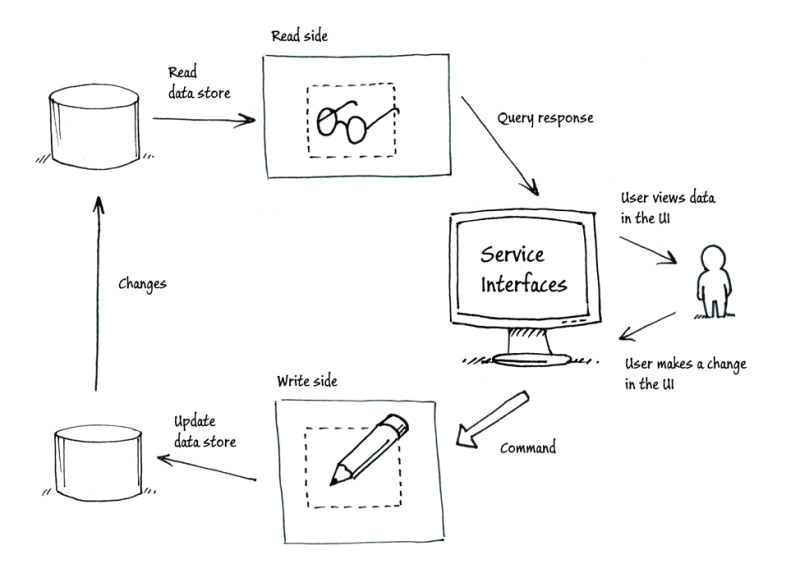

CQRS本身只是一个`读写分离`的架构思想，全称是：Command Query Responsibility Segregation，即`命令查询职责分离`，表示在架构层面，将一个系统分为写入（命令）和查询两部分：

-   一个命令(如写入)表示一种意图，表示命令系统做什么修改，命令的执行结果通常不需要返回；
-   一个查询表示向系统查询数据并返回。

CQRS架构中，另外一个重要的概念就是`事件`，

事件表示命令操作领域中的聚合根，然后聚合根的状态发生变化后产生的事件。

#### 洋葱架构

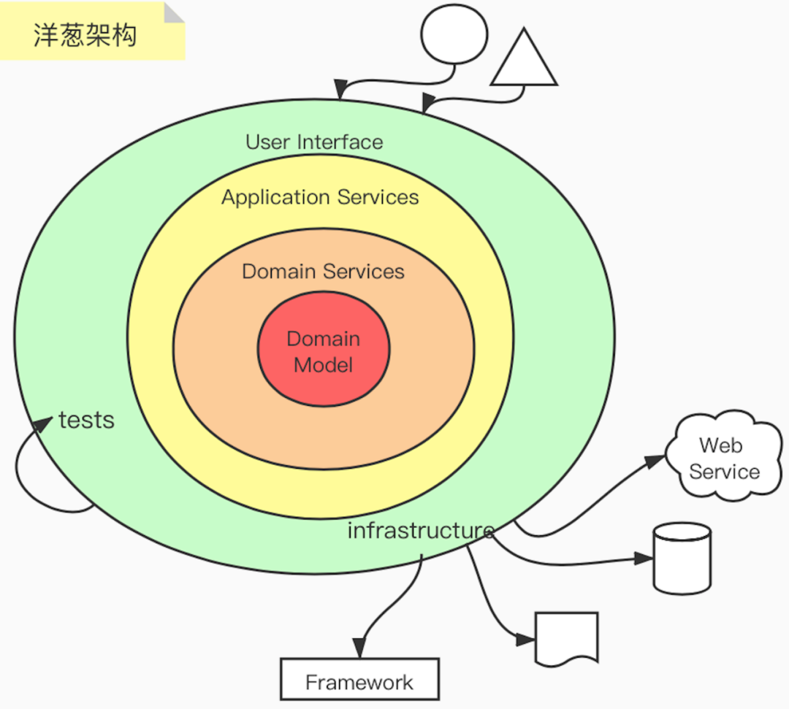

洋葱架构针对六边形架构更进⼀步把内层的业务逻辑进一步细分，

细分为了DDD概念的应⽤服务层、领域服务层和领域模型层。

特点：

（1）围绕独⽴的领域模型构建应⽤

（2）内层定义接⼝，外层实现接⼝

（3）依赖的方向指向圆心（注意：洋葱架构提倡不破坏耦合方向的依赖都是合理的，外层可以依赖直接内层，也可以依赖更里面的层）

（4）所有的应用代码可以独立于基础设施编译和运⾏

## 领域驱动落地框架

### 1 COLA框架

cola框架是阿里大佬张建飞（Frank） 基于DDD构建的平台应用框架。

“让COLA真正成为应用架构的最佳实践，帮助广大的业务技术同学，脱离酱缸代码的泥潭！”

csdn地址：[https://blog.csdn.net/significantfrank/article/details/110934799](https://blog.csdn.net/significantfrank/article/details/110934799)

### 2 leave-sample

中台架构与实现 DDD和微服务，清晰地提供了从战略设计到战术设计以及代码落地。  
leave-sample地址：[https://gitee.com/serpmelon/leave-sample](https://gitee.com/serpmelon/leave-sample)

### 3 dddbook

阿里技术专家详解DDD系列，例子精炼，项目代码结构与rdfa相似，极具参考价值。  
dddbook地址：[https://developer.aliyun.com/article/719251](https://developer.aliyun.com/article/719251)

### 4 Xtoon

xtoon-boot是基于领域驱动设计（DDD）并支持SaaS平台的单体应用开发脚手架。

重点研究如何应用。xtoon-boot提供了完整落地方案和企业级手脚架；

gitee地址：[https://gitee.com/xtoon/xtoon-boot](https://gitee.com/xtoon/xtoon-boot)  
github地址：[https://github.com/xtoon/xtoon-boot](https://github.com/xtoon/xtoon-boot)

### 5 DDD Lite

DDD 领域驱动设计微服务简化版，简洁、高效、值得重点研究。

gitee地址：[https://gitee.com/litao851025/geekhalo-ddd](https://gitee.com/litao851025/geekhalo-ddd)

快速入门：[https://segmentfault.com/a/1190000018464713](https://segmentfault.com/a/1190000018464713)  
快速构建新闻系统：[https://segmentfault.com/a/1190000018254111](https://segmentfault.com/a/1190000018254111)

### 6 ruoyi\_cloud

若依快速开发平台，以该项目建立对阳光智采和rdfa的技术框架基准线。  
gitee地址：[https://gitee.com/y\_project/RuoYi-Cloud](https://gitee.com/y_project/RuoYi-Cloud)

### 7 Axon Framework

Axon Framework 是用来帮助开发人员构建基于命令查询责任分类(Command Query Responsibility Segregation: CQRS)设计模式的可伸缩、可扩展和可维护应用程序的框架。你只需要把工作重心放在业务逻辑的设计上。通过一些 Annotation ，Axon 使得你的代码和测试分离。

[https://www.oschina.net/p/axon](https://www.oschina.net/p/axon)  
[https://www.jianshu.com/p/15484ed1fbde](https://www.jianshu.com/p/15484ed1fbde)

## DDD实战

这里，尼恩还是使用略设计和战术设计方式，进行 领域驱动设计的介绍。

### step1：学生管理系统的问题空间

**学生管理系统**（Student Management System，下文简称 SMS）作为讲解示例，以下为其问题空间的描述。

学校需要构建一个学生管理系统（Student Management System, SMS）。

通过这个管理系统，学生可以进行选课，查询成绩，查询绩点。

老师则可以通过这个系统录入授课课程的成绩。录入的分数会由系统自动换算为绩点，规则如下：若分数>= 90，绩点为4.0；90>= 分数> 80，绩点为3.0；80 >= 分数 > 70，绩点为2.0；70 >= 分数 >= 60，绩点为1.0；成绩< 60，则没有绩点，并邮件通知教务员，由教务员联系学生商榷重修事宜。

成绩录入后的一周内，若出现录入成绩错误的情况，老师可提交修改申请，由教务员审核后即可完成修改。审核完成后系统会通过邮件告知老师审核结果。一周后成绩将锁定，不予修改。成绩锁定后，次日系统会自动计算各年级、各班的学生的总绩点（总绩点由各门课程的学分与其绩点进行加权平均后所得）。

而教务员则可以通过该系统发布可以选修的课程。同时，教务员能够查看到各年级，各班的学生的总绩点排名。

### step2：价值需求分析：形成统一语言

根据业务需求，形成统一语言，有助于团队对事物的认知达成一致。

统一语言可以通过词汇表的形式展示，其中词汇表最好还要包含术语对应的英文描述，便于研发同学在代码层面表达统一语言。

示例-SMS 的统一语言词汇表如下。

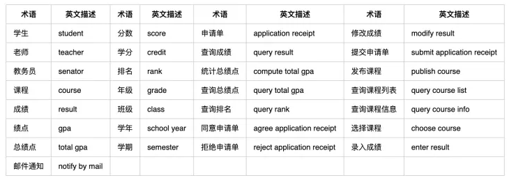

### step3： **价值需求分析**

价值需求分析主要做的三个工作是：

1.  识别利益相关者。利益相关者指的是与目标系统存在利益关系的人、团队或组织, 可以简单理解为目标系统的用户，或与目标系统有直接交互的人、团队或组织。
2.  明确系统愿景。阐明目标系统要做什么，以及为何要做。
3.  确定系统范围。确定系统问题空间的边界，明确系统什么该做，什么不该做。结合目标系统**当前状态**和**未来状态**进行判断。当前状态指的是系统的可用资源，包括业务资源、人力资源，资金资源等；而未来的状态则由业务目标、组织的战略规划和产品规划共同构成。

并非任何系统都 DDD，DDD 的核心是解决领域复杂性，

若系统逻辑简单，功能不多，引入 DDD 则会得不偿失。

而在进行价值需求分析后，我们便能判断是否需要通过 DDD 驱动系统的设计

因为是SMS 是演示系统，所以这里不做**价值需求分析**

### step4：业务需求分析

使用**业务流程、业务场景、业务服务**和**业务规则**来表示业务需求。

**业务流程**：表示的是一个完整的、端对端的服务过程。

**业务场景**：按阶段性的业务目标划分业务流程，就可以获得业务场景。在示例-SMS 中，老师修改成绩就分为了老师“提交申请单”，以及教务员“同意申请单”两个场景。

**业务服务**：**角色**主动向**目标系统**发起服务请求完成一次**完整**的功能交互，以实现业务目标。

业务服务是业务需求分析最核心，也是最基础的单元。

-   **角色**可以是用户、策略（定时任务）或者其他系统，
-   **完整**则强调的是业务服务的执行序列的所有步骤都应该是**连续且不可中断**的。

而**业务流程和业务场景是为了更好地分析出业务服务**，在示例-SMS 中的“同意申请单”场景中包含了两个业务服务：教务员“同意申请单”和系统“邮件通知”教务员。

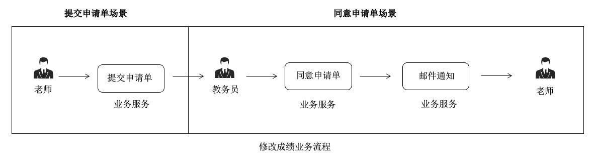

**业务规则**：指对业务服务约束的描述，用于控制业务服务的对外行为。

业务规则是业务服务正确性的基础。

常见的业务规则有：

a) 意如“若… , 就….” 的需求描述，比如示例-SMS 中可提炼出“若成绩录入时间间隔超过一周，不予修改”；

b) 具有事务性的操作。

#### 子领域

通过业务流程、业务场景和业务服务的梳理，基本可以分析出业务需求所需要的业务服务。

然而，在业务服务的分析过程中，发现业务服务粒度太细，而问题空间又太大，我们需要找一个更细粒度的问题空间，或者说更粗粒度的业务服务单元，而这个更粒度的业务单元就是**子领域**。

**子领域的作用**：

-   划分问题空间，作为业务服务分类的边界；
-   用于分辨问题空间的核心问题和次要问题。

划分子领域的过程存在很多经验因素，一个对该行业领域知识了如指掌的领域专家，可以在完成价值需求分析后，结合自身的领域经验，能够选择合适的聚类策略并给出稳定的子领域列表。

但，没有领域经验也没有关系！因为根据知识消化循环思路，再经历多个迭代后收敛出来的子领域划分也会逐渐合理，逼急领域专家凭经验得出的子领域划分，只是可能需要的时间要长一些。

### 识别限界上下文及其映射

示例SMS 的限界上下文可划分为：

-   成绩上下文
-   课程上下文
-   审批上下文
-   权限上下文
-   邮件上下文

上下文及其映射是啥呢？

咱们都是开发，按照开发的概念来理解吧。

假设一个界限上下文，对应一个微服务。

那么上面就是 5个微服务，微服务之间是 rpc 调用。这种服务的发布，和调用，就是 上下文的映射。

发布 rest 接口的一方，在DDD叫做开放主机服务（OHS），

调用rest 接口的一方，在DDD 叫做防腐层（ACL），如下图所示：

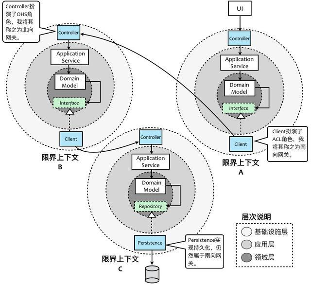

限界上下文 Context A 通过控制器（Controller）为其他上下文暴露 REST 服务，而在 Context A内部呢？则调用的自己的应用层的应用服务（Application Service），然后再调用领域层的领域模型（Domain Model）。

倘若限界上下文 B 需要访问限界上下文A 的rest 服务，由基础设施层的客户端（ 如 Feign Client）完成，这个客户端就是上下文映射模式的防腐层ACL。而在 Context B内部呢？实际不会直接调用Feign，则通过放置在领域层的接口（Interface）去完成，接口（Interface）去 调用由基础设施层的客户端（ 如 Feign Client），完成真正的访问逻辑实现。

SMS 上下文映射图如下所示。

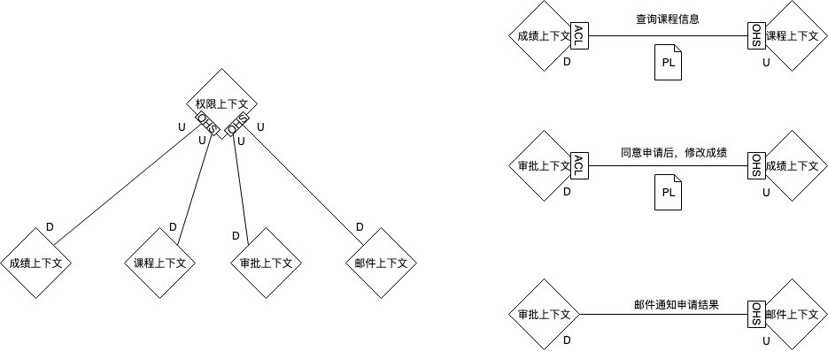

### step5：领域分析模型

这一步，提炼出领域对象

通过名词建模，动词建模和归纳抽象后，可提炼出以下领域对象：成绩（Result）、绩点（gpa）、总成绩（total result）、总绩点（total gpa）、学年（school year）、学期（semester）、课程（course）、学分（credit）、申请单（application receipt），邮件（mail），排名（rank），申请单状态（application receipt status）

这些领域对象之间的关系如下图所示。

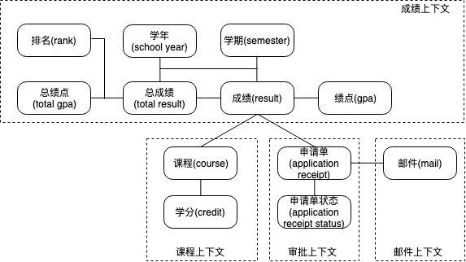

### step6：领域设计模型

进行领域对象的聚合

**聚合设计**：

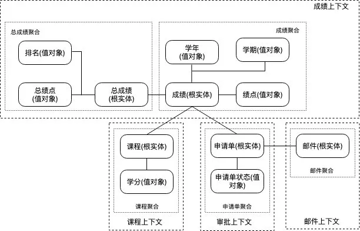

### step7：服务设计：

这一步，包括应用服务和领域服务

注意：不要把领域服务和领域对象，搞混淆

下面只罗列非查询类的服务设计。

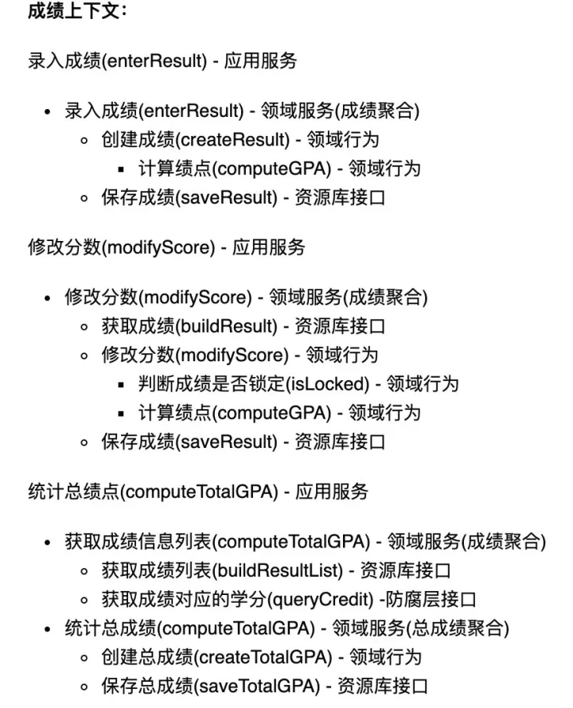

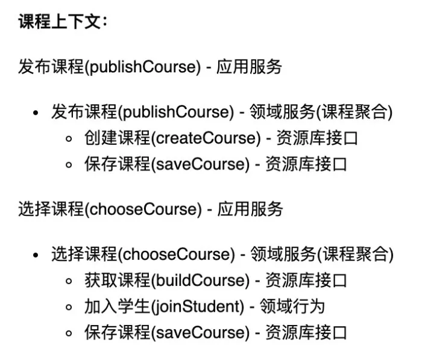

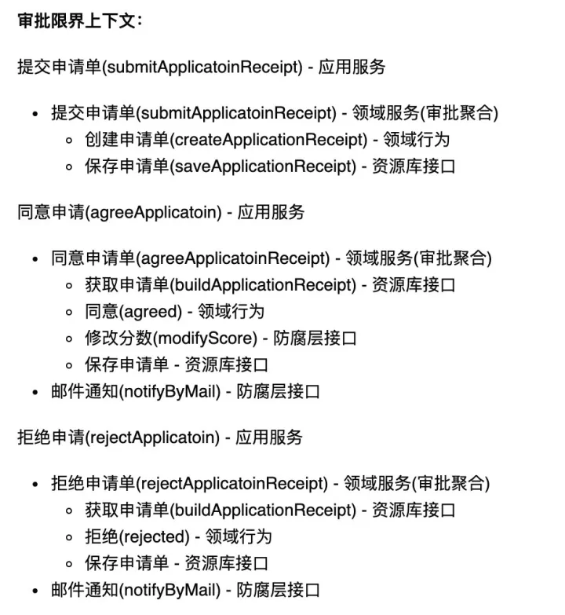

### step8：领域实现建模

注意，这里，领域实现建模关注的不是如何进行代码实现，

不是编码，而是领域的测试设计

而是**如何验证代码实现的正确性，保证实现的高质量**。

#### 领域模型与测试金字塔之间的关系

领域模型中的服务包括了**应用服务**、**领域服务**、**领域行为**和**端口**。

其中通过 Provider（面向服务行为/rpc）、Resource（面向服务资源/rest）、Subscriber（面向事件）、Controller（面向视图模型）对外进行暴露的，我们称为**远程服务**。

-   面向服务行为，比如基于 RPC，称为提供者（Provider）；
-   面向服务资源，比如基于 REST，称为资源（Resource）；
-   面向事件，比如基于消息中间件，称为订阅者（Subscriber）；
-   面向视图模型，比如基于 MVC的page，称为控制器（Controller）；

领域模型中的服务与测试金字塔的关系如下图所示。

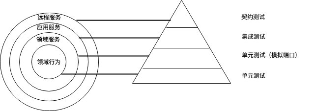

#### 测试驱动开发

领域实现建模提倡的是**测试驱动开发**的编程思想，即要求开发者在进行逻辑实现前，优先进行测试用例的编写，**站在调用者角度而非实现者角度**去思考接口。

在上述测试金字塔中，开发者需要关注的是单元测试（不依赖任何外部资源的测试就是单元测试）。

在领域设计建模阶段，我们对业务服务/应用服务进行分解，定义出了领域行为和领域服务。

对于领域行为，由于其不依赖外部资源，因此我们可以直接编写单元测试；

而对于领域服务，其可能会通过端口访问外部资源，此时我们需要对端口进行 mock，以隔离外部资源对领域逻辑验证的干扰。

特别地，**单元测试一定要覆盖所有对业务规则的验证**，这是保证领域行为和领域服务正确性的基础。

单元测试编码规范：

-   测试类的命名应与被测试类保持一致，为“被测类名称+Test 后缀”。
-   测试方法表达业务或业务规则为目的。
-   测试方法体遵循 Given-When-Then 模式。**Given**: 为要测试的方法提供准备，包括创建被测试对象，为调用方法准备输入参数实参等；**When**: 调用被测试的方法，遵循单一职责原则，在一个测试方法的 When 部分，应该只有一条语句对被测方法进行调用；**Then**: 对被测方法调用后的结果进行预期验证。

### step9：分层架构

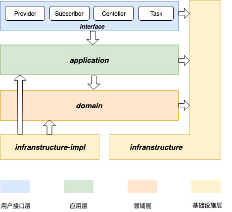

代码架构分层是经典 DDD 四层：**用户接口层**，**应用层**，**领域层**和**基础设施层**。

需要注意的的地方是：

-   用户接口层根据通信方式的不同，区分开了 Provider（面向服务行为/RPC）、Subscriber（面向事件）、Controller（面向视图模型&资源） 、Task（面向策略/定时任务）。
-   基础设施层单独划分了 infranstructure-impl 模块。  
-   为了保证领域层的纯洁性，DDD 通过依赖倒置把访问外部系统（数据库，第三方系统）的服务的实现都下放到了基础设施层，而 infranstructure-impl 模块 则是对这些实现进行了归集。  
-   这样做的好处有两个：第一，依赖关系明确，（infransturcture-impl —> domain，application）, （interface、application、domain —> infranstructure）；第二，拆分服务更便捷。当我们需要部分领域独立拆分出来的时候，在实现层面就只需要关注 infransturcture-impl 模块 即可。
-   Infranstructure-impl 模块依赖应用层的原因是应用层可能会抽象出防腐层接口，需要 infranstruct-impl 为其提供实现。

### Step10.代码骨架

#### 用户接口层

用户接口层的核心职能：协议转换和适配、鉴权、参数校验和异常处理。

    ├── controller                        //面向视图模型&资源
    │   ├── ResultController.java
    │   ├── assembler                     // 装配器，将VO转换为DTO
    │   │   └── ResultAssembler.java
    │   └── vo                            // VO(View Object)对象
    │       ├── EnterResultRequest.java
    │       └── ResponseVO.java
    ├── provider                          // 面向服务行为,比如dubbo RPC
    ├── subscriber                        // 面向事件 ，比如 rocketmq的客户端程序
    └── task                              // 面向策略 ，比如 xxl-job的调度任务
        └── TotalResultTask.java

#### 应用层

应用层的核心职能：编排领域服务、事务管理、发布应用事件。

    ├── assembler                         // 装配器，将DTO转换为DO
    │   ├── ResultAssembler.java
    │   └── TotalResultAssembler.java
    ├── dto                               // DTO(Data Transfer Object)对象
    │   ├── cmd                           // 命令相关的DTO对象
    │   │   ├── ComputeTotalResultCmd.java
    │   │   ├── EnterResultCmd.java
    │   │   └── ModifyResultCmd.java
    │   ├── event                         // 应用事件相关的DTO对象, subscriber负责接收
    │   └── qry                           // 查询相关的DTO对象
    └── service                           // 应用服务
        ├── ResultApplicationService.java
        ├── event                         // 应用事件，用于发布
        └── adapter                       // 防腐层适配器接口

#### 领域层

代码组织以聚合为基本单元。

    ├── result                            // 成绩聚合
    │   ├── entity                        // 成绩聚合内的实体
    │   │   └── Result.java
    │   ├── service                       // 领域服务
    │   │   ├── ResultDomainService.java
    │   │   ├── event                     // 领域事件
    │   │   ├── adapter                   // 防腐层适配器接口
    │   │   ├── factory                   // 工厂
    │   │   └── repository                // 资源库
    │   │       └── ResultRepository.java
    │   └── valueobject                   // 成绩聚合的值对象
    │       ├── GPA.java
    │       ├── ResultUK.java
    │       ├── SchoolYear.java
    │       └── Semester.java
    └── totalresult                       // 总成绩聚合
        ├── ... 这段有点长，其代码结构与成绩聚合一致，因此省略 ...

#### 基础设施实现层

该层主要提供领域层接口（资源库、防腐层接口）和应用层接口（防腐层接口）的实现。

代码组织基本以聚合为基本单元。对于应用层的防腐层接口，则直接以 application 作为包名组织。

    ├── application                       // 应用层相关实现
    │   └── adapter                       // 防腐层适配器接口实现
    │       ├── facade                    // 外观接口
    │       └── translator                // 转换器，DO -> DTO
    ├── result                            // 成绩聚合相关实现
    │   ├── adapter
    │   │   ├── facade
    │   │   └── translator
    │   └── repository                    // 成绩聚合资源库接口实现
    │       └── ResultRepositoryImpl.java
    └── totalresult                       // 总成绩聚合相关实现
        ├── adapter
        │   ├── CourseAdapterImpl.java
        │   ├── facade
        │   └── translator
        └── repository
            └── TotalResultRepositoryImpl.java

## DDD 与微服务的关系

**微服务拆解**指的是把一个单体服务拆分为粒度“足够小”的多个服务，而这里的“足够小”是一个主观的，没有任何标准的定义。

尽管如此，我们对“**微**”这个词还是有一些基本要求的：足够内聚，足够独立，足够完备，这才使得拆分出来的微服务收益大于投入，试想如果一个微服务提供的业务功能会牵扯到与其他众多微服务的协作，那岂不是芭比 Q 了。

而上述我们对微服务的基本要求，实际上与限界上下文的特征（最小完备，自我履行，稳定空间，独立进化）不谋而合，因此，我们可以把**限界上下文映射为微服务**。

我在日常实践中，都是将限界上下文和微服务的关系进行一一对应的，但这不是绝对的！

限界上下文是站在领域角度给出的逻辑边界，而微服务的设计往往还要考虑物理边界，以及实际的质量需求（性能，可用性，安全性等），比如当我们采用的是 CQRS 架构，领域模型会被分为命令模型和查询模型，虽然它们同属一个限界上下文，但是它们往往是物理隔离的。

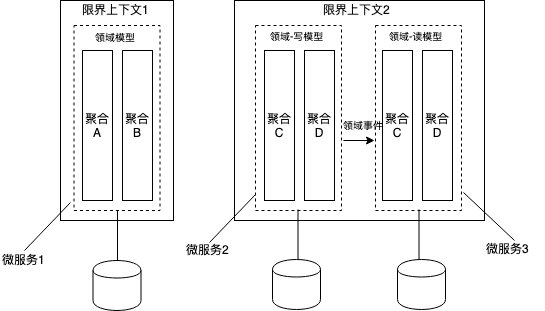

### **一个BC代表一个微服务吗？**

**限界上下文划分规则**

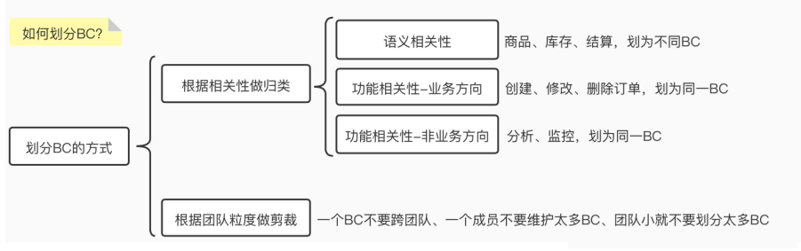

一般来说，先考虑团队规模，来决定最终需要划分到多细粒度的BC，如果团队规模过小而BC过细，则对后期的运维、部署、上线都会造成很大的负担；

在确定好粒度后，可以对语义相关性、功能相关性-业务方向、功能相关性-非业务方向进行划分

按照以上的规则划分之后就得到了多个BC啦

**BC与业务的关系**：

通过对业务的划分，比如订单系统，订单是一个子域；库存是一个子域；

其中商品再不同的子域中所表示的意义也不同，比如在订单上下文中的商品表示商品的单价、折扣等等；而在库存的上下文中商品表示商品的库存量、成本、存放位置等。

**BC与技术的关系**：

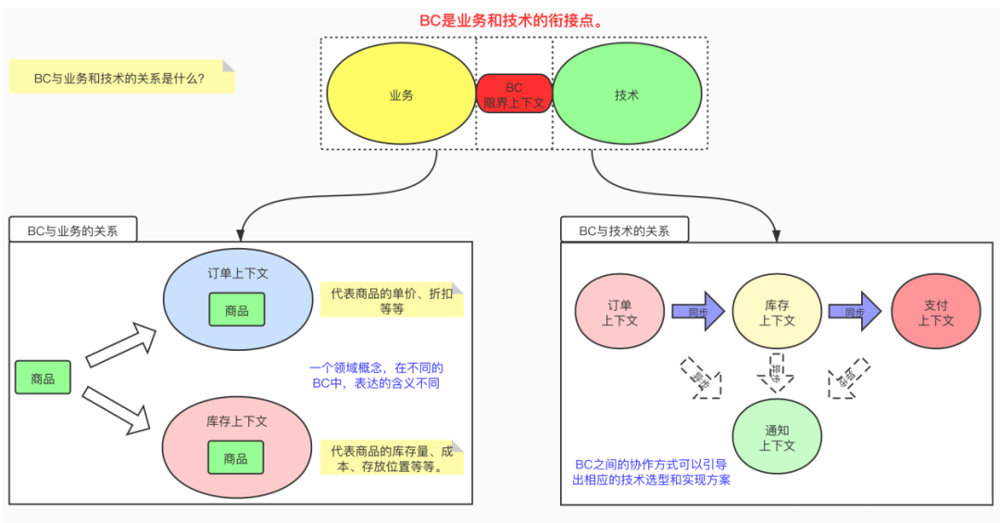

多个子域之间必须需要在应用层进行聚合，而聚合的过程中就引出了技术方案，

比如订单到库存到支付，他们应该采用同步方式；

这几个子域调用通知都应该是异步，那么可能就需要消息中间件或其它技术方案

**一个BC代表一个微服务吗？**

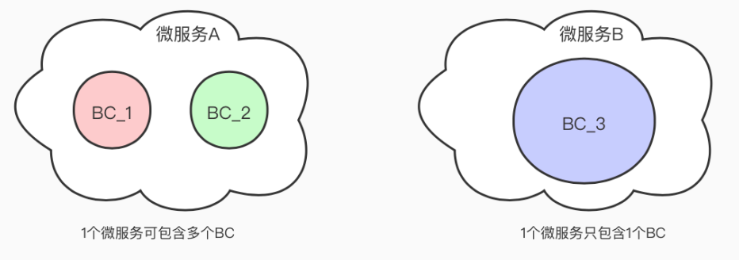

**概念**：

微服务一般是指将高度相关功能的一个开发部署单元，有自己的技术自治性、技术选型、弹性扩缩容、发布上下频率等，说白了就是各自维护一个业务，然后多个业务组成一个系统，多个业务之间各自管理

关系：这里的BC其实就是一个领域或一个模块或一个业务，如果两个领域相关性很高，一个微服务就可以包含多个BC，或者如果一个领域访问量非常大，则需要部署在一个微服务中以提高性能

因此，限界上下文只能作为微服务拆分的指导，而拆分过程中需要考虑质量需求，架构设计等技术因素。

## 最后浓缩一下：DDD的四重边界

根据下图所示，我们通过四重边界来进行架构设计：

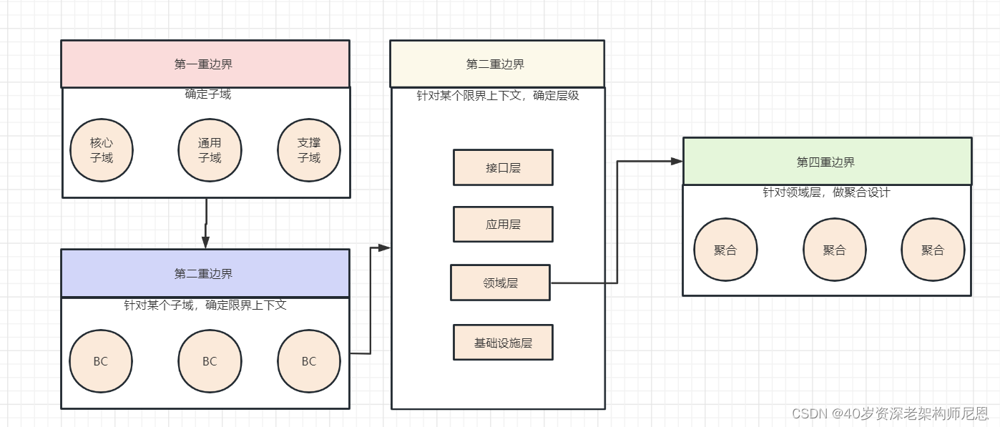

**分而治之**：DDD通过规划四重边界，把领域知识做了合理的固化和分层。

业务有核心领域和支持域、业务域中又拆分成多个限界上下文（BC），一个BC中又根据领域知识核心与否进行分层，领域层中按照多个业务（子域）的强相关性进行聚合成一个子域

【第一重边界】确定项目的愿景与目标，确定问题空间，确定核心子领域、通用子领域（多个子领域可以复用）、支撑子领域（额外功能，如数据统计、导出报表）

【第二重边界】解决方案空间里的限界上下文，就是一道进程隔离层面的物理边界

【第三重边界】每个限界上下文内，使用分层架构划分为：接口层、领域层、应用层、基础设施层之间的最小隔离

【第四重边界】领域层里为了保证各个领域的完整性和一致性，引入聚合的设计作为隔离领域模型的最小单元

### 附录：什么是POCO和DTO、值对象（Value Object）?

-   DTO就是数据传输对象（Data Transfer Object），
-   POCO就是简单CLR对象（Plain Old CLR Object）这个是C#中的概念，公共语言运行时 (CLR)，概念来源于Java中的POJO；
-   值对象（Value Object）是领域驱动设计（Domain-Driven Design，DDD）中的概念，是一个包含数据+逻辑的完整的领域模型。

那么这三者是什么关系呢？Vladimir Khorikov专门发表了一篇文章来解释这个问题。

首先，他给它们进行了更加准确的定义：

-   DTO是表示数据的对象，但是其中不包含任何业务逻辑
-   Value Object (值对象) 是一个完整的领域模型，不仅包含数据，还有逻辑  
    从值对象还引申出实体对象（Entity），实体对象和值对象的概念比较接近， 不同的是，实体对象一般会基于标识ID进行区分
-   POCO概念来源于POJO，POJO概念由Martin Fowler提出，使用POJO名称是为了避免和EJB混淆起来, 是和EJB这类重量级Java对象的相互对立概念。POJO简单直接，有一些属性及其getter setter方法的类，没有业务逻辑，有时可以作为VO(value -object)或DTO(Data Transform Object)来使用。当然,如果你有一个简单的运算属性也是可以的，但POJO不允许有业务方法，也不能携带有connection之类的方法。POJO是可以理解为轻量级的JavaBeans，轻量级到什么地步呢？也即这种POJO类不继承于任何对象，或者说POJO 直接继承于Object）；同理，C#中POCO类似Java的POJO，是继承自C#中 System.ComponentModel命名空间中的Component对象的独立对象。可以说，理解了Java的POJO的概念，也即理解了C#中POCO概念。
-   而C#中 POCO代表了可以用于领域模型的尽可能简单的对象，而POCO是可以包含逻辑的。

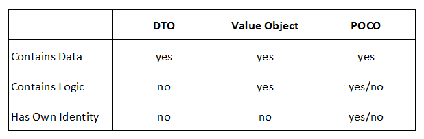

根据以上定义，我们得到这样几个结论：

-   POCO是DTO和值对象的超集
-   DTO不能等同于值对象
-   DTO和值对象都不能有标识Id，而POCO可以有标识Id
-   实体对象 是DDD里边的概念，可以基于标识ID进行区分，也属于 POCO

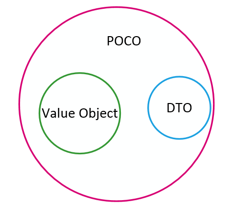