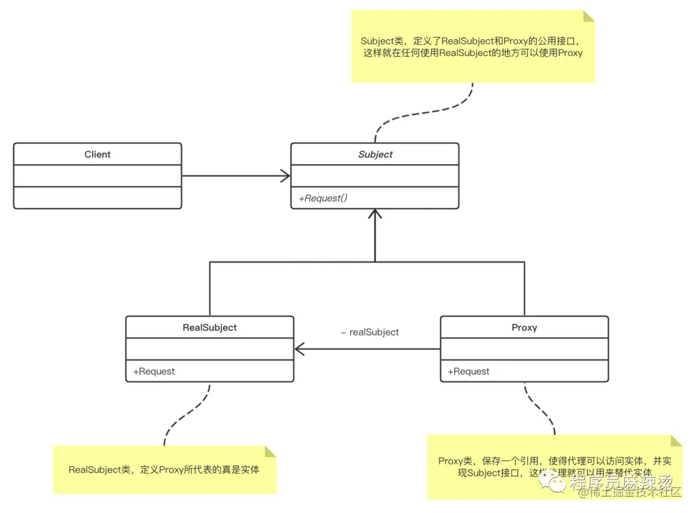
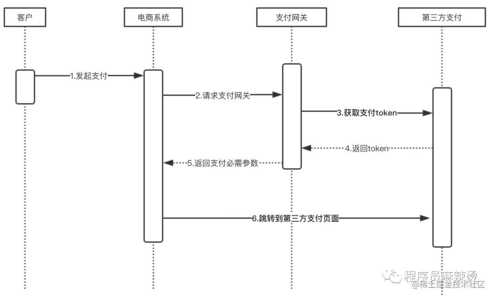

# 设计模式

## 什么是设计模式

-   设计模式，是一套被反复使用、多数人知晓的、经过分类编目的、代码设计经验的总结。使用设计模式是为了可重用代码、让代码更容易被他人理解、保证代码可靠性、程序的重用性。

## 为什么要学习设计模式

-   看懂源代码：如果你不懂设计模式去看Jdk、Spring、SpringMVC、IO等等等等的源码，你会很迷茫，你会寸步难行
-   看看前辈的代码：你去个公司难道都是新项目让你接手？很有可能是接盘的，前辈的开发难道不用设计模式？
-   编写自己的理想中的好代码：我个人反正是这样的，对于我自己开发的项目我会很认真，我对他比对我女朋友还好，把项目当成自己的儿子一样

## 设计模式分类


-   创建型模式，共五种：**工厂方法模式、抽象工厂模式**、**单例模式**、建造者模式、**原型模式。**

-   结构型模式，共七种：适配器模式、装饰器模式、代理模式、外观模式、桥接模式、组合模式、享元模式。

-   行为型模式，共十一种：策略模式、模板方法模式、观察者模式、迭代子模式、责任链模式、命令模式、备忘录模式、状态模式、访问者模式、中介者模式、解释器模式。

## 设计模式的六大原则


### 开放封闭原则（Open Close Principle）

-   原则思想：尽量通过扩展软件实体来解决需求变化，而不是通过修改已有的代码来完成变化
-   描述：一个软件产品在生命周期内，都会发生变化，既然变化是一个既定的事实，我们就应该在设计的时候尽量适应这些变化，以提高项目的稳定性和灵活性。
-   优点：单一原则告诉我们，每个类都有自己负责的职责，里氏替换原则不能破坏继承关系的体系。

### 里氏代换原则（Liskov Substitution Principle）

-   原则思想：使用的基类可以在任何地方使用继承的子类，完美的替换基类。
-   大概意思是：子类可以扩展父类的功能，但不能改变父类原有的功能。子类可以实现父类的抽象方法，但不能覆盖父类的非抽象方法，子类中可以增加自己特有的方法。
-   优点：增加程序的健壮性，即使增加了子类，原有的子类还可以继续运行，互不影响。

### 依赖倒转原则（Dependence Inversion Principle）

-   依赖倒置原则的核心思想是面向接口编程.

-   依赖倒转原则要求我们在程序代码中传递参数时或在关联关系中，尽量引用层次高的抽象层类，

-   这个是开放封闭原则的基础，具体内容是：对接口编程，依赖于抽象而不依赖于具体。

### 接口隔离原则（Interface Segregation Principle）

-   这个原则的意思是：使用多个隔离的接口，比使用单个接口要好。还是一个降低类之间的耦合度的意思，从这儿我们看出，其实设计模式就是一个软件的设计思想，从大型软件架构出发，为了升级和维护方便。所以上文中多次出现：降低依赖，降低耦合。
-   例如：支付类的接口和订单类的接口，需要把这俩个类别的接口变成俩个隔离的接口

### 迪米特法则（最少知道原则）（Demeter Principle）

-   原则思想：一个对象应当对其他对象有尽可能少地了解，简称类间解耦
-   大概意思就是一个类尽量减少自己对其他对象的依赖，原则是低耦合，高内聚，只有使各个模块之间的耦合尽量的低，才能提高代码的复用率。
-   优点：低耦合，高内聚。

### 单一职责原则（Principle of single responsibility）

-   原则思想：一个方法只负责一件事情。
-   描述：单一职责原则很简单，一个方法 一个类只负责一个职责，各个职责的程序改动，不影响其它程序。 这是常识，几乎所有程序员都会遵循这个原则。
-   优点：降低类和类的耦合，提高可读性，增加可维护性和可拓展性，降低可变性的风险。

## 设计模式的分类

**创建型：** 在创建对象的同时隐藏创建逻辑，不使用 new 直接实例化对象，程序在判断需要创建哪些对象时更灵活。包括工厂/抽象工厂/单例/建造者/原型模式。

**结构型：** 通过类和接口间的继承和引用实现创建复杂结构的对象。包括适配器/桥接模式/过滤器/组合/装饰器/外观/享元/代理模式。

**行为型：** 通过类之间不同通信方式实现不同行为。包括责任链/命名/解释器/迭代器/中介者/备忘录/观察者/状态/策略/模板/访问者模式。

## 工厂模式

### 核心概念

#### **简单工厂（Simple Factory）**

- **定义**：通过一个工厂函数，根据输入参数决定创建不同的具体对象。
- **核心**：集中化对象的创建逻辑，隐藏实例化细节。
- **Go 实现**：返回接口类型，依赖参数判断具体类型。

#### **工厂方法（Factory Method）**

- **定义**：定义一个创建对象的接口，由子类决定实例化哪个类。
- **核心**：将对象的创建延迟到子类，实现扩展性。
- **Go 实现**：通过接口定义工厂方法，每个具体类型对应一个工厂。

####  **抽象工厂（Abstract Factory）**

- **定义**：提供一个接口，用于创建**相关或依赖对象家族**，而无需指定具体类。
- **核心**：处理一组相互关联的对象的创建。
- **Go 实现**：通过组合多个工厂方法，生成配套的对象集合。

------

### 适用场景

| 模式         | 适用场景                                                     |
| :----------- | :----------------------------------------------------------- |
| **简单工厂** | 对象创建逻辑简单，类型较少，且调用方不需要关心具体实现。     |
| **工厂方法** | 需要灵活扩展新类型，且希望将对象创建逻辑分散到子类中。       |
| **抽象工厂** | 需要创建一组相互关联或依赖的对象（如不同主题的 UI 组件、数据库全家桶）。 |

------

### 优缺点对比

| 模式         | 优点                               | 缺点                                     |
| :----------- | :--------------------------------- | :--------------------------------------- |
| **简单工厂** | 代码简单，集中管理对象创建逻辑。   | 违反开闭原则（新增类型需修改工厂函数）。 |
| **工厂方法** | 符合开闭原则，扩展性强。           | 类/接口数量增加，代码复杂度提升。        |
| **抽象工厂** | 保证对象族的兼容性，避免不一致性。 | 扩展新对象族困难（需修改抽象工厂接口）。 |

------

### 代码示例

#### **简单工厂模式**

```go
package main

import "fmt"

// 接口
type Vehicle interface {
    Drive() string
}

// 具体实现
type Car struct{}
func (c Car) Drive() string { return "Driving a car" }

type Bike struct{}
func (b Bike) Drive() string { return "Riding a bike" }

// 工厂函数
func NewVehicle(vehicleType string) Vehicle {
    switch vehicleType {
    case "car":
        return Car{}
    case "bike":
        return Bike{}
    default:
        panic("Unknown vehicle type")
    }
}

func main() {
    car := NewVehicle("car")
    fmt.Println(car.Drive()) // Driving a car
}
```

------

#### **工厂方法模式**

```go
package main

import "fmt"

// 产品接口
type Logger interface {
    Log(message string)
}

// 具体产品
type FileLogger struct{}
func (f FileLogger) Log(message string) { 
    fmt.Println("Log to file:", message) 
}

type ConsoleLogger struct{}
func (c ConsoleLogger) Log(message string) { 
    fmt.Println("Log to console:", message) 
}

// 工厂接口
type LoggerFactory interface {
    CreateLogger() Logger
}

// 具体工厂
type FileLoggerFactory struct{}
func (f FileLoggerFactory) CreateLogger() Logger { 
    return FileLogger{} 
}

type ConsoleLoggerFactory struct{}
func (c ConsoleLoggerFactory) CreateLogger() Logger { 
    return ConsoleLogger{} 
}

func main() {
    var factory LoggerFactory = FileLoggerFactory{}
    logger := factory.CreateLogger()
    logger.Log("Error occurred") // Log to file: Error occurred
}
```

------

#### **抽象工厂模式**

```go
package main

import "fmt"

// ---- 数据库相关接口 ----
type Database interface {
    Connect() string
}

type MySQL struct{}
func (m MySQL) Connect() string { return "MySQL connected" }

type PostgreSQL struct{}
func (p PostgreSQL) Connect() string { return "PostgreSQL connected" }

// ---- 日志相关接口 ----
type Logger interface {
    Log(message string)
}

type FileLogger struct{}
func (f FileLogger) Log(message string) { 
    fmt.Println("File log:", message) 
}

type ConsoleLogger struct{}
func (c ConsoleLogger) Log(message string) { 
    fmt.Println("Console log:", message) 
}

// ---- 抽象工厂接口 ----
type Factory interface {
    CreateDatabase() Database
    CreateLogger() Logger
}

// 具体工厂：MySQL + FileLogger 组合
type MySQLFactory struct{}
func (m MySQLFactory) CreateDatabase() Database { return MySQL{} }
func (m MySQLFactory) CreateLogger() Logger    { return FileLogger{} }

// 具体工厂：PostgreSQL + ConsoleLogger 组合
type PostgreSQLFactory struct{}
func (p PostgreSQLFactory) CreateDatabase() Database { return PostgreSQL{} }
func (p PostgreSQLFactory) CreateLogger() Logger    { return ConsoleLogger{} }

func main() {
    var factory Factory = PostgreSQLFactory{}
    db := factory.CreateDatabase()
    logger := factory.CreateLogger()
    fmt.Println(db.Connect())  // PostgreSQL connected
    logger.Log("DB connected") // Console log: DB connected
}
```

------

## 总结

#### **核心选择原则**

- **简单工厂**：适合对象类型少、无需频繁扩展的场景。
- **工厂方法**：适合需要灵活扩展新类型的场景。
- **抽象工厂**：适合需要保证一组对象兼容性的场景（如跨平台组件）。

#### **Go 的独特实现**

- 利用接口的隐式实现，无需显式声明继承关系。
- 通过返回接口类型隐藏具体实现（如 `func New() Interface`）。
- 使用包级别的可见性控制（如小写结构体名），强制使用工厂函数。

通过合理选择工厂模式，可以显著提升代码的可维护性和扩展性，尤其在复杂对象创建和依赖管理的场景中效果显著。

## 单例模式

单例模式的作用是确保无论对象被实例化多少次，全局都只有一个实例存在。根据这一特性，我们可以将其应用到全局唯一性配置、数据库连接对象、文件访问对象等。Go 语言实现单例模式的方法有很多种，下面我们就一起来看一下。

### 饿汉式

饿汉式实现单例模式非常简单，直接看代码：

```
package singleton
type singleton struct{}
var instance = &singleton{}
func GetSingleton() *singleton {
    return instance
}
```

singleton 包在被导入时会自动初始化 instance 实例，使用时通过调用 singleton.GetSingleton() 函数即可获得 singleton 这个结构体的单例对象。

这种方式的单例对象是在包加载时立即被创建，所以这个方式叫作饿汉式。与之对应的另一种实现方式叫作懒汉式，懒汉式模式下实例会在第一次被使用时被创建。

需要注意的是，尽管饿汉式实现单例模式的方式简单，但大多数情况下并不推荐。因为如果单例实例化时初始化内容过多，会造成程序加载用时较长。

### 懒汉式

接下来我们再来看下如何通过懒汉式实现单例模式：

```
package singleton
type singleton struct{}
var instance *singleton
func GetSingleton() *singleton {
    if instance == nil {
        instance = &singleton{}
    }
    return instance
}
```

相较于饿汉式的实现，懒汉式将实例化 singleton 结构体部分的代码移到了 GetSingleton() 函数内部。这样能够将对象实例化的步骤延迟到 GetSingleton() 第一次被调用时。

不过通过 instance == nil 的判断来实现单例并不十分可靠，如果有多个 goroutine 同时调用 GetSingleton() 就无法保证并发安全。

### 支持并发的单例

如果你使用 Go 语言写过并发编程，应该很快能想到该如何解决懒汉式单例模式并发安全问题，比如像下面这样：

```
package singleton
import "sync"
type singleton struct{}
var instance *singleton
var mu sync.Mutex
func GetSingleton() *singleton {
    mu.Lock()
    defer mu.Unlock()
    if instance == nil {
        instance = &singleton{}
    }
    return instance
}
```

上面代码的修改是通过加锁机制，即在 GetSingleton() 函数最开始加了如下两行代码：

```
mu.Lock()
defer mu.Unlock()
```

加锁的机制可以有效保证这个实现单例模式的函数是并发安全的。

不过使用了锁机制也带来了一些问题，这让每次调用 GetSingleton() 时程序都会进行加锁、解锁的步骤，从而导致程序性能的下降。

### 双重锁定

加锁会导致程序性能下降，但又不用锁又无法保证程序的并发安全。为了解决这个问题有人提出了双重锁定（Double-Check Locking）的方案：

```
package singleton
import "sync"
type singleton struct{}
var instance *singleton
var mu sync.Mutex
func GetSingleton() *singleton {
    if instance == nil {
        mu.Lock()
        defer mu.Unlock()
        if instance == nil {
            instance = &singleton{}
        }
    }
    return instance
}
```

通过上面的可以看到，所谓双重锁定实际上就是在程序加锁前又加了一层 instance == nil 判断，通过这种方式来兼顾性能和安全两个方面。不过这让代码看起来有些奇怪，外层已经判断了 instance == nil，但是加锁后又进行了第二次 instance == nil  判断。

其实外层的 instance == nil 判断是为了提高程序的执行效率，免去原来每次调用 GetSingleton() 都上锁的操作，将加锁的粒度更加精细化。简单说就是如果 instance 已经存在，则无需进入 if 逻辑，程序直接返回 instance 即可。而内层的 instance == nil  判断则考虑了并发安全，考虑到万一在极端情况下，多个 goroutine 同时走到了加锁这一步，内层判断会在这里起到作用。

### Gopher 惯用方案

虽然双重锁定机制兼顾和性能和并发安全，但显然代码有些丑陋，不符合广大 Gopher 的期待。好在 Go 语言在 sync 包中提供了 Once 机制能够帮助我们写出更加优雅的代码：

```
package singleton
import "sync"
type singleton struct{}
var instance *singleton
var once sync.Once
func GetSingleton() *singleton {
    once.Do(func() {
        instance = &singleton{}
    })
    return instance
}
```

Once 是一个结构体，在执行 Do 方法的内部通过 atomic 操作和加锁机制来保证并发安全，且 once.Do 能够保证多个 goroutine 同时执行时 &singleton{} 只被创建一次。

其实 Once 并不神秘，其内部实现跟上面使用的双重锁定机制非常类似，只不过把 instance == nil 换成了 atomic 操作，感兴趣的同学可以查看下其对应源码。

### 总结

以上就是 Go 语言中实现单例模式的几种常用套路，经过对比可以得出结论，最推荐的方式是使用 once.Do 来实现，sync.Once 包帮我们隐藏了部分细节，却可以让代码可读性得到很大提升。

## 建造者模式

建造者模式是一种**创建型设计模式**，用于**分步骤构建复杂对象**，将对象的**构造过程**与**最终表示**分离，使得相同的构建过程可以创建不同的对象表示。该模式特别适用于包含多个可选参数的复杂对象创建场景。

------

### 核心组件

1. **产品（Product）**：最终要构建的复杂对象
2. **建造者接口（Builder）**：定义构建步骤的抽象方法
3. **具体建造者（Concrete Builder）**：实现接口的具体构建逻辑
4. **指挥者（Director）**：控制构建流程（可选）

------

### Go 实现示例：数据库连接配置

构建一个支持链式调用的数据库连接配置建造器，包含以下特性：

- 必填参数校验
- 默认值设置
- 参数约束检查
- 不可变最终配置

#### 完整代码实现：

```go
package main

import (
	"errors"
	"fmt"
	"time"
)

// ================== 产品结构体 ==================
type DBConfig struct {
	host     string
	port     int
	username string
	password string
	timeout  time.Duration
	maxConns int
}

func (c DBConfig) String() string {
	return fmt.Sprintf(
		"host=%s port=%d user=%s password=****** timeout=%v max_conns=%d",
		c.host, c.port, c.username, c.timeout, c.maxConns,
	)
}

// ================== 建造者 ==================
type DBConfigBuilder struct {
	host     string
	port     int
	username string
	password string
	timeout  time.Duration
	maxConns int
}

func NewDBConfigBuilder() *DBConfigBuilder {
	return &DBConfigBuilder{
		port:    5432,          // 默认端口
		timeout: 5 * time.Second, // 默认超时
		maxConns: 10,           // 默认最大连接数
	}
}

// 链式方法设置参数
func (b *DBConfigBuilder) WithHost(host string) *DBConfigBuilder {
	b.host = host
	return b
}

func (b *DBConfigBuilder) WithPort(port int) *DBConfigBuilder {
	if port < 1 || port > 65535 {
		panic("无效端口号")
	}
	b.port = port
	return b
}

func (b *DBConfigBuilder) WithCredentials(user, pass string) *DBConfigBuilder {
	b.username = user
	b.password = pass
	return b
}

func (b *DBConfigBuilder) WithTimeout(timeout time.Duration) *DBConfigBuilder {
	if timeout < 0 {
		panic("超时时间不能为负")
	}
	b.timeout = timeout
	return b
}

func (b *DBConfigBuilder) WithMaxConns(max int) *DBConfigBuilder {
	if max < 1 {
		panic("最大连接数至少为1")
	}
	b.maxConns = max
	return b
}

// 构建最终配置（含校验逻辑）
func (b *DBConfigBuilder) Build() (*DBConfig, error) {
	if b.host == "" {
		return nil, errors.New("必须指定主机地址")
	}
	if b.username == "" || b.password == "" {
		return nil, errors.New("必须提供用户名和密码")
	}

	return &DBConfig{
		host:     b.host,
		port:     b.port,
		username: b.username,
		password: b.password,
		timeout:  b.timeout,
		maxConns: b.maxConns,
	}, nil
}

// ================== 使用示例 ==================
func main() {
	// 最小配置（使用默认值）
	builder := NewDBConfigBuilder()
	cfg1, err := builder.
		WithHost("localhost").
		WithCredentials("admin", "secret").
		Build()
	if err != nil {
		panic(err)
	}
	fmt.Println("配置1:", cfg1)

	// 全自定义配置
	cfg2, _ := NewDBConfigBuilder().
		WithHost("db.prod.com").
		WithPort(6432).
		WithCredentials("app_user", "P@ssw0rd").
		WithTimeout(10*time.Second).
		WithMaxConns(50).
		Build()
	fmt.Println("配置2:", cfg2)

	// 错误配置示例
	_, err = NewDBConfigBuilder().
		WithHost("").
		WithCredentials("user", "pass").
		Build()
	fmt.Println("错误配置:", err)
}
```

------

### 执行结果

```shell
配置1: host=localhost port=5432 user=admin password=****** timeout=5s max_conns=10
配置2: host=db.prod.com port=6432 user=app_user password=****** timeout=10s max_conns=50
错误配置: 必须指定主机地址
```

------

### 关键设计点

1. **链式调用**：每个`With`方法返回建造者自身
2. **参数校验**：在设置方法和`Build`方法中进行双重校验
3. **默认值**：建造者初始化时设置合理默认值
4. **不可变产品**：构建完成后返回不可修改的配置对象
5. **错误处理**：`Build`方法返回错误信息

------

### 建造者模式 vs 工厂模式对比

| 特性     | 建造者模式           | 工厂模式          |
| :------- | :------------------- | :---------------- |
| 适用场景 | 复杂对象（多参数）   | 简单对象/标准创建 |
| 构建过程 | 分步骤控制           | 单一方法完成创建  |
| 参数处理 | 支持可选参数和默认值 | 需要完整参数      |
| 复杂度   | 适合高复杂度对象     | 适合低复杂度对象  |

------

### 实际应用场景

1. 配置对象构建（如数据库、HTTP服务配置）
2. 复杂文档生成（HTML/XML构建器）
3. 游戏角色创建（包含多个装备/属性）
4. 查询条件组装（SQL查询构造器）
5. 报告生成系统（分步骤添加章节/图表）

------

### Go语言实现优势

1. **结构体标签**：支持通过tag实现自动化校验
2. **零值优化**：利用类型系统的零值特性
3. **方法接收器**：通过指针接收器实现流畅接口
4. **错误处理**：多返回值机制便于错误传递
5. **并发安全**：每个建造者实例独立使用

建造者模式通过明确的步骤化构建过程，显著提升了复杂对象创建的代码可读性和可维护性，是处理多参数、多约束对象构造的理想选择。

## 代理模式

**代理模式能够在不改变原始类（或叫被代理类）代码的情况下，通过引入代理类来给原始类附加功能。** 一般代理类和被代理类有同一个父类。

### 1.定义

#### 1.1代理模式

代理模式：为其他对象提供一种代理以控制对这个对象的访问。

UML类图：



#### 1.2分析

看UML类图，可以看出代理类Proxy和被代理类RealSubject实现了相同接口Subject，代理类包含被代理类的引用。代理模式实现了在被代理类外面套了一层壳。虽然整体的设计和思想都很简单，但效果却很明显。首先在请求RealSubject的时候，必须经过Proxy，这样一些前置或者后置通用操作都可以放在Proxy中，扩展性和通用性都会加强。其次，因为Proxy和RealSubject各自实现了一部分功能，会使RealSubject更加关注自己的业务逻辑，起到很好的隔离效果。

### 2\. 使用场景

使用代理模式的场景有以下这些：

1. 业务系统的非功能性需求开发：如监控、统计、鉴权、限流、事务、幂等、日志等，这些和业务没有关系，所以可以放到Proxy中，RealSubject只关注功能性需求。

   公司对接了大量的第三方支付公司（PayU、PayTM、WX），这些公司发起支付的流程是一样的，核心是获取token，但是还要做很多琐碎、通用的工作，如校验签名、初始化订单数据、参数检查、记录日志等。这些琐碎功能如果让每一个支付类自己处理，不但是重复开发，而且后期修改时不易维护，这时候就很适合用代理模式。



2.  框架设计，如RPC的实现。调用RPC客户端，客户端会自动调用RPC服务端，客户端也是一个代理，做了大量操作让开发者可以不关心是如何成功调用到服务端的，只需要关心逻辑实现即可。

### 3.代码实现

这里简单实现一下支付网关发起支付功能是如何使用代理模式的。

```go
package main

import (
   "fmt"
)

/**
 * @Description: 支付接口，只包含发起支付功能
 */
type PaymentService interface {
   pay(order string) string
}

/**
 * @Description: 微信支付类
 */
type WXPay struct {
}

/**
 * @Description: 微信支付类，从微信获取支付token
 * @receiver w
 * @param order
 * @return string
 */
func (w *WXPay) pay(order string) string {
   return "从微信获取支付token"
}

/**
 * @Description: 阿里支付类
 */
type AliPay struct {
}

/**
 * @Description: 阿里支付类，从阿里获取支付token
 * @receiver a
 * @param order
 * @return string
 */
func (a *AliPay) pay(order string) string {
   return "从阿里获取支付token"
}

/**
 * @Description: 支付代理类
 */
type PaymentProxy struct {
   realPay PaymentService
}

/**
 * @Description: 做校验签名、初始化订单数据、参数检查、记录日志、组装这种通用性操作，调用真正支付类获取token
 * @receiver p
 * @param order
 * @return string
 */
func (p *PaymentProxy) pay(order string) string {
   fmt.Println("处理" + order)
   fmt.Println("1校验签名")
   fmt.Println("2格式化订单数据")
   fmt.Println("3参数检查")
   fmt.Println("4记录请求日志")
   token := p.realPay.pay(order)
   return "http://组装" + token + "然后跳转到第三方支付"
}
func main() {
   proxy := &PaymentProxy{
      realPay: &AliPay{},
   }
   url := proxy.pay("阿里订单")
   fmt.Println(url)
}
```

输出为：

➜ myproject go run main.go

处理阿里订单

1校验签名

2格式化订单数据

3参数检查

4记录请求日志

代码比较简单，但效果还是很好的，大家可以思考一下，如果再使用上工厂模式，是不是就全自动化了，今后接入新的第三方支付，只需要开发新的支付类，框架上几乎不需要修改，研发和测试的成本会降低很多。这也解释了设计模式的妙用。

### 总结

代理模式简单实用，使用得当能让系统可扩展性增强。它能帮助开发者实现具体业务和通用逻辑的分离，是开发者只需关注具体业务，满足开放-封闭、里氏替换、依赖倒转等原则。

## 装饰器模式

装饰器模式（Decorator Pattern）是一种结构型设计模式，允许向现有对象**动态添加新功能**，相比代理模式更强调**功能的叠加和组合**。两种模式在结构上相似，但核心目的不同（装饰器侧重功能增强，代理侧重访问控制）。

------

### Go 实现装饰器模式的特点

1. **接口组合**：通过实现相同接口实现嵌套包装
2. **链式调用**：支持多层装饰器叠加
3. **运行时扩展**：动态增减功能不影响原代码
4. **透明性**：客户端无需感知装饰器存在

------

### 场景示例：数据处理器

实现一个数据处理器，支持通过装饰器动态添加：

- 加密/解密功能
- 压缩/解压功能
- 日志记录功能

#### 代码实现：

```go
package main

import (
	"fmt"
	"strings"
)

// 核心接口
type DataProcessor interface {
	Process(data string) string
}

// ----------------- 基础实现 -----------------
type BasicProcessor struct{}

func (p *BasicProcessor) Process(data string) string {
	return data
}

// ----------------- 装饰器基类 -----------------
type ProcessorDecorator struct {
	wrapped DataProcessor
}

func (d *ProcessorDecorator) Process(data string) string {
	return d.wrapped.Process(data)
}

// ----------------- 具体装饰器 -----------------
// 加密装饰器
type EncryptDecorator struct {
	ProcessorDecorator
	key string
}

func NewEncryptDecorator(wrapped DataProcessor, key string) *EncryptDecorator {
	return &EncryptDecorator{
		ProcessorDecorator: ProcessorDecorator{wrapped: wrapped},
		key:                key,
	}
}

func (d *EncryptDecorator) Process(data string) string {
	// 模拟加密（实际应使用标准加密算法）
	encrypted := fmt.Sprintf("ENC(%s|%s)", d.key, data)
	return d.wrapped.Process(encrypted)
}

// 压缩装饰器
type CompressDecorator struct {
	ProcessorDecorator
}

func NewCompressDecorator(wrapped DataProcessor) *CompressDecorator {
	return &CompressDecorator{
		ProcessorDecorator: ProcessorDecorator{wrapped: wrapped},
	}
}

func (d *CompressDecorator) Process(data string) string {
	// 模拟压缩（实际可用zlib等）
	compressed := fmt.Sprintf("ZIP(%s)", data)
	return d.wrapped.Process(compressed)
}

// 日志装饰器
type LogDecorator struct {
	ProcessorDecorator
}

func NewLogDecorator(wrapped DataProcessor) *LogDecorator {
	return &LogDecorator{
		ProcessorDecorator: ProcessorDecorator{wrapped: wrapped},
	}
}

func (d *LogDecorator) Process(data string) string {
	fmt.Printf("[LOG] Input data: %s\n", data)
	result := d.wrapped.Process(data)
	fmt.Printf("[LOG] Output data: %s\n", result)
	return result
}

// ----------------- 使用示例 -----------------
func main() {
	// 基础处理器
	base := &BasicProcessor{}

	// 组合装饰器（加密 -> 压缩 -> 日志）
	processor := NewLogDecorator(
		NewCompressDecorator(
			NewEncryptDecorator(base, "secret-key"),
		),
	)

	input := "Hello, Decorator Pattern!"
	output := processor.Process(input)

	fmt.Println("\nFinal Result:")
	fmt.Println("Input :", input)
	fmt.Println("Output:", output)

	// 动态移除压缩层
	fmt.Println("\nWithout Compression:")
	simpleProcessor := NewLogDecorator(
		NewEncryptDecorator(base, "secret-key"),
	)
	fmt.Println(simpleProcessor.Process(input))
}
```

------

### 执行结果

```shell
[LOG] Input data: ZIP(ENC(secret-key|Hello, Decorator Pattern!))
[LOG] Output data: ZIP(ENC(secret-key|Hello, Decorator Pattern!))

Final Result:
Input : Hello, Decorator Pattern!
Output: ZIP(ENC(secret-key|Hello, Decorator Pattern!))

Without Compression:
[LOG] Input data: ENC(secret-key|Hello, Decorator Pattern!)
[LOG] Output data: ENC(secret-key|Hello, Decorator Pattern!)
```

------

### 关键设计点

1. **接口一致性**：所有装饰器实现相同的`DataProcessor`接口
2. **嵌套结构**：装饰器包含被装饰对象的实例
3. **灵活组合**：装饰顺序影响最终结果（如先加密后压缩 vs 先压缩后加密）
4. **开闭原则**：新增装饰器无需修改已有代码

------

### 装饰器 vs 代理模式对比

| 特性       | 装饰器模式     | 代理模式             |
| :--------- | :------------- | :------------------- |
| 主要目的   | 功能增强和组合 | 访问控制和管理       |
| 对象关系   | 平等包装关系   | 代表/替代关系        |
| 关注点     | 动态添加功能   | 控制对象访问         |
| 接口方法   | 可能扩展新方法 | 保持与原对象相同接口 |
| 初始化时机 | 通常提前初始化 | 可能延迟初始化       |

------

### 实际应用场景

1. HTTP中间件链（如Gin框架）
2. IO流处理（如gzip.Writer）
3. 业务逻辑的权限校验层
4. 数据转换流水线
5. 日志记录系统

装饰器模式通过灵活的对象包装机制，为Go语言实现功能扩展提供了优雅的解决方案，特别适合需要动态组合多种功能的场景。

## 组合模式

组合模式是一种**结构型设计模式**，用于将对象组织成**树形结构**，使客户端可以**统一处理单个对象和组合对象**。该模式特别适合处理具有递归层次结构的场景，如文件系统、UI组件嵌套等。

------

### 核心组件

1. **组件接口（Component）**：定义所有对象的通用行为
2. **叶子节点（Leaf）**：表示树形结构的末端对象
3. **复合节点（Composite）**：包含子组件的容器对象

------

### Go 实现示例：文件系统分析

实现一个文件系统分析工具，支持：

- 统一处理文件和目录
- 计算目录总大小（递归统计包含文件）
- 显示嵌套结构

#### 完整代码实现：

```go
package main

import (
	"fmt"
	"strings"
)

// ================== 组件接口 ==================
type FileSystemComponent interface {
	Name() string
	Size() int
	Print(indent string)
}

// ================== 叶子节点 ==================
type File struct {
	name string
	size int
}

func NewFile(name string, size int) *File {
	return &File{name: name, size: size}
}

func (f *File) Name() string {
	return f.name
}

func (f *File) Size() int {
	return f.size
}

func (f *File) Print(indent string) {
	fmt.Printf("%s📄 %s (%d KB)\n", indent, f.name, f.size)
}

// ================== 复合节点 ==================
type Directory struct {
	name     string
	children []FileSystemComponent
}

func NewDirectory(name string) *Directory {
	return &Directory{name: name}
}

func (d *Directory) Name() string {
	return d.name
}

func (d *Directory) Size() int {
	total := 0
	for _, child := range d.children {
		total += child.Size()
	}
	return total
}

func (d *Directory) Print(indent string) {
	fmt.Printf("%s📁 %s (%d KB)\n", indent, d.name, d.Size())
	newIndent := indent + "│  "
	for _, child := range d.children {
		child.Print(newIndent)
	}
}

func (d *Directory) Add(component FileSystemComponent) {
	d.children = append(d.children, component)
}

func (d *Directory) Remove(component FileSystemComponent) {
	for i, c := range d.children {
		if c == component {
			d.children = append(d.children[:i], d.children[i+1:]...)
			break
		}
	}
}

// ================== 使用示例 ==================
func main() {
	// 创建文件系统结构
	root := NewDirectory("根目录")
	
	documents := NewDirectory("文档")
	documents.Add(NewFile("简历.pdf", 256))
	documents.Add(NewFile("合同.doc", 512))

	photos := NewDirectory("照片")
	photos.Add(NewFile("婚礼.jpg", 2048))
	photos.Add(NewFile("旅行.png", 1024))

	downloads := NewDirectory("下载")
	downloads.Add(NewFile("电影.mp4", 4096))
	
	// 构建嵌套结构
	root.Add(documents)
	root.Add(photos)
	photos.Add(downloads)

	// 打印结构
	fmt.Println("文件系统结构:")
	root.Print("")

	// 统一操作示例
	fmt.Println("\n所有组件大小:")
	components := []FileSystemComponent{
		root,
		documents,
		downloads,
		NewFile("test.txt", 128),
	}
	
	for _, c := range components {
		fmt.Printf("%-15s ⇒ %5d KB\n", c.Name(), c.Size())
	}
}
```

------

### 执行结果

```shell
文件系统结构:
📁 根目录 (7936 KB)
│  📁 文档 (768 KB)
│  │  📄 简历.pdf (256 KB)
│  │  📄 合同.doc (512 KB)
│  📁 照片 (7168 KB)
│  │  📄 婚礼.jpg (2048 KB)
│  │  📄 旅行.png (1024 KB)
│  │  📁 下载 (4096 KB)
│  │  │  📄 电影.mp4 (4096 KB)

所有组件大小:
根目录          ⇒  7936 KB
文档            ⇒   768 KB
下载            ⇒  4096 KB
test.txt       ⇒   128 KB
```

------

### 关键设计点

1. **统一接口**：文件和目录实现相同的`FileSystemComponent`接口
2. **递归计算**：目录大小通过遍历子组件递归计算
3. **结构展示**：使用缩进符号展示嵌套层级
4. **动态组合**：运行时动态添加/移除子组件

------

### 组合模式 vs 装饰器模式对比

| 特性     | 组合模式         | 装饰器模式       |
| :------- | :--------------- | :--------------- |
| 核心目的 | 构建树形结构     | 动态添加功能     |
| 组件关系 | 父子包含关系     | 包装增强关系     |
| 接口方法 | 统一接口         | 相同接口         |
| 典型应用 | 文件系统、UI组件 | IO流处理、中间件 |

------

### 实际应用场景

1. 组织架构管理系统（部门与员工）
2. 图形界面组件树（窗口包含面板和控件）
3. 电商类目系统（多级商品分类）
4. 游戏场景图（场景包含角色和道具）
5. 语法树解析（程序代码结构分析）

------

### Go语言实现优势

1. **隐式接口**：自动满足接口实现，无需显式声明
2. **结构体组合**：通过嵌入实现代码复用
3. **简洁的树操作**：切片操作简化子组件管理
4. **类型安全**：编译时检查组件类型

组合模式通过统一接口处理树形结构中的不同节点，使得复杂层次结构的操作变得简单直观，是处理递归嵌套数据的理想选择。

## 适配器模式

适配器模式是一种**结构型设计模式**，用于**将不兼容的接口转换为可兼容的接口**，使得原本无法协同工作的类可以协同工作。其核心是通过一个中间层（适配器）来解决接口不匹配问题。

------

### 适配器模式核心角色

1. **目标接口（Target）**：客户端期望的接口规范
2. **被适配者（Adaptee）**：需要被适配的现有实现
3. **适配器（Adapter）**：实现目标接口并包装被适配者的中间层

------

### Go 实现示例：支付网关集成

假设需要集成两个不同支付服务商：

- **支付宝**：使用 `AliPay{}` 结构体，方法名为 `AliPayment(amount float64)`
- **微信支付**：使用 `WeChatPay{}` 结构体，方法名为 `WXTransfer(money float64)`

需要统一为通用支付接口 `PaymentGateway`：

#### 完整代码实现：

```go
package main

import (
	"fmt"
	"math"
)

// ================== 目标接口 ==================
type PaymentGateway interface {
	Pay(amount float64) string
}

// ================== 被适配对象 ==================
// 支付宝旧接口
type AliPay struct{}

func (a *AliPay) AliPayment(amount float64) string {
	return fmt.Sprintf("支付宝支付成功：%.2f元", amount)
}

// 微信支付旧接口
type WeChatPay struct{}

func (w *WeChatPay) WXTransfer(money float64) string {
	return fmt.Sprintf("微信支付成功：%.2f元", money)
}

// ================== 适配器 ==================
// 支付宝适配器
type AliPayAdapter struct {
	aliPay *AliPay
}

func NewAliPayAdapter() *AliPayAdapter {
	return &AliPayAdapter{aliPay: &AliPay{}}
}

func (a *AliPayAdapter) Pay(amount float64) string {
	// 金额单位转换（假设需要元转分）
	amount = math.Round(amount*100) / 100
	return a.aliPay.AliPayment(amount)
}

// 微信支付适配器
type WeChatAdapter struct {
	wxPay *WeChatPay
}

func NewWeChatAdapter() *WeChatAdapter {
	return &WeChatAdapter{wxPay: &WeChatPay{}}
}

func (w *WeChatAdapter) Pay(amount float64) string {
	// 微信接口需要整数金额（单位：分）
	yuan := int(math.Round(amount * 100))
	return w.wxPay.WXTransfer(float64(yuan)/100)
}

// ================== 客户端调用 ==================
func ProcessPayment(gateway PaymentGateway, amount float64) {
	fmt.Println(gateway.Pay(amount))
}

func main() {
	// 使用支付宝适配器
	aliGateway := NewAliPayAdapter()
	ProcessPayment(aliGateway, 99.99)

	// 使用微信支付适配器
	wxGateway := NewWeChatAdapter()
	ProcessPayment(wxGateway, 199.95)
}
```

------

### 执行结果

```shell
支付宝支付成功：99.99元
微信支付成功：199.95元
```

------

### 关键设计点

1. **接口统一**：所有适配器实现相同的 `PaymentGateway` 接口
2. **对象组合**：适配器通过持有被适配对象实例实现功能委派
3. **转换逻辑**：在适配器中处理参数转换、单位转换等兼容逻辑
4. **透明调用**：客户端无需关注底层具体实现

------

### 适配器模式变体

| 类型       | 说明                         | Go实现方式           |
| :--------- | :--------------------------- | :------------------- |
| 对象适配器 | 通过组合方式实现（推荐）     | 结构体嵌套被适配对象 |
| 类适配器   | 通过多重继承实现（Go不支持） | 不适用               |

------

### 实际应用场景

1. 集成第三方库/API时接口不匹配
2. 系统升级过程中兼容旧版接口
3. 统一多个相似功能的不同实现
4. 数据格式转换（如XML转JSON）
5. 设备驱动兼容层开发

------

### 模式对比：适配器 vs 装饰器 vs 代理

| 模式   | 核心目的     | 关系类型         |
| :----- | :----------- | :--------------- |
| 适配器 | **接口转换** | 不同接口间的桥梁 |
| 装饰器 | **功能增强** | 相同接口的包装层 |
| 代理   | **访问控制** | 相同接口的替身   |

------

### Go语言实现优势

1. **隐式接口**：无需显式声明实现，只需方法匹配
2. **灵活组合**：通过结构体嵌套实现对象适配器
3. **零侵入性**：无需修改被适配对象源码

适配器模式是解决系统集成和接口兼容问题的利器，尤其在处理遗留系统或第三方服务集成时，能显著提升代码的可维护性和扩展性。

## 策略模式

策略模式是一种**行为型设计模式**，允许在运行时**动态切换算法或策略**，通过将算法族进行封装，使它们可以**相互替换**，且算法的变化独立于使用它的客户端。

------

### 核心组件

1. **策略接口**：定义算法的抽象规范
2. **具体策略**：实现接口的具体算法
3. **上下文对象**：持有策略引用并执行策略

------

### Go 实现示例：电商折扣系统

实现三种折扣策略：

- 无折扣
- 百分比折扣
- 满减折扣

#### 完整代码实现：

```go
package main

import "fmt"

// ================== 策略接口 ==================
type DiscountStrategy interface {
	CalculateDiscount(amount float64) float64
}

// ================== 具体策略 ==================
// 无折扣策略
type NoDiscount struct{}

func (s *NoDiscount) CalculateDiscount(amount float64) float64 {
	return 0
}

// 百分比折扣策略
type PercentageDiscount struct {
	percentage float64 // 折扣比例（0-1）
}

func NewPercentageDiscount(p float64) *PercentageDiscount {
	return &PercentageDiscount{percentage: p}
}

func (s *PercentageDiscount) CalculateDiscount(amount float64) float64 {
	return amount * s.percentage
}

// 满减折扣策略
type ThresholdDiscount struct {
	threshold float64 // 满减门槛
	discount  float64 // 减免金额
}

func NewThresholdDiscount(t, d float64) *ThresholdDiscount {
	return &ThresholdDiscount{threshold: t, discount: d}
}

func (s *ThresholdDiscount) CalculateDiscount(amount float64) float64 {
	if amount >= s.threshold {
		return s.discount
	}
	return 0
}

// ================== 上下文对象 ==================
type Order struct {
	amount         float64
	discountStrategy DiscountStrategy
}

func NewOrder(amount float64, strategy DiscountStrategy) *Order {
	return &Order{
		amount:          amount,
		discountStrategy: strategy,
	}
}

// 切换策略方法
func (o *Order) SetStrategy(strategy DiscountStrategy) {
	o.discountStrategy = strategy
}

// 计算实际支付金额
func (o *Order) Checkout() float64 {
	discount := o.discountStrategy.CalculateDiscount(o.amount)
	return o.amount - discount
}

// ================== 客户端调用 ==================
func main() {
	// 创建策略对象
	noDiscount := &NoDiscount{}
	tenPercent := NewPercentageDiscount(0.1)       // 10%折扣
	full100minus20 := NewThresholdDiscount(100, 20) // 满100减20

	// 初始订单使用无折扣
	order := NewOrder(150, noDiscount)
	fmt.Printf("原价: ￥%.2f → 实付: ￥%.2f\n", order.amount, order.Checkout())

	// 动态切换策略
	order.SetStrategy(tenPercent)
	fmt.Printf("应用10%%折扣 → 实付: ￥%.2f\n", order.Checkout())

	order.SetStrategy(full100minus20)
	fmt.Printf("应用满100减20 → 实付: ￥%.2f\n", order.Checkout())

	// 新订单直接使用组合策略
	order2 := NewOrder(80, full100minus20)
	fmt.Printf("\n订单2 原价: ￥%.2f → 实付: ￥%.2f", order2.amount, order2.Checkout())
}
```

------

### 执行结果

```shell
原价: ￥150.00 → 实付: ￥150.00
应用10%折扣 → 实付: ￥135.00
应用满100减20 → 实付: ￥130.00

订单2 原价: ￥80.00 → 实付: ￥80.00
```

------

### 关键设计点

1. **策略隔离**：每个策略独立实现，互不影响
2. **运行时切换**：通过`SetStrategy()`方法动态修改策略
3. **消除条件判断**：避免大量`if-else`逻辑分支
4. **开闭原则**：新增策略无需修改现有代码

------

### 策略模式 vs 工厂模式对比

| 特性     | 策略模式            | 工厂模式           |
| :------- | :------------------ | :----------------- |
| 核心目的 | 算法/策略的动态切换 | 对象的创建封装     |
| 关注点   | 行为的选择与执行    | 对象的实例化过程   |
| 使用场景 | 多个相似算法的场景  | 复杂对象的创建场景 |
| 典型方法 | SetStrategy()       | CreateXXX()        |

------

### 实际应用场景

1. 支付方式选择（支付宝/微信/银联）
2. 导航路线策略（最短路径/最少收费/避开高速）
3. 数据压缩算法选择（ZIP/RAR/7z）
4. 游戏AI行为策略（进攻/防守/逃跑）
5. 机器学习模型选择（随机森林/SVM/神经网络）

------

### Go语言实现优势

1. **接口隐式实现**：无需显式声明策略实现接口
2. **组合优于继承**：通过结构体组合实现策略切换
3. **鸭子类型特性**：策略对象只需实现约定方法即可
4. **并发安全**：策略对象通常为无状态，适合并发场景

策略模式通过解耦策略定义与使用，显著提升系统的灵活性和可维护性，是处理复杂业务规则变化的有效手段。

## 模板方法模式

模板方法模式是一种**行为型设计模式**，用于在父类（或基类）中**定义算法的骨架**，将某些步骤**延迟到子类**实现。该模式通过固定算法流程保证结构统一，同时允许子类灵活实现具体步骤。

------

### 核心组件

1. **抽象模板**：定义算法步骤（包含具体方法和抽象方法）
2. **具体实现**：子类实现模板中的抽象方法
3. **模板方法**：封装不可变的算法流程

------

### Go 实现示例：饮料制作系统

实现两种饮料的制作流程：

- **咖啡**：需要加糖和牛奶
- **茶**：需要加柠檬

#### 完整代码实现：

```go
package main

import "fmt"

// ================== 抽象模板接口 ==================
type Beverage interface {
	Brew()           // 冲泡（子类实现）
	AddCondiments()  // 添加调料（子类实现）
	BoilWater()      // 煮水（通用实现）
	PourInCup()      // 倒入杯子（通用实现）
	WantCondiments() bool // 钩子方法（可选覆盖）
}

// ================== 模板基类 ==================
type BaseBeverage struct{}

// 通用步骤实现
func (b *BaseBeverage) BoilWater() {
	fmt.Println("煮沸水")
}

func (b *BaseBeverage) PourInCup() {
	fmt.Println("倒入杯子")
}

// 默认钩子方法（默认需要调料）
func (b *BaseBeverage) WantCondiments() bool {
	return true
}

// ================== 模板方法 ==================
func MakeBeverage(b Beverage) {
	fmt.Println("\n===== 开始制作饮料 =====")
	b.BoilWater()
	b.Brew()
	b.PourInCup()
	if b.WantCondiments() {
		b.AddCondiments()
	}
	fmt.Println("===== 制作完成 =====\n")
}

// ================== 具体实现 ==================
// 咖啡实现
type Coffee struct {
	BaseBeverage // 嵌入基类
}

func (c *Coffee) Brew() {
	fmt.Println("冲泡咖啡粉")
}

func (c *Coffee) AddCondiments() {
	fmt.Println("加入糖和牛奶")
}

// 茶实现
type Tea struct {
	BaseBeverage
}

func (t *Tea) Brew() {
	fmt.Println("冲泡茶叶")
}

func (t *Tea) AddCondiments() {
	fmt.Println("加入柠檬")
}

// 纯净水（覆盖钩子方法）
type PlainWater struct {
	BaseBeverage
}

func (p *PlainWater) Brew() {
	fmt.Println("无需冲泡，直接装水")
}

func (p *PlainWater) AddCondiments() {} // 空实现

func (p *PlainWater) WantCondiments() bool {
	return false // 禁用调料
}

// ================== 客户端调用 ==================
func main() {
	// 制作咖啡
	coffee := &Coffee{}
	MakeBeverage(coffee)

	// 制作茶
	tea := &Tea{}
	MakeBeverage(tea)

	// 制作纯净水
	water := &PlainWater{}
	MakeBeverage(water)
}
```

------

### 执行结果

```shell
===== 开始制作饮料 =====
煮沸水
冲泡咖啡粉
倒入杯子
加入糖和牛奶
===== 制作完成 =====

===== 开始制作饮料 =====
煮沸水
冲泡茶叶
倒入杯子
加入柠檬
===== 制作完成 =====

===== 开始制作饮料 =====
煮沸水
无需冲泡，直接装水
倒入杯子
===== 制作完成 =====
```

------

### 关键设计点

1. **流程固化**：`MakeBeverage` 方法固定制作流程
2. **步骤拆分**：将可变步骤声明为接口方法
3. **钩子方法**：通过 `WantCondiments()` 控制可选步骤
4. **代码复用**：通用步骤在基类中实现

------

### 模板方法 vs 策略模式对比

| 特性     | 模板方法模式         | 策略模式           |
| :------- | :------------------- | :----------------- |
| 控制级别 | 类级别（继承体系）   | 对象级别（组合）   |
| 侧重点   | 算法流程的固定       | 算法实现的替换     |
| 扩展方式 | 通过子类继承扩展     | 通过策略组合扩展   |
| 适用场景 | 有固定流程的相似算法 | 完全不同的算法实现 |

------

### 实际应用场景

1. 框架的初始化流程控制
2. 自动化测试用例的通用步骤
3. 文档生成器（固定生成步骤）
4. 数据导出流程（通用导出步骤）
5. 游戏角色AI行为流程

------

### Go语言实现特点

1. **组合替代继承**：通过结构体嵌套实现代码复用
2. **接口隐式实现**：无需显式声明接口实现关系
3. **灵活钩子方法**：通过覆盖默认方法实现流程控制
4. **清晰职责划分**：基类处理通用逻辑，子类专注具体实现

模板方法模式通过规范化的流程控制，在保证系统稳定性的同时提高了扩展性，特别适合需要严格流程控制的业务场景。

## 观察者模式

观察者模式是一种**行为型设计模式**，用于建立对象间的**一对多依赖关系**。当被观察对象（主题）状态变化时，会自动通知所有依赖对象（观察者）。该模式也被称为发布-订阅模式。

------

### 核心组件

1. **Subject（主题）**：维护观察者列表，提供订阅/取消订阅方法
2. **Observer（观察者）**：定义更新通知接口
3. **Concrete Subject（具体主题）**：状态变化时触发通知
4. **Concrete Observer（具体观察者）**：实现具体的响应逻辑

------

### Go 实现示例：股票价格通知系统

实现一个股票价格变动通知系统，包含：

- 股票交易所（主题）
- 邮件通知和短信通知（观察者）

#### 完整代码实现：

```go
package main

import (
	"fmt"
	"sync"
)

// ================== 观察者接口 ==================
type Observer interface {
	Update(stockName string, price float64)
}

// ================== 主题接口 ==================
type StockSubject interface {
	Register(o Observer)
	Deregister(o Observer)
	NotifyAll()
}

// ================== 具体主题 ==================
type StockExchange struct {
	observers []Observer
	mutex     sync.Mutex
	stocks    map[string]float64 // 股票名称 -> 当前价格
}

func NewStockExchange() *StockExchange {
	return &StockExchange{
		stocks: make(map[string]float64),
	}
}

// 注册观察者（线程安全）
func (s *StockExchange) Register(o Observer) {
	s.mutex.Lock()
	defer s.mutex.Unlock()
	s.observers = append(s.observers, o)
}

// 注销观察者（线程安全）
func (s *StockExchange) Deregister(target Observer) {
	s.mutex.Lock()
	defer s.mutex.Unlock()
	for i, observer := range s.observers {
		if observer == target {
			s.observers = append(s.observers[:i], s.observers[i+1:]...)
			break
		}
	}
}

// 更新股票价格并通知所有观察者
func (s *StockExchange) UpdatePrice(stockName string, newPrice float64) {
	s.mutex.Lock()
	defer s.mutex.Unlock()
	oldPrice, exists := s.stocks[stockName]
	
	// 只有价格变化超过1%才触发通知
	if exists && (newPrice-oldPrice)/oldPrice < 0.01 {
		return
	}
	
	s.stocks[stockName] = newPrice
	s.NotifyAll()
}

// 通知所有观察者（内部方法）
func (s *StockExchange) NotifyAll() {
	for _, observer := range s.observers {
		for stock, price := range s.stocks {
			observer.Update(stock, price)
		}
	}
}

// ================== 具体观察者 ==================
// 邮件通知
type EmailNotifier struct {
	email string
}

func NewEmailNotifier(email string) *EmailNotifier {
	return &EmailNotifier{email: email}
}

func (e *EmailNotifier) Update(stockName string, price float64) {
	fmt.Printf("[Email] To %s: %s 最新价格 %.2f\n", e.email, stockName, price)
}

// 短信通知
type SMSNotifier struct {
	phone string
}

func NewSMSNotifier(phone string) *SMSNotifier {
	return &SMSNotifier{phone: phone}
}

func (s *SMSNotifier) Update(stockName string, price float64) {
	fmt.Printf("[SMS] To %s: %s 价格变动 %.2f\n", s.phone, stockName, price)
}

// ================== 使用示例 ==================
func main() {
	// 创建股票交易所
	exchange := NewStockExchange()

	// 创建观察者
	emailNotify := NewEmailNotifier("admin@company.com")
	smsNotify := NewSMSNotifier("13800138000")

	// 注册观察者
	exchange.Register(emailNotify)
	exchange.Register(smsNotify)

	// 初始价格设置（不触发通知）
	exchange.UpdatePrice("GOOG", 2500.00)

	// 第一次价格更新（触发通知）
	fmt.Println("\n=== 第一次价格更新 ===")
	exchange.UpdatePrice("GOOG", 2550.50)

	// 第二次价格更新（变化不足1%不触发）
	fmt.Println("\n=== 第二次价格更新 ===")
	exchange.UpdatePrice("GOOG", 2550.50*1.005) // +0.5%

	// 第三次价格更新（触发通知）
	fmt.Println("\n=== 第三次价格更新 ===")
	exchange.UpdatePrice("GOOG", 2550.50*1.02) // +2%

	// 注销短信通知
	exchange.Deregister(smsNotify)

	// 第四次价格更新（仅邮件通知）
	fmt.Println("\n=== 第四次价格更新 ===")
	exchange.UpdatePrice("AAPL", 150.00)
}
```

------

### 执行结果

```shell
=== 第一次价格更新 ===
[Email] To admin@company.com: GOOG 最新价格 2550.50
[SMS] To 13800138000: GOOG 价格变动 2550.50

=== 第二次价格更新 ===
（无输出）

=== 第三次价格更新 ===
[Email] To admin@company.com: GOOG 最新价格 2601.51
[SMS] To 13800138000: GOOG 价格变动 2601.51

=== 第四次价格更新 ===
[Email] To admin@company.com: AAPL 最新价格 150.00
```

------

### 关键设计点

1. **线程安全**：使用`sync.Mutex`保证并发安全
2. **精确通知**：价格变化超过1%才触发通知
3. **批量更新**：遍历所有股票价格进行通知
4. **动态管理**：支持运行时添加/移除观察者

------

### 实际应用场景

1. 用户界面的事件响应
2. 分布式系统状态同步
3. 实时数据监控系统
4. 社交媒体消息推送
5. 游戏引擎中的成就系统

------

### Go语言实现优势

1. **接口灵活性**：隐式接口实现降低耦合
2. **并发原生支持**：goroutine + channel 实现异步通知
3. **轻量级线程**：高效处理大量观察者
4. **组合模式**：通过结构体嵌套实现功能扩展

观察者模式通过解耦主题与观察者，实现了高效的状态同步机制，是构建响应式系统的核心模式之一。在实际开发中，可根据需求选择同步/异步通知方式，并配合channel实现更复杂的消息传递逻辑。

## 发布订阅模式

发布订阅模式是一种**消息传递范式**，通过引入**中间代理（Broker）** 实现**生产者和消费者的完全解耦**。与观察者模式不同，发布者和订阅者**互不知晓对方存在**，所有消息通过主题（Topic）或频道（Channel）进行路由。

------

### 核心组件

1. **Publisher（发布者）**：发布消息到指定主题
2. **Subscriber（订阅者）**：订阅感兴趣的主题
3. **Broker（代理）**：管理主题与订阅关系，负责消息路由
4. **Topic（主题）**：消息的分类通道

------

### Go 实现示例：新闻发布系统

实现一个支持多主题的新闻发布系统：

- 支持动态创建/订阅主题
- 支持持久化消息历史（保留最近5条）
- 支持同步/异步消息传递

#### 完整代码实现：

```go
package main

import (
	"fmt"
	"sync"
	"time"
)

// ================== 消息结构 ==================
type Message struct {
	Topic   string
	Content string
	Time    time.Time
}

// ================== 代理核心 ==================
type Broker struct {
	mu          sync.RWMutex
	subscribers map[string][]chan Message // 主题 → 订阅者通道
	history     map[string][]Message      // 主题 → 历史消息
}

func NewBroker() *Broker {
	return &Broker{
		subscribers: make(map[string][]chan Message),
		history:     make(map[string][]Message),
	}
}

// 订阅主题（返回消息通道）
func (b *Broker) Subscribe(topic string) <-chan Message {
	b.mu.Lock()
	defer b.mu.Unlock()

	ch := make(chan Message, 100)
	b.subscribers[topic] = append(b.subscribers[topic], ch)

	// 发送历史消息（异步）
	go func() {
		b.mu.RLock()
		defer b.mu.RUnlock()
		for _, msg := range b.history[topic] {
			ch <- msg
		}
	}()

	return ch
}

// 发布消息
func (b *Broker) Publish(msg Message) {
	b.mu.Lock()
	defer b.mu.Unlock()

	// 保存历史（最多保留5条）
	b.history[msg.Topic] = append(b.history[msg.Topic], msg)
	if len(b.history[msg.Topic]) > 5 {
		b.history[msg.Topic] = b.history[msg.Topic][1:]
	}

	// 广播消息
	for _, ch := range b.subscribers[msg.Topic] {
		select {
		case ch <- msg:
		default:
			fmt.Printf("警告：%s 主题的订阅者通道已满\n", msg.Topic)
		}
	}
}

// ================== 使用示例 ==================
func main() {
	broker := NewBroker()

	// 创建3个订阅者
	subscriber1 := broker.Subscribe("tech")
	subscriber2 := broker.Subscribe("sports")
	subscriber3 := broker.Subscribe("tech")

	// 消费者协程
	go func() {
		for msg := range subscriber1 {
			fmt.Printf("订阅者1 [tech] 收到消息：%s (%s)\n", 
				msg.Content, msg.Time.Format("15:04:05"))
		}
	}()

	go func() {
		for msg := range subscriber2 {
			fmt.Printf("订阅者2 [sports] 收到消息：%s\n", msg.Content)
		}
	}()

	go func() {
		for msg := range subscriber3 {
			fmt.Printf("订阅者3 [tech] 收到消息：%s\n", msg.Content)
		}
	}()

	// 发布消息
	topics := []string{"tech", "sports", "finance"}
	for i := 1; i <= 10; i++ {
		topic := topics[i%3]
		msg := Message{
			Topic:   topic,
			Content: fmt.Sprintf("新闻%d", i),
			Time:    time.Now(),
		}

		fmt.Printf("发布消息到 [%s]：%s\n", topic, msg.Content)
		broker.Publish(msg)
		time.Sleep(500 * time.Millisecond)
	}

	// 等待消息处理
	time.Sleep(2 * time.Second)
}
```

------

### 执行结果示例：

```shell
发布消息到 [tech]：新闻1
订阅者1 [tech] 收到消息：新闻1 (14:30:25)
订阅者3 [tech] 收到消息：新闻1
发布消息到 [sports]：新闻2
订阅者2 [sports] 收到消息：新闻2
发布消息到 [finance]：新闻3
发布消息到 [tech]：新闻4
订阅者1 [tech] 收到消息：新闻4 (14:30:26)
订阅者3 [tech] 收到消息：新闻4
...
```

------

### 关键设计点

1. **线程安全**：使用`sync.RWMutex`保护共享数据
2. **历史消息**：每个主题保留最近5条消息
3. **通道缓冲**：使用缓冲通道（容量100）防止阻塞
4. **自动回溯**：新订阅者自动获取历史消息
5. **溢出处理**：通道满时打印警告不阻塞发布者

------

### 高级功能扩展方向

1. **通配符订阅**：支持`news.*`格式的主题匹配
2. **消息持久化**：将消息存储到数据库
3. **QoS等级**：实现至少一次/最多一次投递保证
4. **死信队列**：处理无法投递的消息
5. **集群模式**：支持多节点Broker协同工作

------

### 发布订阅 vs 观察者模式对比

| 特性     | 发布订阅模式           | 观察者模式         |
| :------- | :--------------------- | :----------------- |
| 耦合程度 | 完全解耦（通过Broker） | 主题直接持有观察者 |
| 消息传递 | 异步（通常）           | 同步（通常）       |
| 扩展性   | 支持分布式系统         | 适合单机应用       |
| 消息路由 | 支持复杂模式匹配       | 简单的一对多通知   |
| 典型应用 | 微服务通信、日志收集   | GUI事件、状态监控  |

------

### 实际应用场景

1. 微服务间的异步通信
2. 实时日志收集与分析
3. 物联网设备状态广播
4. 金融交易行情推送
5. 社交网络动态更新

------

### Go语言实现优势

1. **原生并发**：goroutine + channel 天然适合消息系统
2. **高效内存**：结构体切片实现环形缓冲区
3. **简单抽象**：通过`map`+`chan`快速实现核心逻辑
4. **高性能**：单节点可处理百万级消息/秒

发布订阅模式是现代分布式系统的基石，Go语言凭借其并发原语和高效性能，非常适合实现高性能消息中间件（类似NSQ的设计理念）。

## 责任链模式

责任链模式是一种**行为型设计模式**，允许将请求沿着处理链传递，直到有一个处理者能够处理它为止。该模式通过**解耦请求发送者与接收者**，支持动态调整处理流程。

------

### 核心组件

1. **处理器接口（Handler）**：定义处理请求的方法和设置下一个处理者的方法
2. **具体处理器（Concrete Handler）**：实现具体的处理逻辑
3. **链式结构**：维护处理器之间的连接关系

------

### Go 实现示例：HTTP请求处理链

实现一个请求处理链，包含三个处理环节：

1. **认证检查**：验证用户凭证
2. **权限校验**：检查用户权限
3. **日志记录**：记录请求信息

#### 完整代码实现：

```go
package main

import (
	"fmt"
	"net/http"
)

// ================== 处理器接口 ==================
type Handler interface {
	Handle(req *http.Request) error
	SetNext(handler Handler)
}

// ================== 基础处理器 ==================
type BaseHandler struct {
	next Handler
}

func (b *BaseHandler) SetNext(handler Handler) {
	b.next = handler
}

func (b *BaseHandler) handleNext(req *http.Request) error {
	if b.next != nil {
		return b.next.Handle(req)
	}
	return nil
}

// ================== 具体处理器 ==================
// 认证处理器
type AuthenticationHandler struct {
	BaseHandler
}

func (a *AuthenticationHandler) Handle(req *http.Request) error {
	fmt.Println("[Auth] 验证用户凭证...")
	// 模拟认证逻辑
	if req.Header.Get("X-Auth-Token") == "" {
		return fmt.Errorf("未授权访问")
	}
	fmt.Println("[Auth] 认证成功")
	return a.handleNext(req)
}

// 权限处理器
type AuthorizationHandler struct {
	BaseHandler
}

func (a *AuthorizationHandler) Handle(req *http.Request) error {
	fmt.Println("[Authz] 校验访问权限...")
	// 模拟权限校验
	if req.URL.Path == "/admin" && req.Header.Get("X-User-Role") != "admin" {
		return fmt.Errorf("权限不足")
	}
	fmt.Println("[Authz] 权限校验通过")
	return a.handleNext(req)
}

// 日志处理器
type LoggingHandler struct {
	BaseHandler
}

func (l *LoggingHandler) Handle(req *http.Request) error {
	fmt.Printf("[Log] 记录请求日志: %s %s\n", req.Method, req.URL.Path)
	return l.handleNext(req)
}

// ================== 链式构建器 ==================
func BuildHandlerChain() Handler {
	auth := &AuthenticationHandler{}
	authz := &AuthorizationHandler{}
	log := &LoggingHandler{}

	auth.SetNext(authz)
	authz.SetNext(log)
	return auth
}

// ================== 使用示例 ==================
func main() {
	handlerChain := BuildHandlerChain()

	testCases := []*http.Request{
		{Method: "GET", URL: &http.URL{Path: "/public"}, Header: http.Header{}},
		{Method: "GET", URL: &http.URL{Path: "/private"}, Header: http.Header{
			"X-Auth-Token": []string{"token123"},
		}},
		{Method: "POST", URL: &http.URL{Path: "/admin"}, Header: http.Header{
			"X-Auth-Token": []string{"token123"},
			"X-User-Role":  []string{"user"},
		}},
		{Method: "POST", URL: &http.URL{Path: "/admin"}, Header: http.Header{
			"X-Auth-Token": []string{"admin-token"},
			"X-User-Role":  []string{"admin"},
		}},
	}

	for i, req := range testCases {
		fmt.Printf("\n=== 测试用例 %d ===\n", i+1)
		if err := handlerChain.Handle(req); err != nil {
			fmt.Printf("请求处理失败: %v\n", err)
		} else {
			fmt.Println("请求处理成功")
		}
	}
}
```

------

### 执行结果

```shell
=== 测试用例 1 ===
[Auth] 验证用户凭证...
请求处理失败: 未授权访问

=== 测试用例 2 ===
[Auth] 验证用户凭证...
[Auth] 认证成功
[Authz] 校验访问权限...
[Authz] 权限校验通过
[Log] 记录请求日志: GET /private
请求处理成功

=== 测试用例 3 ===
[Auth] 验证用户凭证...
[Auth] 认证成功
[Authz] 校验访问权限...
请求处理失败: 权限不足

=== 测试用例 4 ===
[Auth] 验证用户凭证...
[Auth] 认证成功
[Authz] 校验访问权限...
[Authz] 权限校验通过
[Log] 记录请求日志: POST /admin
请求处理成功
```

------

### 关键设计点

1. **链式传递**：每个处理器调用`handleNext()`传递请求
2. **灵活组合**：可动态调整处理器顺序或增减处理器
3. **提前终止**：任一处理器返回错误即终止链式传递
4. **统一接口**：所有处理器实现相同`Handler`接口

------

### 责任链模式 vs 中间件模式对比

| 特性     | 责任链模式   | 中间件模式           |
| :------- | :----------- | :------------------- |
| 控制流向 | 单向传递     | 通常双向（洋葱模型） |
| 中断机制 | 可提前终止   | 通常不中断           |
| 使用场景 | 业务处理流程 | 请求预处理/后处理    |
| 典型实现 | 明确处理器链 | 函数闭包嵌套         |

------

### 实际应用场景

1. 审批工作流（报销审批、假期审批）
2. 输入验证链（表单字段校验）
3. 异常处理管道（多层错误捕获）
4. 游戏事件处理（物理碰撞→音效→计分）
5. 订单处理流程（库存检查→支付→发货）

------

### Go语言实现优势

1. **接口隐式实现**：无需显式声明接口实现关系
2. **组合替代继承**：通过结构体嵌套实现代码复用
3. **并发安全**：每个请求独立处理链无共享状态
4. **天然管道**：与Go的channel特性可结合实现异步处理链

责任链模式通过解耦处理节点与执行顺序，为构建灵活可扩展的处理流程提供了优雅解决方案，特别适合需要动态调整处理步骤的业务场景。
