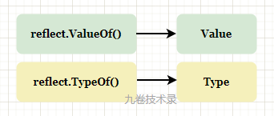
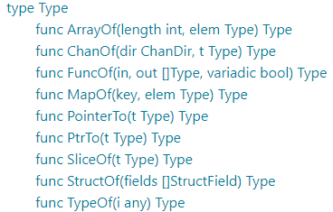
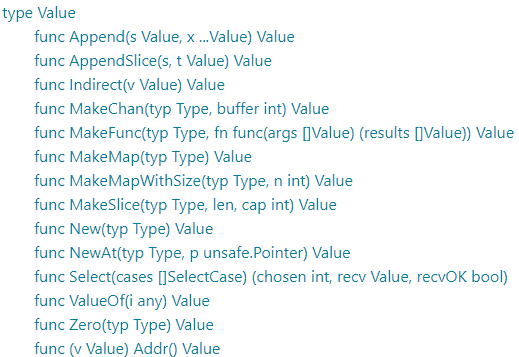

# Go 中的反射 reflect 介绍和基本使用

## 一、什么是反射

在计算机科学中，反射（英语：reflection）是指计算机程序在运行时（runtime）可以访问、检测和修改它本身状态或行为的一种能力。用比喻来说，反射就是程序在运行的时候能够“观察”并且修改自己的行为。（来自wikipedia）

反射是程序审查自身结构的能力，并能对程序做出一定的修改。

对于人来说，审查自身或过往事情的能力，叫 “反思” 或 "反省"。

## 二、Go 中的反射包：reflect介绍

Go 中的反射是用 reflect 包实现，reflect 包实现了运行时的反射能力，能够让程序操作不同的对象。

Go 中的反射是建立在类型系统之上，它与空接口 interface{} 密切相关。

每个 interface{} 类型的变量包含一对值 （type，value），type 表示变量的类型信息，value 表示变量的值信息。

> 所以 nil!=nil，就可以理解了。
>
> 空接口 interface{} 源码

-   获取 2 种类型信息的方法：

> `reflect.TypeOf()` 获取类型信息，返回 [Type](https://cs.opensource.google/go/go/+/refs/tags/go1.18.8:src/reflect/type.go;l=39) 类型；

> `reflect.ValueOf()` 获取数据信息，返回 [Value](https://cs.opensource.google/go/go/+/refs/tags/go1.18.8:src/reflect/value.go;l=39) 类型。



-   2 个方法部分源码：

```go
// ValueOf returns a new Value initialized to the concrete value
// stored in the interface i. ValueOf(nil) returns the zero Value.
// ValueOf用来获取输入参数接口中的数据的值，如果接口为空则返回0
// 参数类型 interface{} 可以表示任意类型
func ValueOf(i interface{}) Value {...}

// TypeOf returns the reflection Type that represents the dynamic type of i.
// If i is a nil interface value, TypeOf returns nil.
// TypeOf用来动态获取输入参数接口中的值的类型，如果接口为空则返回nil
// 参数类型 interface{} 可以表示任意类型
func TypeOf(i interface{}) Type {...}
```

通过 reflect.TypeOf() 和 reflect.ValueOf() ，经过中间变量 interface{}，把一个普通的变量转换为反射包中类型对象： Type 和 Value 2 个类型，然后再用 reflect 包中的方法对它们进行各种操作。

> 步骤：Go 变量 -> interface{} -> 反射包的反射类型对象


反射包 reflect 中所有方法基本都是围绕 Type 和 Value 这 2 个类型设计和操作。

从 [https://pkg.go.dev](https://pkg.go.dev/reflect@go1.18.8#pkg-index) 上可以查看有关 Type 和 Value 的所有方法，以及其它类型方法：

86.png)



## 三、reflect简单使用

从上面可以看出 TypeOf() 返回的是一个反射包中的 Type 类型，ValueOf() 返回的是一个反射包中的 Value 类型。

### 例 1：float 反射示例

```go
package main

import (
	"fmt"
	"reflect"
)

func main() {
	var x float64 = 1.2345

	fmt.Println("==TypeOf==")
	t := reflect.TypeOf(x)
	fmt.Println("type: ", t)
	fmt.Println("kind:", t.Kind())

	fmt.Println("==ValueOf==")
	v := reflect.ValueOf(x)
	fmt.Println("value: ", v)
	fmt.Println("type:", v.Type())
	fmt.Println("kind:", v.Kind())
	fmt.Println("value:", v.Float())
	fmt.Println(v.Interface())
	fmt.Printf("value is %5.2e\n", v.Interface())

	y := v.Interface().(float64)
	fmt.Println(y)
    
    fmt.Println("===kind===")
	type MyInt int
	var m MyInt = 5
	v = reflect.ValueOf(m)
    fmt.Println("kind:", v.Kind()) // Kind() 返回底层的类型 int
    fmt.Println("type:", v.Type()) // Type() 返回类型 MyInt
}
```

运行输出：

> go run ch1.go
>
> TypeOf
> type: float64
> kind: float64
> ValueOf
> value: 1.2345
> type: float64
> kind: float64
> value: 1.2345
> 1.2345
> value is 1.23e+00
> 1.2345
> =kind=
> kind: int
> type: main.MyInt

上面的例子，reflect 包中 reflect.TypeOf() 返回 Type 和 reflect.ValueOf() 返回 Value 类型 都有一个 `Kind()` 方法，Kind() 返回一个底层的数据类型，如 Unit，Float64，Slice, Int 等。

**reflect.ValueOf() 返回的 Value 类型**：

-   它有一个 Type() 方法，返回的是 reflect.Value 的 Type
-   它有获取 Value 类型值的方法
    -   如果我们知道是 `float` 类型，所以直接用 `Float()` 方法。
    -   如果不知道具体类型呢？由上面例子可知用 `Interface()` 方法，然后在进行类型断言 `v.Interface().(float64)` 来判断获取值

**v.Kind() 和 v.Type() 区别**：

上例中，在 `type MyInt int` 里，`v.Kind()` 与 `v.Type()` 返回了不同的类型值，`Kind()` 返回的是 `int`，`Type()` 返回的是 `MyInt`。  
在 Go 中，可以用 type 关键字定义自定义类型，Kind() 方法返回底层类型。比如还有结构体，指针等类型用 type 定义的，那么 Kind() 方法就可以获取这些类型的底层类型。

### 例 2：struct 反射示例

```go
package main

import (
	"fmt"
	"reflect"
)

type student struct {
	Name string `json:"name"`
	Age  int    `json:"age" id:"1"`
}

func main() {
	stu := student{
		Name: "hangmeimei",
		Age:  15,
	}

	valueOfStu := reflect.ValueOf(stu)
	// 获取struct字段数量
	fmt.Println("NumFields: ", valueOfStu.NumField())
	// 获取字段 Name 的值
	fmt.Println("Name value: ", valueOfStu.Field(0).String(), ", ", valueOfStu.FieldByName("Name").String())
	// 字段类型
	fmt.Println("Name type: ", valueOfStu.Field(0).Type())

	typeOfStu := reflect.TypeOf(stu)
	for i := 0; i < typeOfStu.NumField(); i++ {
		// 获取字段名
		name := typeOfStu.Field(i).Name
		fmt.Println("Field Name: ", name)

		// 获取tag
		if fieldName, ok := typeOfStu.FieldByName(name); ok {
			tag := fieldName.Tag

			fmt.Println("tag-", tag, ", ", "json:", tag.Get("json"), ", id", tag.Get("id"))
		}
	}
}
```

输出：

```
$ go run .\get_struct_val_simple.go
NumFields:  2
Name value:  hangmeimei ,  hangmeimei
Name type:  string
Field Name:  Name
tag- json:"name" ,  json: name , id
Field Name:  Age
tag- json:"age" id:"1" ,  json: age , id 1
```

获取 struct 信息的一些方法：

-   NumField() 获取结构体字段数量
-   Field(i) 可以通过 i 字段索引来获取结构体字段信息，比如 Field(i).Name 获取字段名
-   FieldByName(name) 通过 name 获取字段信息

## 四、反射三定律

在 Go 官方博客文章 [laws-of-reflection](https://go.dev/blog/laws-of-reflection) 中，叙述了反射的 3 定律：

-   第一定律：反射是从接口值到反射对象
-   第二定律：从反射对象可以获取接口值
-   第三定律：要修改反射对象的值，其值必须可以设置

### 第一定律

在一般情况下，反射是一种检查存储在接口变量中的类型和值的机制。

这其实从 reflect 包中的 TypeOf 和 ValueOf 函数就可以知道。在本文第二节中有讲，这 2 个函数的接收参数就是 interface{}。

比如 `reflect.TypeOf(6.4)`，调用 reflect.TypeOf(x) 时（这里的 x 表示 6.4），x 首先存储在一个空接口 interface{} 中，作为参数传递，reflect.TypeOf 对该接口进行类型信息解码，获取类型详细信息。

```go
func TypeOf(i interface{}) Type {...}
func ValueOf(i interface{}) Value {...}
```

reflect.Type 和 reflect.Value 都有很多方法让我们来操作他们。

重要的地方：

-   Value 有个返回类型的方法 `Type()`(见上面第三小节例1)
-   Value 和 Type 都有一个 Kind() 方法，它返回一个常量，如 Uint，Float64，Slice等等，表示底层数据类型

### 第二定律

给定一个 reflect.Value 我们可以使用 `Interface` 方法获取接口值。

```go
func (v Value) Interface() interface{}
```

比如：

```go
y := v.Interface().(float64)
```

（见上面第三小节例1，知道数据类型直接获取值方法，不知道数据类型用 Interface() 获取数据然后断言值）

用 Interface() 方法获取值，还可以用 Printf 直接打印值，不用断言。

> 说明：反射从接口值到反射对象，然后在返回接口的各种信息

### 第三定律

看一个例子：

```go
var x float64 = 3.4
v := reflect.ValueOf(x)
v.SetFloat(7.1) // Error: will panic.
```

这个问题并不是 7.1 不可寻址，而是这个 x 不可设置。

可设置性是反射值的一个属性，并不是所有的反射值有这个属性。

Value 的 `CanSet` 方法可以获取值是否可设置，如：

```go
var x float64 = 3.4
v := reflect.ValueOf(x)
fmt.Println("settability of v:", v.CanSet())
```

output：

```
settability of v: false
```

为什么有可设置性？

> 因为 reflect.ValueOf(x) 这个 x 传递的是一个原数据的副本，上面代码 `v.SetFloat(7.1)` 如果设置成功，那么更新的是副本值，原始值 x 并没有更新。这就会造成原值和新值的混乱，可设置属性就是避免这个问题。

那怎么办？

传递的是一个副本，而不是值本身。如果希望能直接修改 x，那么必须把 x 的地址传递给函数，即指向 x 的指针：

```go
var x float64 = 3.4
p := reflect.ValueOf(&x) // Note: take the address of x.
fmt.Println("type of p:", p.Type())
fmt.Println("settability of p:", p.CanSet())
```

output:

```
type of p: *float64
settability of p: false
```

还是 `false`，为什么？

反射对象 p 不可设置，它并不是我们要设置的 p，它实际上是 \*p。为了得到 p 所指向的东西，我们需要调用 Value 的 Elem 方法，通过指针进行简介寻址，然后将结果保存在一个名为 v 的反射 Value 中：

```go
v := p.Elem()
fmt.Println("settability of v:", v.CanSet())
```

现在 v 是一个可设置的反射对象，输出：

```
settability of v: true
```

然后我们可以用 `v.SetFloat()` 设置值：

```go
v.SetFloat(7.1)
fmt.Println(v.Interface())
fmt.Println(x)
```

output

```
7.1
7.1
```

> 说明：请记住，修改反射值需要值的地址，以便修改他们的真正值。

以上来自 Go blog-The Laws of Reflection：[https://go.dev/blog/laws-of-reflection](https://go.dev/blog/laws-of-reflection)

## 五、Kind() 和 Type() 方法区别

上面第三小节例1中有说明，这里在作个小节。

如定义 `type MyInt int`，`v.Kind()` 与 `v.Type()` 返回了不同的类型值，`Kind()` 返回的是 `int`，`Type()` 返回的是 `MyInt`。  
在 Go 中，可以用 type 关键字定义自定义类型，`Kind()` 方法返回底层数据类型，比如这里的 `int`。

比如还有结构体，指针等类型用 type 定义，那么 Kind() 方法就可以获取这些类型的底层类型。

在源码中 Kind() 方法，返回一个常量，如 Uint，Float64，Slice 等等，表示底层数据类型。

## 六、反射设置变量值

### 可设置说明

在上面第四小节第三定律中有讲到反射中值的可设置性，详细情况去看第三定律这一段。

可以用 `CanSet` 方法来判断值是否可以设置。

在 Go 中，函数参数的传递都是值拷贝，在反射中要修改值，**必须传递指针**，并且用 `Elem()` 方法获取指针的值，然后进行修改。

### 例 3：设置变量值

```go
package main

import (
	"fmt"
	"reflect"
)

type student struct {
	Age int
}

func main() {
	var stu student
	fmt.Println("origin age: ", stu.Age)

	valOfStu := reflect.ValueOf(&stu)

	canSet := valOfStu.CanSet()
	fmt.Println("can set: ", canSet)

	valOfStu = valOfStu.Elem()

	field := valOfStu.FieldByName("Age")

	field.SetInt(23)
	fmt.Println("set age: ", field.Int())

	//====================
	fmt.Println("====================")
	var num int32 = 24
	v := reflect.ValueOf(&num)
	fmt.Println("num:", num, ", elem Kind: ", v.Elem().Kind())
	if v.Elem().Kind() == reflect.Int32 {
		v.Elem().SetInt(300)
	}
	fmt.Println("set num: ", num)
}
```

输出：

```
origin age:  0
can set:  false
set age:  23
====================
num: 24 , elem Kind:  int32
set num:  300
```

## 七、反射调用方法

### 例 4：反射调用方法

```go
package main

import (
	"fmt"
	"reflect"
)

type student struct {
	Name  string
	Age   int
	Name2 string
}

func (stu student) SetName(name string, name2 string) {
	stu.Name = name
	stu.Name2 = name2
}

func (stu student) SetAge(age int) {
	stu.Age = age
}

func (stu student) Print() string {
	return fmt.Sprintf("Name: %s, Age: %d, Name2: %s", stu.Name, stu.Age, stu.Name2)
}

func main() {
	stu := student{"tom", 23, "HanMei"}
	fmt.Println("orgin student: ", stu)

	fun := reflect.ValueOf(&stu).Elem()
	fmt.Println(fun.MethodByName("Print").Call(nil)[0])

	params := make([]reflect.Value, 2)
	params[0] = reflect.ValueOf("Tom")
	params[1] = reflect.ValueOf("LiLei")
	fun.MethodByName("SetName").Call(params)

	params2 := make([]reflect.Value, 1)
	params2[0] = reflect.ValueOf(34)
	fun.MethodByName("SetAge").Call(params2)

	fmt.Println(fun.MethodByName("Print").Call(nil))
}
```

输出：

```
orgiin student:  {tom 23 HanMei}
Name: tom, Age: 23, Name2: HanMei
[Name: tom, Age: 23, Name2: HanMei]
```

用 reflect.ValueOf 调用 MethodByName() 方法，然后在调用 Call() 传入参数。

### 例 5：MakeFunc 调用函数

官方的一个例子：[https://pkg.go.dev/reflect@go1.18.8#MakeFunc](https://pkg.go.dev/reflect@go1.18.8#MakeFunc)

```go
package main

import (
	"fmt"
	"reflect"
)

// https://pkg.go.dev/reflect@go1.18.8#MakeFunc
func main() {
	// swap is the implementation passed to MakeFunc.
	// It must work in terms of reflect.Values so that it is possible
	// to write code without knowing beforehand what the types
	// will be.
	swap := func(in []reflect.Value) []reflect.Value {
		return []reflect.Value{in[1], in[0]}
	}

	// makeSwap expects fptr to be a pointer to a nil function.
	// It sets that pointer to a new function created with MakeFunc.
	// When the function is invoked, reflect turns the arguments
	// into Values, calls swap, and then turns swap's result slice
	// into the values returned by the new function.
    makeSwap := func(fptr interface{}) {
		// fptr is a pointer to a function.
		// Obtain the function value itself (likely nil) as a reflect.Value
		// so that we can query its type and then set the value.
		fn := reflect.ValueOf(fptr).Elem()

		// Make a function of the right type.
		v := reflect.MakeFunc(fn.Type(), swap)

		// Assign it to the value fn represents.
		fn.Set(v)
	}

	// Make and call a swap function for ints.
	var intSwap func(int, int) (int, int)
	makeSwap(&intSwap)
	fmt.Println(intSwap(0, 1))

	// Make and call a swap function for float64s.
	var floatSwap func(float64, float64) (float64, float64)
	makeSwap(&floatSwap)
	fmt.Println(floatSwap(2.72, 3.14))
}
```

## 八、反射优缺点

### 优点

-   可以根据条件灵活的调用函数。最大一个优点就是灵活。

比如函数参数的数据类型不确定，这时可以根据反射来判断数据类型，在调用适当的函数。

还有比如根据某些条件来调用哪个函数。

需要根据动态需要来调用函数，可以用反射。

> 使用反射的 2 个典型场景：1、操作数据库的 ORM 框架 ，2、依赖注入

### 缺点

- 用反射编写的代码比较难以阅读和理解

- 反射是在运行时才执行，所以编译期间比较难以发现错误

- 反射对性能的影响，比一般正常运行代码慢一到两个数量级。

  _这里性能其实是你的业务量到了一定时候才要注意。量不大情况，够用_。