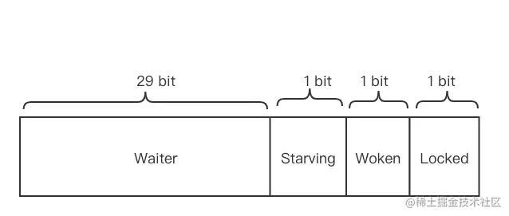
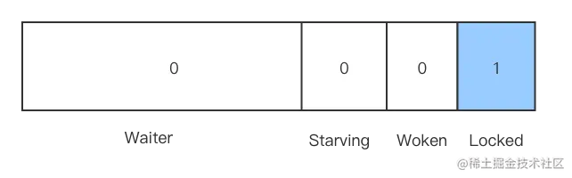
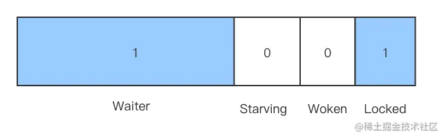

# 互斥锁的实现原理

互斥锁是在并发程序中对共享资源进行访问控制的主要手段。对此 Go 语言提供了简单易用的 `Mutex`。Mutex 和 Goroutine 合作紧密，概念容易混淆，一定注意要区分各自的概念。

`Mutex` 是一个结构体，对外提供 `Lock()`和`Unlock()`两个方法，分别用来加锁和解锁。

```go
// A Locker represents an object that can be locked and unlocked.
type Locker interface {
    Lock()
    Unlock()
}

type Mutex struct {
    state int32 
    sema  uint32
}

const (
	mutexLocked = 1 << iota // mutex is locked
	mutexWoken
	mutexStarving
	mutexWaiterShift = iota
)
```

-   Mutex 是一个互斥锁，其零值对应了未上锁的状态，不能被拷贝；
-   state 代表互斥锁的状态，比如是否被锁定；
-   sema 表示信号量，协程阻塞会等待该信号量，解锁的协程释放信号量从而唤醒等待信号量的协程。

注意到 state 是一个 int32 变量，内部实现时把该变量分成四份，用于记录 Mutex 的状态。



-   Locked: 表示该 Mutex 是否已经被锁定，0表示没有锁定，1表示已经被锁定；
-   Woken: 表示是否有协程已经被唤醒，0表示没有协程唤醒，1表示已经有协程唤醒，正在加锁过程中；
-   Starving: 表示该 Mutex 是否处于饥饿状态，0表示没有饥饿，1表示饥饿状态，说明有协程阻塞了超过1ms；

上面三个表示了 Mutex 的三个状态：锁定 - 唤醒 - 饥饿。

Waiter 信息虽然也存在 state 中，其实并不代表状态。它表示阻塞等待锁的协程个数，协程解锁时根据此值来判断是否需要释放信号量。

协程之间的抢锁，实际上争抢给`Locked`赋值的权利，能给 `Locked` 置为1，就说明抢锁成功。抢不到就阻塞等待 `sema` 信号量，一旦持有锁的协程解锁，那么等待的协程会依次被唤醒。

`Woken` 和 `Starving` 主要用于控制协程间的抢锁过程。

# Lock

```go
func (m *Mutex) Lock() {
	// Fast path: grab unlocked mutex.
	if atomic.CompareAndSwapInt32(&m.state, 0, mutexLocked) {
		if race.Enabled {
			race.Acquire(unsafe.Pointer(m))
		}
		return
	}
	// Slow path (outlined so that the fast path can be inlined)
	m.lockSlow()
}
```

若当前锁已经被使用，请求 Lock() 的 goroutine 会阻塞，直到锁可用为止。

## 单协程加锁

若只有一个协程加锁，无其他协程干扰，在加锁过程中会判断 `Locked` 标志位是否为 0，若当前为 0 则置为 1，代表加锁成功。这里本质是一个 CAS 操作，依赖了 `atomic.CompareAndSwapInt32`。

## 加锁被阻塞

假设协程B在尝试加锁前，已经有一个协程A获取到了锁，此时的状态为：



此时协程B尝试加锁，被阻塞，Mutex 的状态为：



Waiter 计数器增加了1，协程B将会持续阻塞，直到 `Locked` 值变成0 后才会被唤醒。

# Unlock

```go
func (m *Mutex) Unlock() {
	if race.Enabled {
		_ = m.state
		race.Release(unsafe.Pointer(m))
	}

	// Fast path: drop lock bit.
	new := atomic.AddInt32(&m.state, -mutexLocked)
	if new != 0 {
		// Outlined slow path to allow inlining the fast path.
		// To hide unlockSlow during tracing we skip one extra frame when tracing GoUnblock.
		m.unlockSlow(new)
	}
}
```

如果 Mutex 没有被加锁，就直接 `Unlock` ，会抛出一个 runtime error。

从源码注释来看，一个 Mutex 并不会与某个特定的 goroutine 绑定，理论上讲用一个 goroutine 加锁，另一个 goroutine 解锁也是允许的，不过为了代码可维护性，一般还是建议不要这么搞。

> A locked Mutex is not associated with a particular goroutine. It is allowed for one goroutine to lock a Mutex and then arrange for another goroutine to unlock it.

## 无协程阻塞下的解锁

假定在解锁时，没有其他协程阻塞等待加锁，那么只需要将 `Locked` 置为 0 即可，不需要释放信号量。

### 解锁并唤醒协程

假定解锁时有1个或多个协程阻塞，解锁过程分为两个步骤：

1.  将`Locked`位置0；
2.  看到 `Waiter` > 0，释放一个信号量，唤醒一个阻塞的协程，被唤醒的协程把 `Locked` 置为1，获取到锁。

# 自旋

加锁时，如果当前 `Locked` 位为1，则说明当前该锁由其他协程持有，尝试加锁的协程并不是马上转入阻塞，而是会持续探测 `Locked` 位是否变为0，这个过程就是「**自旋**」。

自旋的时间很短，如果在自旋过程中发现锁已经被释放，那么协程可以立即获取锁。此时即便有协程被唤醒，也无法获取锁，只能再次阻塞。

自旋的好处是，当加锁失败时不必立即转入阻塞，有一定机会获取到锁，这样可以避免一部分协程的切换。

## 什么是自旋

自旋对应于 CPU 的 `PAUSE` 指令，CPU 对该指令什么都不做，相当于空转。对程序而言相当于`sleep`了很小一段时间，大概 30个时钟周期。连续两次探测`Locked` 位的间隔就是在执行这些 `PAUSE` 指令，它不同于`sleep`，不需要将协程转为睡眠态。

## 自旋条件

加锁时 Golang 的 runtime 会自动判断是否可以自旋，无限制的自旋将给 CPU 带来巨大压力，自旋必须满足以下所有条件：

-   自旋次数要足够少，通常为 4，即自旋最多 4 次；
-   CPU 核数要大于 1，否则自旋没有意义，因为此时不可能有其他协程释放锁；
-   协程调度机制中的 P 的数量要大于 1，比如使用 `GOMAXPROCS()` 将处理器设置为 1 就不能启用自旋；
-   协程调度机制中的可运行队列必须为空，否则会延迟协程调度。

可见自旋的条件是很苛刻的，简单说就是不忙的时候才会启用自旋。

## 自旋的优势

自旋的优势是更充分地利用 CPU，尽量避免协程切换。因为当前申请加锁的协程拥有 CPU，如果经过短时间的自旋可以获得锁，则当前写成可以继续运行，不必进入阻塞状态。

## 自旋的问题

如果在自旋过程中获得锁，那么之前被阻塞的协程就无法获得。如果加锁的协程特别多，每次都通过自旋获取锁，则之前被阻塞的协程将很难获取锁，从而进入【**饥饿状态**】。

为此，Golang 1.8 版本后为`Mutex`增加了`Starving`模式，在这个状态下不会自旋，一旦有协程释放锁。那么一定会唤醒一个协程并成功加锁。

# Mutex 的模式

每个 Mutex 都有两种模式：**Normal**, **Starving**。

## Normal 模式

默认情况下的模式就是 Normal。 在该模式下，协程如果加锁不成功，不会立即转入阻塞排队（先进先出），而是判断是否满足自旋条件，如果满足则会启动自旋过程，尝试抢锁。

## Starving 模式

自旋过程中能抢到锁，一定意味着同一时刻有协程释放了锁。我们知道释放锁时，如果发现有阻塞等待的协程，那么还会释放一个信号量来唤醒一个等待协程，被唤醒的协程得到 CPU 后开始运行，此时发现锁已经被抢占了，自己只好再次阻塞，不过阻塞前会判断，自上次阻塞到本次阻塞经过了多长时间，如果超过 1ms，则会将 Mutex 标记为 `Starving`模式，然后阻塞。

在`Starving`模式下，不会启动自旋过程，一旦有协程释放了锁，一定会唤醒协程，被唤醒的协程将成功获取锁，同时会把等待计数减 1。

# Woken 状态

Woken 状态用于加锁和解锁过程中的通信。比如，同一时刻，两个协程一个在加锁，一个在解锁，在加锁的协程可能在自旋过程中，此时把 Woken 标记为 1，用于通知解锁协程不必释放信号量，类似知会一下对方，不用释放了，我马上就拿到锁了。