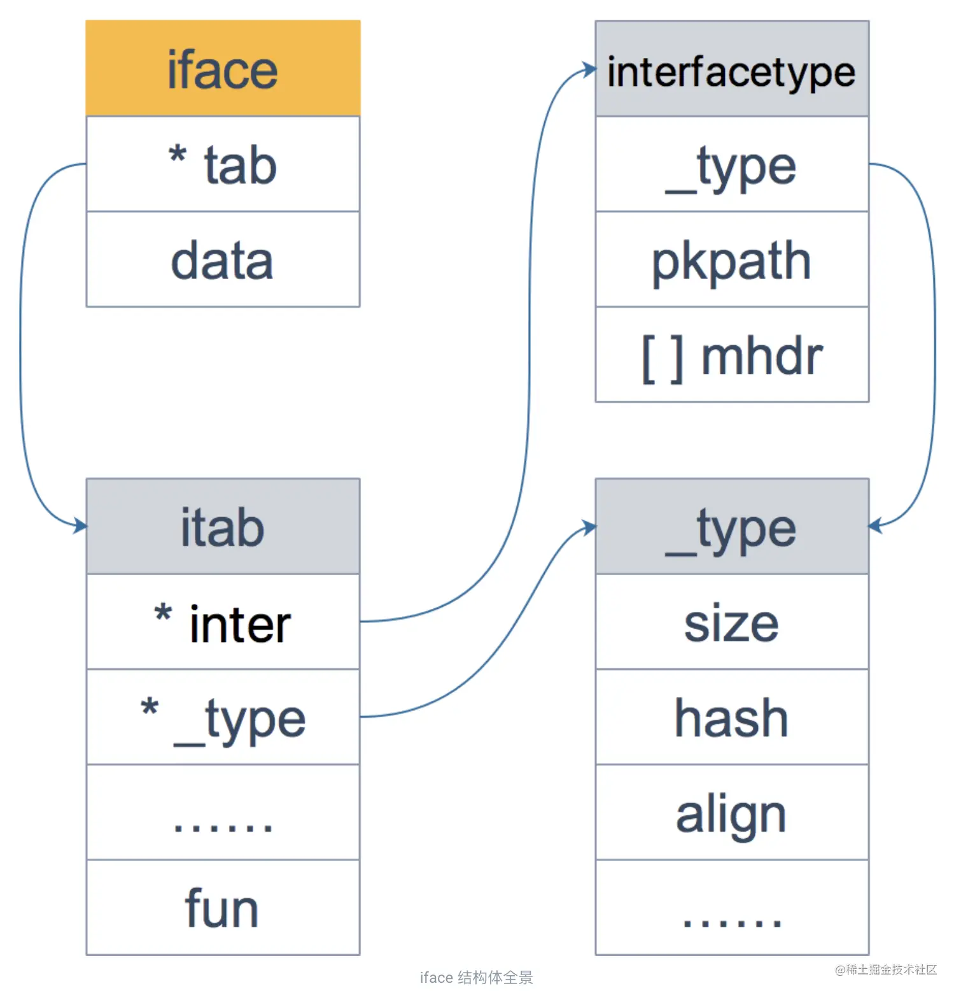

# 深入了解Go的interface{}底层原理

## 1\. interface{}初探

Go是强类型语言，各个实例变量的类型信息正是存放在interface{}中的，Go中的反射也与其底层结构有关。

`iface` 和 `eface` 都是 Go 中描述interface{}的底层结构体，区别在于 `iface` 描述的接口包含方法，而 `eface` 则是不包含任何方法的空接口：`interface{}`。

接下来，我们将详细剖析`iface` 和 `eface`的底层数据结构。

## 2\. eface

`eface` 比较简单，只维护了 `_type` 字段，表示空接口所承载的具体的实体类型，以及`data` 描述了具体的值。

```go
type eface struct {
    _type *_type
    data  unsafe.Pointer
}
```

`data`字段是`iface` 和 `eface`都有的结构，这个是一个内存指针，指向interface{}实例对象信息的存储地址，在这里，我们可以获取对象的具体属性的数值信息。

而interface{}的类型信息是存放在`_type`结构体中的，如下所示，在`eface`中，直接存放了`_type`的指针，`iface`中多了一层封装，本节我们主要针对`eface`做梳理，所以介绍`_type`结构体。

```go
type _type struct {
    // 类型大小
    size       uintptr
    ptrdata    uintptr
    // 类型的 hash 值
    hash       uint32
    // 类型的 flag，和反射相关
    tflag      tflag
    // 内存对齐相关
    align      uint8
    fieldalign uint8
    // 类型的编号，有bool, slice, struct 等等等等
    kind       uint8
    alg        *typeAlg
    // gc 相关
    gcdata    *byte
    str       nameOff
    ptrToThis typeOff
}
```

我们可以看到`size`,`ptrdata`等表示interface{}对象的类型信息，`hash`是其对应的哈希值，用于map等的哈希算法，`tflag`与反射相关，而`align`与`fieldalign`是用来内存对齐的，这与Go底层的内存管理机制有关，Go的内存管理机制类似于Linux中的伙伴系统，是以固定大小的内存块进行内存分配的，与这个大小进行对齐消除外碎片，提高内存利用率。另外还有一些和gc相关的参数，大家有一个初步的理解与认识就可以了，如果想深入掌握可以专门学习和查看源码。

## 3\. iface

与`eface`不同，`iface`结构体中要同时储存方法信息，其数据结构如下图所示。正如前面所说的，`itab`结构体封装了`_type`结构体，同样利用`_type`储存类型信息，另外，其还有一些其他的属性。`hash`是对`_type`结构体中`hash`的拷贝，提高类型断言的效率。`bad`与`inhash`都是标记位，提高gc以及其他活动的效率。`fun`指向方法信息的具体地址。

另外，`interfacetype`，他描述的是接口静态类型信息。

`fun` 字段放置和接口方法对应的具体数据类型的方法地址，实现接口调用方法的动态分派，一般在每次给接口赋值发生转换时会更新此表，或者直接拿缓存的 itab。这里只会列出实体类型和接口相关的方法，实体类型的其他方法并不会出现在这里。如果你学过 C++ 的话，这里可以类比虚函数的概念，至于静态函数，并不存放在这里。

C++ 和 Go 在定义接口方式上的不同，也导致了底层实现上的不同。C++ 通过虚函数表来实现基类调用派生类的函数；而 Go 通过 `itab` 中的 `fun` 字段来实现接口变量调用实体类型的函数。C++ 中的虚函数表是在编译期生成的；而 Go 的 `itab` 中的 `fun` 字段是在运行期间动态生成的。原因在于，Go 中实体类型可能会无意中实现 N 多接口，很多接口并不是本来需要的，所以不能为类型实现的所有接口都生成一个 `itab`， 这也是“非侵入式”带来的影响；这在 C++ 中是不存在的，因为派生需要显示声明它继承自哪个基类。

```go
type iface struct {
    tab  *itab
    data unsafe.Pointer
}

type itab struct {
    inter  *interfacetype
    _type  *_type
    link   *itab
    hash   uint32 // copy of _type.hash. Used for type switches.
    bad    bool   // type does not implement interface
    inhash bool   // has this itab been added to hash?
    unused [2]byte
    fun    [1]uintptr // variable sized
}

type interfacetype struct {
    typ     _type
    pkgpath name
    mhdr    []imethod
}
```

综合上面的分析，我们可以梳理出，`iface`对应的几个重要数据结构的关系如下图所示。



## 4\. 接口转化

通过前面提到的 `iface` 的源码可以看到，实际上它包含接口的类型 `interfacetype` 和 实体类型的类型 `_type`，这两者都是 `iface` 的字段 `itab` 的成员。也就是说生成一个 `itab` 同时需要接口的类型和实体的类型。

> \->itable

当判定一种类型是否满足某个接口时，Go 使用类型的方法集和接口所需要的方法集进行匹配，如果类型的方法集完全包含接口的方法集，则可认为该类型实现了该接口。

例如某类型有 `m` 个方法，某接口有 `n` 个方法，则很容易知道这种判定的时间复杂度为 `O(mn)`，Go 会对方法集的函数按照函数名的字典序进行排序，所以实际的时间复杂度为 `O(m+n)`。

Go的接口实现是非侵入式的，而是鸭子模式：如果某个东西长得像鸭子，像鸭子一样游泳，像鸭子一样嘎嘎叫，那它就可以被看成是一只鸭子。

因此，只要我们实现了接口对应的方法，也就实现了对应的接口，不需要单独申明。