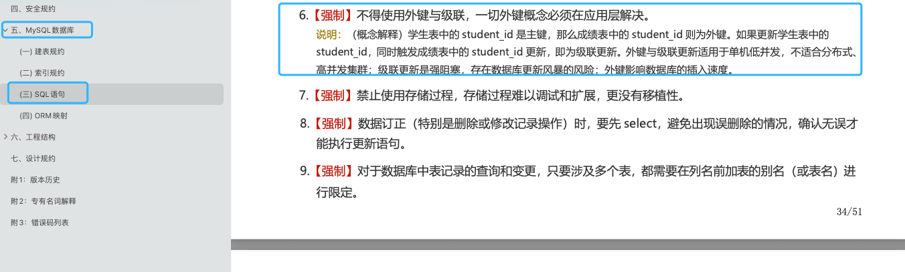

# MySQL 存储引擎

MySQL 核心在于存储引擎，想要深入学习 MySQL，必定要深入研究 MySQL 存储引擎。

## MySQL 支持哪些存储引擎？默认使用哪个？

MySQL 支持多种存储引擎，你可以通过 `SHOW ENGINES` 命令来查看 MySQL 支持的所有存储引擎。

从上图我们可以查看出， MySQL 当前默认的存储引擎是 InnoDB。并且，所有的存储引擎中只有 InnoDB 是事务性存储引擎，也就是说只有 InnoDB 支持事务。

我这里使用的 MySQL 版本是 8.x，不同的 MySQL 版本之间可能会有差别。

MySQL 5.5.5 之前，MyISAM 是 MySQL 的默认存储引擎。5.5.5 版本之后，InnoDB 是 MySQL 的默认存储引擎。

你可以通过 `SELECT VERSION()` 命令查看你的 MySQL 版本。

    mysql> SELECT VERSION();
    +-----------+
    | VERSION() |
    +-----------+
    | 8.0.27    |
    +-----------+
    1 row in set (0.00 sec)

你也可以通过 `SHOW VARIABLES LIKE '%storage_engine%'` 命令直接查看 MySQL 当前默认的存储引擎。

    mysql> SHOW VARIABLES  LIKE '%storage_engine%';
    +---------------------------------+-----------+
    | Variable_name                   | Value     |
    +---------------------------------+-----------+
    | default_storage_engine          | InnoDB    |
    | default_tmp_storage_engine      | InnoDB    |
    | disabled_storage_engines        |           |
    | internal_tmp_mem_storage_engine | TempTable |
    +---------------------------------+-----------+
    4 rows in set (0.00 sec)

如果你想要深入了解每个存储引擎以及它们之间的区别，推荐你去阅读以下 MySQL 官方文档对应的介绍(面试不会问这么细，了解即可)：

-   InnoDB 存储引擎详细介绍：[https://dev.mysql.com/doc/refman/8.0/en/innodb-storage-engine.html](https://dev.mysql.com/doc/refman/8.0/en/innodb-storage-engine.html) 。
-   其他存储引擎详细介绍：[https://dev.mysql.com/doc/refman/8.0/en/storage-engines.html](https://dev.mysql.com/doc/refman/8.0/en/storage-engines.html) 。

## MySQL 存储引擎架构了解吗？

MySQL 存储引擎采用的是 **插件式架构** ，支持多种存储引擎，我们甚至可以为不同的数据库表设置不同的存储引擎以适应不同场景的需要。**存储引擎是基于表的，而不是数据库。**

下图展示了具有可插拔存储引擎的 MySQL 架构（）：

你还可以根据 MySQL 定义的存储引擎实现标准接口来编写一个属于自己的存储引擎。这些非官方提供的存储引擎可以称为第三方存储引擎，区别于官方存储引擎。像目前最常用的 InnoDB 其实刚开始就是一个第三方存储引擎，后面由于过于优秀，其被 Oracle 直接收购了。

MySQL 官方文档也有介绍到如何编写一个自定义存储引擎，地址：[https://dev.mysql.com/doc/internals/en/custom-engine.html](https://dev.mysql.com/doc/internals/en/custom-engine.html) 。

## 常见存储引擎

### MyISAM

使用这个存储引擎，每个MyISAM在磁盘上存储成三个文件。

（1）frm文件：存储表的定义数据

（2）MYD文件：存放表具体记录的数据

（3）MYI文件：存储索引

frm和MYI可以存放在不同的目录下。MYI文件用来存储索引，但仅保存记录所在页的指针，索引的结构是B+树结构。下面这张图就是MYI文件保存的机制：

从这张图可以发现，这个存储引擎通过MYI的B+树结构来查找记录页，再根据记录页查找记录。并且支持全文索引、B树索引和数据压缩。

支持数据的类型也有三种：

（1）静态固定长度表

这种方式的优点在于存储速度非常快，容易发生缓存，而且表发生损坏后也容易修复。缺点是占空间。这也是默认的存储格式。

（2）动态可变长表

优点是节省空间，但是一旦出错恢复起来比较麻烦。

（3）压缩表

上面说到支持数据压缩，说明肯定也支持这个格式。在数据文件发生错误时候，可以使用check table工具来检查，而且还可以使用repair table工具来恢复。

有一个重要的特点那就是不支持事务，但是这也意味着他的存储速度更快，如果你的读写操作允许有错误数据的话，只是追求速度，可以选择这个存储引擎。

### InnoDB

InnoDB是默认的数据库存储引擎，他的主要特点有：

（1）可以通过自动增长列，方法是auto_increment。

（2）支持事务。默认的事务隔离级别为可重复度，通过MVCC（并发版本控制）来实现的。

（3）使用的锁粒度为行级锁，可以支持更高的并发；

（4）支持外键约束；外键约束其实降低了表的查询速度，但是增加了表之间的耦合度。

（5）配合一些热备工具可以支持在线热备份；

（6）在InnoDB中存在着缓冲管理，通过缓冲池，将索引和数据全部缓存起来，加快查询的速度；

（7）对于InnoDB类型的表，其数据的物理组织形式是聚簇表。所有的数据按照主键来组织。数据和索引放在一块，都位于B+数的叶子节点上；

当然InnoDB的存储表和索引也有下面两种形式：

（1）使用共享表空间存储：所有的表和索引存放在同一个表空间中。

（2）使用多表空间存储：表结构放在frm文件，数据和索引放在IBD文件中。分区表的话，每个分区对应单独的IBD文件，分区表的定义可以查看我的其他文章。使用分区表的好处在于提升查询效率。

对于InnoDB来说，最大的特点在于支持事务。但是这是以损失效率来换取的。

### Memory

将数据存在内存，为了提高数据的访问速度，每一个表实际上和一个磁盘文件关联。文件是frm。

（1）支持的数据类型有限制，比如：不支持TEXT和BLOB类型，对于字符串类型的数据，只支持固定长度的行，VARCHAR会被自动存储为CHAR类型；

（2）支持的锁粒度为表级锁。所以，在访问量比较大时，表级锁会成为MEMORY存储引擎的瓶颈；

（3）由于数据是存放在内存中，一旦服务器出现故障，数据都会丢失；

（4）查询的时候，如果有用到临时表，而且临时表中有BLOB，TEXT类型的字段，那么这个临时表就会转化为MyISAM类型的表，性能会急剧降低；

（5）默认使用hash索引。

（6）如果一个内部表很大，会转化为磁盘表。

不同的存储引擎都有各自的特点，以适应不同的需求，如表所示。为了做出选择，首先要考虑每一个存储引擎提供了哪些不同的功能。

## MyISAM 和 InnoDB 有什么区别？

MySQL 5.5 之前，MyISAM 引擎是 MySQL 的默认存储引擎，可谓是风光一时。

虽然，MyISAM 的性能还行，各种特性也还不错（比如全文索引、压缩、空间函数等）。但是，MyISAM 不支持事务和行级锁，而且最大的缺陷就是崩溃后无法安全恢复。

MySQL 5.5 版本之后，InnoDB 是 MySQL 的默认存储引擎。

言归正传！咱们下面还是来简单对比一下两者：

**1、是否支持行级锁**

MyISAM 只有表级锁(table-level locking)，而 InnoDB 支持行级锁(row-level locking)和表级锁,默认为行级锁。

也就说，MyISAM 一锁就是锁住了整张表，这在并发写的情况下是多么滴憨憨啊！这也是为什么 InnoDB 在并发写的时候，性能更牛皮了！

**2、是否支持事务**

MyISAM 不提供事务支持。

InnoDB 提供事务支持，实现了 SQL 标准定义了四个隔离级别，具有提交(commit)和回滚(rollback)事务的能力。并且，InnoDB 默认使用的 REPEATABLE-READ（可重读）隔离级别是可以解决幻读问题发生的（基于 MVCC 和 Next-Key Lock）。

**3、是否支持外键**

MyISAM 不支持，而 InnoDB 支持。

外键对于维护数据一致性非常有帮助，但是对性能有一定的损耗。因此，通常情况下，我们是不建议在实际生产项目中使用外键的，在业务代码中进行约束即可！

阿里的《Java 开发手册》也是明确规定禁止使用外键的。

不过，在代码中进行约束的话，对程序员的能力要求更高，具体是否要采用外键还是要根据你的项目实际情况而定。

总结：一般我们也是不建议在数据库层面使用外键的，应用层面可以解决。不过，这样会对数据的一致性造成威胁。具体要不要使用外键还是要根据你的项目来决定。

**4、是否支持数据库异常崩溃后的安全恢复**

MyISAM 不支持，而 InnoDB 支持。

使用 InnoDB 的数据库在异常崩溃后，数据库重新启动的时候会保证数据库恢复到崩溃前的状态。这个恢复的过程依赖于 `redo log` 。

**5、是否支持 MVCC**

MyISAM 不支持，而 InnoDB 支持。

讲真，这个对比有点废话，毕竟 MyISAM 连行级锁都不支持。MVCC 可以看作是行级锁的一个升级，可以有效减少加锁操作，提高性能。

**6、索引实现不一样。**

虽然 MyISAM 引擎和 InnoDB 引擎都是使用 B+Tree 作为索引结构，但是两者的实现方式不太一样。

InnoDB 引擎中，其数据文件本身就是索引文件。相比 MyISAM，索引文件和数据文件是分离的，其表数据文件本身就是按 B+Tree 组织的一个索引结构，树的叶节点 data 域保存了完整的数据记录。

**7、性能有差别。**

InnoDB 的性能比 MyISAM 更强大，不管是在读写混合模式下还是只读模式下，随着 CPU 核数的增加，InnoDB 的读写能力呈线性增长。MyISAM 因为读写不能并发，它的处理能力跟核数没关系。

**8、数据缓存策略和机制实现不同。**

InnoDB 使用缓冲池（Buffer Pool）缓存数据页和索引页，MyISAM 使用键缓存（Key Cache）仅缓存索引页而不缓存数据页。

**总结**：

-   InnoDB 支持行级别的锁粒度，MyISAM 不支持，只支持表级别的锁粒度。
-   MyISAM 不提供事务支持。InnoDB 提供事务支持，实现了 SQL 标准定义了四个隔离级别。
-   MyISAM 不支持外键，而 InnoDB 支持。
-   MyISAM 不支持 MVCC，而 InnoDB 支持。
-   虽然 MyISAM 引擎和 InnoDB 引擎都是使用 B+Tree 作为索引结构，但是两者的实现方式不太一样。
-   MyISAM 不支持数据库异常崩溃后的安全恢复，而 InnoDB 支持。
-   InnoDB 的性能比 MyISAM 更强大。

最后，再分享一张图片给你，这张图片详细对比了常见的几种 MySQL 存储引擎。

## MyISAM 和 InnoDB 如何选择？

大多数时候我们使用的都是 InnoDB 存储引擎，在某些读密集的情况下，使用 MyISAM 也是合适的。不过，前提是你的项目不介意 MyISAM 不支持事务、崩溃恢复等缺点（可是~我们一般都会介意啊）。

《MySQL 高性能》上面有一句话这样写到:

> 不要轻易相信“MyISAM 比 InnoDB 快”之类的经验之谈，这个结论往往不是绝对的。在很多我们已知场景中，InnoDB 的速度都可以让 MyISAM 望尘莫及，尤其是用到了聚簇索引，或者需要访问的数据都可以放入内存的应用。

因此，对于咱们日常开发的业务系统来说，你几乎找不到什么理由使用 MyISAM 了，老老实实用默认的 InnoDB 就可以了！