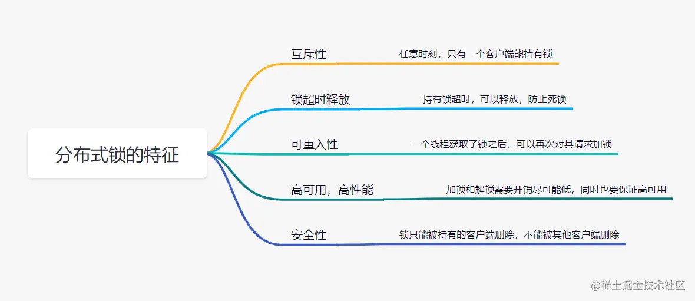
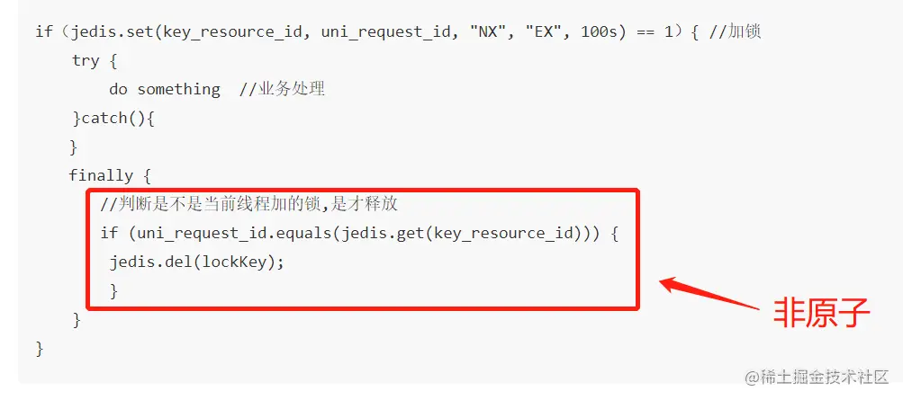
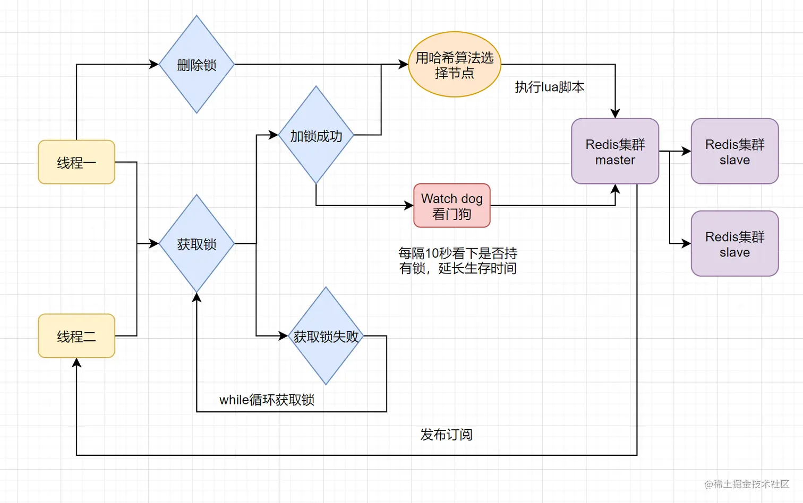
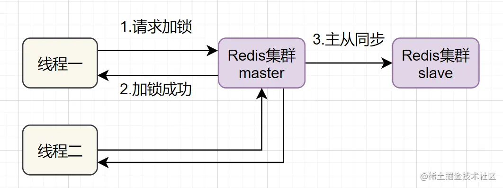
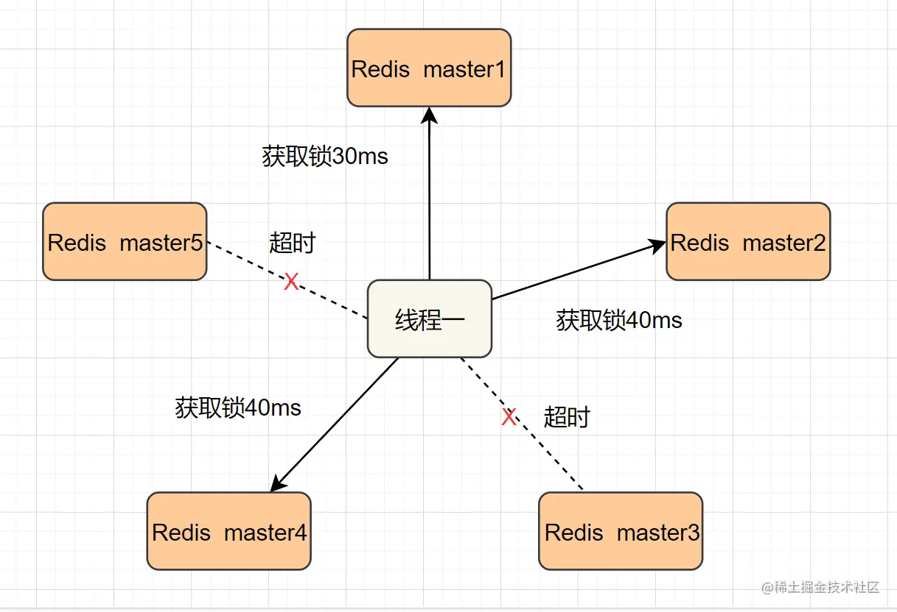

# Redis分布式锁

### 前言

日常开发中，秒杀下单、抢红包等等业务场景，都需要用到分布式锁。而Redis非常适合作为分布式锁使用。本文将分七个方案展开，跟大家探讨Redis分布式锁的正确使用方式。

-   什么是分布式锁
-   方案一：SETNX + EXPIRE
-   方案二：SETNX + value值是（系统时间+过期时间）
-   方案三：使用Lua脚本(包含SETNX + EXPIRE两条指令)
-   方案四：SET的扩展命令（SET EX PX NX）
-   方案五：SET EX PX NX + 校验唯一随机值,再释放锁
-   方案六: 开源框架:Redisson
-   方案七：多机实现的分布式锁Redlock

### 什么是分布式锁

> 分布式锁其实就是，控制分布式系统不同进程共同访问共享资源的一种锁的实现。如果不同的系统或同一个系统的不同主机之间共享了某个临界资源，往往需要互斥来防止彼此干扰，以保证一致性。

我们先来看下，一把靠谱的分布式锁应该有哪些特征：



-   **互斥性**: 任意时刻，只有一个客户端能持有锁。
-   **锁超时释放**：持有锁超时，可以释放，防止不必要的资源浪费，也可以防止死锁。
-   **可重入性**:一个线程如果获取了锁之后,可以再次对其请求加锁。
-   **高性能和高可用**：加锁和解锁需要开销尽可能低，同时也要保证高可用，避免分布式锁失效。
-   **安全性**：锁只能被持有的客户端删除，不能被其他客户端删除

### Redis分布式锁方案一：SETNX + EXPIRE

提到Redis的分布式锁，很多小伙伴马上就会想到`setnx`\+ `expire`命令。即先用`setnx`来抢锁，如果抢到之后，再用`expire`给锁设置一个过期时间，防止锁忘记了释放。

> SETNX 是SET IF NOT EXISTS的简写.日常命令格式是SETNX key value，如果 key不存在，则SETNX成功返回1，如果这个key已经存在了，则返回0。

假设某电商网站的某商品做秒杀活动，key可以设置为key\_resource\_id,value设置任意值，伪代码如下：

```
if（jedis.setnx(key_resource_id,lock_value) == 1）{ //加锁
    expire（key_resource_id，100）; //设置过期时间
    try {
        do something  //业务请求
    }catch(){
　　}
　　finally {
       jedis.del(key_resource_id); //释放锁
    }
}

```

但是这个方案中，`setnx`和`expire`两个命令分开了，**不是原子操作**。如果执行完`setnx`加锁，正要执行`expire`设置过期时间时，进程crash或者要重启维护了，那么这个锁就“长生不老”了，**别的线程永远获取不到锁啦**。

### Redis分布式锁方案二：SETNX + value值是(系统时间+过期时间)

为了解决方案一，**发生异常锁得不到释放的场景**，有小伙伴认为，可以把过期时间放到`setnx`的value值里面。如果加锁失败，再拿出value值校验一下即可。加锁代码如下：

```
long expires = System.currentTimeMillis() + expireTime; //系统时间+设置的过期时间
String expiresStr = String.valueOf(expires);

// 如果当前锁不存在，返回加锁成功
if (jedis.setnx(key_resource_id, expiresStr) == 1) {
        return true;
} 
// 如果锁已经存在，获取锁的过期时间
String currentValueStr = jedis.get(key_resource_id);

// 如果获取到的过期时间，小于系统当前时间，表示已经过期
if (currentValueStr != null && Long.parseLong(currentValueStr) < System.currentTimeMillis()) {

     // 锁已过期，获取上一个锁的过期时间，并设置现在锁的过期时间（不了解redis的getSet命令的小伙伴，可以去官网看下哈）
    String oldValueStr = jedis.getSet(key_resource_id, expiresStr);
    
    if (oldValueStr != null && oldValueStr.equals(currentValueStr)) {
         // 考虑多线程并发的情况，只有一个线程的设置值和当前值相同，它才可以加锁
         return true;
    }
}
        
//其他情况，均返回加锁失败
return false;
}
```

这个方案的优点是，巧妙移除`expire`单独设置过期时间的操作，把**过期时间放到setnx的value值**里面来。解决了方案一发生异常，锁得不到释放的问题。但是这个方案还有别的缺点：

> -   过期时间是客户端自己生成的（System.currentTimeMillis()是当前系统的时间），必须要求分布式环境下，每个客户端的时间必须同步。
> -   如果锁过期的时候，并发多个客户端同时请求过来，都执行jedis.getSet()，最终只能有一个客户端加锁成功，但是该客户端锁的过期时间，可能被别的客户端覆盖
> -   该锁没有保存持有者的唯一标识，可能被别的客户端释放/解锁。

### Redis分布式锁方案三：使用Lua脚本(包含SETNX + EXPIRE两条指令)

实际上，我们还可以使用Lua脚本来保证原子性（包含setnx和expire两条指令），lua脚本如下：

```
if redis.call('setnx',KEYS[1],ARGV[1]) == 1 then
   redis.call('expire',KEYS[1],ARGV[2])
else
   return 0
end;
```

```
String lua_scripts = "if redis.call('setnx',KEYS[1],ARGV[1]) == 1 then" +
            " redis.call('expire',KEYS[1],ARGV[2]) return 1 else return 0 end";   
Object result = jedis.eval(lua_scripts, Collections.singletonList(key_resource_id), Collections.singletonList(values));
//判断是否成功
return result.equals(1L);
```

这个方案还是有缺点的哦，至于哪些缺点，你先思考一下。也可以想下。跟方案二对比，哪个更好？

### Redis分布式锁方案方案四：SET的扩展命令（SET EX PX NX）

除了使用Lua脚本，保证`SETNX + EXPIRE`两条指令的原子性，我们还可以巧用Redis的SET指令扩展参数！（`SET key value[EX seconds][PX milliseconds][NX|XX]`），它也是原子性的！

> SET key value\[EX seconds\]\[PX milliseconds\]\[NX|XX\]
>
> -   NX :表示key不存在的时候，才能set成功，也即保证只有第一个客户端请求才能获得锁，而其他客户端请求只能等其释放锁，才能获取。
> -   EX seconds :设定key的过期时间，时间单位是秒。
> -   PX milliseconds: 设定key的过期时间，单位为毫秒
> -   XX: 仅当key存在时设置值

伪代码demo如下：

```
if（jedis.set(key_resource_id, lock_value, "NX", "EX", 100s) == 1）{ //加锁
    try {
        do something  //业务处理
    }catch(){
　　}
　　finally {
       jedis.del(key_resource_id); //释放锁
    }
}
```

但是呢，这个方案还是可能存在问题：

-   问题一：**锁过期释放了，业务还没执行完**。假设线程a获取锁成功，一直在执行临界区的代码。但是100s过去后，它还没执行完。但是，这时候锁已经过期了，此时线程b又请求过来。显然线程b就可以获得锁成功，也开始执行临界区的代码。那么问题就来了，临界区的业务代码都不是严格串行执行的啦。
-   问题二：**锁被别的线程误删**。假设线程a执行完后，去释放锁。但是它不知道当前的锁可能是线程b持有的（线程a去释放锁时，有可能过期时间已经到了，此时线程b进来占有了锁）。那线程a就把线程b的锁释放掉了，但是线程b临界区业务代码可能都还没执行完呢。

### 方案五：SET EX PX NX + 校验唯一随机值,再删除

既然锁可能被别的线程误删，那我们给value值设置一个标记当前线程唯一的随机数，在删除的时候，校验一下，不就OK了嘛。伪代码如下：

```
if（jedis.set(key_resource_id, uni_request_id, "NX", "EX", 100s) == 1）{ //加锁
    try {
        do something  //业务处理
    }catch(){
　　}
　　finally {
       //判断是不是当前线程加的锁,是才释放
       if (uni_request_id.equals(jedis.get(key_resource_id))) {
        jedis.del(lockKey); //释放锁
        }
    }
}
```

在这里，**判断是不是当前线程加的锁**和**释放锁**不是一个原子操作。如果调用jedis.del()释放锁的时候，可能这把锁已经不属于当前客户端，会解除他人加的锁。



为了更严谨，一般也是用lua脚本代替。lua脚本如下：

```
if redis.call('get',KEYS[1]) == ARGV[1] then 
   return redis.call('del',KEYS[1]) 
else
   return 0
end;
```

### Redis分布式锁方案六：Redisson框架

方案五还是可能存在**锁过期释放，业务没执行完**的问题。有些小伙伴认为，稍微把锁过期时间设置长一些就可以啦。其实我们设想一下，是否可以给获得锁的线程，开启一个定时守护线程，每隔一段时间检查锁是否还存在，存在则对锁的过期时间延长，防止锁过期提前释放。

当前开源框架Redisson解决了这个问题。我们一起来看下Redisson底层原理图吧：



只要线程一加锁成功，就会启动一个`watch dog`看门狗，它是一个后台线程，会每隔10秒检查一下，如果线程1还持有锁，那么就会不断的延长锁key的生存时间。因此，Redisson就是使用Redisson解决了**锁过期释放，业务没执行完**问题。

### Redis分布式锁方案七：多机实现的分布式锁Redlock+Redisson

前面六种方案都只是基于单机版的讨论，还不是很完美。其实Redis一般都是集群部署的：



如果线程一在Redis的master节点上拿到了锁，但是加锁的key还没同步到slave节点。恰好这时，master节点发生故障，一个slave节点就会升级为master节点。线程二就可以获取同个key的锁啦，但线程一也已经拿到锁了，锁的安全性就没了。

为了解决这个问题，Redis作者 antirez提出一种高级的分布式锁算法：Redlock。Redlock核心思想是这样的：

> 搞多个Redis master部署，以保证它们不会同时宕掉。并且这些master节点是完全相互独立的，相互之间不存在数据同步。同时，需要确保在这多个master实例上，是与在Redis单实例，使用相同方法来获取和释放锁。

我们假设当前有5个Redis master节点，在5台服务器上面运行这些Redis实例。



RedLock的实现步骤:如下

> -   1.获取当前时间，以毫秒为单位。
> -   2.按顺序向5个master节点请求加锁。客户端设置网络连接和响应超时时间，并且超时时间要小于锁的失效时间。（假设锁自动失效时间为10秒，则超时时间一般在5-50毫秒之间,我们就假设超时时间是50ms吧）。如果超时，跳过该master节点，尽快去尝试下一个master节点。
> -   3.客户端使用当前时间减去开始获取锁时间（即步骤1记录的时间），得到获取锁使用的时间。当且仅当超过一半（N/2+1，这里是5/2+1=3个节点）的Redis master节点都获得锁，并且使用的时间小于锁失效时间时，锁才算获取成功。（如上图，10s> 30ms+40ms+50ms+4m0s+50ms）
> -   如果取到了锁，key的真正有效时间就变啦，需要减去获取锁所使用的时间。
> -   如果获取锁失败（没有在至少N/2+1个master实例取到锁，有或者获取锁时间已经超过了有效时间），客户端要在所有的master节点上解锁（即便有些master节点根本就没有加锁成功，也需要解锁，以防止有些漏网之鱼）。

简化下步骤就是：

-   按顺序向5个master节点请求加锁
-   根据设置的超时时间来判断，是不是要跳过该master节点。
-   如果大于等于三个节点加锁成功，并且使用的时间小于锁的有效期，即可认定加锁成功啦。
-   如果获取锁失败，解锁！

Redisson实现了redLock版本的锁

## 基于 Zookeeper 的锁安全吗？

如果你有了解过 Zookeeper，基于它实现的分布式锁是这样的：

1.  客户端 1 和 2 都尝试创建「临时节点」，例如 /lock
2.  假设客户端 1 先到达，则加锁成功，客户端 2 加锁失败
3.  客户端 1 操作共享资源
4.  客户端 1 删除 /lock 节点，释放锁

你应该也看到了，Zookeeper 不像 Redis 那样，需要考虑锁的过期时间问题，它是采用了「临时节点」，保证客户端 1 拿到锁后，只要连接不断，就可以一直持有锁。

而且，如果客户端 1 异常崩溃了，那么这个临时节点会自动删除，保证了锁一定会被释放。

**不错，没有锁过期的烦恼，还能在异常时自动释放锁，是不是觉得很完美？**

其实不然。

思考一下，客户端 1 创建临时节点后，Zookeeper 是如何保证让这个客户端一直持有锁呢？

原因就在于，**客户端 1 此时会与 Zookeeper 服务器维护一个 Session，这个 Session 会依赖客户端「定时心跳」来维持连接。**

如果 Zookeeper 长时间收不到客户端的心跳，就认为这个 Session 过期了，也会把这个临时节点删除。


同样地，基于此问题，我们也讨论一下 GC 问题对 Zookeeper 的锁有何影响：

1.  客户端 1 创建临时节点 /lock 成功，拿到了锁
2.  客户端 1 发生长时间 GC
3.  客户端 1 无法给 Zookeeper 发送心跳，Zookeeper 把临时节点「删除」
4.  客户端 2 创建临时节点 /lock 成功，拿到了锁
5.  客户端 1 GC 结束，它仍然认为自己持有锁（冲突）

可见，即使是使用 Zookeeper，也无法保证进程 GC、网络延迟异常场景下的安全性。

**这就是前面 Redis 作者在反驳的文章中提到的：如果客户端已经拿到了锁，但客户端与锁服务器发生「失联」（例如 GC），那不止 Redlock 有问题，其它锁服务都有类似的问题，Zookeeper 也是一样！**

所以，这里我们就能得出结论了：**一个分布式锁，在极端情况下，不一定是安全的。**

如果你的业务数据非常敏感，在使用分布式锁时，一定要注意这个问题，不能假设分布式锁 100% 安全。

好，现在我们来总结一下 Zookeeper 在使用分布式锁时优劣：

Zookeeper 的优点：

1.  不需要考虑锁的过期时间
2.  watch 机制，加锁失败，可以 watch 等待锁释放，实现乐观锁

但它的劣势是：

1.  性能不如 Redis
2.  部署和运维成本高
3.  客户端与 Zookeeper 的长时间失联，锁被释放问题

## 我对分布式锁的理解

好了，前面详细介绍了基于 Redis 的 Redlock 和 Zookeeper 实现的分布锁，在各种异常情况下的安全性问题，下面我想和你聊一聊我的看法，仅供参考，不喜勿喷。

**1) 到底要不要用 Redlock？**

前面也分析了，Redlock 只有建立在「时钟正确」的前提下，才能正常工作，如果你可以保证这个前提，那么可以拿来使用。

但保证时钟正确，我认为并不是你想的那么简单就能做到的。

**第一，从硬件角度来说**，时钟发生偏移是时有发生，无法避免的。

例如，CPU 温度、机器负载、芯片材料都是有可能导致时钟发生偏移。

**第二，从我的工作经历来说**，曾经就遇到过时钟错误、运维暴力修改时钟的情况发生，进而影响了系统的正确性，所以，人为错误也是很难完全避免的。

所以，我对 Redlock 的个人看法是，尽量不用它，而且它的性能不如单机版 Redis，部署成本也高，我还是会优先考虑使用 Redis「主从+哨兵」的模式，实现分布式锁。

那正确性如何保证呢？第二点给你答案。

**2) 如何正确使用分布式锁？**

在分析 Martin 观点时，它提到了 fecing token 的方案，给我了很大的启发，虽然这种方案有很大的局限性，但对于保证「正确性」的场景，是一个非常好的思路。

所以，我们可以把这两者结合起来用：

**1、使用分布式锁，在上层完成「互斥」目的，虽然极端情况下锁会失效，但它可以最大程度把并发请求阻挡在最上层，减轻操作资源层的压力。**

**2、但对于要求数据绝对正确的业务，在资源层一定要做好「兜底」**

两种思路结合，我认为对于大多数业务场景，已经可以满足要求了。