## 问题场景介绍

**首先，看看VIVO商城的用户数据**

截止2021，vivo在全球已覆盖**4亿**多用户，服务60多个国家和地区，

vivo 在菲律宾、马来、印度等国家的市场份额名列前三，在国内出货量始终保持领先地位，成功跻身2021年第三季度4000+以上高端手机市场份额的Top3。

_抱歉，以上是他们2021的数据，_

_但是咱们手上的方案，大概是他们2018年的，那时候，他们的订单只有1000万级别。_

_那个时候的vivo商城数据量看上去不多，但是刚好是完美的学习型数据。_

**VIVO商城问题场景**

从2017年开始，随着用户量级的快速增长，vivo 官方商城 v1.0 的单体架构逐渐暴露出弊端：

-   模块愈发臃肿
-   开发效率低下
-   性能出现瓶颈
-   系统维护困难。

订单模块是电商系统的交易核心，不断累积的数据即将达到单表存储瓶颈，系统难以支撑新品发布和大促活动期间的流量，服务化改造势在必行。

_那么，他们如何做优化呢？_

## 优化措施的宏观介绍

### 优化1：业务架构解耦

从2017年开始启动的 v2.0 架构升级和全面的解耦，包括 业务模块解耦、服务化改造

-   业务模块解耦，主要是基于业务模块进行垂直的系统物理拆分，
-   服务化改造，就是在业务模块解耦基础上，进一步的微服务化。拆分出来业务线各司其职，提供服务化的能力，共同支撑主站业务。

基于业务模块进行垂直的系统物理拆分，分出来业务线各司其职，提供服务化的能力，共同支撑主站业务。

### 优化2：数据量大的优化

随着历史订单不断累积，2017年MySQL中订单表数据量已达千万级。之后的订单数据，远远大于亿级

对数据量大的问题，进行了以下优化：

-   数据归档
-   分表

### 优化3：吞吐量大的优化

商城业务处于高速发展期，下单量屡创新高，业务复杂度也在提升，

应用程序对MySQL的访问量越来越高，但是， 单机MySQL的处理能力是有限的，

当压力过大时，所有请求的访问速度都会下降，甚至有可能使数据库宕机。

并发量高的解决方案有：

-   使用缓存
-   读写分离
-   分库

### 优化4：高速搜索引擎的数据一致性优化

为了便于订单的聚合搜索，高速搜索，把订单数据冗余存储在Elasticsearch中，

那么，如何在MySQL的订单数据和ES中订单数据的增量一致性呢？

他们从以下的两种方案中：

1）MQ方案

2）Binlog方案

他们没有选择 业务代码侵入小、不影响服务本身的性能 的Binlog方案

而是选择 更加低延迟的 MQ方案。

### 优化5：合理的选择数据库迁移措施

何将数据从原来的单实例数据库，迁移到新的数据库集群，也是一大技术挑战。

要考虑的问题有二：

-   要确保数据的正确性，
-   还要保证迁移过程中，只要有问题，能快速地回滚。

他们考虑了两种方案：

-   停机迁移
-   不停机迁移

他们比较务实，不追求高大上。

考虑到不停机方案的改造成本较高，而夜间停机方案的业务损失并不大，最终选用的是停机迁移方案。

这才是 教科书式的选择。

### 优化6：合理的进行分布式事务方案的选型

从单体架构，到微服务架构，数据的一致性呢？

单体架构的 数据库ACID 事务，当然保证不了，需要用到分布式事务。

分布式事务的方案，那就太多了。 具体可以参考下面的博客文章：

[分布式事务 （秒懂）\_40岁资深老架构师尼恩的博客-CSDN博客\_尼恩分布式事务](https://blog.csdn.net/crazymakercircle/article/details/109459593)

业界的主流方案中，用于解决强一致性的有两阶段提交(2PC)、三阶段提交(3PC)，

用于解决最终一致性的有TCC、本地消息、事务消息和最大努力通知等。

他们从高并发的场景出发，选择了本地消息表方案：

在本地事务中将要执行的异步操作记录在消息表中，如果执行失败，可以通过定时任务来补偿。

### 优化7： 其他的一些细节优化

-   比如 es 召回优化
-   比如消息的有序性优化
-   比如sharding-jdbc 分页查询优化等等

接下来，来看看这个生产项目，具体是怎么做的。

## 优化1：业务架构解耦

业务架构解耦，就是基于业务模块，进行垂直的系统物理拆分，

拆分出来业务线各司其职，提供服务化的能力，共同支撑主站业务。

所以，之前的订单模块，被从商城拆分出来，独立为订单系统，为商城相关系统提供订单、支付、物流、售后等标准化服务。

模块解耦配合的，就是数据库解耦，所以，订单模块使用独立的数据库，

高并发场景下，模块解耦之后，就是服务解耦（微服务化）。

服务化解耦之后，对应的就是团队解耦。拆分出来业务线，各司其职。

总结起来，其实就是四大解耦：

-   模块解耦
-   数据库解耦
-   服务解耦
-   团队解耦（业务线解耦）

四大解耦之后，订单系统架构如下图所示：

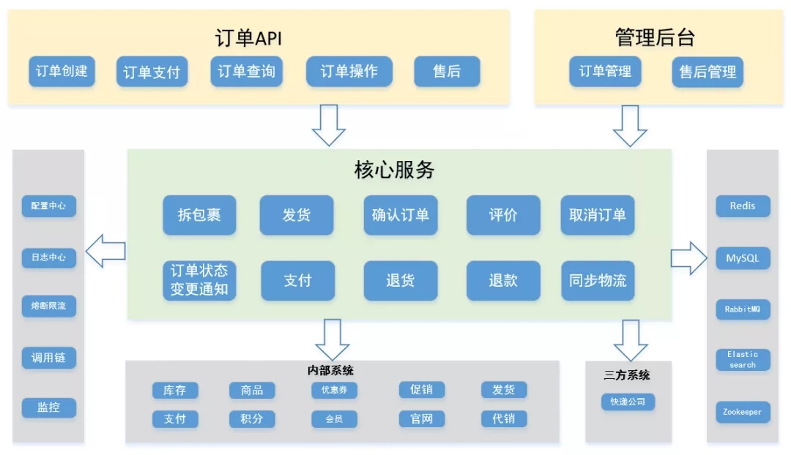

### 那么四大解耦之后，结果是什么呢：

-   拆分出来业务线各司其职，迭代效率大幅提升
-   能更好的应对超高并发、超大规模数据存储难题。各个业务线可以结合领域特性，实施个性化的解决方案，更加有效、更有针对性的生产难题。

## 优化2：数据量大的优化

随着历史订单不断累积，2017年MySQL中订单表数据量已达千万级。2017年之后的订单数据，远远大于亿级

大家知道，InnoDB存储引擎的存储结构是B+树，单表的查找时间复杂度是O(log n)，

B+树的问题是： 树的高度越大， IO次数越多

而磁盘IO操作，是性能非常低的。

因此当数据总量n变大时，检索速度必然会变慢，

不论如何加索引或者优化都无法解决，只能想办法减小单表数据量。

对数据量大的问题，进行了以下优化：

-   数据归档
-   分表

### 1）数据归档

根据**二八定律，**系统绝大部分的性能开销花在20%的业务。数据也不例外，

从数据的使用频率来看，经常被业务访问的数据称为热点数据；反之，称之为冷数据。

订单数据具备时间属性，存在热尾效应，

在了解的数据的冷、热特性后，便可以指导我们做一些有针对性的性能优化。

这里面有业务层面的优化，也有技术层面的优化。

**业务层面的优化**：

电商网站，一般只能查询3个月内的订单，如果你想看看3个月前的订单，需要访问历史订单页面。

**技术层面的优化**：

大部分情况下检索的都是最近的订单，而订单表里却存储了大量使用频率较低的老数据。

那么就可以将新老数据分开存储，将历史订单移入另一张表中，

然后，对代码中的查询模块做一些相应改动，便能有效解决数据量大的问题。

### 2）数据分表

分表又包含垂直分表和水平分表：

-   **水平分表**：在同一个数据库内，把一个表的数据按一定规则拆到多个表中；
-   **垂直分表**：将一个表按照字段分成多表，每个表存储其中一部分字段。

这里主要是减少 IO 的次数，降低B+树的高度，所以，主要考虑的是**水平分表**

按照业内的参考标准，单表的数据在500-1000W，B+树的高度在2-3层，一般2-3次IO操作，就可以读取到数据记录。

但是，分表和措施，通常和分库一起分析和落地。

所以，这里稍后结合 第三大优化吞吐量大的优化，一起分析。

## 优化3：吞吐量大的优化

截止2021，vivo在全球已覆盖**4亿**多用户，服务60多个国家和地区

从2017年开始，商城业务处于高速发展期，下单量屡创新高，吞吐量猛涨

-   应用程序吞吐量猛涨
-   MySQL的吞吐量猛涨

但是， 单体MySQL的处理能力是有限的，当压力过大时，首先是 所有请求的RT时间拉长，访问速度下降，最后是拖垮整个数据库，甚至有可能使数据库宕机。

吞吐量大的优化的解决方案有：

-   使用缓存
-   读写分离
-   分库

### 1）使用缓存

尼恩梳理了《当当的亿级电商支付系统性能优化方案》之后，总结了高并发架构的三板斧： 缓存、池化、异步

第一板斧，首当其冲

首先考虑的是分布式缓存 Redis，使用Redis作为MySQL的前置缓存，可以挡住大部分的查询请求，并降低响应时延。

其次，对于热点数据，可以使用二级缓存，甚至三级缓存

_具体可以参考尼恩的 《第26章视频： 百万qps 三级缓存架构落地与实操》_

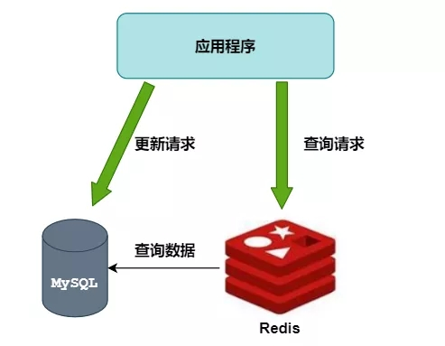

但是，缓存对存在局部热点、周期性热点数据友好

比如： 商品系统、 优惠券系统、活动系统，这里存在局部热点、周期性热点数据的系统，使用一级缓存、二级缓存、甚至三级缓存。

但是，订单系统不属于这个场景。

订单熊有一个特点，每个用户的订单数据都不一样，

所以，在订单系统中，缓存的缓存命中率不高。不存在太热的数据，所以一级缓存、三级缓存就不用了。

但是，redis 二级缓存，能缓存最近的订单，

最近的订单也是用户最近最可能使用的数据，矮个子里边拔将军，

所以，redis分布式还是能够为DB分担一下压力。这个还是要用的。

### 2）读写分离

主库负责执行数据更新请求，然后将数据变更实时同步到所有从库，用多个从库来分担查询请求。

问题是：

-   但订单数据的更新操作较多，下单高峰时主库的压力依然没有得到解决。
-   且存在主从同步延迟，正常情况下延迟非常小，不超过1ms，但也会导致在某一个时刻的主从数据不一致。

那就需要对所有受影响的业务场景进行兼容处理，可能会做一些妥协，

比如下单成功后先跳转到一个下单成功页，用户手动点击查看订单后才能看到这笔订单。

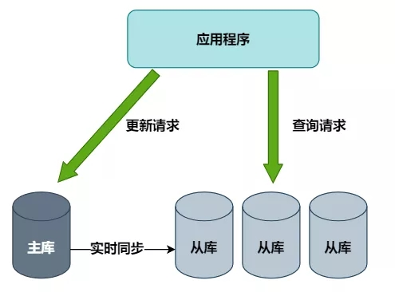

### 3）分库

分库又包含垂直分库和水平分库：

-   **水平分库**：把同一个表的数据按一定规则拆到不同的数据库中，每个库可以放在不同的服务器上；
-   **垂直分库**：按照业务将表进行分类，分布到不同的数据库上面，每个库可以放在不同的服务器上，它的核心理念是专库专用。

分库能够解决整体 高吞吐的问题

分表能够解决单表 高吞吐的问题

综合考虑了改造成本、效果和对现有业务的影响，决定直接使用最后一招：**分库分表。**

### 4）分库分表技术选型

分库分表的技术选型主要从这几个方向考虑：

-   客户端sdk开源方案
-   中间件proxy开源方案
-   公司中间件团队提供的自研框架
-   自己动手造轮子

参考之前项目经验，并与公司中间件团队沟通后，采用了开源的 Sharding-JDBC 方案。

Sharding-JDBC 方案 已更名为Sharding-Sphere。其官方的地址是：

-   Github：[https://github.com/sharding-sphere/](https://github.com/sharding-sphere/)
-   文档：官方文档比较粗糙，但是网上资料、源码解析、demo比较丰富
-   社区：活跃
-   特点：jar包方式提供，属于client端分片，支持xa事务

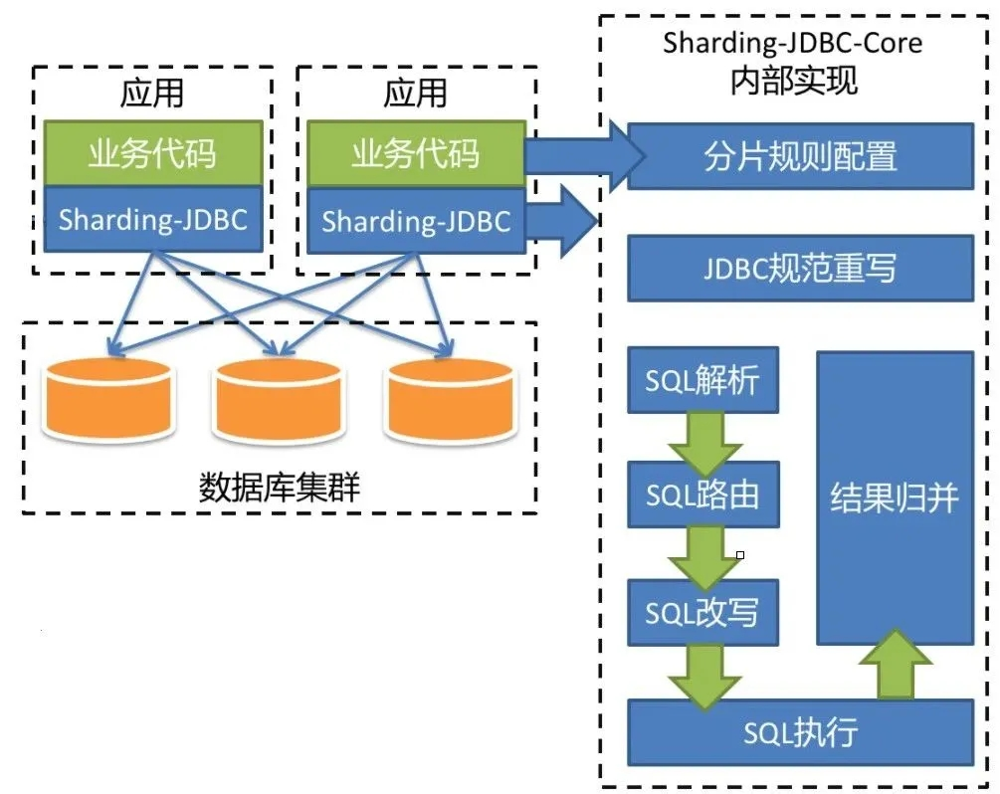

#### 1）分库分表策略

结合业务特性，选取用户标识作为分片键，

通过计算用户标识的哈希值再取模，来得到用户订单数据的库表编号。

假设共有n个库，每个库有m张表，

则库表编号的计算方式为：

-   库序号：Hash(userId) / m % n
-   表序号：Hash(userId) % m

路由过程如下图所示：

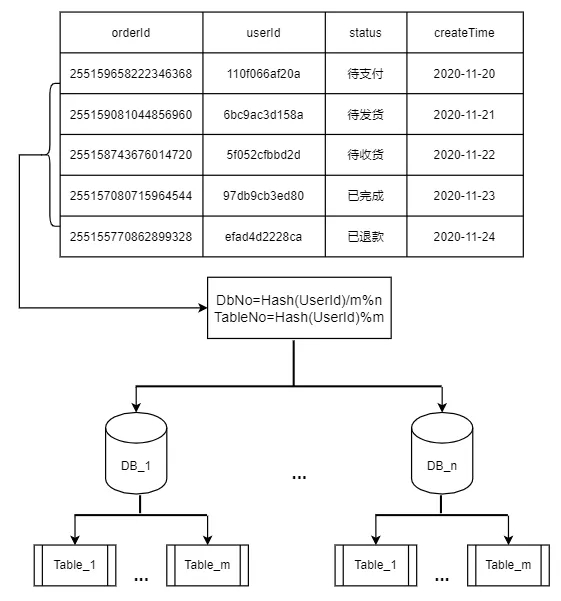

id的路由，逻辑比较复杂， 尼恩的第19章《10w qps 推送中台》有详细具体的介绍，这个可以参考。

行业有非常多的解决案例， 推特 snowflake雪花id， 百度 雪花id，shardingjdbc 雪花id 源码，这些案例各有优势，这些 尼恩的第19章《10w qps 推送中台》有源码级、原理级的介绍。

#### 2）分库分表的局限性和应对方案

分库分表解决了数据量和并发问题，但它会**极大限制数据库的查询能力**，

有一些之前很简单的关联查询，在分库分表之后可能就没法实现了，

那就需要单独对这些Sharding-JDBC不支持的SQL进行改写。

除此之外，还遇到了这些挑战：

**①全局唯一ID设计**

分库分表后，数据库自增主键不再全局唯一，不能作为订单号来使用，

但很多内部系统间的交互接口只有订单号，没有用户标识这个分片键，如何用订单号来找到对应的库表呢？

原来，我们在生成订单号时，就将库表编号隐含在其中了。

这样就能在没有用户标识的场景下，从订单号中获取库表编号。

id的设计，逻辑复杂，既要考虑 高并发高性能，还要考虑时钟回拨等问题。

行业有非常多的解决案例， 推特 snowflake雪花id， 百度 雪花id，shardingjdbc 雪花id 源码，这些案例各有优势，这些 尼恩的第19章《10w qps 推送中台》有源码级、原理级的介绍。

**②历史订单号没有隐含库表信息**

用一张表单独存储历史订单号和用户标识的映射关系，随着时间推移，这些订单逐渐不在系统间交互，就慢慢不再被用到。

**③管理后台需要根据各种筛选条件，分页查询所有满足条件的订单**

将订单数据冗余存储在搜索引擎Elasticsearch中，仅用于后台查询。

## 优化4：高速搜索引擎的数据一致性优化

为了便于订单的聚合搜索，高速搜索，把订单数据冗余存储在Elasticsearch中，

那么，如何在MySQL的订单数据和ES中订单数据的增量一致性呢？

上面的说法，文绉绉的。

直白来说，如何在MySQL的订单数据变更后，同步到ES中呢？

上面说到为了便于管理后台的查询，我们将订单数据冗余存储在Elasticsearch中，

那么，如何在MySQL的订单数据变更后，同步到ES中呢？

这里要考虑的是数据同步的时效性和一致性、对业务代码侵入小、不影响服务本身的性能等。

### 1）MQ方案

ES更新服务作为消费者，接收订单变更MQ消息后对ES进行更新

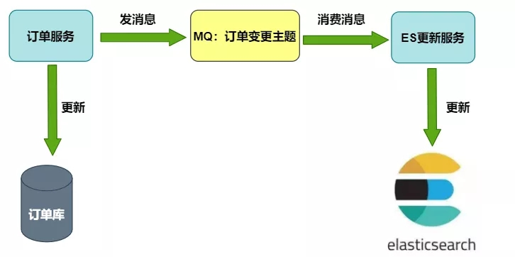

### 2）Binlog方案

ES更新服务借助canal等开源项目，把自己伪装成MySQL的从节点，接收Binlog并解析得到实时的数据变更信息，然后根据这个变更信息去更新ES。

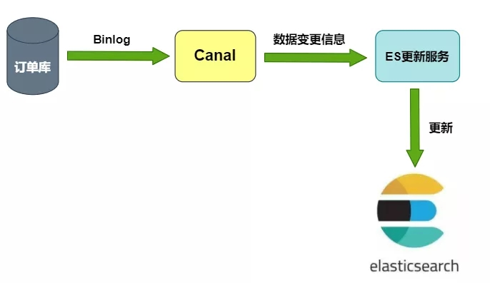

其中BinLog方案比较通用，但实现起来也较为复杂，我们最终选用的是MQ方案。

因为ES数据只在管理后台使用，对数据可靠性和同步实时性的要求不是特别高。

考虑到宕机和消息丢失等极端情况，在后台增加了按某些条件手动同步ES数据的功能来进行补偿。

## 优化5：合理的选择数据库迁移措施

如何将数据从原来的单实例数据库，迁移到新的数据库集群，也是一大技术挑战。

不但要确保数据的正确性，还要保证每执行一个步骤后，一旦出现问题，能快速地回滚到上一个步骤。

我们考虑了停机迁移和不停机迁移的两种方案：

### **1）**不停机迁移方案**：**

-   把旧库的数据复制到新库中，上线一个同步程序，使用 Binlog等方案实时同步旧库数据到新库；
-   上线双写订单新旧库服务，只读写旧库；
-   开启双写，同时停止同步程序，开启对比补偿程序，确保新库数据和旧库一致；
-   逐步将读请求切到新库上；
-   读写都切换到新库上，对比补偿程序确保旧库数据和新库一致；
-   下线旧库，下线订单双写功能，下线同步程序和对比补偿程序。

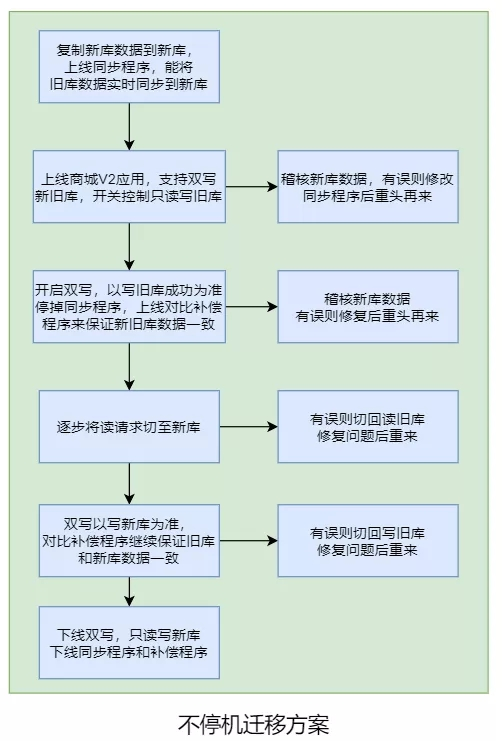

### 2）停机迁移方案：

-   上线新订单系统，执行迁移程序将两个月之前的订单同步到新库，并对数据进行稽核；
-   将商城V1应用停机，确保旧库数据不再变化；
-   执行迁移程序，将第一步未迁移的订单同步到新库并进行稽核；
-   上线商城V2应用，开始测试验证，如果失败则回退到商城V1应用（新订单系统有双写旧库的开关）。

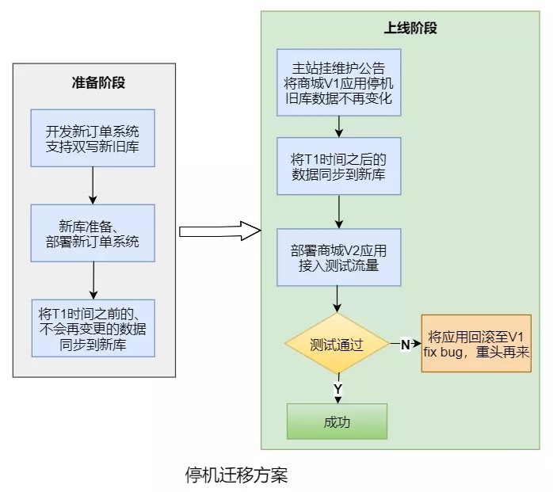

考虑到不停机方案的改造成本较高，而夜间停机方案的业务损失并不大，最终选用的是停机迁移方案。

## 优化6：合理的进行分布式事务方案的选型

电商的交易流程中，分布式事务是一个经典问题，比如：

-   用户支付成功后，需要通知发货系统给用户发货；
-   用户确认收货后，需要通知积分系统给用户发放购物奖励的积分。

我们是如何保证微服务架构下数据的一致性呢？

不同业务场景对数据一致性的要求不同，业界的主流方案中，用于解决强一致性的有两阶段提交(2PC)、三阶段提交(3PC)，解决最终一致性的有TCC、本地消息、事务消息和最大努力通知等。

我们正在使用的本地消息表方案：

在本地事务中将要执行的异步操作记录在消息表中，如果执行失败，可以通过定时任务来补偿。

下图以订单完成后通知积分系统赠送积分为例。

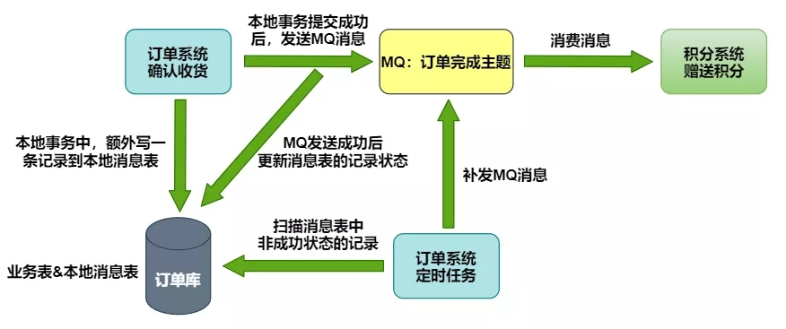

## 优化7： 其他的一些细节、具备优化

### **1）网络隔离**

只有极少数第三方接口可通过外网访问，且都会验证签名，

内部系统交互使用内网域名和RPC接口，不需要要进行签名，提升性能，也提升安全性。

### 2）并发锁

分布式场景，可能会出现同一个订单的并发更新

任何订单更新操作之前，会通过数据库行级锁加以限制，防止出现并发更新。

### 3）幂等性

分布式场景，可能会出现同一个订单的重复更新

所有接口均具备幂等性，不用担心对方网络超时重试所造成的影响。

### 4）熔断

分布式场景，需要防止故障的扩散，发生由一点牵动全身的系统性雪崩

防止某个系统故障的影响扩大到整个分布式系统中。

使用Hystrix组件，对外部系统的实时调用添加熔断保护，防止某个系统故障的影响扩大到整个分布式系统中。

### 5）全方位监控和告警

通过配置日志平台的错误日志报警、调用链的服务分析告警，

再加上公司各中间件和基础组件的监控告警功能，让我们能够能够第一时间发现系统异常。

### 6）消息的有序性问题

采用MQ消费的方式同步数据库的订单相关数据到ES中，遇到的写入数据不是订单最新数据问题。

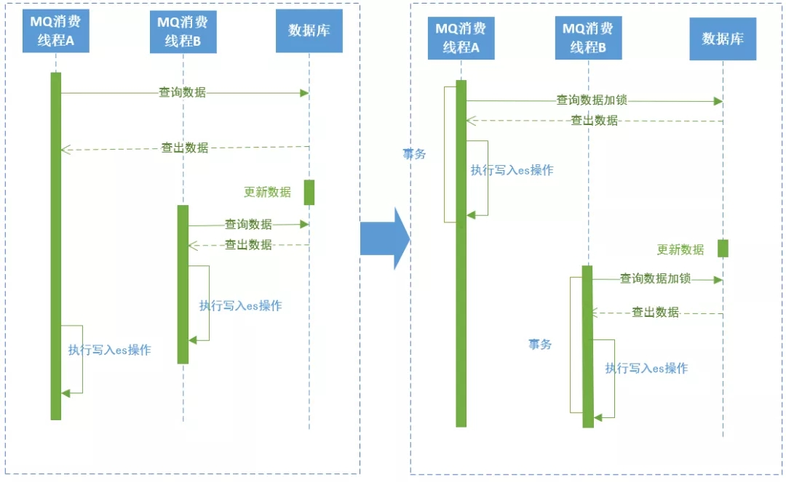

上图左边是原方案：

在消费订单数据同步的MQ时，如果线程A在先执行，查出数据，

这时候订单数据被更新了，线程B开始执行同步操作，查出订单数据后先于线程A一步写入ES中，

线程A执行写入时就会将线程B写入的数据覆盖，导致ES中的订单数据不是最新的。

上图右边是解决方案：

解决方案是在查询订单数据时加行锁，整个业务执行在事务中，执行完成后再执行下一个线程。

### 7）sharding-jdbc 分组后排序分页查询出所有数据问题

示例：

    select a  from  temp group by a,b order by a  desc limit 1,10

执行时Sharding-jdbc里group by 和 order by 字段和顺序不一致时将10置为Integer.MAX\_VALUE, 导致分页查询失效。

    io.shardingsphere.core.routing.router.sharding.ParsingSQLRouter#processLimit
    
    private void processLimit(final List<Object> parameters, final SelectStatement selectStatement, final boolean isSingleRouting) {
         boolean isNeedFetchAll = (!selectStatement.getGroupByItems().isEmpty() || !selectStatement.getAggregationSelectItems().isEmpty()) && !selectStatement.isSameGroupByAndOrderByItems();
        selectStatement.getLimit().processParameters(parameters, isNeedFetchAll, databaseType, isSingleRouting);
    }
    
    io.shardingsphere.core.parsing.parser.context.limit.Limit#processParameters
    
    /**
    * Fill parameters for rewrite limit.
    *
    * @param parameters parameters
    * @param isFetchAll is fetch all data or not
    * @param databaseType database type
    * @param isSingleRouting is single routing or not
    */
    public void processParameters(final List<Object> parameters, final boolean isFetchAll, final DatabaseType databaseType, final boolean isSingleRouting) {
        fill(parameters);
        rewrite(parameters, isFetchAll, databaseType, isSingleRouting);
    }

​    

    private void rewrite(final List<Object> parameters, final boolean isFetchAll, final DatabaseType databaseType, final boolean isSingleRouting) {
        int rewriteOffset = 0;
        int rewriteRowCount;
        if (isFetchAll) {
            rewriteRowCount = Integer.MAX_VALUE;
        } else if (isNeedRewriteRowCount(databaseType) && !isSingleRouting) {
             rewriteRowCount = null == rowCount ? -1 : getOffsetValue() + rowCount.getValue();
        } else {
           rewriteRowCount = rowCount.getValue();
        }
        if (null != offset && offset.getIndex() > -1 && !isSingleRouting) {
           parameters.set(offset.getIndex(), rewriteOffset);
         }
         if (null != rowCount && rowCount.getIndex() > -1) {
            parameters.set(rowCount.getIndex(), rewriteRowCount);
          }
    }

正确的写法应该是

    select a  from  temp group by a desc ，b limit 1,10;

两个sql，可以对比一下

    select a  from  temp group by a desc ，b limit 1,10 ； #优化的sql， 去掉了 oderby
    
    select a  from  temp group by a,b order by a  desc limit 1,10   #原始的sql

这里 使用的版本是sharing-jdbc的3.1.1。

### 8）ES分页查询的召回问题

ES分页查询的召回问题: ES分页查询如果排序字段存在重复的值。

解决方案：最好加一个唯一的字段作为第二排序条件，避免分页查询时漏掉数据、查出重复数据，

比如用的是订单创建时间作为唯一排序条件，同一时间如果存在很多数据，就会导致查询的订单存在遗漏或重复，

这里，需要增加一个唯一值作为第二排序条件、或者直接使用唯一值作为排序条件。

## 优化和升级的成果

**最后，总结一下，优化和升级的成果**

-   一次性上线成功，稳定运行了一年多；
-   核心服务性能提升十倍以上；
-   系统解耦，迭代效率大幅提升；
-   能够支撑商城至少五年的高速发展。

## 来自VIVO官方的建议

VIVO官网商城开发团队在系统设计时，并没有一味追求前沿技术和思想，

面对问题根据业务实际状况来选取最合适的办法。

VIVO官网商城开发团队认为，一个好的系统，不是在一开始就被大牛设计出来的，

一个好的系统，一定是随着业务的发展和演进逐渐被迭代出来的，持续预判业务发展方向，提前制定架构演进方案，