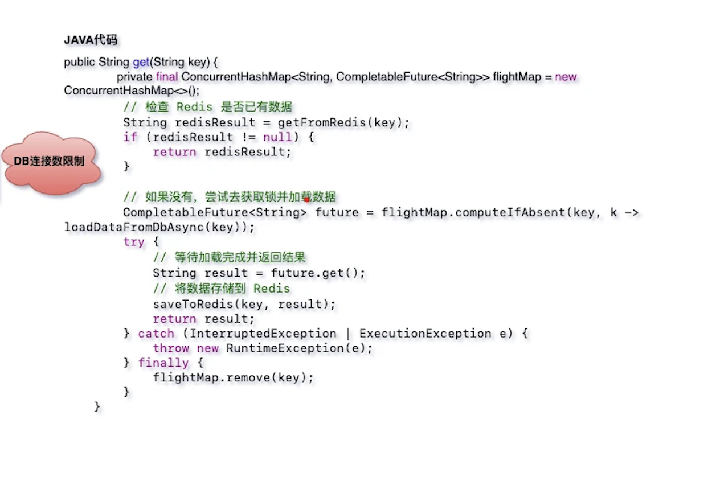

# 系统设计-评论系统

## 需求 & 难点

## 表设计

### ER图

* 抽象评论主题表(comment_subject)

* 评论索引与内容分离

* 评论索引表(id)与内容表主键(comment_index_id)相同

* root和parent的区别
  * root可理解为某条一级评论的评论区
  * parent表示评论的父子层级关系
  * 按照时间排序就是楼中楼

### 示例

## 数据如何展示

### 不建议递归查询展示所有评论

### 产品形态展示两层

#### 产品细节

* 一级评论分页展示
* 一级评论下即第二层展示点赞最多的三条

* 点击"更多"加载更多楼中楼

#### 实现细节

* 一级评论分页查询，按照创建时间倒排
  * 可以在这里加入一些复杂的排序策略，比如根据点赞，回复数等多个维度
* 获取到评论id后，再去内容到获取评论内容
* 通过异步的方式获取一级评论下点赞最多的三条评论
  * 这里有个问题点，就是获取更多的时候，还是按照点赞数倒排，还是根据一级评论下的回复id进行排序
    * B站是采用，点击进去后，评论区下的回复默认按照时间倒排，也可以选择按照热度排序
    * 抖音一级评论则没有展示点赞最多的三天，点击更多的时候，按照回复时间进行倒排

## 如何缓存数据

### 评论主题缓存

### 评论索引-时间缓存

### 评论索引-点赞缓存

### 评论内容缓存

### 读取操作旁路系统

### 时序图

### 客户端写请求

#### 更新时间戳

#### 更新点赞数

#### 合并点赞跟时间戳

### 客户端读请求

#### cache missing

#### 构建缓存评论列表

## 如何写入评论数据

## 热点评论多级缓存策略

## 整体架构模块

