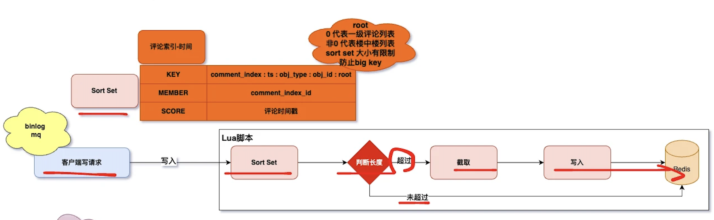

# 系统设计-评论系统

## 需求 & 难点


## 表设计

### ER图


* 抽象评论主题表(comment_subject)

* 评论索引与内容分离

* 评论索引表(id)与内容表主键(comment_index_id)相同

* root和parent的区别
  * root可理解为某条一级评论的评论区
  * parent表示评论的父子层级关系
  * 按照时间排序就是楼中楼

### 示例


## 数据如何展示

### 不建议递归查询展示所有评论


### 产品形态展示两层

#### 产品细节

* 一级评论分页展示
* 一级评论下即第二层展示点赞最多的三条

* 点击"更多"加载更多楼中楼


#### 实现细节

* 一级评论分页查询，按照创建时间倒排
  * 可以在这里加入一些复杂的排序策略，比如根据点赞，回复数等多个维度
* 获取到评论id后，再去内容到获取评论内容
* 通过异步的方式获取一级评论下点赞最多的三条评论
  * 这里有个问题点，就是获取更多的时候，还是按照点赞数倒排，还是根据一级评论下的回复id进行排序
    * B站是采用，点击进去后，评论区下的回复默认按照时间倒排，也可以选择按照热度排序
    * 抖音一级评论则没有展示点赞最多的三天，点击更多的时候，按照回复时间进行倒排


## 如何缓存数据

### 评论主题缓存

```
key:   comment_subject:obj_type:obj_id
value: 评论主题信息
```

### 评论索引-时间缓存

```
key:    comment_index:ts:obj_type:obj_id:root
member: comment_index_id
score:  评论时间戳
```

>root: 0代表一级评论列表；非0代表楼中楼列表
>
>sort set大小有限制，防止big key

### 评论索引-点赞缓存

```
key:    comment_index:like:obj_type:obj_id:root
member: comment_index_id
score:  点赞数
```

### 评论内容缓存

```
key:   comment_content:comment_index_id
value: 评论内容
```

>评论内容有哪些？
>
>A_id, A_name, B_id, B_name, A@B, 评论内容， 点赞数量，attrs扩展属性

### 读取操作旁路系统


### 时序图


> 置顶评论如何实现？
>
> sql可通过comment_index表的attrs属性进行过滤，然后存储到单独的zset key里
>
> 查询的时候，当前端查询第一页时，在查询普通评论的同时，会额外查询置顶评论，然后合并返回给客户端，其可通过特定标识进行区分

### 客户端写请求

#### 更新时间戳



```lua
local comment ARGV[1]
local new_score tonumber(ARGV[2])

判断元素是否存在
local score redis.call('ZSCORE','comments_by_likes',comment)

if score then
	-- 更新分数
	return redis.call('ZADD','comments_by_likes',new_score,comment)
else
	return nil
end
```

#### 更新点赞数


```lua
local key KEYS[1]
local member =ARGV[1]
local score tonumber(ARGV[2])
一判断元索是否存在
local exists redis.call('ZSCORE',key,member)
if exists then
	return "exists"
end
一取出最小值和最大值
local min redis.call('ZRANGE,key,0,0,WITHSCORES)[2]
local max redis.call('ZREVRANGE',key,0,0,WITHSCORES)[2]
min tonumber(min)
max tonumber(max)
一检查分数是否在区间内
if score >min and score <max then
	redis.call('ZADD',key,score,member)
	return "added"
else
	return out of_range
end
```

### 客户端读请求

#### cache missing


```java
public String get(String key){
	private final ConcurrentHashMap<String,CompletableFuture<String>>flightMap new
ConcurrentHashMap();
	//检查Redis是否已有数据
	String redisResult getFromRedis(key);
	if (redisResult !null){
		return redisResult;
	}
	//如果没有，尝试去获取锁并加载数据
	CompletableFuture<String>future flightMap.computeIfAbsent(key,k -
loadDataFromDbAsync(key));
	try {
		//等待加载完成并返回结果
		String result future.get();
		//将数据存储到Redis
		saveToRedis(key,result);
		return result;
  } catch (InterruptedException ExecutionException e){
		throw new RuntimeException(e);
  } finally {
    flightMap.remove(key);
  }
}
```

#### 构建缓存评论列表


## 如何写入评论数据


## 热点评论多级缓存策略


## 整体架构模块

