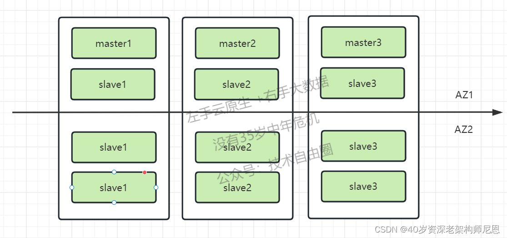
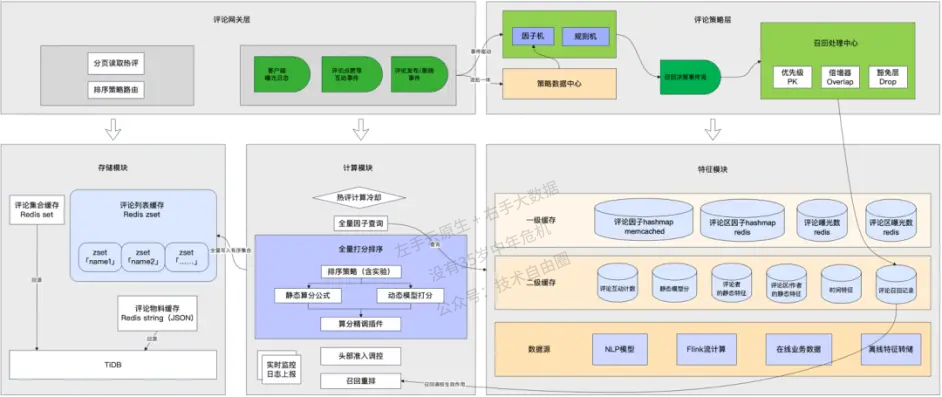

# 评论系统架构设计

## 评论系统的业务分析

在B站，UP主每天都会发布海量的视频、动态、专栏等内容，随之而来的是弹幕和评论区的各种讨论。

播放器中直接滚动播放的弹幕，如同调味剂，重在提升视频观看体验；

而点进评论区，相对而言评论文本更长，内容的观点、形式都更丰富，更像是饭后甜点。

随着业务不断发展，B站的评论系统逐渐组件化、平台化；

通过持续演进架构设计，管理不断上升的系统复杂度，从而更好地满足各类用户的需求。

评论的基础功能模块是相对稳定的。

1.  发布评论：支持无限盖楼回复。

2.  读取评论：按照时间、热度排序；显示评论数、楼中楼等。

3.  删除评论：用户删除、UP主删除等。

4.  评论互动：点赞、点踩、举报等。

5.  管理评论：置顶、精选、后台运营管理（搜索、删除、审核等）。

结合B站以及其他互联网平台的评论产品特点，评论一般还包括一些更高阶的基础功能：

1.  评论富文本展示：例如表情、@、分享链接、广告等。

2.  评论标签：例如UP主点赞、UP主回复、好友点赞等。

3.  评论装扮：一般用于凸显发评人的身份等。

4.  热评管理：结合AI和人工，为用户营造更好的评论区氛围。

## 总体的架构设计

评论系统 中台，从总体的架构上来区分，分为：

（1）接入层

（2）服务层

（3）异步任务层

（4）cache层

（5）DB层

## 接入层架构 reply-interface

reply-interface是评论系统的接入层，主要服务于两种调用者：

一是客户端的评论组件，

二是基于评论系统做二次开发或存在业务关联的其他业务后端。

面向移动端/WEB场景，设计一套基于视图模型的API，利用客户端提供的布局能力，接入层负责组织业务数据模型，并转换为视图模型，编排后下发给客户端。

面向服务端场景，接入层设计的API需要体现清晰的系统边界，最小可用原则对外提供数据，同时做好安全校验和流量控制。

接入层整个业务数据模型组装，分为两个步骤：

一是服务编排,

二是数据组装。

服务编排拆的架构为：

（1）对服务进行分层，分为若干个层级，

（2）前置依赖通过流水线调用，

（3）同一层级的可以并发调用，结构性提升了复杂调用场景下的接口性能下限；

（4）针对不同依赖服务所提供的SLA不同，设置不同的降级处理、超时控制和服务限流方案，保证少数弱依赖抖动甚至完全不可用情况下评论服务可用。

_SLA_一般指服务级别协议。 服务级别协议是指提供服务的企业与客户之间就服务的品质、水准、性能等方面所达成的双方共同认可的协议或契约。

## 服务层架构

### 评论管理服务层reply-admin

评论管理服务层，为多个内部管理后台提供服务。

运营人员的数据查询具有：

1.  组合、关联查询条件复杂；

2.  刚需关键词检索能力；

3.  写后读的可靠性与实时性要求高等特征。

此类查询需求，ES几乎是不二选择。

但是由于业务数据量较大，需要为多个不同的查询场景建立多种索引分片，且数据更新实时性不高。

因此，我们基于ES做了一层封装，提供统一化的数据检索能力，并结合在线数据库刷新部分实时性要求较高的字段。

### 评论基础服务 reply-service 架构设计

评论基础服务层，专注于评论功能的原子功能，例如：

-   查询评论列表
-   删除评论等。

这一层的特点是：

-   较少做业务逻辑变更的，
-   极高的可用性
-   极高性能吞吐。

这一层采用了多种高性能方案：

-   多级缓存
-   布隆过滤器
-   热点探测等。

> 尼恩提示：
>
> 多级缓存、布隆过滤器、热点探测等理论和实操非常重要，
>
> 很多的高并发应用，都要用到这些理论知识和实操知识，大家一定 要掌握，
>
> 具体可以参见尼恩的3高架构知识笔记。

### 异步任务层reply-job 架构设计

异步任务层，主要有两个职责：

1.  为原子的业务操作操作，提供异步协助

与reply-service协同，为评论基础功能的原子化实现做架构上的补充。

2.  异步削峰处理

为 长耗时/高吞吐的调用, 做异步化/削峰处理

#### 职责1：提供异步协助

为原子的业务操作操作，提供异步协助， 最典型的案例就是缓存的更新。

一般采用Cache Aside模式，先读缓存，再读DB；

Cache Aside模式下的缓存的重建策略：就是读请求未命中缓存穿透到DB，从DB读取到内容之后反写缓存。

这一套流程对外提供了一个原子化的数据读取功能。

但由于部分缓存数据项的重建代价较高，比如评论列表。

为啥呢？

由于列表是分页的，缓存重建时会启用预加载，也就是要多加载几页，

如果短时间内大量请求缓存未命中，并且多个服务节点的同时重建缓存，容易造成DB抖动。

解决方案是啥？

利用消息队列+reply-job ，实现单个评论列表异步重建，只重建一次缓存。

另外呢，reply-job还作为数据库binlog的消费者，执行缓存的更新操作。

#### 职责2：异步削峰处理

与reply-interface协同，为 长耗时/高吞吐的调用，做异步化/削峰处理

诸如评论发布等操作，基于安全/策略考量，会有非常重的前置调用逻辑。

对于用户来说，这个长耗时几乎是不可接受的。同时，时事热点容易造成发评论的瞬间峰值流量。

因此，reply-interface在处理完一些必要校验逻辑之后，会通过消息队列送至reply-job异步处理，包括送审、写DB、发通知等。

那么异步处理后用户体验是如何保证的呢？

首先是当次交互，返回最新数据。

C端的发评接口会返回展示新评论所需的数据内容，客户端据此展示新评论，完成一次用户交互。

其次，控制延迟时长，如果太长则进行预警和调优

若用户重新刷新页面，因为发评的异步处理端到端延迟基本在2s以内，此时所有数据已准备好，不会影响用户体验。

### 消息队列的保证有序

利用了消息队列的「有序」特性，将单个评论区内的发评串行处理，避免了并行处理导致的一些数据错乱风险。

一个有趣的问题是，早年间评论显示楼层号，楼层号实际是计数器，且在一个评论区范围内不能出现重复。

因此，这个楼层发号操作必须是在一个评论区范围内串行的（或者用更复杂的锁实现），否则两条同时发布的评论，获取的楼层号就是重复的。

而分布式部署+负载均衡的网关，处理发评论请求是无法实现这种串行的，因此需要放到消息队列中处理。

## 数据存储架构

### 结构化模型设计

结合评论的产品功能要求，评论需要至少两张表：

（1）首先是评论表，主键是评论id，关键索引是评论区id；

（2）其次是评论区表，主键是评论区id，平台化之后增加一个评论区type字段，与评论区id组成一个”联合主键“。

（3）评论内容表. 由于评论内容是大字段，且相对独立、很少修改，因此独立设计第3张表。主键也是评论id。

评论表和评论区表的字段主要包括4种：

1.  关系类，包括发布人、父评论等，这些关系型数据是发布时已经确定的，基本不会修改。

2.  计数类，包括总评论数、根评论数、子评论数等，一般会在有评论发布或者删除时修改。

3.  状态类，包括评论/评论区状态、评论/评论区属性等，评论/评论区状态是一个枚举值，描述的是正常、审核、删除等可见性状态；评论/评论区属性是一个整型的bitmap，可用于描述评论/评论区的一些关键属性，例如UP主点赞等。

4.  其他，包括meta等，可用于存储一些关键的附属信息。

评论回复的树形关系，如下图所示：

以评论列表的访问为例，我们的查询SQL可能是（已简化）：

1.  查询评论区基础信息：SELECT \* FROM subject WHERE obj\_id=? AND obj\_type=?

2.  查询时间序一级评论列表：SELECT id FROM reply\_index WHERE obj\_id=? AND obj\_type=? AND root=0 AND state=0 ORDER BY floor=? LIMIT 0,20

3.  批量查询根评论基础信息：SELECT \* FROM reply\_index,reply\_content WHERE rpid in (?,?,...)

4.  并发查询楼中楼评论列表：SELECT id FROM reply\_index WHERE obj\_id=? AND obj\_type=? AND root=? ORDER BY like\_count LIMIT 0,3

5.  批量查询楼中楼评论基础信息：SELECT \* FROM reply\_index,reply\_content WHERE rpid in (?,?,...)

### 分库分表架构

评论系统对数据库的选型要求，有两个基本且重要的特征：

1.  必须有事务；

2.  必须容量大。

一开始，B站采用的是MySQL分表来满足这两个需求。MySQL分库分表数据量起来之后，原来的MySQL分表架构很快到达存储瓶颈。

> 尼恩提示：
>
> mysql 不停服在线扩容实际非常复杂，很多公司选择停服切换， 估计B站为了不停服， 或者不愿意发生停服的风险， 选择了 专门的商用 分布式 TiDB， 毕竟这个是花了钱的。

于是从2020年起，我们逐步迁移到TiDB，从而具备了在线水平扩容能力。

### 高并发写入架构，TPS提升了10倍以上

面对10Wqps的并发写入超大规模吞吐量，做了如下优化：

**方案一：内存聚合+ 批量写入**  
评论区评论计数的更新，先做内存合并再更新，可以减少热点场景下的SQL执行条数；评论表的插入，改成批量写入。

> tips： 这就是 尼恩3高架构知识宇宙当中，所讲的 队列缓存+批量写入的架构
>
> 具体，请去看 100Wqps 三级缓存组件实操

**方案二：核心逻辑和非核心异步化，为核心操作瘦身**

非数据库写操作的其他业务逻辑，拆分为前置和后置两部分，

其他业务逻辑从数据写入主线程中剥离，交由其他的线程池并发执行。

**总之，采用新的高并发写入架构之后，性能得到极大提升。**

写入架构调整之后，系统的并发处理能力有了极大提升，同时支持配置并行度/聚合粒度，在吞吐方面具备更大的弹性，热点评论区发评论的TPS提升了10倍以上。

## 缓存层架构

### 数据的缓存模型架构

主要有3项缓存：

1. subject，对应于「查询评论区基础信息」，

   redis string类型，value使用JSON序列化方式存入。

2. reply\_index，对应于「查询xxx评论列表」，

   redis sorted set类型。

   member是评论id，score对应于ORDER BY的字段，如floor、like\_count等。

3. reply\_content，对应于「查询xxx评论基础信息」

   存储内容包括同一个评论id对应的reply\_index和reply\_content表的两部分字段。

### 缓存的一致性架构

缓存的一致性依赖binlog刷新，主要两个要点：

1.  消息队列，保证 同一个评论区内有序

binlog投递到消息队列，分片key选择的是评论区，保证单个评论区和单个评论的更新操作是串行的，消费者顺序执行，保证对同一个member的zadd和zrem操作不会顺序错乱。

2.  采用删除缓存而非直接更新的方式

程序主动写缓存和binlog刷缓存，都采用删除缓存而非直接更新的方式，避免并发写操作时，特别是诸如binlog延迟、网络抖动等异常场景下的数据错乱。

### 缓存击穿解决方案

那大量写操作后读操作缓存命中率低的问题如何解决呢？

读缓存的时候， 可以利用 锁的机制，进行同步控制，防止缓存击穿。

_具体方案，请参见尼恩的3高架构笔记中，redis 高可用实操的章节_

### 热点探测架构

除了写热点，评论的读热点也有一些典型的特征：

1.  由于大量接口都需要读取评论区基础信息，存在**读放大**，因此该操作是最先感知到读热点存在的。
2.  由于评论业务的下游依赖较多，且多是批量查询，对下游来说也是读放大。此外，很多依赖是体量相对小的业务单元，数据稀疏，难以承载评论的大流量。
3.  评论的读热点集中在评论列表的第一页，以及热评的热评。
4.  评论列表的业务数据模型也包含部分个性化信息。

在读取评论区基础信息阶段探测热点，并将热点标识传递至服务层；

服务层实现了页面请求级的热点本地缓存，感知到热点后即读取本地缓存，然后再加载个性化信息。

热点探测的实现基于单机的滑动窗口+LFU，那么如何定义、计算相应的热点条件阈值呢？

首先，我们进行系统容量设计，列出容量计算的数学公式，主要包括各接口QPS的关系、服务集群总QPS与节点数的关系、接口QPS与CPU/网络吞吐的关系等；

然后，收集系统内部以及相应依赖方的一些的热点相关统计信息，通过公式，计算出探测数据项的单机QPS热点阈值。

最后通过热点压测，来验证相应的热点配置与代码实现是符合预期的。

## 高可用架构

包括：

（1）缓存降级与DB降级

（2）同城读双活 + 双机房独立部署 架构

（3）副本数据延迟优化架构

（4）限流熔断策略的优化

### 缓存降级与DB降级

基础服务层集成了多级缓存，在上一级缓存未命中或者出现网络错误后，降级至下一级缓存，

缓存没有命中，就降级到DB，保证系统的的可用性。

### 同城读双活 + 双机房独立部署 架构

评论系统是一个同城读双活+ 双机房独立部署 的架构。

DB 和 redis 均支持多副本，具备水平扩容的弹性。

**双机房独立部署 :**

数据库与缓存均是双机房独立部署的，通过 db-proxy，或者 db-redis进行访问

### 副本数据延迟优化架构

双机房架构场景下，存在跨机房数据延迟问题，

采用如下的策略解决：

-   入口层切流
-   应用层补偿
-   跨机房重试

尽可能保证极端情况下, 用户没有延迟感。

### 限流熔断策略的优化

为了尽可能 保证系统可用， 在功能层面，做了级别划分：

> 把依赖划分为强依赖（如审核）、弱依赖（如粉丝勋章）。

首先，在如果强依赖出现异常，下坚决限流熔断，尽可能 保证 强依赖的可用性。

另外，对于弱依赖，通过超时控制、请求预过滤、优化调用编排， 持续优化提升非核心功能的可用性，

## 重点：Redis 的双机房部署方案

_tips：在写这个文章的过程中，尼恩的疯狂创客圈社群中，有小伙伴说他刚刚面试遇到了一道难题：_

> 双机房部署redis该怎么做 ?

顺着这个文章，尼恩 给大家 把双机房部署redis 方案说一下。

**采用 redis-cluster-proxy + redis cluster的架构方案。**

redis cluster是redis的官方集群方案，但是他要求客户端自己做重定向，

redis-cluster-proxy 是redis的官方集群代理，经过这个proxy的代理后，连接redis集群就和连接单机redis一样了。

### proxy+cluster架构

proxy+cluster架构图如下：

架构说明：

1、redis-cluster采用了同城双活架构，

其中，图中的AZ1和AZ2表示为可用区1、可用区2，

主节点（AZ1）按3主3从部署，备节点（AZ2）作为Cluster的6从，整个集群为3主9从；

2、单个master节点发生故障，redis集群自动感知并进行选主，完成主从切换，不影响业务正常使用；

3、应用服务连接所有Redis集群主从节点，以便自动感知主从切换情况。

其实只要连接到redis-proxy一个节点，应用服务便可以获取到集群信息，某些节点宕机后，客户端不会收到影响。

注意：单AZ1池资源出现问题，可以使用已准备好的脚本进行快速切换AZ2节点，完成集群恢复。

当然，上面的方案，可以考虑把master节点打散到两个AZ，避免集群超半数master节点宕机；

### proxy+cluster架构问题

redis-proxy模式采用官方的redis-proxy+cluster模式，优点就是应用只需要连接proxy节点即可，不需要配置更多的node节点，生产环境proxy需要考虑高可用，而proxy也可以考虑用lvs+keepalived作为代理取代，

### 自动切换脚本

先使用`cluster failover force`命令执行强制切库，如果试了3次都不行，就使用`cluster failover takeover`更强制的切库，

手动故障转移是一种特殊的故障转移，通常在没有实际故障的情况下执行，我们希望将当前主节点与其中一个slave从节点（我们发送该命令的节点）交换（安全地，而不会有数据丢失的窗口）。

> 1.  当前slave从节点通知主节点停止处理客户端的请求。
> 2.  主节点回复slave从节点当前的 _同步偏移量_。
> 3.  slave从节点等待同步偏移量在slave从节点的侧匹配，以确保它已经处理了所有主节点的数据，然后继续。
> 4.  slave从节点开始故障转移，从主节点的大多数主节点获取新的配置纪元值epoch，并广播新的配置。
> 5.  旧的主节点接收配置更新：解除对客户端访问的阻止，并开始回复重定向消息，以便它们继续与新的主节点通信。

两个选项：

> FORCE option: manual failover when the master is down 当主节点停止时手动故障转移
>
> 如果选择**FORCE**选项，slave从节点不会与master主节点进行协商（master节点可能不可达），而是直接尽快从上文的故障转移步骤中的第4步开始做故障转移。当主节点不可达时，**FORCE**选项对于我们做手动故障转移非常有用。
>
> TAKEOVER option: manual failover without cluster consensus 在集群数据不一致的场景下，也要人工故障转移
>
> **TACKOVER**选项实现了**FORCE**选项的所有实现，但是无需集群一致性验证来进行故障转移。

如果需要故障转移，在从节点上，可以输入以下命令

    redis-cli -p 7001 -c CLUSTER FAILOVER

也可以结合linux上的定时器，使用脚本，配合使用

（1）探活脚本：redis\_check.sh

（2）切换脚本：redis\_task.sh

redis\_check.sh脚本为检测redis节点是否存活

    #!/bin/bash 
     
    LOGDIR="/root"
    BINDIR="/data/redis/7001/bin/redis-cli"
    PASSWD="123456"
    IPDIR="172.16.0.8:7001  172.16.0.8:7002 172.16.0.8:7003 172.16.0.8:7004  172.16.0.8:7005 172.16.0.8:7006" 
    DATE=`date`
    LOGFILE=${LOGDIR}/logs
    ERROR_LOG=${LOGDIR}/error.logs
     
    cd ${LOGDIR}
    if [ ! -d bak ] ; then
            mkdir -p bak
    fi
     
    for i in $IPDIR
    do
      port=${i#*:}
      ip=${i%:*}
     
      ALIVE=`$BINDIR -h $ip -p $port  PING`
      #ALIVE=`$BINDIR -h $ip -p $port -a $PASSWD PING`
     
      if [ "$ALIVE" == "PONG" ]; then
        echo "${DATE} Success: redis-cli -h $ip -p $port   PING $ALIVE" >> $LOGFILE 2>&1
      else
        echo "${DATE} Failed:redis-cli -h $ip -p $port  PING $ALIVE " >> $ERROR_LOG 2>&1
      fi
     
    done

​    

redis\_task.sh为AZ1节点宕机后，执行脚本切换到AZ2节点

    #!/bin/bash
     
    IPMASTER="172.16.0.8:7001  172.16.0.8:7002 172.16.0.8:7003"
    BINDIR="/data/redis/7001/bin/redis-cli"
    PASSWD="123456"
    DATE=`date`
    LOGDIR="/root"
    LOGFILE=${LOGDIR}/logs
    ERROR_LOG=${LOGDIR}/error.logs
     
    for i in $IPMASTER
    do
      port=${i#*:}
      ip=${i%:*}
     
      status=`$BINDIR -h $ip -p $port -c cluster failover takeover`
      #status=` $BINDIR -h $ip -p $port -a $PASSWD -c cluster failover takeover`
     
      if [ "$status" == "OK" ]; then
        echo "${DATE} Success: $i 成功切换成master节点" >> $LOGFILE 2>&1
      else
        echo "${DATE} Failed: $i 切换master节点失败 " >> $ERROR_LOG 2>&1
      fi
     
    done

### 机房故障的redis 故障转移过程

最开始cluster搭建方式如下图所示

在AZ1机房全部宕机后，我们需要通过执行cluster failover takeover命令将AZ2机房切换为Master，如下图所示：

在AZ1机房恢复正常之后，如下图所示：

## 安全性架构

### 一、数据安全

满足数据安全法要求，除了数据安全法所要求的以外，评论系统的数据安全还包括「合规性要求」。

评论数据合规，一方面是审核和风控，另一方面对工程侧的要求主要是「状态一致性」。

例如，有害评论被删除后，在客户端不能展现，也不能通过API等对外暴露。

这就对数据一致性，包括缓存，提出了较高要求。

在设计层面主要有两方面实践：

1. 数据读写阶段均考虑了一致性风险，严格保证时序性。

2. 对各类数据写操作，定义了优先级，避免高优先级操作被低优先级操作覆盖，例如审核删除的有害评论，不能被其他普通运营人员/自动化策略放出。

3. 通过冗余校验，避免风险数据外泄。

   例如评论列表的露出，读取sorted set中的id列表后，还需要校验对应评论的状态，是可见态才允许下发。

### 二、舆论安全

舆论安全问题更为泛化。

接口错误导致用户操作失败、关闭评论区、评论计数不准，甚至新功能上线、用户不满意的评论被顶到热评前排等问题均可能引发舆情问题。

在系统设计层面，我们主要通过几方面规避。

1. **不对用户暴露用户无法处理和不值得处理的错误。**

   例如评论点赞点踩、某个数据项读取失败这一类的轻量级操作，不值得用户重试，此时告知用户操作失败也没有意义。系统可以考虑自行重试，甚至直接忽略。

2. 优化产品功能及其技术实现，例如评论计数、热评排序等。

## 热评设计架构

### **什么是热评**

早期的热评，实际就是按照评论点赞数降序。

后来衍生了更为复杂的热评：

> 既包括类似「妙评」这种用户推荐、运营精选且带logo突出展示的产品形态，
>
> 也包括各类热评排序算法，且热评排序算法应用场景也不仅局限于评论主列表的热度序，
>
> 还包括楼中楼（外露子评论）、动态外露评论等。

热评排序逻辑一般包括点赞数、回复数、内容相关、负反馈数、“时间衰退因子”、字数加权、用户等级加权等等。

咬文嚼字来说，我们对「热」的理解，大致分为几个阶段：

1.  阶段1 ： 点赞高，就代表热度高。→ 解决热评的有无问题
2.  阶段2 ：基于用户正负样本投票的，加权平均高，就代表热度高。→ 解决高赞高踩的负面热评问题
3.  阶段3：短时间内点赞率高，就代表热度高。→ 解决高赞永远高赞的马太效应
4.  阶段4 ：热评用户流量大，社区影响也大。→ 追求用户价值平衡, 要权衡社会价值观引导、公司战略导向、商业利益、UP主与用户的「情绪」等。

### 阶段1 ：按照点赞绝对值排序

按照点赞绝对值排序，即要实现ORDER BY like\_count的分页排序。

点赞数是一个频繁更新的值，MySQL，特别是TiDB，由于扫描行数约等于OFFSET，因此在OFFSET较大时查询性能特别差，很难找到一个完美的优化方案。

此外，由于like\_count的分布可能出现同一个值堆叠多个元素，比如评论区所有的评论都没有赞，

我们更多依赖redis的sorted set来执行分页查询，这就要求 **缓存命中率非常高**。

### 阶段2 ：按照正负样本加权平均排序

按照正负样本加权平均的，即**Reddit：威尔逊排序\[6\]**，

到这个阶段，数据库已经无法实现这样复杂的ORDER BY，热评开始几乎完全依赖sorted set这样的数据结构，预先计算好排序分数并写入。

于是在架构设计上，新增了feed-service和feed-job来支撑热评列表的读写。

Reddit最早成立于2005年，两名创始人是史蒂夫·霍夫曼和阿里克西斯·奥哈尼安，当时他们刚刚从弗吉尼亚大学毕业。他们的创业想法获得了美国知名创业孵化器Y Combinator的天使投资。

Reddit在美国的影响力非常大，它的信息展示形式像论坛，又像贴吧。是由不同版块下的帖子组成的交流平台，用户可以选择对帖子点击“上涨”或“下沉”来决定帖子的排名顺序。

Reddit在2009年公开过自己如何用威尔逊区间(wilson interval)对评论排序的，代码也开源过。

Wilson算法要点有两个：

1. 把“所有正负反馈中正反馈的比例”作为对评论质量的考核指标。

   在Reddit的情况中，正负反馈分别为点赞和反对。

   简单来说，就是 正为点赞, 负为反对

2. 对在冷启动过程中的评论（即正负反馈总数很少）做降权处理。

   具体算法就是：假设观测到的正反馈率符合真实正反馈率的正态分布，求当前观测得到的正反馈率恰好位于95%置信上区间时的真实反馈率。

### 阶段3：按照点赞率排序

按照点赞率排序，需要实现点赞率的近实时计算。

点赞率=点赞数/曝光数，曝光的数据来源是客户端上报的展现日志，量级非常大，

可以说是一个写多读少的场景：只有重算排序的时候才会读取曝光数。

### 阶段4 ：追求用户价值平衡

追求用户价值平衡，需要处理各种细分场景下的差异化需求。

热评排序与feed排序很像，但也有一点根本性差异：

> feed排序是个性化的，每个人看到的都不相同，
>
> 但评论排序往往不会如此激进，一般来说会希望大家看到的评论排序都大致相同。

由于排序问题的解决方案是探索型的，因此系统设计层面需要提供更多元、更易扩展的工程化能力，

> 包括算法和策略的快速迭代、实验能力等，
>
> 并提升整个热评模块的可观测水平，监控完善、数据报表丰富、排序过程可解释等等。

在架构上，新增了strategy-service和strategy-job来承担这部分策略探索型业务。

此外，数据量级规模的增加，也对系统的吞吐能力提出了更高要求：

不管热评的算法如何变化，一般来说，热评列表都需要能够访问到全部评论，且基本维持相同的热评排序逻辑。

在评论数过百万甚至千万的评论区，热评排序的挑战点主要在于：

1. 大key问题：

   例如单个sorted set过大，读写性能都受影响（时间复杂度的基数可以认为都是O(logN)）；全量更新时，还可能遇到redis pipeline的瓶颈。

2. 实时性放大存储压力：

   多样化的数据源，对特征的导入与更新都提出了挑战，需要支持较丰富的数据结构，和尽可能高的写吞吐（想象一下曝光数作为排序特征的变态要求）；

   与推荐排序不同，热评排序是全排序，此时需要读取全部评论的全部特征，查询压力也会非常大。

这一阶段，我们仍然在持续优化，在工程落地层面尽可能还原理想的排序算法设计，保障用户的热评浏览体验。目前形成的系统架构总体如下图所示：

图示的「评论策略层」，负责建立一套热评调控体系化能力，通过召回机制来实现想要的“balance“。

即先通过策略工程，召回一批应该沉底的不良评论或者应该进前排的优秀评论，然后在排序分计算阶段根据召回结果实现这样的效果。

这样做的好处是，可以**保留一套通用的底层排序算法，然后通过迭代细分场景下的召回策略，来实现差异化评论排序的平衡。**

召回策略的工程设计，按照分层设计的原则拆分为3个部分：

1. **因子机**。

   主要职责是维护策略所需的全部「因子」，包括一些已有的在线/离线数据，也包括为了策略迭代而需要新开发的流式的窗口聚合数据。

   因子机的重难点是需要管理各种数据获取的拓扑关系，以及通过缓存来保护下游（数据提供方很难也不应该承受热评业务的巨大流量）。

   所有的因子可以构成一个有向无环图，通过梳理依赖关系和推导计算，实现并发提效、减少冗余。

2. **规则机**。

   实现了一套声明式规则语法，可以直接引用因子机预定义的因子，结合各种逻辑算子构成一个规则表达式。

   规则机执行命中后，会向下游传递预先声明的召回决策，例如排序提权。

3. **召回处理中心**。

   这一层的职责就是接收规则机返回的各种决策并执行，需要处理不同决策的优先级PK、不同规则的决策叠加作用、决策豁免等。

热评排序涉及的特征，是多数据源的，数据更新方式、更新频率、查询性能也天差万别。

因此我们针对数据源的特点做了多级缓存，通过**多级冗余与跨级合并**，提升了特征读取的稳定性与性能上限。

当然，其中的数据实时性、一致性、可用性，仍然处于一个动态权衡取舍的过程。