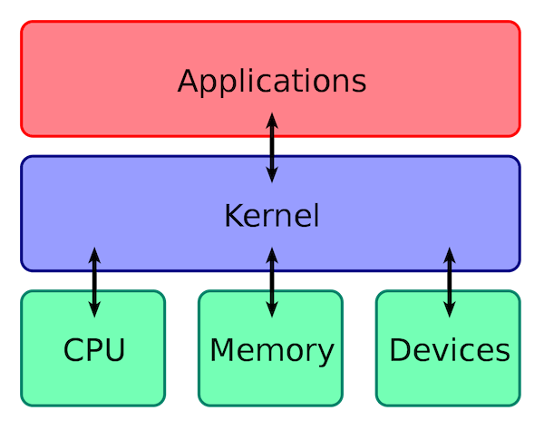
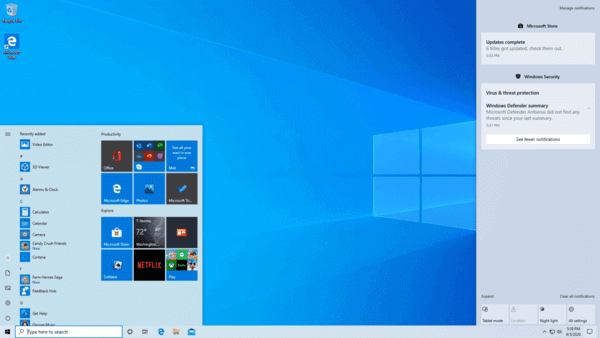
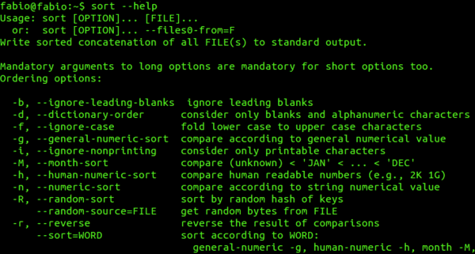
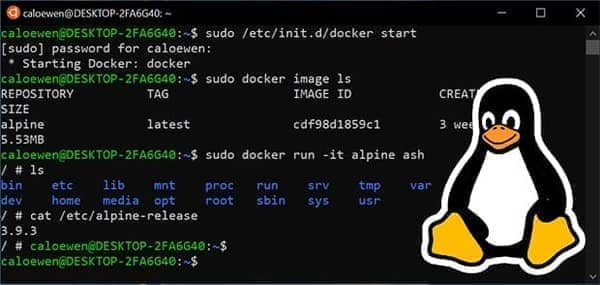
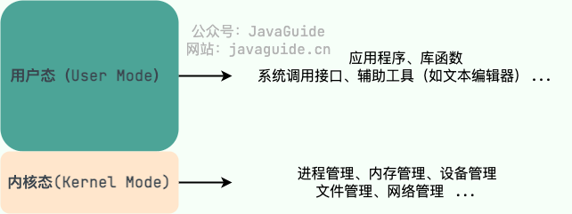
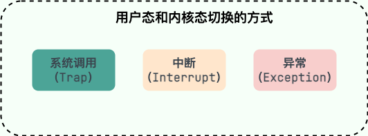
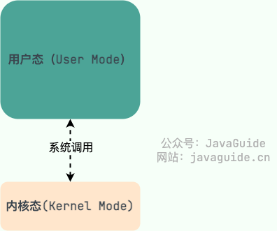
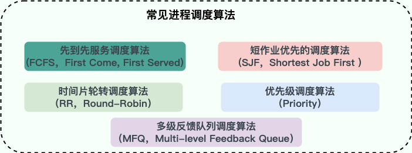
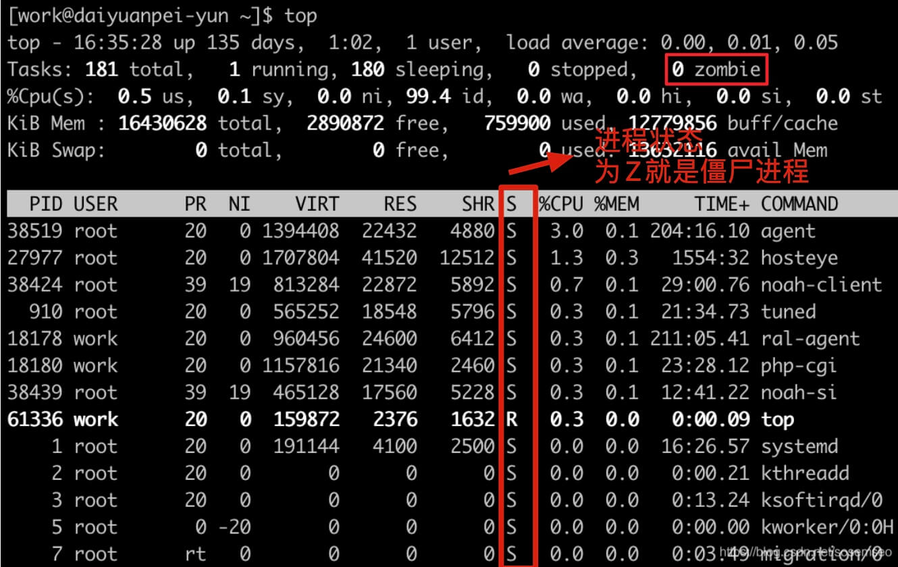

很多读者抱怨计算操作系统的知识点比较繁杂，自己也没有多少耐心去看，但是面试的时候又经常会遇到。所以，我带着我整理好的操作系统的常见问题来啦！这篇文章总结了一些我觉得比较重要的操作系统相关的问题比如 **用户态和内核态、系统调用、进程和线程、死锁、内存管理、虚拟内存、文件系统**等等。

这篇文章只是对一些操作系统比较重要概念的一个概览，深入学习的话，建议大家还是老老实实地去看书。另外， 这篇文章的很多内容参考了《现代操作系统》第三版这本书，非常感谢。

开始本文的内容之前，我们先聊聊为什么要学习操作系统。

-   **从对个人能力方面提升来说**：操作系统中的很多思想、很多经典的算法，你都可以在我们日常开发使用的各种工具或者框架中找到它们的影子。比如说我们开发的系统使用的缓存（比如 Redis）和操作系统的高速缓存就很像。CPU 中的高速缓存有很多种，不过大部分都是为了解决 CPU 处理速度和内存处理速度不对等的问题。我们还可以把内存看作外存的高速缓存，程序运行的时候我们把外存的数据复制到内存，由于内存的处理速度远远高于外存，这样提高了处理速度。同样地，我们使用的 Redis 缓存就是为了解决程序处理速度和访问常规关系型数据库速度不对等的问题。高速缓存一般会按照局部性原理（2-8 原则）根据相应的淘汰算法保证缓存中的数据是经常会被访问的。我们平常使用的 Redis 缓存很多时候也会按照 2-8 原则去做，很多淘汰算法都和操作系统中的类似。既说了 2-8 原则，那就不得不提命中率了，这是所有缓存概念都通用的。简单来说也就是你要访问的数据有多少能直接在缓存中直接找到。命中率高的话，一般表明你的缓存设计比较合理，系统处理速度也相对较快。
-   **从面试角度来说**：尤其是校招，对于操作系统方面知识的考察是非常非常多的。

**简单来说，学习操作系统能够提高自己思考的深度以及对技术的理解力，并且，操作系统方面的知识也是面试必备。**

## 操作系统基础

### 什么是操作系统？

通过以下四点可以概括操作系统到底是什么：

1.  操作系统（Operating System，简称 OS）是管理计算机硬件与软件资源的程序，是计算机的基石。
2.  操作系统本质上是一个运行在计算机上的软件程序 ，主要用于管理计算机硬件和软件资源。 举例：运行在你电脑上的所有应用程序都通过操作系统来调用系统内存以及磁盘等等硬件。
3.  操作系统存在屏蔽了硬件层的复杂性。 操作系统就像是硬件使用的负责人，统筹着各种相关事项。
4.  操作系统的内核（Kernel）是操作系统的核心部分，它负责系统的内存管理，硬件设备的管理，文件系统的管理以及应用程序的管理。 内核是连接应用程序和硬件的桥梁，决定着系统的性能和稳定性。

很多人容易把操作系统的内核（Kernel）和中央处理器（CPU，Central Processing Unit）弄混。你可以简单从下面两点来区别：

1.  操作系统的内核（Kernel）属于操作系统层面，而 CPU 属于硬件。
2.  CPU 主要提供运算，处理各种指令的能力。内核（Kernel）主要负责系统管理比如内存管理，它屏蔽了对硬件的操作。

下图清晰说明了应用程序、内核、CPU 这三者的关系。

### 操作系统主要有哪些功能？

从资源管理的角度来看，操作系统有 6 大功能：

1.  **进程和线程的管理**：进程的创建、撤销、阻塞、唤醒，进程间的通信等。
2.  **存储管理**：内存的分配和管理、外存（磁盘等）的分配和管理等。
3.  **文件管理**：文件的读、写、创建及删除等。
4.  **设备管理**：完成设备（输入输出设备和外部存储设备等）的请求或释放，以及设备启动等功能。
5.  **网络管理**：操作系统负责管理计算机网络的使用。网络是计算机系统中连接不同计算机的方式，操作系统需要管理计算机网络的配置、连接、通信和安全等，以提供高效可靠的网络服务。
6.  **安全管理**：用户的身份认证、访问控制、文件加密等，以防止非法用户对系统资源的访问和操作。

### 常见的操作系统有哪些？

#### Windows

目前最流行的个人桌面操作系统 ，不做多的介绍，大家都清楚。界面简单易操作，软件生态非常好。

_玩玩电脑游戏还是必须要有 Windows 的，所以我现在是一台 Windows 用于玩游戏，一台 Mac 用于平时日常开发和学习使用。_

#### Unix

最早的多用户、多任务操作系统 。后面崛起的 Linux 在很多方面都参考了 Unix。

目前这款操作系统已经逐渐逐渐退出操作系统的舞台。

#### Linux

**Linux 是一套免费使用、开源的类 Unix 操作系统。** Linux 存在着许多不同的发行版本，但它们都使用了 **Linux 内核** 。

> 严格来讲，Linux 这个词本身只表示 Linux 内核，在 GNU/Linux 系统中，Linux 实际就是 Linux 内核，而该系统的其余部分主要是由 GNU 工程编写和提供的程序组成。单独的 Linux 内核并不能成为一个可以正常工作的操作系统。
>
> **很多人更倾向使用 “GNU/Linux” 一词来表达人们通常所说的 “Linux”。**

#### Mac OS

苹果自家的操作系统，编程体验和 Linux 相当，但是界面、软件生态以及用户体验各方面都要比 Linux 操作系统更好。

### 用户态和内核态

#### 什么是用户态和内核态？

根据进程访问资源的特点，我们可以把进程在系统上的运行分为两个级别：

-   **用户态(User Mode)** : 用户态运行的进程可以直接读取用户程序的数据，拥有较低的权限。当应用程序需要执行某些需要特殊权限的操作，例如读写磁盘、网络通信等，就需要向操作系统发起系统调用请求，进入内核态。
-   **内核态(Kernel Mode)**：内核态运行的进程几乎可以访问计算机的任何资源包括系统的内存空间、设备、驱动程序等，不受限制，拥有非常高的权限。当操作系统接收到进程的系统调用请求时，就会从用户态切换到内核态，执行相应的系统调用，并将结果返回给进程，最后再从内核态切换回用户态。

内核态相比用户态拥有更高的特权级别，因此能够执行更底层、更敏感的操作。不过，由于进入内核态需要付出较高的开销（需要进行一系列的上下文切换和权限检查），应该尽量减少进入内核态的次数，以提高系统的性能和稳定性。

#### 为什么要有用户态和内核态？只有一个内核态不行么？

-   在 CPU 的所有指令中，有一些指令是比较危险的比如内存分配、设置时钟、IO 处理等，如果所有的程序都能使用这些指令的话，会对系统的正常运行造成灾难性地影响。因此，我们需要限制这些危险指令只能内核态运行。这些只能由操作系统内核态执行的指令也被叫做 **特权指令** 。
-   如果计算机系统中只有一个内核态，那么所有程序或进程都必须共享系统资源，例如内存、CPU、硬盘等，这将导致系统资源的竞争和冲突，从而影响系统性能和效率。并且，这样也会让系统的安全性降低，毕竟所有程序或进程都具有相同的特权级别和访问权限。

因此，同时具有用户态和内核态主要是为了保证计算机系统的安全性、稳定性和性能。

#### 用户态和内核态是如何切换的？

用户态切换到内核态的 3 种方式：

1.  **系统调用（Trap）**：用户态进程 **主动** 要求切换到内核态的一种方式，主要是为了使用内核态才能做的事情比如读取磁盘资源。系统调用的机制其核心还是使用了操作系统为用户特别开放的一个中断来实现。
2.  **中断（Interrupt）**：当外围设备完成用户请求的操作后，会向 CPU 发出相应的中断信号，这时 CPU 会暂停执行下一条即将要执行的指令转而去执行与中断信号对应的处理程序，如果先前执行的指令是用户态下的程序，那么这个转换的过程自然也就发生了由用户态到内核态的切换。比如硬盘读写操作完成，系统会切换到硬盘读写的中断处理程序中执行后续操作等。
3.  **异常（Exception）**：当 CPU 在执行运行在用户态下的程序时，发生了某些事先不可知的异常，这时会触发由当前运行进程切换到处理此异常的内核相关程序中，也就转到了内核态，比如缺页异常。

在系统的处理上，中断和异常类似，都是通过中断向量表来找到相应的处理程序进行处理。区别在于，中断来自处理器外部，不是由任何一条专门的指令造成，而异常是执行当前指令的结果。

### 系统调用

#### 什么是系统调用？

我们运行的程序基本都是运行在用户态，如果我们调用操作系统提供的内核态级别的子功能咋办呢？那就需要系统调用了！

也就是说在我们运行的用户程序中，凡是与系统态级别的资源有关的操作（如文件管理、进程控制、内存管理等)，都必须通过系统调用方式向操作系统提出服务请求，并由操作系统代为完成。

这些系统调用按功能大致可分为如下几类：

-   设备管理：完成设备（输入输出设备和外部存储设备等）的请求或释放，以及设备启动等功能。
-   文件管理：完成文件的读、写、创建及删除等功能。
-   进程管理：进程的创建、撤销、阻塞、唤醒，进程间的通信等功能。
-   内存管理：完成内存的分配、回收以及获取作业占用内存区大小及地址等功能。

系统调用和普通库函数调用非常相似，只是系统调用由操作系统内核提供，运行于内核态，而普通的库函数调用由函数库或用户自己提供，运行于用户态。

总结：系统调用是应用程序与操作系统之间进行交互的一种方式，通过系统调用，应用程序可以访问操作系统底层资源例如文件、设备、网络等。

#### 系统调用的过程了解吗？

系统调用的过程可以简单分为以下几个步骤：

1.  用户态的程序发起系统调用，因为系统调用中涉及一些特权指令（只能由操作系统内核态执行的指令），用户态程序权限不足，因此会中断执行，也就是 Trap（Trap 是一种中断）。
2.  发生中断后，当前 CPU 执行的程序会中断，跳转到中断处理程序。内核程序开始执行，也就是开始处理系统调用。
3.  内核处理完成后，主动触发 Trap，这样会再次发生中断，切换回用户态工作。

### 进程的调度算法有哪些?

这是一个很重要的知识点！为了确定首先执行哪个进程以及最后执行哪个进程以实现最大 CPU 利用率，计算机科学家已经定义了一些算法，它们是：

-   **先到先服务调度算法(FCFS，First Come, First Served)** : 从就绪队列中选择一个最先进入该队列的进程为之分配资源，使它立即执行并一直执行到完成或发生某事件而被阻塞放弃占用 CPU 时再重新调度。
-   **短作业优先的调度算法(SJF，Shortest Job First)** : 从就绪队列中选出一个估计运行时间最短的进程为之分配资源，使它立即执行并一直执行到完成或发生某事件而被阻塞放弃占用 CPU 时再重新调度。
-   **时间片轮转调度算法（RR，Round-Robin）** : 时间片轮转调度是一种最古老，最简单，最公平且使用最广的算法。每个进程被分配一个时间段，称作它的时间片，即该进程允许运行的时间。
-   **多级反馈队列调度算法（MFQ，Multi-level Feedback Queue）**：前面介绍的几种进程调度的算法都有一定的局限性。如**短进程优先的调度算法，仅照顾了短进程而忽略了长进程** 。多级反馈队列调度算法既能使高优先级的作业得到响应又能使短作业（进程）迅速完成，因而它是目前**被公认的一种较好的进程调度算法**，UNIX 操作系统采取的便是这种调度算法。
-   **优先级调度算法（Priority）**：为每个流程分配优先级，首先执行具有最高优先级的进程，依此类推。具有相同优先级的进程以 FCFS 方式执行。可以根据内存要求，时间要求或任何其他资源要求来确定优先级。

### 什么是僵尸进程和孤儿进程？

在 Unix/Linux 系统中，子进程通常是通过 fork()系统调用创建的，该调用会创建一个新的进程，该进程是原有进程的一个副本。子进程和父进程的运行是相互独立的，它们各自拥有自己的 PCB，即使父进程结束了，子进程仍然可以继续运行。

当一个进程调用 exit()系统调用结束自己的生命时，内核会释放该进程的所有资源，包括打开的文件、占用的内存等，但是该进程对应的 PCB 依然存在于系统中。这些信息只有在父进程调用 wait()或 waitpid()系统调用时才会被释放，以便让父进程得到子进程的状态信息。

这样的设计可以让父进程在子进程结束时得到子进程的状态信息，并且可以防止出现“僵尸进程”（即子进程结束后 PCB 仍然存在但父进程无法得到状态信息的情况）。

-   **僵尸进程**：子进程已经终止，但是其父进程仍在运行，且父进程没有调用 wait()或 waitpid()等系统调用来获取子进程的状态信息，释放子进程占用的资源，导致子进程的 PCB 依然存在于系统中，但无法被进一步使用。这种情况下，子进程被称为“僵尸进程”。避免僵尸进程的产生，父进程需要及时调用 wait()或 waitpid()系统调用来回收子进程。
-   **孤儿进程**：一个进程的父进程已经终止或者不存在，但是该进程仍在运行。这种情况下，该进程就是孤儿进程。孤儿进程通常是由于父进程意外终止或未及时调用 wait()或 waitpid()等系统调用来回收子进程导致的。为了避免孤儿进程占用系统资源，操作系统会将孤儿进程的父进程设置为 init 进程（进程号为 1），由 init 进程来回收孤儿进程的资源。

### 如何查看是否有僵尸进程？

Linux 下可以使用 Top 命令查找，`zombie` 值表示僵尸进程的数量，为 0 则代表没有僵尸进程。

下面这个命令可以定位僵尸进程以及该僵尸进程的父进程：

    ps -A -ostat,ppid,pid,cmd |grep -e '^[Zz]'

## 死锁

### 什么是死锁？

死锁（Deadlock）描述的是这样一种情况：多个进程/线程同时被阻塞，它们中的一个或者全部都在等待某个资源被释放。由于进程/线程被无限期地阻塞，因此程序不可能正常终止。

### 能列举一个操作系统发生死锁的例子吗？

假设有两个进程 A 和 B，以及两个资源 X 和 Y，它们的分配情况如下：

| 进程 | 占用资源 | 需求资源 |
| ---- | -------- | -------- |
| A    | X        | Y        |
| B    | Y        | X        |

此时，进程 A 占用资源 X 并且请求资源 Y，而进程 B 已经占用了资源 Y 并请求资源 X。两个进程都在等待对方释放资源，无法继续执行，陷入了死锁状态。

### 产生死锁的四个必要条件是什么?

1.  **互斥**：资源必须处于非共享模式，即一次只有一个进程可以使用。如果另一进程申请该资源，那么必须等待直到该资源被释放为止。
2.  **占有并等待**：一个进程至少应该占有一个资源，并等待另一资源，而该资源被其他进程所占有。
3.  **非抢占**：资源不能被抢占。只能在持有资源的进程完成任务后，该资源才会被释放。
4.  **循环等待**：有一组等待进程 `{P0, P1,..., Pn}`， `P0` 等待的资源被 `P1` 占有，`P1` 等待的资源被 `P2` 占有，……，`Pn-1` 等待的资源被 `Pn` 占有，`Pn` 等待的资源被 `P0` 占有。

**注意 ⚠️**：这四个条件是产生死锁的 **必要条件** ，也就是说只要系统发生死锁，这些条件必然成立，而只要上述条件之一不满足，就不会发生死锁。

下面是百度百科对必要条件的解释：

> 如果没有事物情况 A，则必然没有事物情况 B，也就是说如果有事物情况 B 则一定有事物情况 A，那么 A 就是 B 的必要条件。从逻辑学上看，B 能推导出 A，A 就是 B 的必要条件，等价于 B 是 A 的充分条件。

### 能写一个模拟产生死锁的代码吗？

下面通过一个实际的例子来模拟下图展示的线程死锁：

    public class DeadLockDemo {
        private static Object resource1 = new Object();//资源 1
        private static Object resource2 = new Object();//资源 2
    
        public static void main(String[] args) {
            new Thread(() -> {
                synchronized (resource1) {
                    System.out.println(Thread.currentThread() + "get resource1");
                    try {
                        Thread.sleep(1000);
                    } catch (InterruptedException e) {
                        e.printStackTrace();
                    }
                    System.out.println(Thread.currentThread() + "waiting get resource2");
                    synchronized (resource2) {
                        System.out.println(Thread.currentThread() + "get resource2");
                    }
                }
            }, "线程 1").start();
    
            new Thread(() -> {
                synchronized (resource2) {
                    System.out.println(Thread.currentThread() + "get resource2");
                    try {
                        Thread.sleep(1000);
                    } catch (InterruptedException e) {
                        e.printStackTrace();
                    }
                    System.out.println(Thread.currentThread() + "waiting get resource1");
                    synchronized (resource1) {
                        System.out.println(Thread.currentThread() + "get resource1");
                    }
                }
            }, "线程 2").start();
        }
    }

Output

    Thread[线程 1,5,main]get resource1
    Thread[线程 2,5,main]get resource2
    Thread[线程 1,5,main]waiting get resource2
    Thread[线程 2,5,main]waiting get resource1

线程 A 通过 `synchronized (resource1)` 获得 `resource1` 的监视器锁，然后通过`Thread.sleep(1000);`让线程 A 休眠 1s 为的是让线程 B 得到执行然后获取到 `resource2` 的监视器锁。线程 A 和线程 B 休眠结束了都开始企图请求获取对方的资源，然后这两个线程就会陷入互相等待的状态，这也就产生了死锁。

### 解决死锁的方法

解决死锁的方法可以从多个角度去分析，一般的情况下，有**预防，避免，检测和解除四种**。

-   **预防** 是采用某种策略，**限制并发进程对资源的请求**，从而使得死锁的必要条件在系统执行的任何时间上都不满足。

-   **避免**则是系统在分配资源时，根据资源的使用情况**提前做出预测**，从而**避免死锁的发生**

-   **检测**是指系统设有**专门的机构**，当死锁发生时，该机构能够检测死锁的发生，并精确地确定与死锁有关的进程和资源。

-   **解除** 是与检测相配套的一种措施，用于**将进程从死锁状态下解脱出来**。

#### 死锁的预防

死锁四大必要条件上面都已经列出来了，很显然，只要破坏四个必要条件中的任何一个就能够预防死锁的发生。

破坏第一个条件 **互斥条件**：使得资源是可以同时访问的，这是种简单的方法，磁盘就可以用这种方法管理，但是我们要知道，有很多资源 **往往是不能同时访问的** ，所以这种做法在大多数的场合是行不通的。

破坏第三个条件 **非抢占**：也就是说可以采用 **剥夺式调度算法**，但剥夺式调度方法目前一般仅适用于 **主存资源** 和 **处理器资源** 的分配，并不适用于所有的资源，会导致 **资源利用率下降**。

所以一般比较实用的 **预防死锁的方法**，是通过考虑破坏第二个条件和第四个条件。

**1、静态分配策略**

静态分配策略可以破坏死锁产生的第二个条件（占有并等待）。所谓静态分配策略，就是指一个进程必须在执行前就申请到它所需要的全部资源，并且知道它所要的资源都得到满足之后才开始执行。进程要么占有所有的资源然后开始执行，要么不占有资源，不会出现占有一些资源等待一些资源的情况。

静态分配策略逻辑简单，实现也很容易，但这种策略 **严重地降低了资源利用率**，因为在每个进程所占有的资源中，有些资源是在比较靠后的执行时间里采用的，甚至有些资源是在额外的情况下才使用的，这样就可能造成一个进程占有了一些 **几乎不用的资源而使其他需要该资源的进程产生等待** 的情况。

**2、层次分配策略**

层次分配策略破坏了产生死锁的第四个条件(循环等待)。在层次分配策略下，所有的资源被分成了多个层次，一个进程得到某一次的一个资源后，它只能再申请较高一层的资源；当一个进程要释放某层的一个资源时，必须先释放所占用的较高层的资源，按这种策略，是不可能出现循环等待链的，因为那样的话，就出现了已经申请了较高层的资源，反而去申请了较低层的资源，不符合层次分配策略，证明略。

#### 死锁的避免

上面提到的 **破坏** 死锁产生的四个必要条件之一就可以成功 **预防系统发生死锁** ，但是会导致 **低效的进程运行** 和 **资源使用率** 。而死锁的避免相反，它的角度是允许系统中**同时存在四个必要条件** ，只要掌握并发进程中与每个进程有关的资源动态申请情况，做出 **明智和合理的选择** ，仍然可以避免死锁，因为四大条件仅仅是产生死锁的必要条件。

我们将系统的状态分为 **安全状态** 和 **不安全状态** ，每当在为申请者分配资源前先测试系统状态，若把系统资源分配给申请者会产生死锁，则拒绝分配，否则接受申请，并为它分配资源。

> 如果操作系统能够保证所有的进程在有限的时间内得到需要的全部资源，则称系统处于安全状态，否则说系统是不安全的。很显然，系统处于安全状态则不会发生死锁，系统若处于不安全状态则可能发生死锁。

那么如何保证系统保持在安全状态呢？通过算法，其中最具有代表性的 **避免死锁算法** 就是 Dijkstra 的银行家算法，银行家算法用一句话表达就是：当一个进程申请使用资源的时候，**银行家算法** 通过先 **试探** 分配给该进程资源，然后通过 **安全性算法** 判断分配后系统是否处于安全状态，若不安全则试探分配作废，让该进程继续等待，若能够进入到安全的状态，则就 **真的分配资源给该进程**。

银行家算法详情可见：[《一句话+一张图说清楚——银行家算法》](https://blog.csdn.net/qq_33414271/article/details/80245715) 。

操作系统教程书中讲述的银行家算法也比较清晰，可以一看.

死锁的避免(银行家算法)改善了 **资源使用率低的问题** ，但是它要不断地检测每个进程对各类资源的占用和申请情况，以及做 **安全性检查** ，需要花费较多的时间。

#### 死锁的检测

对资源的分配加以限制可以 **预防和避免** 死锁的发生，但是都不利于各进程对系统资源的**充分共享**。解决死锁问题的另一条途径是 **死锁检测和解除** (这里突然联想到了乐观锁和悲观锁，感觉死锁的检测和解除就像是 **乐观锁** ，分配资源时不去提前管会不会发生死锁了，等到真的死锁出现了再来解决嘛，而 **死锁的预防和避免** 更像是悲观锁，总是觉得死锁会出现，所以在分配资源的时候就很谨慎)。

这种方法对资源的分配不加以任何限制，也不采取死锁避免措施，但系统 **定时地运行一个 “死锁检测”** 的程序，判断系统内是否出现死锁，如果检测到系统发生了死锁，再采取措施去解除它。

##### 进程-资源分配图

操作系统中的每一刻时刻的**系统状态**都可以用**进程-资源分配图**来表示，进程-资源分配图是描述进程和资源申请及分配关系的一种有向图，可用于**检测系统是否处于死锁状态**。

用一个方框表示每一个资源类，方框中的黑点表示该资源类中的各个资源，用一个圆圈表示每一个进程，用 **有向边** 来表示**进程申请资源和资源被分配的情况**。

图中 2-21 是**进程-资源分配图**的一个例子，其中共有三个资源类，每个进程的资源占有和申请情况已清楚地表示在图中。在这个例子中，由于存在 **占有和等待资源的环路** ，导致一组进程永远处于等待资源的状态，发生了 **死锁**。

进程-资源分配图中存在环路并不一定是发生了死锁。因为循环等待资源仅仅是死锁发生的必要条件，而不是充分条件。图 2-22 便是一个有环路而无死锁的例子。虽然进程 P1 和进程 P3 分别占用了一个资源 R1 和一个资源 R2，并且因为等待另一个资源 R2 和另一个资源 R1 形成了环路，但进程 P2 和进程 P4 分别占有了一个资源 R1 和一个资源 R2，它们申请的资源得到了满足，在有限的时间里会归还资源，于是进程 P1 或 P3 都能获得另一个所需的资源，环路自动解除，系统也就不存在死锁状态了。

##### 死锁检测步骤

知道了死锁检测的原理，我们可以利用下列步骤编写一个 **死锁检测** 程序，检测系统是否产生了死锁。

1.  如果进程-资源分配图中无环路，则此时系统没有发生死锁
2.  如果进程-资源分配图中有环路，且每个资源类仅有一个资源，则系统中已经发生了死锁。
3.  如果进程-资源分配图中有环路，且涉及到的资源类有多个资源，此时系统未必会发生死锁。如果能在进程-资源分配图中找出一个 **既不阻塞又非独立的进程** ，该进程能够在有限的时间内归还占有的资源，也就是把边给消除掉了，重复此过程，直到能在有限的时间内 **消除所有的边** ，则不会发生死锁，否则会发生死锁。(消除边的过程类似于 **拓扑排序**)

#### 死锁的解除

当死锁检测程序检测到存在死锁发生时，应设法让其解除，让系统从死锁状态中恢复过来，常用的解除死锁的方法有以下四种：

1.  **立即结束所有进程的执行，重新启动操作系统**：这种方法简单，但以前所在的工作全部作废，损失很大。
2.  **撤销涉及死锁的所有进程，解除死锁后继续运行**：这种方法能彻底打破**死锁的循环等待**条件，但将付出很大代价，例如有些进程可能已经计算了很长时间，由于被撤销而使产生的部分结果也被消除了，再重新执行时还要再次进行计算。
3.  **逐个撤销涉及死锁的进程，回收其资源直至死锁解除。**
4.  **抢占资源**：从涉及死锁的一个或几个进程中抢占资源，把夺得的资源再分配给涉及死锁的进程直至死锁解除。