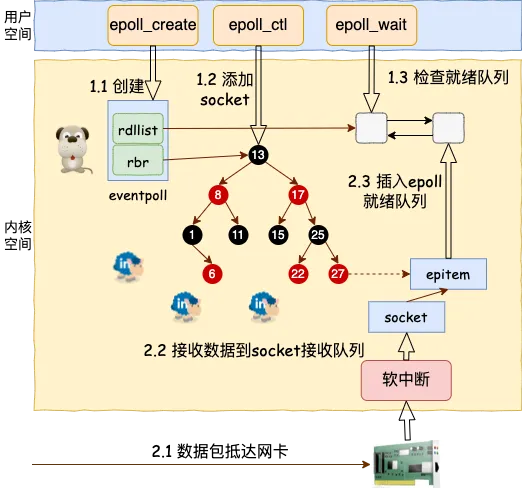
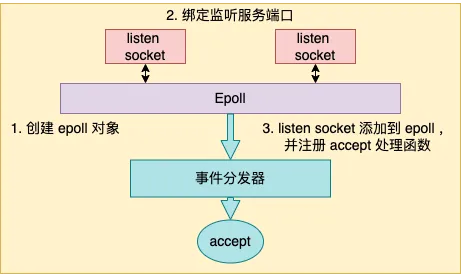
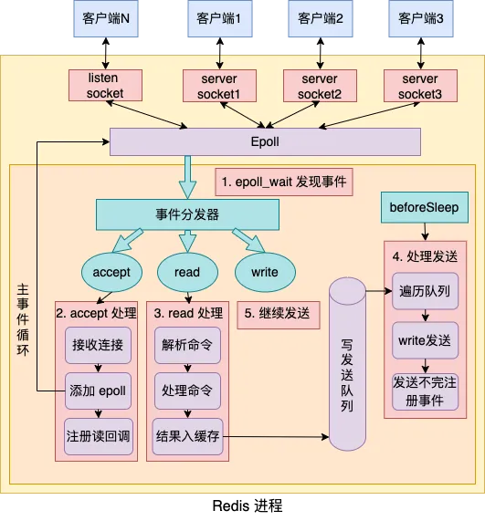
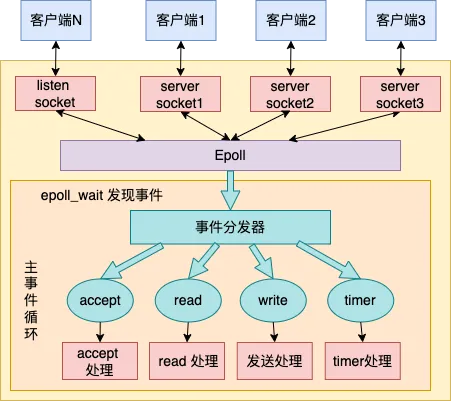
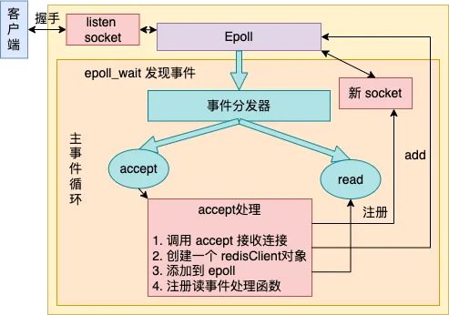
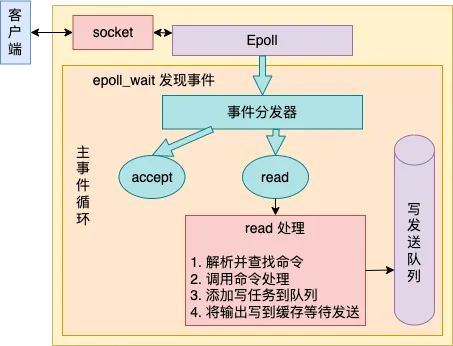
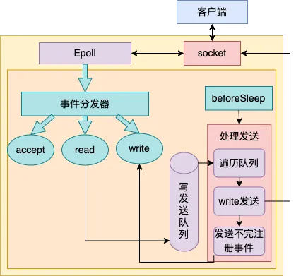
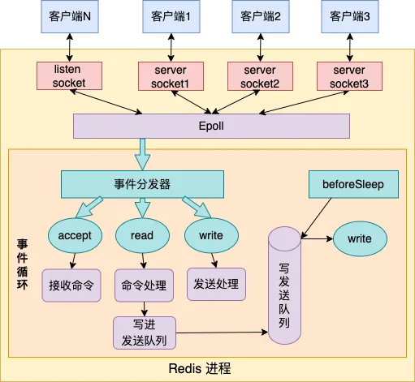

今天就跟大家用 Redis 的源码，带大家分析下单线程的 Redis 如何做到每秒数万 QPS 的超高处理能力的。当然，最好有我上面说的那两篇文章的基础，再来看本篇会比较好点。

今天跟大家分享 Redis 核心网络模块的内部实现，学习下 Redis 是如何做到如此的高性能的！

## 一、理解多路复用原理

在开始介绍 Redis 之前，我想有必要先来简单介绍下 epoll。

在传统的同步阻塞网络编程模型里（没有协程以前），性能上不来的根本原因在于进程线程都是笨重的家伙。让一个进(线)程只处理一个用户请求确确实实是有点浪费了。


先抛开高内存开销不说，在海量的网络请求到来的时候，光是频繁的进程线程上下文就让 CPU 疲于奔命了。  


如果把进程比作牧羊人，一个进(线)程同时只能处理一个用户请求，相当于一个人只能看一只羊，放完这一只才能放下一只。如果同时来了 1000 只羊，那就得 1000 个人去放，这人力成本是非常高的。  


性能提升思路很简单，就是让很多的用户连接来复用同一个进(线)程，这就是**多路复用**。**多路**指的是许许多多个用户的网络连接。**复用**指的是对进(线)程的复用。换到牧羊人的例子里，就是一群羊只要一个牧羊人来处理就行了。  

不过复用实现起来是需要特殊的 socket 事件管理机制的，最典型和高效的方案就是 epoll。放到牧羊人的例子来，epoll 就相当于一只牧羊犬。

在 epoll 的系列函数里， epoll\_create 用于创建一个 epoll 对象，epoll\_ctl 用来给 epoll 对象添加或者删除一个 socket。epoll\_wait 就是查看它当前管理的这些 socket 上有没有可读可写事件发生。



当网卡上收到数据包后，Linux 内核进行一系列的处理后把数据放到 socket 的接收队列。然后会检查是否有 epoll 在管理它，如果是则在 epoll 的就绪队列中插入一个元素。epoll\_wait 的操作就非常的简单了，就是到 epoll 的就绪队列上来查询有没有事件发生就行了。关于 epoll 这只“牧羊犬”的工作原理参见[深入揭秘 epoll 是如何实现 IO 多路复用的] (Javaer 习惯把基于 epoll 的网络开发模型叫做 NIO)  

在基于 epoll 的编程中，和传统的函数调用思路不同的是，我们并不能主动调用某个 API 来处理。因为无法知道我们想要处理的事件啥时候发生。所以只好提前把想要处理的事件的处理函数注册到一个**事件分发器**上去。当事件发生的时候，由这个事件分发器调用回调函数进行处理。这类基于实现注册事件分发器的开发模式也叫 Reactor 模型。

## 二、Redis 服务启动初始化

理解了 epoll 原理后，我们再来实际看 Redis 具体是如何使用 epoll 的。直接在 Github 上就可以非常方便地获取 Redis 的源码。我们切到 5.0.0 版本来看单线程版本的实现（多线程我们改天再讲）。

``` 
# git clone https://github.com/redis/redis
# cd redis
# git checkout -b 5.0.0 5.0.0
```

其中整个 Redis 服务的代码总入口在 src/server.c 文件中，我把入口函数的核心部分摘了出来，如下。

``` c
//file: src/server.c
int main(int argc, char **argv) {
    ......
    // 启动初始化
    initServer();
    // 运行事件处理循环，一直到服务器关闭为止
    aeMain(server.el);
}
```

其实整个 Redis 的工作过程，就只需要理解清楚 main 函数中调用的 initServer 和 aeMain 这两个函数就足够了。

本节中我们重点介绍 initServer，在下一节介绍事件处理循环 aeMain。在 initServer 这个函数内，Redis 做了这么三件重要的事情。



-   创建一个 epoll 对象
    
-   对配置的监听端口进行 listen
    
-   把 listen socket 让 epoll 给管理起来
    

``` c
//file: src/server.c
void initServer() {
    // 2.1.1 创建 epoll
    server.el = aeCreateEventLoop(server.maxclients+CONFIG_FDSET_INCR);

    // 2.1.2 绑定监听服务端口
    listenToPort(server.port,server.ipfd,&server.ipfd_count);

    // 2.1.3 注册 accept 事件处理器
    for (j = 0; j < server.ipfd_count; j++) {
        aeCreateFileEvent(server.el, server.ipfd[j], AE_READABLE,
            acceptTcpHandler,NULL);
    }
    ...
}
```

接下来我们分别来看。

### 2.1 创建 epoll 对象

本小节的逻辑看起来貌似不短，但其实只是创建了一个 epoll 对象出来而已。

创建 epoll 对象的逻辑在 aeCreateEventLoop 中，在创建完后，Redis 将其保存在 redisServer 的 aeEventLoop 成员中，以备后续使用。

``` c
struct redisServer {
    ...
    aeEventLoop *el;
}
```

我们来看 aeCreateEventLoop 详细逻辑。Redis 在操作系统提供的 epoll 对象基础上又封装了一个 eventLoop 出来，所以创建的时候是先申请和创建 eventLoop。

``` c
//file:src/ae.c
aeEventLoop *aeCreateEventLoop(int setsize) {
    aeEventLoop *eventLoop;
    eventLoop = zmalloc(sizeof(*eventLoop);

    //将来的各种回调事件就都会存在这里
    eventLoop->events = zmalloc(sizeof(aeFileEvent)*setsize);
    ......

    aeApiCreate(eventLoop);
    return eventLoop;
}
```

在 eventLoop 里，我们稍微注意一下 eventLoop->events，将来在各种事件注册的时候都会保存到这个数组里。

``` c
//file:src/ae.h
typedef struct aeEventLoop {
    ......
    aeFileEvent *events; /* Registered events */
}
```

具体创建 epoll 的过程在 ae\_epoll.c 文件下的 aeApiCreate 中。在这里，真正调用了 epoll\_create

``` c
//file:src/ae_epoll.c
static int aeApiCreate(aeEventLoop *eventLoop) {
    aeApiState *state = zmalloc(sizeof(aeApiState));
    state->epfd = epoll_create(1024); 
    eventLoop->apidata = state;
    return 0;
}
```

### 2.2 绑定监听服务端口

我们再来看 Redis 中的 listen 过程，它在 listenToPort 函数中。虽然调用链条很长，但其实主要就是执行了个简单 listen 而已。

``` c
//file: src/redis.c
int listenToPort(int port, int *fds, int *count) {
    for (j = 0; j < server.bindaddr_count || j == 0; j++) {
        fds[*count] = anetTcpServer(server.neterr,port,NULL,
                server.tcp_backlog);
    }
}
```

Redis 是支持开启多个端口的，所以在 listenToPort 中我们看到是启用一个循环来调用 anetTcpServer。在 anetTcpServer 中，逐步会展开调用，直到执行到 bind 和 listen 系统调用。

``` c
//file:src/anet.c
int anetTcpServer(char *err, int port, char *bindaddr, int backlog)
{
    return _anetTcpServer(err, port, bindaddr, AF_INET, backlog);
}
static int _anetTcpServer(......)
{
    // 设置端口重用
    anetSetReuseAddr(err,s)
    // 监听
    anetListen(err,s,p->ai_addr,p->ai_addrlen,backlog)
}
static int anetListen(......) {
    bind(s,sa,len);
    listen(s, backlog);
    ......
}
```

### 2.3 注册事件回调函数

我们回头再看一下 initServer，它调用 aeCreateEventLoop 创建了 epoll，调用 listenToPort 进行了服务端口的 bind 和 listen。接着就开始调用 aeCreateFileEvent 来注册一个 accept 事件处理器。

``` c
//file: src/server.c
void initServer() {
    // 2.1.1 创建 epoll
    server.el = aeCreateEventLoop(server.maxclients+CONFIG_FDSET_INCR);

    // 2.1.2 监听服务端口
    listenToPort(server.port,server.ipfd,&server.ipfd_count);

    // 2.1.3 注册 accept 事件处理器
    for (j = 0; j < server.ipfd_count; j++) {
        aeCreateFileEvent(server.el, server.ipfd[j], AE_READABLE,
            acceptTcpHandler,NULL);
    }
    ...
}
```

我们来注意看调用 aeCreateFileEvent 时传的重要参数是 acceptTcpHandler，它表示将来在 listen socket 上有新用户连接到达的时候，该函数将被调用执行。我们来看 aeCreateFileEvent 具体代码。

``` c
//file: src/ae.c
int aeCreateFileEvent(aeEventLoop *eventLoop, int fd, int mask,
        aeFileProc *proc, void *clientData)
{
    // 取出一个文件事件结构
    aeFileEvent *fe = &eventLoop->events[fd];

    // 监听指定 fd 的指定事件
    aeApiAddEvent(eventLoop, fd, mask);

    // 设置文件事件类型，以及事件的处理器
    fe->mask |= mask;
    if (mask & AE_READABLE) fe->rfileProc = proc;
    if (mask & AE_WRITABLE) fe->wfileProc = proc;

    // 私有数据
    fe->clientData = clientData;
}
```

函数 aeCreateFileEvent 一开始，从 eventLoop->events 获取了一个 aeFileEvent 对象。在 2.1 中我们介绍过 eventLoop->events 数组，注册的各种事件处理器会保存在这个地方。

接下来调用 aeApiAddEvent。这个函数其实就是对 epoll\_ctl 的一个封装。主要就是实际执行 epoll\_ctl EPOLL\_CTL\_ADD。

``` c
//file:src/ae_epoll.c
static int aeApiAddEvent(aeEventLoop *eventLoop, int fd, int mask) {
    // add or mod
    int op = eventLoop->events[fd].mask == AE_NONE ?
            EPOLL_CTL_ADD : EPOLL_CTL_MOD;
    ......

    // epoll_ctl 添加事件
    epoll_ctl(state->epfd,op,fd,&ee);
    return 0;
}
```

每一个 eventLoop->events 元素都指向一个 aeFileEvent 对象。在这个对象上，设置了三个关键东西

-   rfileProc：读事件回调
    
-   wfileProc：写事件回调
    
-   clientData：一些额外的扩展数据
    

将来 当 epoll\_wait 发现某个 fd 上有事件发生的时候，这样 redis 首先根据 fd 到 eventLoop->events 中查找 aeFileEvent 对象，然后再看 rfileProc、wfileProc 就可以找到读、写回调处理函数。

回头看 initServer 调用 aeCreateFileEvent 时传参来看。

``` c
//file: src/server.c
void initServer() {
    ......
    // 2.1.3 注册 accept 事件处理器
    for (j = 0; j < server.ipfd_count; j++) {
        aeCreateFileEvent(server.el, server.ipfd[j], AE_READABLE,
            acceptTcpHandler,NULL);
    }
}
```

listen fd 对应的读回调函数 rfileProc 事实上就被设置成了 acceptTcpHandler，写回调没有设置，私有数据 client\_data 也为 null。

## 三、Redis 事件处理循环

在上一节介绍完了 Redis 的启动初始化过程，创建了 epoll，也进行了绑定监听，也注册了 accept 事件处理函数为 acceptTcpHandler。

``` c

//file: src/server.c
int main(int argc, char **argv) {
    ......
    // 启动初始化
    initServer();
    // 运行事件处理循环，一直到服务器关闭为止
    aeMain(server.el);
}
```

接下来，Redis 就会进入 aeMain 开始进行真正的用户请求处理了。在 aeMain 函数中，是一个无休止的循环。在每一次的循环中，要做如下几件事情。



-   通过 epoll\_wait 发现 listen socket 以及其它连接上的可读、可写事件
    
-   若发现 listen socket 上有新连接到达，则接收新连接，并追加到 epoll 中进行管理
    
-   若发现其它 socket 上有命令请求到达，则读取和处理命令，把命令结果写到缓存中，加入写任务队列
    
-   每一次进入 epoll\_wait 前都调用 beforesleep 来将写任务队列中的数据实际进行发送
    
-   如若有首次未发送完毕的，当写事件发生时继续发送
    

``` c

//file:src/ae.c
void aeMain(aeEventLoop *eventLoop) {

    eventLoop->stop = 0;
    while (!eventLoop->stop) {

        // 如果有需要在事件处理前执行的函数，那么运行它
        // 3.4 beforesleep 处理写任务队列并实际发送之
        if (eventLoop->beforesleep != NULL)
            eventLoop->beforesleep(eventLoop);

        // 开始等待事件并处理
        // 3.1 epoll_wait 发现事件
        // 3.2 处理新连接请求
        // 3.3 处理客户连接上的可读事件
        aeProcessEvents(eventLoop, AE_ALL_EVENTS);
    }
}
```

以上就是 aeMain 函数的核心逻辑所在，接下来我们分别对如上提到的四件事情进行详细的阐述。

### 3.1  epoll\_wait 发现事件

Redis 不管有多少个用户连接，都是通过 epoll\_wait 来统一发现和管理其上的可读（包括 liisten socket 上的 accept事件）、可写事件的。甚至连 timer，也都是交给 epoll\_wait 来统一管理的。



每当 epoll\_wait 发现特定的事件发生的时候，就会调用相应的事先注册好的事件处理函数进行处理。我们来详细看 aeProcessEvents 对 epoll\_wait 的封装。

``` c

//file:src/ae.c
int aeProcessEvents(aeEventLoop *eventLoop, int flags)
{
    // 获取最近的时间事件
    tvp = xxx

    // 处理文件事件，阻塞时间由 tvp 决定
    numevents = aeApiPoll(eventLoop, tvp);
    for (j = 0; j < numevents; j++) {
        // 从已就绪数组中获取事件
        aeFileEvent *fe = &eventLoop->events[eventLoop->fired[j].fd];

        //如果是读事件，并且有读回调函数
        fe->rfileProc()

        //如果是写事件，并且有写回调函数
        fe->wfileProc()
    }
}

//file: src/ae_epoll.c
static int aeApiPoll(aeEventLoop *eventLoop, struct timeval *tvp) {
    // 等待事件
    aeApiState *state = eventLoop->apidata;
    epoll_wait(state->epfd,state->events,eventLoop->setsize,
            tvp ? (tvp->tv_sec*1000 + tvp->tv_usec/1000) : -1);
    ...
}
```

aeProcessEvents 就是调用 epoll\_wait 来发现事件。当发现有某个 fd 上事件发生以后，则调为其事先注册的事件处理器函数 rfileProc 和 wfileProc。

### 3.2 处理新连接请求

我们假设现在有新用户连接到达了。前面在我们看到 listen socket 上的 rfileProc 注册的是 acceptTcpHandler。也就是说，如果有连接到达的时候，会回调到 acceptTcpHandler。

在 acceptTcpHandler 中，主要做了几件事情



-   调用 accept 系统调用把用户连接给接收回来
    
-   为这个新连接创建一个唯一 redisClient 对象
    
-   将这个新连接添加到 epoll，并注册一个读事件处理函数
    

接下来让我们看上面这三件事情都分别是如何被处理的。

``` c
//file:src/networking.c
void acceptTcpHandler(aeEventLoop *el, int fd, ...) {
    cfd = anetTcpAccept(server.neterr, fd, cip, ...);
    acceptCommonHandler(cfd,0);
}
```

在 anetTcpAccept 中执行非常的简单，就是调用 accept 把连接接收回来。

``` c
//file: src/anet.c
int anetTcpAccept(......) {
    anetGenericAccept(err,s,(struct sockaddr*)&sa,&salen)
}
static int anetGenericAccept(......) {
    fd = accept(s,sa,len)
}
```

接下来在 acceptCommonHandler 为这个新的客户端连接 socket，创建一个 redisClient 对象。

``` c
//file: src/networking.c
static void acceptCommonHandler(int fd, int flags) {
    // 创建 redisClient 对象
    redisClient *c;
    c = createClient(fd);
    ......
}
```

在 createClient 中，创建 client 对象，并且为该用户连接注册了读事件处理器。

``` c
//file:src/networking.c
redisClient *createClient(int fd) {

    // 为用户连接创建 client 对象
    redisClient *c = zmalloc(sizeof(redisClient));

    if (fd != -1) {
        ...

        // 为用户连接注册读事件处理器
        aeCreateFileEvent(server.el,fd,AE_READABLE,
            readQueryFromClient, c)
    }
    ...
}
```

关于 aeCreateFileEvent 的处理过程这里就不赘述了，详情参见 2.3 节。其效果就是将该用户连接 socket fd 对应的读处理函数设置为 readQueryFromClient, 并且设置私有数据为 redisClient c。

### 3.3 处理客户连接上的可读事件

现在假设该用户连接有命令到达了，就假设用户发送了`GET XXXXXX_KEY` 命令。那么在 Redis 的时间循环中调用 epoll\_wait 发现该连接上有读时间后，会调用在上一节中讨论的为其注册的读处理函数 readQueryFromClient。



在读处理函数 readQueryFromClient 中主要做了这么几件事情。  

-   解析并查找命令
    
-   调用命令处理
    
-   添加写任务到队列
    
-   将输出写到缓存等待发送
    

我们来详细地看 readQueryFromClient 的代码。在 readQueryFromClient 中会调用 processInputBuffer，然后进入 processCommand 对命令进行处理。其调用链如下：

``` c
//file: src/networking.c
void readQueryFromClient(aeEventLoop *el, int fd, void *privdata, ...) {
    redisClient *c = (redisClient*) privdata;
    processInputBufferAndReplicate(c);
}

void processInputBufferAndReplicate(client *c) {
    ...
    processInputBuffer(c);
}

// 处理客户端输入的命令内容
void processInputBuffer(redisClient *c) {
    // 执行命令，
    processCommand(c);
}
```

我们再来详细看 processCommand 。

``` c
//file:
int processCommand(redisClient *c) { 
    // 查找命令，并进行命令合法性检查，以及命令参数个数检查
    c->cmd = c->lastcmd = lookupCommand(c->argv[0]->ptr);

    ......

    // 处理命令
    // 如果是 MULTI 事务，则入队，否则调用 call 直接处理
    if (c->flags & CLIENT_MULTI && ...)
    {
        queueMultiCommand(c);
    } else {
        call(c,CMD_CALL_FULL);
        ...
    }
    return C_OK;
}
```

我们先忽略 queueMultiCommand，直接看核心命令处理方法 call。

``` c
//file:src/server.c
void call(client *c, int flags) {
    // 查找处理命令，
    struct redisCommand *real_cmd = c->cmd;
    // 调用命令处理函数
    c->cmd->proc(c);
    ......
}
```

在 server.c 中定义了每一个命令对应的处理函数

``` c
//file:src/server.c
struct redisCommand redisCommandTable[] = {
    {"module",moduleCommand,-2,"as",0,NULL,0,0,0,0,0},
    {"get",getCommand,2,"rF",0,NULL,1,1,1,0,0},
    {"set",setCommand,-3,"wm",0,NULL,1,1,1,0,0},
    {"setnx",setnxCommand,3,"wmF",0,NULL,1,1,1,0,0},
    {"setex",setexCommand,4,"wm",0,NULL,1,1,1,0,0},
    ......

    {"mget",mgetCommand,-2,"rF",0,NULL,1,-1,1,0,0},
    {"rpush",rpushCommand,-3,"wmF",0,NULL,1,1,1,0,0},
    {"lpush",lpushCommand,-3,"wmF",0,NULL,1,1,1,0,0},
    {"rpushx",rpushxCommand,-3,"wmF",0,NULL,1,1,1,0,0},
    ......
}
```

对于 get 命令来说，其对应的命令处理函数就是 getCommand。也就是说当处理 GET 命令执行到 `c->cmd->proc` 的时候会进入到 getCommand 函数中来。

``` c
//file: src/t_string.c
void getCommand(client *c) {
    getGenericCommand(c);
}
int getGenericCommand(client *c) {
    robj *o;

    if ((o = lookupKeyReadOrReply(c,c->argv[1],shared.null[c->resp])) == NULL)
        return C_OK;
    ...
    addReplyBulk(c,o);
    return C_OK;
}
```

getGenericCommand 方法会调用 lookupKeyReadOrReply 来从内存中查找对应的 key值。如果找不到，则直接返回 C\_OK；如果找到了，调用 addReplyBulk 方法将值添加到输出缓冲区中。

``` c
//file: src/networking.c
void addReplyBulk(client *c, robj *obj) {
    addReplyBulkLen(c,obj);
    addReply(c,obj);
    addReply(c,shared.crlf);
}
```

其主题是调用 addReply 来设置回复数据。在 addReply 方法中做了两件事情：

-   prepareClientToWrite 判断是否需要返回数据，并且将当前 client 添加到等待写返回数据队列中。
    
-   调用 \_addReplyToBuffer 和 \_addReplyObjectToList 方法将返回值写入到输出缓冲区中，等待写入 socekt
    

``` c
//file:src/networking.c
void addReply(client *c, robj *obj) {
    if (prepareClientToWrite(c) != C_OK) return;

    if (sdsEncodedObject(obj)) {
        if (_addReplyToBuffer(c,obj->ptr,sdslen(obj->ptr)) != C_OK)
            _addReplyStringToList(c,obj->ptr,sdslen(obj->ptr));
    } else {
        ......        
    }
}
```

先来看 prepareClientToWrite 的详细实现，

``` c
//file: src/networking.c
int prepareClientToWrite(client *c) {
    ......
    if (!clientHasPendingReplies(c) && !(c->flags & CLIENT_PENDING_READ))
        clientInstallWriteHandler(c);
}

//file:src/networking.c
void clientInstallWriteHandler(client *c) {
    c->flags |= CLIENT_PENDING_WRITE;
    listAddNodeHead(server.clients_pending_write,c);
}
```

其中 server.clients\_pending\_write 就是我们说的任务队列，队列中的每一个元素都是有待写返回数据的 client 对象。在 prepareClientToWrite 函数中，把 client 添加到任务队列 server.clients\_pending\_write 里就算完事。

接下再来 \_addReplyToBuffer，该方法是向固定缓存中写，如果写不下的话就继续调用 \_addReplyStringToList 往链表里写。简单起见，我们只看 \_addReplyToBuffer 的代码。

``` c
//file:src/networking.c
int _addReplyToBuffer(client *c, const char *s, size_t len) {
    ......
    // 拷贝到 client 对象的 Response buffer 中
    memcpy(c->buf+c->bufpos,s,len);
    c->bufpos+=len;
    return C_OK;
}
```

### 3.4 beforesleep 处理写任务队列

回想在 aeMain 函数中，每次在进入 aeProcessEvents 前都需要先进行 beforesleep 处理。这个函数名字起的怪怪的，但实际上大有用处。

``` c
//file:src/ae.c
void aeMain(aeEventLoop *eventLoop) {
    eventLoop->stop = 0;
    while (!eventLoop->stop) {
        // beforesleep 处理写任务队列并实际发送之
        if (eventLoop->beforesleep != NULL)
            eventLoop->beforesleep(eventLoop);

        aeProcessEvents(eventLoop, AE_ALL_EVENTS);
    }
}
```

该函数处理了许多工作，其中一项便是遍历发送任务队列，并将 client 发送缓存区中的处理结果通过 write 发送到客户端手中。



我们来看下 beforeSleep 的实际源码。  

``` c
//file:src/server.c
void beforeSleep(struct aeEventLoop *eventLoop) {
    ......
    handleClientsWithPendingWrites();
}
```

``` c
//file:src/networking.c
int handleClientsWithPendingWrites(void) {
    listIter li;
    listNode *ln;
    int processed = listLength(server.clients_pending_write);

    //遍历写任务队列 server.clients_pending_write
    listRewind(server.clients_pending_write,&li);
    while((ln = listNext(&li))) {
        client *c = listNodeValue(ln);
        c->flags &= ~CLIENT_PENDING_WRITE;
        listDelNode(server.clients_pending_write,ln);

        //实际将 client 中的结果数据发送出去
        writeToClient(c->fd,c,0)

        //如果一次发送不完则准备下一次发送
        if (clientHasPendingReplies(c)) {
            //注册一个写事件处理器，等待 epoll_wait 发现可写后再处理 
            aeCreateFileEvent(server.el, c->fd, ae_flags,
                sendReplyToClient, c);
        }
        ......
    }
}
```

在 handleClientsWithPendingWrites 中，遍历了发送任务队列 server.clients\_pending\_write，并调用 writeToClient 进行实际的发送处理。

值得注意的是，发送 write 并不总是能一次性发送完的。假如要发送的结果太大，而系统为每个 socket 设置的发送缓存区又是有限的。

在这种情况下，clientHasPendingReplies 判断仍然有未发送完的数据的话，就需要注册一个写事件处理函数到 epoll 上。等待 epoll 发现该 socket 可写的时候再次调用 sendReplyToClient进行发送。

``` c
//file:src/networking.c
int writeToClient(int fd, client *c, int handler_installed) {
    while(clientHasPendingReplies(c)) {
        // 先发送固定缓冲区
        if (c->bufpos > 0) {
            nwritten = write(fd,c->buf+c->sentlen,c->bufpos-c->sentlen);
            if (nwritten <= 0) break;
            ......

        // 再发送回复链表中数据
        } else {
            o = listNodeValue(listFirst(c->reply));
            nwritten = write(fd, o->buf + c->sentlen, objlen - c->sentlen);
            ......
        }
    }
}
```

writeToClient 中的主要逻辑就是调用 write 系统调用让内核帮其把数据发送出去即可。由于每个命令的处理结果大小是不固定的。所以 Redis 采用的做法用固定的 buf + 可变链表来储存结果字符串。这里自然发送的时候就需要分别对固定缓存区和链表来进行发送了。

## 四、高性能 Redis 网络原理总结

Redis 服务器端只需要单线程可以达到非常高的处理能力，每秒可以达到数万 QPS 的高处理能力。如此高性能的程序其实就是对 Linux 提供的多路复用机制 epoll 的一个较为完美的运用而已。

在 Redis 源码中，核心逻辑其实就是两个，一个是 initServer 启动服务，另外一个就是 aeMain 事件循环。把这两个函数弄懂了，Redis 就吃透一大半了。

``` c
//file: src/server.c
int main(int argc, char **argv) {
    ......
    // 启动初始化
    initServer();
    // 运行事件处理循环，一直到服务器关闭为止
    aeMain(server.el);
}
```


在 initServer 这个函数内，Redis 做了这么三件重要的事情。

-   创建一个 epoll 对象
    
-   对配置的监听端口进行 listen
    
-   把 listen socket 让 epoll 给管理起来
    

在 aeMain 函数中，是一个无休止的循环，它是 Redis 中最重要的部分。在每一次的循环中，要做的事情可以总结为如下图。



-   通过 epoll\_wait 发现 listen socket 以及其它连接上的可读、可写事件
    
-   若发现 listen socket 上有新连接到达，则接收新连接，并追加到 epoll 中进行管理
    
-   若发现其它 socket 上有命令请求到达，则读取和处理命令，把命令结果写到缓存中，加入写任务队列
    
-   每一次进入 epoll\_wait 前都调用 beforesleep 来将写任务队列中的数据实际进行发送
    

其实事件分发器还处理了一个不明显的逻辑，那就是如果 beforesleep 在将结果写回给客户端的时候，如果由于内核 socket 发送缓存区过小而导致不能一次发送完毕的时候，也会注册一个写事件处理器。等到 epoll\_wait 发现对应的 socket 可写的时候，再执行 write 写处理。

整个 Redis 的网络核心模块就在咱们这一篇文章中都叙述透了（剩下的 Redis 就是对各种数据结构的建立和处理了）。相信吃透这一篇对于你对网络编程的理解会有极大的帮助！