**写在前面**

主要参考：https://github.com/yunlzheng/prometheus-book

本文档主要分为两部分，分别讲解PromQL和Grafana的基础使用，在阅读PromQL部分时，建议不要联想Grafana中要怎么使用这些查询表达式，又是怎么根据查询结果绘图的，因为PromQL对于Grafana来说和SQL并没有区别，都是查询出结果，然后根据各种指定配置进行绘图，所以阅读和理解PromQL部分，应关注查询结果是什么样的，不要关注这些结果在Grafana中是怎么绘图的。

### 1、理解时间序列

#### 1.1指标

 指标就是要监控的目标。

 在形式上，所有的指标(Metric)都通过如下格式标示：

    <metric name>{<label name>=<label value>, ...}


 指标名称(metric name)一般反映被监控样本的含义（比如，`http_request_total` - 表示当前系统接收到的HTTP请求总量）。

 标签(label)反映了当前样本的特征维度，通过这些维度可以对样本数据进行过滤，聚合等。

#### 1.2样本

 Prometheus会定时到指定的Exportor上**pull**当前的**样本数据**，然后根据pull的时间以**时间序列**的方式保存在内存数据库中，并且定时持久化到硬盘上，Exportor只维护指标的值。每条时间序列由指标名称(metrics)和一组标签集(labelset)确定并命令，也就是说一个指标名称可能对应很多条时间序列。

 可以将时间序列理解为一个以时间为轴的矩阵，如下所示，有三个时间序列在时间轴上分别对应不同的值：

      ^
      │     . . . . . . . . . .   node_cpu{cpu="cpu0",mode="idle"}
      │     . . . . . . . . . .   node_cpu{cpu="cpu0",mode="system"}
      │     . . . . . . . . . .   node_load1{}
      v
        <------- 时间 ---------->


 每一个点称为一个**样本**（sample），样本由以下三部分组成：

- **指标**(metric)：metric name和描述当前样本特征的labelsets;

- **时间戳**(timestamp)：一个精确到毫秒的时间戳;

-   **值**(value)：表示该时间的样本的值。

    ``` 
    <--------------- metric ---------------------><-timestamp -><-value->
    http_request_total{status="200", method="GET"}@1434417560938 => 94355
    http_request_total{status="200", method="GET"}@1434417561287 => 94334
    http_request_total{status="404", method="GET"}@1434417560938 => 38473
    http_request_total{status="404", method="GET"}@1434417561287 => 38544
    http_request_total{status="200", method="POST"}@1434417560938 => 4748
    http_request_total{status="200", method="POST"}@1434417561287 => 4785
    ```

 所以查询值的where条件就是指标、标签和时间戳（区间）。

### 2、查询语法

#### 2.1指标查询（瞬时向量查询）

通过指标名称和标签进行查询，可以查询该指标下的所有时间序列距离当前系统时间**最新的值**，无时间概念，所以查询的结果称为瞬时向量（instant vector），如下图所示：

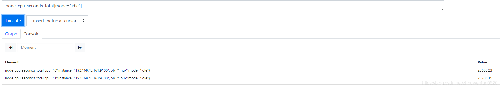

而且可以看到查询到的多条时间序列都包含指定的标签。单独使用指标名称，相当于不使用标签进行过滤，同样独

单使用标签查询也可以。

标签过滤支持使用`=`和`!=`两种完全匹配模式：

-   通过使用`label=value`可以选择那些标签满足表达式定义的时间序列；
-   反之使用`label!=value`则可以根据标签匹配排除时间序列；

除了使用完全匹配的方式对时间序列进行过滤以外，还支持使用正则表达式作为匹配条件，多个正则表达式之间使用`|`进行分离：

-   使用`label=~regx`表示选择符合正则表达式定义的时间序列；
-   反之使用`label=!~regx`进行反向选择；

例如，如果想查询多个环境下的请求数统计，可以使用如下表达式：

    http_requests_total{environment=~"prodect|test|development",method!="GET"}


每个正则表达式就是简单的字符串。

#### 2.2时间范围查询（区间向量查询）

 如果我们想过去一段时间范围内的样本数据时，我们则需要使用**区间向量表达式**。区间向量表达式和瞬时向量表达式之间的差异在于需要定义时间范围，通过时间范围选择器`[]`进行定义。例如查询距离当前系统时间最近5分钟内的**所有样本数据**：

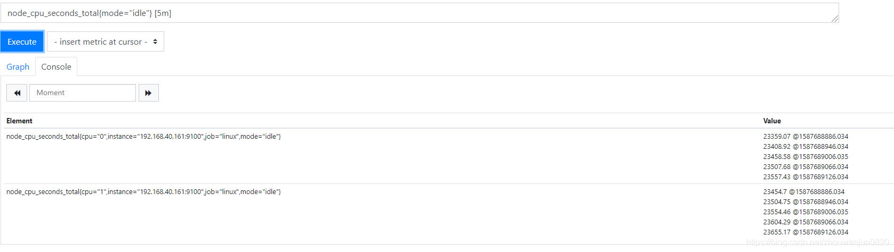

可以看到结果中每个时间序列都有5个值并且@了不同的时间戳（因为该prometheus每分钟pull一次，所以5分钟有5个结果）。

除了使用m表示分钟以外，PromQL的时间范围选择器支持其它时间单位：

-   s - 秒
-   m - 分钟
-   h - 小时
-   d - 天
-   w - 周
-   y - 年

#### 2.3时间位移

在瞬时向量表达式或者区间向量表达式中，都是以prometheus当前系统时间为基准进行查询：

    http_request_total{} # 瞬时向量表达式，选择当前最新的数据
    http_request_total{}[5m] # 区间向量表达式，选择以当前时间为基准过去5分钟内的所有数据


而如果我们想查询5分钟之前的最新数据，或者想查询昨天的所有数据呢?

这个时候我们就可以使用位移操作，位移操作的关键字为**offset**，例如：

     http_request_total{} offset 5m
     http_request_total{}[1d] offset 1d


#### 2.4操作符

除了能够方便的查询和过滤时间序列以外，还支持丰富的操作符，用户可以使用这些操作符进一步的对事件序列进行二次加工。这些操作符包括：数学运算符，逻辑运算符，布尔运算符等等。

##### **数学运算符**

操作数可以是一个常数，也可以是一个查询表达式，比如：

> bet\_amount\_total / 100 : bet\_amount是投注金额的总计，经常单位是分，为了转成元，可以除以100
>
> http\_requests\_total{api=“/bet“} + http\_requests\_total{api=”/login“} 计算投注和登录请求的和

支持的所有数学运算符如下所示：

-   `+` (加法)
-   `-` (减法)
-   `*` (乘法)
-   `/` (除法)
-   `%` (求余)
-   `^` (幂运算)

##### **布尔运算符**

通过布尔运算对时间序列进行过滤，例如如下想查询node\_cpu\_seconds\_total{mode=“idle”} > 22000的时间序列，不大于的时间序列会被过滤掉。

过滤前：

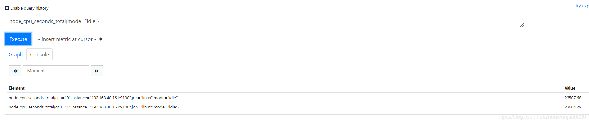

过滤后：

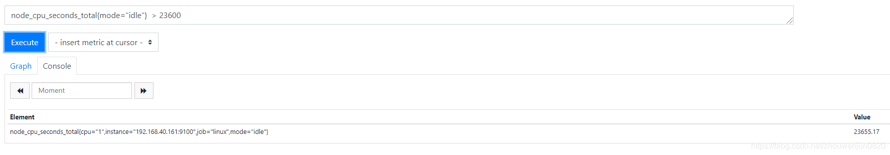

目前，Prometheus支持以下布尔运算符如下：

-   `==` (相等)
-   `!=` (不相等)
-   `>` (大于)
-   `<` (小于)
-   `>=` (大于等于)
-   `<=` (小于

**获取布尔运算结果**

布尔运算的默认行为是对时间序列进行过滤。而有时候我们需要的是的运算结果。例如，只需要知道当前HTTP请求量是否>=1000，如果大于等于1000则返回1否则返回0。这时可以使用bool修饰符改变布尔运算的默认行为。 例如：

    http_requests_total > bool 1000

使用bool修饰符后，布尔运算不会对时间序列进行过滤，而是直接依次对各个样本数据进行比较，结果是0或者1。从而形成一条新的时间序列，如下图value等于0或者1： 

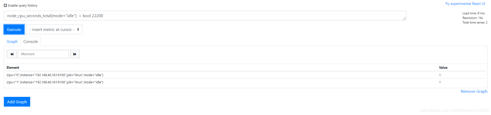

#### 2.5聚合函数

查询可能会返回多条满足指定标签的时间序列，可是有时候我们并不希望分开查看，恰恰大多数情况其实是想查询一条时间序列的结果，例如查询请求总数时想要的结果是：

> http\_requests\_total{} 170

而并不是想要：

> http\_requests\_total{environment="product“} 30
>
> http\_requests\_total{environment="test“} 60
>
> http\_requests\_total{environment="developement“} 80

为了实现这个需求，PromQL提供的聚合操作可以用来对这些时间序列进行处理，**通过处理形成一条新的时间序列**，上述需求的表达式应该是：sum(http\_requests\_total)，例如下图会自动将所有时间序列的值相加后形成一条新的时间序列作为结果。 

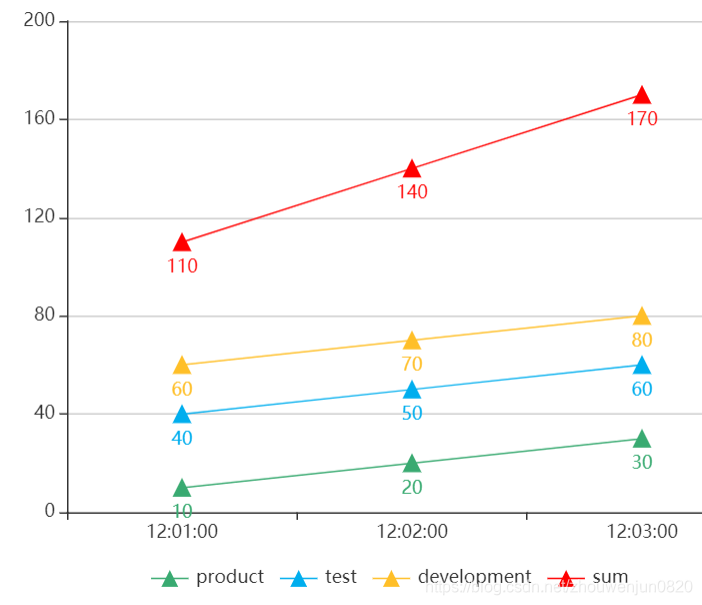 


sum函数非常常用，因为常常不知道查询到时间序列究竟又多少条，注意不要再误认为sum是求指标在某个时间段的和。

有下面这些聚合操作符：

-   sum：求和。
-   min：最小值。
-   max：最大值
-   avg：平均值
-   stddev：标准差
-   stdvar：方差
-   count：元素个数
-   count\_values：等于某值的元素个数
-   bottomk：最小的 k 个元素
-   topk：最大的 k 个元素
-   quantile：分位数

**部分聚合**

有时候，聚合并不想完全聚合，想根据某个标签进行区分时候，可以使用by进行拆分，比如监控每个cpu累计的空闲时间：sum(node\_cpu\_seconds\_total{mode=“idle”} )by (cpu)，并设置了时间序列的名称模式为：cpu-{{cpu}}

图示： 

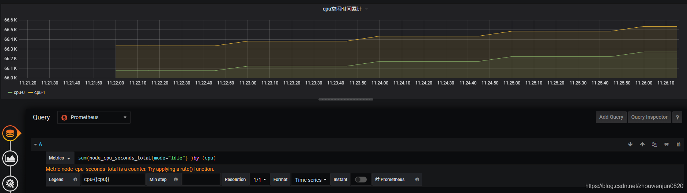

#### 2.6内置函数

为了方便查询，Prometheus 内置了一些函数来辅助计算，下面介绍一些典型的。

-   instant-vector abs(instant-vector)：绝对值
-   instant-vector sqrt(instant-vector))：平方根
-   instant-vector exp(instant-vector )：指数计算
-   instant-vector ln(instant-vector )：自然对数
-   instant-vector ceil(instant-vector )：向上取整
-   instant-vector floor(instant-vector )：向下取整
-   instant-vector round(instant-vector )：四舍五入取整
-   instant-vector delta(**range-vector**)：计算区间向量里最大最小的差值
-   instant-vector increase(**range-vector**)：计算区间向量里最后一个值和第一个值的差值
-   instant-vector rate(**range-vector**)：计算区间向量里的平均增长率

然而在实际使用中，发现increase函数计算有误差，比如一分钟的前值和后值分别是1和183，差值应该是182，但是increase( m e t r i c \[ 1 m \] ) 的结果是 185 ，使用 {metric}\[1m\])的结果是185，使用 metric\[1m\])的结果是185，使用{metric} - ${metric} offset 1的结果却是正确的182。误差原因目前还没有确定。

以下函数允许随着时间的推移聚合给定范围向量的每个序列，并返回具有每个序列聚合结果的即时向量：

-   avg\_over\_time(range-vector)：指定间隔内所有点的平均值。
-   min\_over\_time(range-vector)：指定间隔中所有点的最小值。
-   max\_over\_time(range-vector)：指定间隔内所有点的最大值。
-   sum\_over\_time(range-vector)：指定时间间隔内所有值的总和。

### 3、指标分类(了解)

Prometheus根据目标功能和内容的不同，把指标分了4种类型(metric type)：Counter（计数器）、Gauge（仪表盘）、Histogram（直方图）、Summary（摘要）；**但是本质上都是指标，都是时间序列**，只是进行了简单的分类，更方便理解和沟通。

#### 3.1Counter：只增不减的计数器

Counter类型的指标其工作方式和计数器一样，只增不减（除非系统发生重置）。常见的监控指标，如http\_requests\_total，node\_cpu都是Counter类型的监控指标。

Counter是一个简单但有强大的工具，例如我们可以在应用程序中记录某些事件发生的次数，通过以时序的形式存储这些数据，我们可以轻松的了解该事件产生速率的变化。PromQL内置的聚合函数可以用户对这些数据进行进一步的分析：

例如，通过rate()函数获取HTTP请求量的增长率：

    rate(http_requests_total[5m])


查询当前系统中，访问量前10的HTTP地址：

    topk(10, http_requests_total)


#### 3.2Gauge：可增可减的仪表盘

与Counter不同，Gauge类型的指标侧重于反应系统的**当前状态**。因此这类指标的样本数据可增可减。常见指标如：node\_memory\_MemFree（主机当前空闲的内容大小）、node\_memory\_MemAvailable（可用内存大小）都是Gauge类型的监控指标。

通过Gauge指标，用户可以直接查看系统的当前状态：

    node_memory_MemFree


对于Gauge类型的监控指标，通过PromQL内置函数delta()可以获取样本在一段时间返回内的变化情况。例如，计算CPU温度在两个小时内的差异：

    delta(cpu_temp_celsius{host="zeus"}[2h])


#### 3.3Histogram和Summary：数据分布

除了Counter和Gauge类型的监控指标以外，Prometheus还定义分别定义Histogram和Summary的指标类型，主用用于统计和分析样本的分布情况。

在大多数情况下，我们都倾向于使用某些量化指标的平均值，例如CPU的平均使用率、页面的平均响应时间。这种方式的问题很明显，以系统API调用的平均响应时间为例：如果大多数API请求都维持在100ms的响应时间范围内，而个别请求的响应时间需要5s，那么就会导致某些WEB页面的响应时间落到中位数的情况，而这种现象被称为长尾问题。

为了区分是平均的慢还是长尾的慢，最简单的方式就是按照请求延迟的范围进行分组。例如，统计延迟在010ms之间的请求数有多少而1020ms之间的请求数又有多少。通过这种方式可以快速分析系统慢的原因。Histogram和Summary都是为了能够解决这样问题的存在，通过Histogram和Summary类型的监控指标，我们可以快速了解监控样本的分布情况。

例如，Prometheus自身监控的指标【prometheus\_tsdb\_wal\_fsync\_duration\_seconds】的指标类型为Summary。 它记录了Prometheus Server中wal\_fsync操作的耗时，通过访问Prometheus Server的/metrics地址，可以获取到以下监控样本数据（当前时间的样本）：

    # HELP prometheus_tsdb_wal_fsync_duration_seconds Duration of WAL fsync.
    # TYPE prometheus_tsdb_wal_fsync_duration_seconds summary
    prometheus_tsdb_wal_fsync_duration_seconds{quantile="0.5"} 0.012352463
    prometheus_tsdb_wal_fsync_duration_seconds{quantile="0.9"} 0.014458005
    prometheus_tsdb_wal_fsync_duration_seconds{quantile="0.99"} 0.017316173
    prometheus_tsdb_wal_fsync_duration_seconds_sum 2.888716127000002
    prometheus_tsdb_wal_fsync_duration_seconds_count 216


从上面的样本中可以得知当前Prometheus Server进行wal\_fsync操作的总次数为216次，总耗时为2.888716127000002s，并且50%操作耗时不超过0.012352463秒，90%的操作耗时不超过0.014458005s，99%的操作耗时不超过0.017316173s。

在Prometheus自身监控中，我们还能找到类型为Histogram的监控指标：prometheus\_tsdb\_compaction\_chunk\_range\_bucket。

    # HELP prometheus_tsdb_compaction_chunk_range Final time range of chunks on their first compaction
    # TYPE prometheus_tsdb_compaction_chunk_range histogram
    prometheus_tsdb_compaction_chunk_range_bucket{le="100"} 0
    prometheus_tsdb_compaction_chunk_range_bucket{le="400"} 0
    prometheus_tsdb_compaction_chunk_range_bucket{le="1600"} 0
    prometheus_tsdb_compaction_chunk_range_bucket{le="6400"} 0
    prometheus_tsdb_compaction_chunk_range_bucket{le="25600"} 0
    prometheus_tsdb_compaction_chunk_range_bucket{le="102400"} 0
    prometheus_tsdb_compaction_chunk_range_bucket{le="409600"} 0
    prometheus_tsdb_compaction_chunk_range_bucket{le="1.6384e+06"} 260
    prometheus_tsdb_compaction_chunk_range_bucket{le="6.5536e+06"} 780
    prometheus_tsdb_compaction_chunk_range_bucket{le="2.62144e+07"} 780
    prometheus_tsdb_compaction_chunk_range_bucket{le="+Inf"} 780
    prometheus_tsdb_compaction_chunk_range_sum 1.1540798e+09
    prometheus_tsdb_compaction_chunk_range_count 780


从上面的样本中可以得知当前Prometheus Server tsdb数据库的压缩后数据库共有780个，总大小是1.1540798e+09，小于等于100/400/1600/…/409600的有0

与Summary类型的指标相似之处在于Histogram类型的样本同样会反应当前指标的记录的总数(以\_count作为后缀)以及其值的总量（以\_sum作为后缀）。不同在于Histogram指标直接反应了在不同区间内样本的个数，区间通过标签len进行定义。

同时对于Histogram的指标，我们还可以通过histogram\_quantile()函数计算出其值的分位数。和Summary不同在于Histogram通过histogram\_quantile函数在服务器端计算的分位数，即prometheus计算； 而Sumamry的分位数则是由客户端计算，prometheus直接pull即可。因此对于分位数的计算而言，Summary在通过PromQL进行查询时有更好的性能表现，而Histogram则会消耗更多的资源；反之对于客户端而言Histogram消耗的资源更少。

    # 查询 prometheus_tsdb_compaction_chunk_range 95 百分位
    
    histogram_quantile(0.95, prometheus_tsdb_compaction_chunk_range_bucket)


### 4、HTTP API

#### 4.1Grafana查询报错

比如想在Grafana绘制折线图（Graph），因为需要很多时间点的值，似乎应该使用时间范围查询或者说是区间查询，因为指标查询（瞬时查询）只能查询的当前的最新值，让我们试一试： 
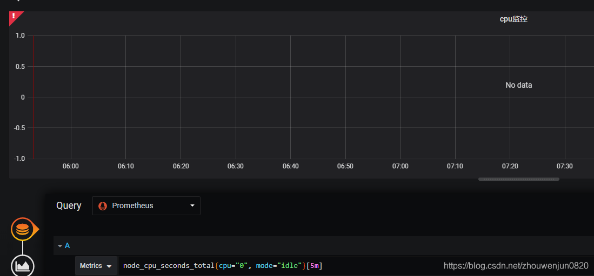
红色叹号错误提示：

> “invalid expression type “range vector” for range query, must be Scalar or instant Vector”

非法的表达式类型：区间向量用于区间查询，必须是标量（常数）或者瞬时向量。

这是因为在Grafana查询需要调用prometheus的http api，所以首先了解prometheus的http api是什么？

#### 4.query

通过使用如下API我们可以查询**PromQL表达式**在指定**时间点**下的计算结果。

    GET /api/v1/query


URL请求参数：

-   query=：PromQL表达式。
-   time=：指定时间戳。可选参数，默认情况下使用Prometheus当前系统时间。

例如：

    $ curl 'http://192.168.40.161:9090/api/v1/query?query=node_cpu_seconds_total{mode="idle"}&time=1587690566.034'
    {
      "status": "success",
      "data": {
        "resultType": "vector",
        "result": [
          {
            "metric": {
              "__name__": "node_cpu_seconds_total",
              "cpu": "0",
              "instance": "192.168.40.161:9100",
              "job": "linux",
              "mode": "idle"
            },
            "value": [
              1587690566.034,
              "24745.92"
            ]
          },
          {
            "metric": {
              "__name__": "node_cpu_seconds_total",
              "cpu": "1",
              "instance": "192.168.40.161:9100",
              "job": "linux",
              "mode": "idle"
            },
            "value": [
              1587690566.034,
              "24846.7"
            ]
          }
        ]
      }
    }


**响应数据类型**

当API调用成功后，Prometheus会返回JSON格式的响应内容，格式如上小节所示。并且在data节点中返回查询结果。data节点格式如下：

    {
      "resultType": "matrix" | "vector",
      "result": <value>
    }


PromQL表达式可能返回多种数据类型，在响应内容中使用resultType表示当前返回的数据类型，包括：

-   瞬时向量：vector

当返回数据类型resultType为vector时，result响应格式如下：

    [
      {
        "metric": { "<label_name>": "<label_value>", ... },
        "value": [ <unix_time>, "<sample_value>" ]
      },
      ...
    ]


其中metrics表示当前时间序列的特征维度，value只包含一个**唯一的**样本。

-   区间向量：matrix

当返回数据类型resultType为matrix时，result响应格式如下：

    [
      {
        "metric": { "<label_name>": "<label_value>", ... },
        "values": [ [ <unix_time>, "<sample_value>" ], ... ]
      },
      ...
    ]


其中metrics表示当前时间序列的特征维度，values包含当前事件序列的**一组**样本，例如：

    $ curl 'http://192.168.40.161:9090/api/v1/query?query=node_cpu_seconds_total{mode="idle"}[5m]&time=1587690566.034'
    
    {
      "status": "success",
      "data": {
        "resultType": "matrix",
        "result": [
          {
            "metric": {
              "__name__": "node_cpu_seconds_total",
              "cpu": "0",
              "instance": "192.168.40.161:9100",
              "job": "linux",
              "mode": "idle"
            },
            "values": [
              [
                1587690266.034,
                "24499.47"
              ],
              [
                1587690326.034,
                "24548.82"
              ],
              [
                1587690386.034,
                "24598.17"
              ],
              [
                1587690446.034,
                "24648.21"
              ],
              [
                1587690506.034,
                "24697.37"
              ],
              [
                1587690566.034,
                "24745.92"
              ]
            ]
          },
          {
            "metric": {
              "__name__": "node_cpu_seconds_total",
              "cpu": "1",
              "instance": "192.168.40.161:9100",
              "job": "linux",
              "mode": "idle"
            },
            "values": [
              [
                1587690266.034,
                "24600.32"
              ],
              [
                1587690326.034,
                "24649.97"
              ],
              [
                1587690386.034,
                "24698.96"
              ],
              [
                1587690446.034,
                "24747.99"
              ],
              [
                1587690506.034,
                "24797.52"
              ],
              [
                1587690566.034,
                "24846.7"
              ]
            ]
          }
        ]
      }
    }


#### 4.3query\_range

使用如下API，我们可以查询**PromQL表达式**在**一段时间**内的数据。

    GET /api/v1/query_range


URL请求参数：

-   query=: PromQL表达式。
-   start=: 起始时间。
-   end=: 结束时间。
-   step=: 查询步长。

返回结果一定是一个区间向量：

    {
      "resultType": "matrix",
      "result": <value>
    }


比如

    $ curl 'http://192.168.40.161:9090/api/v1/query_range?query=node_cpu_seconds_total{mode="idle"}&start=1587693926.035&end=1587694166.034&step=2m'
    
    {
      "status": "success",
      "data": {
        "resultType": "matrix",
        "result": [
          {
            "metric": {
              "__name__": "node_cpu_seconds_total",
              "cpu": "0",
              "instance": "192.168.40.161:9100",
              "job": "linux",
              "mode": "idle"
            },
            "values": [
              [
                1587693926.035,
                "27510.45"
              ],
              [
                1587694046.035,
                "27607.39"
              ]
            ]
          },
          {
            "metric": {
              "__name__": "node_cpu_seconds_total",
              "cpu": "1",
              "instance": "192.168.40.161:9100",
              "job": "linux",
              "mode": "idle"
            },
            "values": [
              [
                1587693926.035,
                "27645.27"
              ],
              [
                1587694046.035,
                "27743.97"
              ]
            ]
          }
        ]
      }
    }


​    

**需要注意的是，只能使用瞬时向量类型的表达式**

这是因为区间数据查询实现，首先根据时间范围和步长计算时间点集合，比如

start=1s & end=60s & setp=10s,

那么时间点集合是：1s 、11s、21s、31s、41s、51s

因为下一个时间点应该是61s，不在时间范围内。

然后查询**距离每个时间点最近的值**作为该时间点的值。

而如果使用区间向量表达式，那么每个时间点计算结果将是一个区间，而目标查询结果也是区间，并且两个区间的含义不相同，所以无法融合在一块。

#### 4.4Grafana报错原因

Grafana默认调用的api是query\_range api，可通过【Query Inspector】按钮展开查询请求和结果，如下图： 

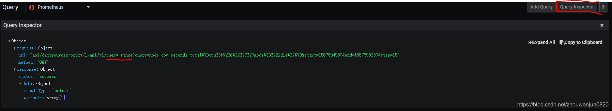

所以Graph中不能直接使用区间向量查询，而应该使用瞬时向量，然后调用区间数据查询API来查询指定时间范围的值（时间范围是Grafana面板右上角选择的时间范围，步长默认15秒，可通过Min step设置）。  

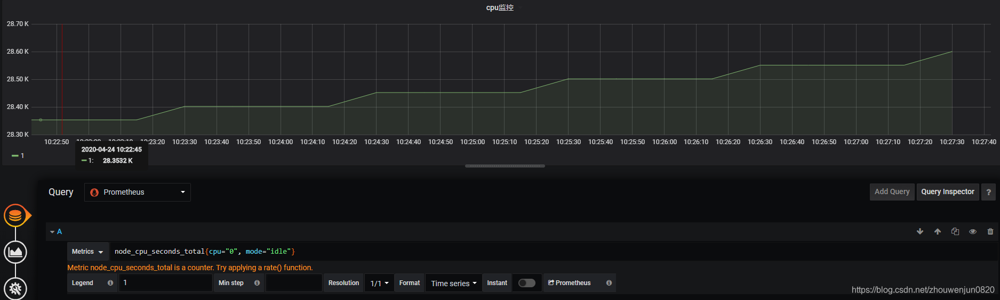

Graph通过查询结果中的各个时间点的值绘制成线。 
可以通过开启Instant开关，使Grafana调用瞬时数据查询API，例如： 

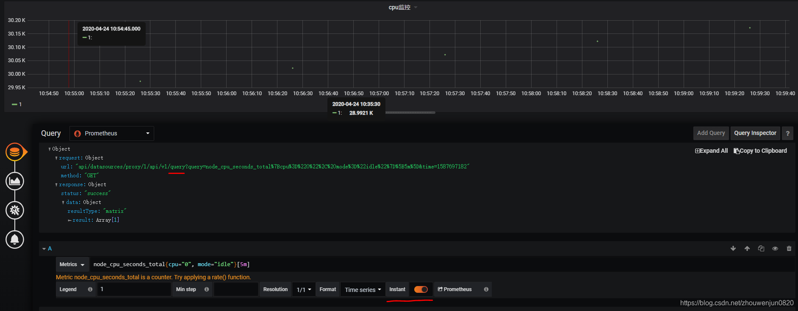

可以看到api改成了query，并且prometheus返回了5个时间点的值，此时Graph不会连接成线。

#### 4.5区间向量的应用

前面说到通过瞬时向量查询+query\_rangw API可以查询到指定时间范围的值，那么区间向量查询似乎没啥用了？  

区间向量可用于计算某个时间点的附近的状态，通过内置函数可以将区间向量转成瞬时向量，就能用在Graph图中了；比如返回时间范围内中每个时间点的过去1分钟内 HTTP 请求数：increase(http\_requests\_total\[1m\])

### 5、Grafana配置方法

通过前面的学习，我们知道如何编写Prometheus查询表达式，也知道Grafana通过调用HTTP API接口来查询时间序列的，可能查到很多条时间序列，查询结果中每个时间序列可能只有最新的值，也可能包含一个时间范围内很多个值。接下来，讲解Grafana提供了那些数据展示方法，以及如何使用查询结构。

#### 5.1Graph

Graph默认以时间为X轴展示所有查询到的时间序列，如下图所示，查询到两条时间序列：  

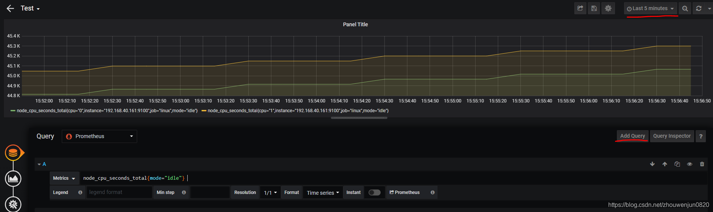  

右上角按钮【Last 5 minutes】指定时间范围，可以改为其他的时间范围。注意这里的Last 5 Time的时间基准是Grafana页面所在PC机的当前时间，如果PC机的时间异常，可能查询到的并不是目标时间范围的数据,比如系统当前时间是12:05:00，那么Last 5 minutes的时间范围会转换成：start=12:00:00&end=12:05:00。具体的请求和响应信息，可以通过按钮【Query Inspector】展示。

通过按钮【Add Query】可以添加查询表达式，需要注意的是一条查询语句可以展示多条线，这取决于查询结果中有多少条时间序列。

通过指定【Min step】可以修改步长，可以改变查询结果中时间点的密度，即步长越大，则相同时间范围的时间点就越少，密度就越小，那么折线可能更陡峭。

#### 5.2SingleStat

显示查询结果中最新的**一个**值，查询结果不能包含多条时间序列，否者提示错误。如果未开启Instant，则可显示指定时间范围内的变化曲线，如果开启Instant则仅显示一个数值；  

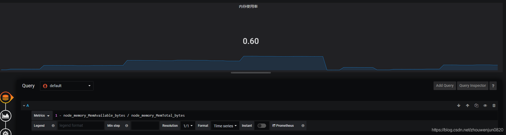

支持设置阈值来显示不同的颜色，例如大于0.5显示红色： 

 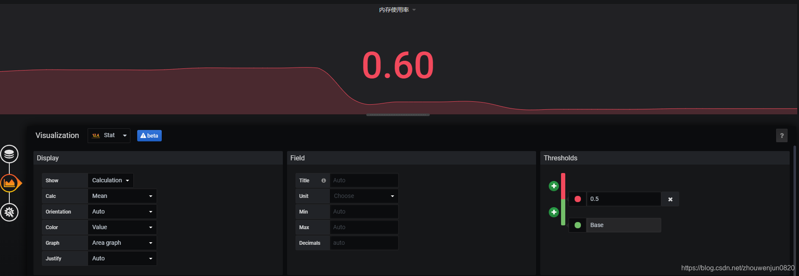

Stat和SingStat基本一样，不同的是Stat支持查询并显示多条时间序列的变化曲线和值。

#### 5.4Gauge


和SingleStat一样，也是显示查询结果中最新的**一个**值，支持一次查询多条时间序列，例如下图一个表达式返回两条时间序列： 

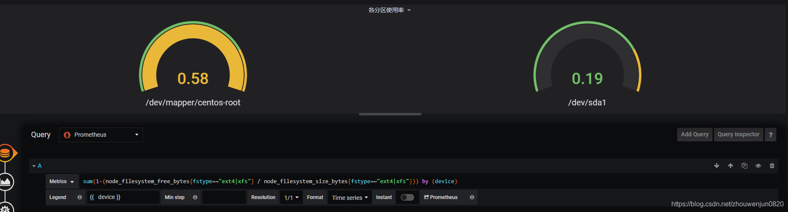

也可以设置阈值来显示不同的颜色，例如上图小于0.5时显示绿色，大于0.5时内边填充黄色，更加醒目，并且在仪表盘的边上根据值的分布动态显示绿色和黄色的比例。

#### 5.5Table

默认情况下，表格显示所有时间序列在不同时间点上的值，最左列是时间戳对应的时间，后边就是所有指标对用的值： 

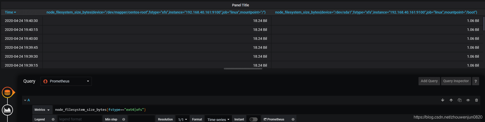

如果开启Instant，则只显示最新的时间戳和最新的值：

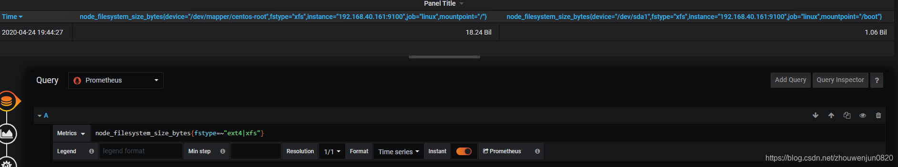

可通过【Column Styles】对列进行设置：

（1）隐藏列：设置列的Type是Hidden 

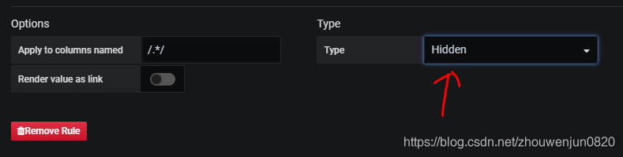

(2)设置列的值：比如设置某列为查询表达式B的值，设置名称正则【Apply to columns named】为 Value #B  

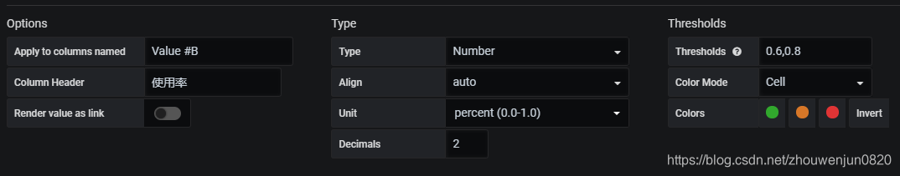

如果想显示某个标签的值，那么【Apply to columns named】就是标签的名字。